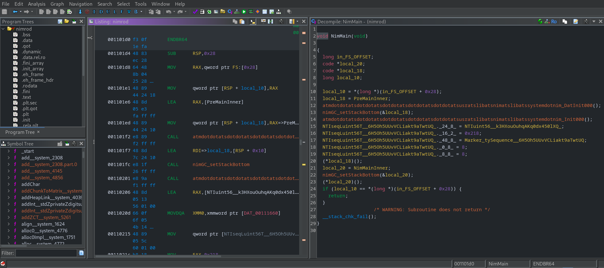
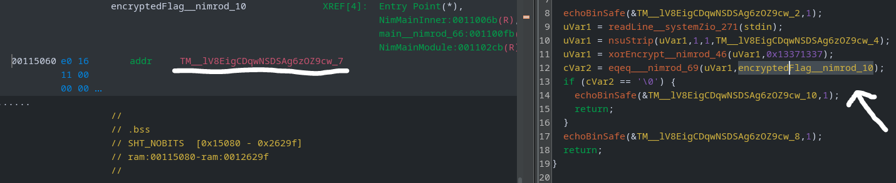
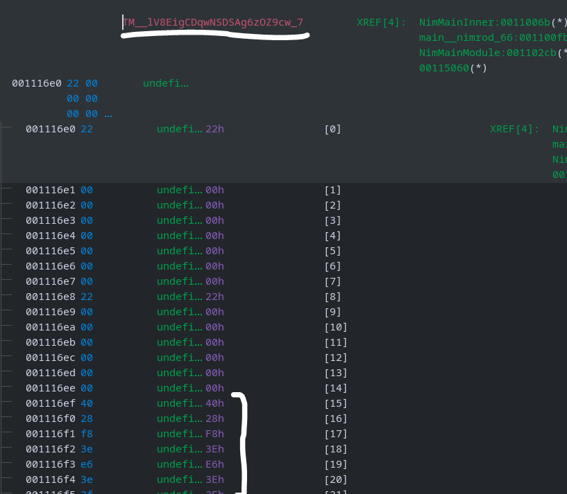

# Nimrod

## Description

> And Cush begat Nimrod: he began to be a mighty one in the earth.

## Solution

### Basic File Checks

The binary is not stripped, so we shouldn't have too hard a time reversing in ghidra.


```bash
file nimrod

nimrod: ELF 64-bit LSB pie executable, x86-64, version 1 (SYSV), dynamically linked, interpreter /lib64/ld-linux-x86-64.so.2, BuildID[sha1]=d2214d1703d64f0f7620e8d86f2790ebc1f0b861, for GNU/Linux 3.2.0, not stripped
```


Try to run the binary with `ltrace` for a quick win, but no such luck 🍀


```bash
ltrace ./nimrod

Enter the flag:
meow
Incorrect.
+++ exited (status 0) +++
```


I would normally go straight for ghidra, but it's been so long since I opened `gdb-pwndbg` - let's see if it's still working 😆


```bash
gdb-pwndbg ./nimrod

pwndbg: loaded 209 pwndbg commands. Type pwndbg [filter] for a list.
pwndbg: created 13 GDB functions (can be used with print/break). Type help function to see them.
Reading symbols from ./nimrod...
(No debugging symbols found in ./nimrod)
------- tip of the day (disable with set show-tips off) -------
Use GDB's pi command to run an interactive Python console where you can use Pwndbg APIs like pwndbg.aglib.memory.read(addr, len), pwndbg.aglib.memory.write(addr, data), pwndbg.aglib.vmmap.get() and so on!
```


Wow, so much output these days 😕 Let's check the functions.


```r
pwndbg> info functions

All defined functions:

Non-debugging symbols:
0x0000000000001000  _init
0x0000000000001300  main
0x0000000000001330  _start
0x0000000000001360  deregister_tm_clones
0x0000000000001390  register_tm_clones
0x00000000000013d0  __do_global_dtors_aux
0x0000000000001410  frame_dummy
0x0000000000001420  addInt__stdZprivateZdigitsutils_164
0x00000000000017e0  addInt__stdZprivateZdigitsutils_167
0x0000000000001c90  dollar___systemZdollars_6
0x0000000000001ce0  dollar___systemZdollars_3
0x0000000000001d30  asgnRef.constprop.0
0x0000000000001d70  echoBinSafe
<SNIP>
```


There's a lot, we can start by disassembling `main`.


```r
pwndbg> disassemble main

Dump of assembler code for function main:
   0x0000000000001300 <+0>:	endbr64
   0x0000000000001304 <+4>:	sub    rsp,0x8
   0x0000000000001308 <+8>:	mov    QWORD PTR [rip+0x24f39],rsi        # 0x26248 <cmdLine>
   0x000000000000130f <+15>:	mov    DWORD PTR [rip+0x24f3b],edi        # 0x26250 <cmdCount>
   0x0000000000001315 <+21>:	mov    QWORD PTR [rip+0x24f24],rdx        # 0x26240 <gEnv>
   0x000000000000131c <+28>:	call   0x101d0 <NimMain>
   0x0000000000001321 <+33>:	mov    eax,DWORD PTR [rip+0x244d9]        # 0x25800 <nim_program_result>
   0x0000000000001327 <+39>:	add    rsp,0x8
   0x000000000000132b <+43>:	ret
End of assembler dump.
```


It just saves command line args (`cmdLine`, `cmdCount`, `gEnv`) before calling `NimMain`. After `NimMain` returns, it grabs `nim_program_result` (a global) and returns it. The real functionality lies within the `NimMain` function.


```r
pwndbg> disassemble NimMain

Dump of assembler code for function NimMain:
   0x00000000000101d0 <+0>:	endbr64
   0x00000000000101d4 <+4>:	sub    rsp,0x28
   0x00000000000101d8 <+8>:	mov    rax,QWORD PTR fs:0x28
   0x00000000000101e1 <+17>:	mov    QWORD PTR [rsp+0x18],rax
   0x00000000000101e6 <+22>:	lea    rax,[rip+0xfffffffffffffae3]        # 0xfcd0 <PreMainInner>
   0x00000000000101ed <+29>:	mov    QWORD PTR [rsp+0x10],rax
   0x00000000000101f2 <+34>:	call   0xf480 <atmdotdotatsdotdotatsdotdotatsdotdotatsdotdotatsusratslibatsnimatslibatssystemdotnim_DatInit000>
   0x00000000000101f7 <+39>:	lea    rdi,[rsp+0x10]
   0x00000000000101fc <+44>:	call   0x2820 <nimGC_setStackBottom>
   0x0000000000010201 <+49>:	call   0xf3a0 <atmdotdotatsdotdotatsdotdotatsdotdotatsdotdotatsusratslibatsnimatslibatssystemdotnim_Init000>
   0x0000000000010206 <+54>:	lea    rax,[rip+0x15613]        # 0x25820 <NTIuint56__k3HXouOuhqAKq0dx450lXQ_>
   0x000000000001020d <+61>:	movdqa xmm0,XMMWORD PTR [rip+0x144b]        # 0x11660
   0x0000000000010215 <+69>:	mov    QWORD PTR [rip+0x1605c],rax        # 0x26278 <NTIseqLuint56T__6H5Oh5UUvVCLiakt9aTwtUQ_+24>
   0x000000000001021c <+76>:	mov    eax,0x218
   0x0000000000010221 <+81>:	mov    WORD PTR [rip+0x16048],ax        # 0x26270 <NTIseqLuint56T__6H5Oh5UUvVCLiakt9aTwtUQ_+16>
   0x0000000000010228 <+88>:	lea    rax,[rip+0xfffffffffffffa91]        # 0xfcc0 <Marker_tySequence__6H5Oh5UUvVCLiakt9aTwtUQ>
   0x000000000001022f <+95>:	mov    QWORD PTR [rip+0x1605a],rax        # 0x26290 <NTIseqLuint56T__6H5Oh5UUvVCLiakt9aTwtUQ_+48>
   0x0000000000010236 <+102>:	mov    rax,QWORD PTR [rsp+0x10]
   0x000000000001023b <+107>:	movaps XMMWORD PTR [rip+0x1601e],xmm0        # 0x26260 <NTIseqLuint56T__6H5Oh5UUvVCLiakt9aTwtUQ_>
   0x0000000000010242 <+114>:	call   rax
   0x0000000000010244 <+116>:	lea    rax,[rip+0xfffffffffffffdd5]        # 0x10020 <NimMainInner>
   0x000000000001024b <+123>:	lea    rdi,[rsp+0x8]
   0x0000000000010250 <+128>:	mov    QWORD PTR [rsp+0x8],rax
   0x0000000000010255 <+133>:	call   0x2820 <nimGC_setStackBottom>
   0x000000000001025a <+138>:	mov    rax,QWORD PTR [rsp+0x8]
   0x000000000001025f <+143>:	call   rax
   0x0000000000010261 <+145>:	mov    rax,QWORD PTR [rsp+0x18]
   0x0000000000010266 <+150>:	sub    rax,QWORD PTR fs:0x28
   0x000000000001026f <+159>:	jne    0x10276 <NimMain+166>
   0x0000000000010271 <+161>:	add    rsp,0x28
   0x0000000000010275 <+165>:	ret
   0x0000000000010276 <+166>:	call   0x11f0
```


OK, that's enough GDB for me for now 😂 There are many functions in this program and I want to analyse with ghidra for a better layout _and_ pseudocode, renaming/commenting functionality etc. Once we find some interesting code there, we can always return to our debugger and setup a breakpoint 🔎

### Static Analysis

I use a [bash alias](https://github.com/Crypto-Cat/CTF/blob/main/my_bash_aliases.md) to automate importing the binary to ghidra which speeds things up a lot.


```bash
ghidra_auto -t nimrod

nimrod: ELF 64-bit LSB pie executable, x86-64, version 1 (SYSV), dynamically linked, interpreter /lib64/ld-linux-x86-64.so.2, BuildID[sha1]=d2214d1703d64f0f7620e8d86f2790ebc1f0b861, for GNU/Linux 3.2.0, not stripped

Will run analysis in 1 second, press any key to cancel
```


There we go, looking better already!



We could rename some functions and variables, they are needlessly obfuscated to make it look complicated, but let's jump to the `NimMainInner` function.


```c
void NimMainInner(void)
{
  undefined8 uVar1;
  char cVar2;

  echoBinSafe(&TM__lV8EigCDqwNSDSAg6zOZ9cw_2,1);
  uVar1 = readLine__systemZio_271(stdin);
  uVar1 = nsuStrip(uVar1,1,1,TM__lV8EigCDqwNSDSAg6zOZ9cw_4);
  uVar1 = xorEncrypt__nimrod_46(uVar1,0x13371337);
  cVar2 = eqeq___nimrod_69(uVar1,encryptedFlag__nimrod_10);
  if (cVar2 == '\0') {
    echoBinSafe(&TM__lV8EigCDqwNSDSAg6zOZ9cw_10,1);
    return;
  }
  echoBinSafe(&TM__lV8EigCDqwNSDSAg6zOZ9cw_8,1);
  return;
}
```


Again, we could start renaming things - there's already some clues about XOR and an encrypted flag.

### LLM Analysis / Conversion

I've been focusing on web for a while, so I'm interested to see how LLMs help with this. I paste all the pseudocode we've seen so far (`NimMain` and `NimMainInner`) to ChatGPT and ask for some lightly commented conversion to `C`.


```c
#include <stdio.h>
#include <string.h>

// forward decls (placeholders, you’d implement or extract them)
char *readLine(FILE *fp);
char *strip(char *s);
char *xorEncrypt(char *s, unsigned int key);
int equals(char *a, char *b);

// global: the encrypted flag stored in the binary
extern char *encryptedFlag;

void NimMainInner(void) {
    char *input;
    char *processed;
    // print prompt (likely "Enter flag:")
    printf("Enter flag: ");
    // read a line from stdin
    input = readLine(stdin);
    // trim whitespace
    processed = strip(input);
    // XOR with constant key
    processed = xorEncrypt(processed, 0x13371337);
    // compare with encrypted flag
    if (equals(processed, encryptedFlag)) {
        printf("Correct!\n");
    } else {
        printf("Wrong!\n");
    }
}
```


OK, that's actually pretty cool! It got some stuff wrong.. literally, since "Wrong!" isn't a string in the binary 😆 That's my fault though for not giving it enough context. Let's dump the other functions, feeding the input to ChatGPT as we go.


```c
void echoBinSafe(long param_1,long param_2)
{
  size_t *psVar1;
  long lVar2;
  size_t __size;
  size_t *__ptr;

  lVar2 = 0;
  flockfile(stdout);
  if (0 < param_2) {
    do {
      psVar1 = *(size_t **)(param_1 + lVar2 * 8);
      __ptr = (size_t *)0x1111a2;
      __size = 0;
      if ((psVar1 != (size_t *)0x0) && (*psVar1 != 0)) {
        __ptr = psVar1 + 2;
        __size = *psVar1;
      }
      lVar2 = lVar2 + 1;
      fwrite(__ptr,__size,1,stdout);
    } while (lVar2 != param_2);
  }
  fwrite("\n",1,1,stdout);
  fflush(stdout);
  funlockfile(stdout);
  return;
}
```



```c
void nsuStrip(long *param_1,char param_2,char param_3,long param_4)
{
  byte bVar1;
  long lVar2;
  long lVar3;
  bool bVar4;

  if (param_1 == (long *)0x0) {
    lVar2 = 0;
    lVar3 = -1;
  }
  else {
    lVar3 = *param_1 + -1;
    if (SBORROW8(*param_1,1)) {
                    /* WARNING: Subroutine does not return */
      raiseOverflow();
    }
    if (param_2 == '\0') {
      lVar2 = 0;
    }
    else {
      lVar2 = 0;
      while (lVar2 <= lVar3) {
        if ((lVar2 < 0) || (*param_1 <= lVar2)) {
          raiseIndexError2(lVar2,*param_1 + -1);
        }
        bVar1 = *(byte *)((long)param_1 + lVar2 + 0x10);
        if ((*(byte *)(param_4 + (ulong)(bVar1 >> 3)) >> (bVar1 & 7) & 1) == 0) break;
        bVar4 = SCARRY8(lVar2,1);
        lVar2 = lVar2 + 1;
        if (bVar4) {
                    /* WARNING: Subroutine does not return */
          raiseOverflow();
        }
      }
    }
    if (param_3 != '\0') {
      while (lVar2 <= lVar3) {
        if ((lVar3 < 0) || (*param_1 <= lVar3)) {
          raiseIndexError2(lVar3,*param_1 + -1);
        }
        bVar1 = *(byte *)((long)param_1 + lVar3 + 0x10);
        if ((*(byte *)(param_4 + (ulong)(bVar1 >> 3)) >> (bVar1 & 7) & 1) == 0) break;
        bVar4 = SBORROW8(lVar3,1);
        lVar3 = lVar3 + -1;
        if (bVar4) {
                    /* WARNING: Subroutine does not return */
          raiseOverflow();
        }
      }
    }
  }
  substr__system_7727(param_1,lVar2,lVar3);
  return;
}
```



```c
long * xorEncrypt__nimrod_46(long *param_1,undefined4 param_2)

{
  long *plVar1;
  long *plVar2;
  long lVar3;
  long lVar4;
  long lVar5;

  if (param_1 == (long *)0x0) {
    keystream__nimrod_20(param_2,0);
    plVar1 = (long *)newSeq__nimrod_29(0);
    return plVar1;
  }
  plVar1 = (long *)keystream__nimrod_20(param_2,*param_1);
  lVar5 = *param_1;
  if (lVar5 < 0) {
    raiseRangeErrorI(lVar5,0,0x7fffffffffffffff);
    lVar5 = *param_1;
  }
  plVar2 = (long *)newSeq__nimrod_29(lVar5);
  lVar5 = *param_1;
  if (0 < lVar5) {
    if (plVar1 != (long *)0x0) {
      if (plVar2 != (long *)0x0) {
        lVar4 = *plVar2;
        lVar3 = 0;
        if (0 < lVar4) goto LAB_0010fe39;
        goto LAB_0010fe63;
      }
      lVar3 = 0;
      raiseIndexError2(0,0xffffffffffffffff);
LAB_0010fe30:
      lVar4 = *param_1;
      if (lVar4 <= lVar3) goto LAB_0010fe78;
LAB_0010fe39:
      lVar4 = *plVar1;
      if (lVar4 <= lVar3) goto LAB_0010fe8d;
      do {
        *(byte *)((long)plVar2 + lVar3 + 0x10) =
             *(byte *)((long)param_1 + lVar3 + 0x10) ^ *(byte *)((long)plVar1 + lVar3 + 0x10);
        while( true ) {
          lVar3 = lVar3 + 1;
          if (lVar3 == lVar5) {
            return plVar2;
          }
          lVar4 = *plVar2;
          if (lVar3 < lVar4) goto LAB_0010fe30;
LAB_0010fe63:
          raiseIndexError2(lVar3,lVar4 + -1);
          lVar4 = *param_1;
          if (lVar3 < lVar4) goto LAB_0010fe39;
LAB_0010fe78:
          raiseIndexError2(lVar3,lVar4 + -1);
          lVar4 = *plVar1;
          if (lVar3 < lVar4) break;
LAB_0010fe8d:
          raiseIndexError2(lVar3,lVar4 + -1);
          *(byte *)((long)plVar2 + lVar3 + 0x10) =
               *(byte *)((long)param_1 + lVar3 + 0x10) ^ *(byte *)((long)plVar1 + lVar3 + 0x10);
        }
      } while( true );
    }
    lVar4 = 0;
    if (plVar2 == (long *)0x0) {
      do {
        while( true ) {
          raiseIndexError2(lVar4,0xffffffffffffffff);
          if (*param_1 <= lVar4) break;
          raiseIndexError2(lVar4,0xffffffffffffffff);
          *(byte *)(lVar4 + 0x10) =
               *(byte *)(lVar4 + 0x10) ^ *(byte *)((long)param_1 + lVar4 + 0x10);
          lVar4 = lVar4 + 1;
          if (lVar4 == lVar5) {
            return (long *)0x0;
          }
        }
        raiseIndexError2(lVar4,*param_1 + -1);
        raiseIndexError2(lVar4,0xffffffffffffffff);
        *(byte *)(lVar4 + 0x10) = *(byte *)(lVar4 + 0x10) ^ *(byte *)((long)param_1 + lVar4 + 0x10);
        lVar4 = lVar4 + 1;
      } while (lVar5 != lVar4);
    }
    else {
      do {
        lVar3 = *plVar2;
        if (lVar3 <= lVar4) goto LAB_0010ff0f;
        while (lVar3 = *param_1, lVar4 < lVar3) {
          while( true ) {
            raiseIndexError2(lVar4,0xffffffffffffffff);
            *(byte *)((long)plVar2 + lVar4 + 0x10) =
                 *(byte *)((long)param_1 + lVar4 + 0x10) ^ *(byte *)(lVar4 + 0x10);
            lVar4 = lVar4 + 1;
            if (lVar5 == lVar4) {
              return plVar2;
            }
            lVar3 = *plVar2;
            if (lVar4 < lVar3) break;
LAB_0010ff0f:
            raiseIndexError2(lVar4,lVar3 + -1);
            lVar3 = *param_1;
            if (lVar3 <= lVar4) goto LAB_0010ff24;
          }
        }
LAB_0010ff24:
        raiseIndexError2(lVar4,lVar3 + -1);
        raiseIndexError2(lVar4,0xffffffffffffffff);
        *(byte *)((long)plVar2 + lVar4 + 0x10) =
             *(byte *)(lVar4 + 0x10) ^ *(byte *)((long)param_1 + lVar4 + 0x10);
        lVar4 = lVar4 + 1;
      } while (lVar4 != lVar5);
    }
  }
  return plVar2;
}
```



```c
bool eqeq___nimrod_69(ulong *param_1,ulong *param_2)
{
  ulong uVar1;
  long lVar2;
  ulong uVar3;

  if (param_1 == param_2) {
    return true;
  }
  if (param_1 == (ulong *)0x0) {
    uVar3 = 0;
    if (param_2 == (ulong *)0x0) {
      return true;
    }
  }
  else {
    uVar3 = *param_1;
    if (param_2 == (ulong *)0x0) {
      return uVar3 == 0;
    }
  }
  if (uVar3 != *param_2) {
    return false;
  }
  uVar1 = (ulong)SBORROW8(uVar3,1);
  if (SBORROW8(uVar3,1)) goto LAB_0010f38d;
  if ((long)(uVar3 - 1) < 0) {
    return true;
  }
  if ((long)uVar3 < 1) {
    lVar2 = -1;
    if (param_1 != (ulong *)0x0) goto LAB_0010f37e;
  }
  else {
    do {
      if (*(char *)((long)param_1 + uVar1 + 0x10) != *(char *)((long)param_2 + uVar1 + 0x10)) {
        return false;
      }
      uVar1 = uVar1 + 1;
      if ((long)(uVar3 - 1) < (long)uVar1) {
        return true;
      }
    } while (*param_2 != uVar1);
LAB_0010f37e:
    lVar2 = *param_1 - 1;
  }
  raiseIndexError2(uVar1,lVar2);
LAB_0010f38d:
                    /* WARNING: Subroutine does not return */
  raiseOverflow();
}
```


I tell ChatGPT I want a summary of the binary so far, and a working replica in `C`.

#### Summary

1. **`main` / `NimMain`** → runtime setup, then calls `NimMainInner`.
2. **`NimMainInner`**:
    - Prints a banner (`echoBinSafe`).
    - Reads input.
    - Strips leading/trailing whitespace (`nsuStrip`).
    - XOR-encrypts it with key `0x13371337` (`xorEncrypt__nimrod_46`).
    - Compares result against `encryptedFlag__nimrod_10` (`eqeq___nimrod_69`).
    - Prints success/failure.
3. **Supporting functions**:
    - `echoBinSafe` → thin wrapper for `fwrite`/`printf`. Only matters for UI.
    - `nsuStrip` → trims whitespace. Not critical for crypto, just sanitization.
    - `xorEncrypt__nimrod_46` → **important**. Generates a keystream with `keystream__nimrod_20` and XORs it against the input. This is the actual “encryption”.
    - `eqeq___nimrod_69` → safe string comparison. Just checks equality.

The **only cryptographic/validation logic** is in `xorEncrypt__nimrod_46` and the comparison against `encryptedFlag__nimrod_10`. Everything else is just I/O or input cleaning.

#### PoC.c


```c
#include <stdio.h>
#include <stdlib.h>
#include <string.h>
#include <ctype.h>

// This is the hardcoded encrypted flag from the binary.
// You would dump it from encryptedFlag__nimrod_10 in .rodata
unsigned char encryptedFlag[] = {
    /* placeholder: real bytes go here */
};
size_t encryptedFlagLen = sizeof(encryptedFlag);

// Generate a keystream from a key and length (stubbed)
// In the Nim version, this comes from keystream__nimrod_20.
// Here we just cycle the key bytes.
void makeKeystream(unsigned int key, size_t len, unsigned char *out) {
    for (size_t i = 0; i < len; i++) {
        out[i] = ((unsigned char *)&key)[i % 4];
    }
}

// XOR "encryption"
void xorEncrypt(const unsigned char *input, size_t len, unsigned int key, unsigned char *out) {
    unsigned char *ks = malloc(len);
    makeKeystream(key, len, ks);
    for (size_t i = 0; i < len; i++) {
        out[i] = input[i] ^ ks[i];
    }
    free(ks);
}

// Trim whitespace (equivalent to nsuStrip)
char *strip(char *s) {
    char *end;
    while (isspace((unsigned char)*s)) s++;
    if (*s == 0) return s;
    end = s + strlen(s) - 1;
    while (end > s && isspace((unsigned char)*end)) end--;
    end[1] = '\0';
    return s;
}

int main(void) {
    char buf[256];
    printf("Enter flag: ");
    if (!fgets(buf, sizeof(buf), stdin)) return 1;

    char *clean = strip(buf);
    size_t len = strlen(clean);

    unsigned char *encrypted = malloc(len);
    xorEncrypt((unsigned char *)clean, len, 0x13371337, encrypted);

    if (len == encryptedFlagLen && memcmp(encrypted, encryptedFlag, len) == 0) {
        printf("Correct!\n");
    } else {
        printf("Wrong!\n");
    }

    free(encrypted);
    return 0;
}
```


Wow, LLMs changed the game for reversing for sure! The only downside here is the manual effort of copy/pasting each function, but I've seen people doing some crazy integrations (e.g. [blasty](https://x.com/bl4sty/status/1904631424663379973), [LaurieWired](https://x.com/lauriewired/status/1904582573046878333), [itszn](https://x.com/itszn13/status/1903227860648886701), [wilgibbs](https://wilgibbs.com/blog/defcon-finals-mcp/)) which I look forward to exploring in the future.

Anyway, we recreated the code but we haven't actually got the encrypted flag to XOR with 0x13371337 yet. It doesn't simply show us the text though, we'll need to follow the `addr`.



We have what look like some encrypted data here, but what are all the null bytes at the start?



Let's check with ChatGPT again.

> Nim strings/sequences are not just raw bytes. They’re usually a struct like:


```c
[0x0] = length (8 bytes, little-endian)
[0x8] = other metadata (capacity, typedescriptor pointer, etc.)
[0x10] = actual string data bytes
```


Paste in the assembly output, since we are too lazy to extract the hex ourselves 😴


```r
001116e0  22 00 00 00 00 00 00 00   <- length = 0x22 = 34 bytes
001116e8  22 00 00 00 00 00 00 40   <- capacity / type ptr (not relevant)
001116f0  28 f8 3e e6 3e 2f 43 0c
          b9 96 d1 5c d6 bf 36 d8
          20 79 0e 8e 52 21 b2 50
          e3 98 b5 c9 b8 a0 88 30
          d9 0a
```


We'll make one final request; a quick python solve script.


```python
encrypted = bytes([
    0x28,0xf8,0x3e,0xe6,0x3e,0x2f,0x43,0x0c,
    0xb9,0x96,0xd1,0x5c,0xd6,0xbf,0x36,0xd8,
    0x20,0x79,0x0e,0x8e,0x52,0x21,0xb2,0x50,
    0xe3,0x98,0xb5,0xc9,0xb8,0xa0,0x88,0x30,
    0xd9,0x0a
])

key = 0x13371337
ks = bytes([(key >> (8*(i % 4))) & 0xff for i in range(len(encrypted))])
flag = bytes([c ^ k for c,k in zip(encrypted, ks)])
print(flag.decode(errors="ignore"))
```


Give it a run.


```bash
python solve.py
		<tOj9e2Cԋڏ#
```


That does not look like a flag 💀 Oh, we forgot one function in ghidra - it was part of the `xorEncrypt__nimrod_46` function.


```c
long * keystream__nimrod_20(int param_1,long param_2)
{
  long *plVar1;
  long lVar2;
  long lVar3;

  if (param_2 < 0) {
    raiseRangeErrorI(param_2,0,0x7fffffffffffffff);
    plVar1 = (long *)newSeq__nimrod_29(param_2);
    return plVar1;
  }
  plVar1 = (long *)newSeq__nimrod_29(param_2);
  if (param_2 != 0) {
    lVar2 = 0;
    if (plVar1 == (long *)0x0) {
      do {
        lVar3 = lVar2 + 1;
        raiseIndexError2(lVar2,0xffffffffffffffff);
        param_1 = param_1 * 0x19660d + 0x3c6ef35f;
        *(char *)(lVar2 + 0x10) = (char)((uint)param_1 >> 0x10);
        lVar2 = lVar3;
      } while (lVar3 < param_2);
    }
    else {
      do {
        param_1 = param_1 * 0x19660d + 0x3c6ef35f;
        if (*plVar1 <= lVar2) {
          raiseIndexError2(lVar2,*plVar1 + -1);
        }
        *(char *)((long)plVar1 + lVar2 + 0x10) = (char)((uint)param_1 >> 0x10);
        lVar2 = lVar2 + 1;
      } while (lVar2 < param_2);
    }
  }
  return plVar1;
}
```


That function is just a linear congruential generator (LCG) with params:


```perl
state = seed
repeat len times:
    state = state * 0x19660d + 0x3c6ef35f
    output[i] = (state >> 16) & 0xff
```


Alright, let's update the PoC!


```python
encrypted = bytes([
    0x28,0xf8,0x3e,0xe6,0x3e,0x2f,0x43,0x0c,
    0xb9,0x96,0xd1,0x5c,0xd6,0xbf,0x36,0xd8,
    0x20,0x79,0x0e,0x8e,0x52,0x21,0xb2,0x50,
    0xe3,0x98,0xb5,0xc9,0xb8,0xa0,0x88,0x30,
    0xd9,0x0a
])

def keystream(seed, n):
    out = []
    state = seed & 0xffffffff
    for _ in range(n):
        state = (state * 0x19660d + 0x3c6ef35f) & 0xffffffff
        out.append((state >> 16) & 0xff)
    return bytes(out)

ks = keystream(0x13371337, len(encrypted))
flag = bytes([c ^ k for c,k in zip(encrypted, ks)])
print(flag.decode(errors="ignore"))
```



```bash
python solve.py

ictf{a_mighty_hunter_bfc16cce9dc8}
```


We got the flag! Was that a lesson in pro reversing? Nope, it wasn't even a particularly efficient route to solving, but hopefully there was some useful tips about using LLMs effectively in your workflow. I'll look to make mine more effective in future with the MCP/automation stuff everyone is raving about these days 😁

Flag: `ictf{a_mighty_hunter_bfc16cce9dc8}`
