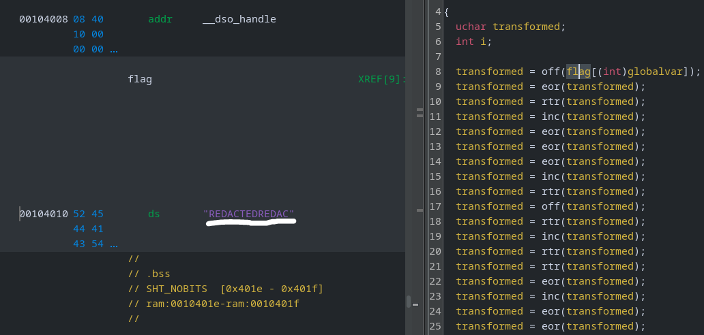

# Stacked

## Description

> Return oriented programming is one of the paradigms of all time. The garbled output is `94 7 d4 64 7 54 63 24 ad 98 45 72 35` hex.

## Solution

The description seems to give us some important information; `94 7 d4 64 7 54 63 24 ad 98 45 72 35`. Let's download the accompanying `chal.out`

### Basic File Checks


```bash
file chal.out

chal.out: ELF 64-bit LSB pie executable, x86-64, version 1 (SYSV), dynamically linked, interpreter /lib64/ld-linux-x86-64.so.2, BuildID[sha1]=836f77bf8a51ffeb485379fe5e9e1109e2389838, for GNU/Linux 3.2.0, not stripped
```


We've got a 64-bit ELF executable. Checking the strings, there's not much more than "REDACTED".


```bash
strings -n 10 chal.out

/lib64/ld-linux-x86-64.so.2
__cxa_finalize
__libc_start_main
GLIBC_2.34
GLIBC_2.2.5
_ITM_deregisterTMCloneTable
__gmon_start__
_ITM_registerTMCloneTable
REDACTEDREDAC
GCC: (Ubuntu 11.4.0-1ubuntu1~22.04.2) 11.4.0
<SNIP>
```


Let's run the file with `ltrace`, to see if it reveals anything.


```bash
ltrace /home/crystal/Desktop/chall/chal.out

4 2c 98 39 2a 9c e5 78 51 a2 31 39 9c
+++ exited (status 0) +++
```


Nope! It outputs some hex values, but not the same ones we got in the description.

### Static Analysis

Next, let's open the binary in ghidra.



We can see our `flag` variable is "REDACTEDREDAC". I renamed some variables and converted data types in the decompiled code, as seen below.


```c
{
  uchar transformed;
  int i;

  transformed = off(flag[(int)globalvar]);
  transformed = eor(transformed);
  transformed = rtr(transformed);
  transformed = inc(transformed);
  transformed = eor(transformed);
  transformed = eor(transformed);
  transformed = eor(transformed);
  transformed = inc(transformed);
  transformed = rtr(transformed);
  transformed = off(transformed);
  transformed = rtr(transformed);
  transformed = inc(transformed);
  transformed = rtr(transformed);
  transformed = rtr(transformed);
  transformed = eor(transformed);
  transformed = inc(transformed);
  transformed = eor(transformed);
  transformed = eor(transformed);
  transformed = eor(transformed);
  transformed = inc(transformed);
  transformed = rtr(transformed);
  transformed = off(transformed);
  transformed = rtr(transformed);
  transformed = inc(transformed);
  transformed = rtr(transformed);
  transformed = eor(transformed);
  transformed = rtr(transformed);
  transformed = inc(transformed);
  transformed = rtr(transformed);
  transformed = rtr(transformed);
  transformed = eor(transformed);
  transformed = inc(transformed);
  transformed = rtr(transformed);
  transformed = off(transformed);
  transformed = eor(transformed);
  transformed = inc(transformed);
  transformed = eor(transformed);
  transformed = eor(transformed);
  transformed = rtr(transformed);
  transformed = inc(transformed);
  transformed = off(transformed);
  transformed = off(transformed);
  transformed = rtr(transformed);
  transformed = inc(transformed);
  transformed = rtr(transformed);
  transformed = rtr(transformed);
  transformed = eor(transformed);
  transformed = inc(transformed);
  transformed = eor(transformed);
  transformed = off(transformed);
  transformed = rtr(transformed);
  transformed = inc(transformed);
  transformed = off(transformed);
  transformed = eor(transformed);
  transformed = off(transformed);
  inc(transformed);
  for (i = 0; i < 13; i = i + 1) {
    printf("%x ",(ulong)(byte)flag[i]);
  }
  putchar(10);
  return 0;
}
```


The flag goes through many transformations, before eventually being printed to the screen in hex. Essentially, our output (`4 2c 98 39 2a 9c e5 78 51 a2 31 39 9c`) is result of "REDACTEDREDAC" going through this flow. We were told the output of the _real_ flag is `94 7 d4 64 7 54 63 24 ad 98 45 72 35`, so we'll need to use that as an input while reversing each of the operations. Let's take a look at those functions, I'll rename variables manually in ghidra (`l` key) and add short comments as I go, for clarity.


```c
// add 15 to the byte
int off(uchar param_1)
{
  return param_1 + 15;
}

// XOR byte with 0x69
byte eor(uchar param_1)
{
  return param_1 ^ 0x69;
}

// rotate right by 1 bit
uint rtr(uchar param_1)
{
  return (param_1 << 7) | (param_1 >> 1);
}

// next char in flag
char inc(uchar param_1)
{
  flag[(int)globalvar] = param_1;
  globalvar = globalvar + 1;
  return flag[(int)globalvar];
}
```


Alright, so it will perform a 3 operations on a character before moving to the next one. There doesn't appear to be a rhythm to this, e.g. the first character has an addition, XOR and rotation whereas the second character has three XOR operations.

Like the previous writeup, I'll avoid defaulting to my usual python scripting habits and instead use the language the challenge was coded in (C).

Remember, we are reversing the order of the operations - but also the functionality of each operation. Instead of adding 15, we will subtract 15. Instead of rotating right by 1 bit, we will rotate left by 1 bit. XOR is a reversible operation, so that stays the same.

### Solve Script


```c
#include <stdio.h>
#include <stdint.h>

unsigned char flag[64];
int globalvar = 0;

// inverse the addition (subtract)
unsigned char inv_off(unsigned char x){ return (unsigned char)(x - 15); }
// inverse the XOR (same same)
unsigned char inv_eor(unsigned char x){ return (unsigned char)(x ^ 0x69); }
// Inverse the shift right (shift left)
unsigned char rotl(unsigned char x){ return (unsigned char)(((x << 1) | (x >> 7)) & 0xff); }

// incremement char every 3 operations
char inc(unsigned char param_1){
    flag[globalvar] = param_1;
    globalvar = globalvar + 1;
    return flag[globalvar];
}

int main(void){
    unsigned char out[] = {0x94,0x07,0xd4,0x64,0x07,0x54,0x63,0x24,0xad,0x98,0x45,0x72,0x35}; // encrypted flag
    for(int i=0;i<13;i++) flag[i]=out[i];

    unsigned char transformed;

    transformed = rotl(flag[globalvar]);
    transformed = inv_eor(transformed);
    transformed = inv_off(transformed);
    transformed = inc(transformed);

    transformed = inv_eor(transformed);
    transformed = inv_eor(transformed);
    transformed = inv_eor(transformed);
    transformed = inc(transformed);

    transformed = rotl(transformed);
    transformed = inv_off(transformed);
    transformed = rotl(transformed);
    transformed = inc(transformed);

    transformed = inv_eor(transformed);
    transformed = rotl(transformed);
    transformed = rotl(transformed);
    transformed = inc(transformed);

    transformed = inv_eor(transformed);
    transformed = inv_eor(transformed);
    transformed = inv_eor(transformed);
    transformed = inc(transformed);

    transformed = rotl(transformed);
    transformed = inv_off(transformed);
    transformed = rotl(transformed);
    transformed = inc(transformed);

    transformed = rotl(transformed);
    transformed = inv_eor(transformed);
    transformed = rotl(transformed);
    transformed = inc(transformed);

    transformed = inv_eor(transformed);
    transformed = rotl(transformed);
    transformed = rotl(transformed);
    transformed = inc(transformed);

    transformed = inv_eor(transformed);
    transformed = inv_off(transformed);
    transformed = rotl(transformed);
    transformed = inc(transformed);

    transformed = rotl(transformed);
    transformed = inv_eor(transformed);
    transformed = inv_eor(transformed);
    transformed = inc(transformed);

    transformed = rotl(transformed);
    transformed = inv_off(transformed);
    transformed = inv_off(transformed);
    transformed = inc(transformed);

    transformed = inv_eor(transformed);
    transformed = rotl(transformed);
    transformed = rotl(transformed);
    transformed = inc(transformed);

    transformed = rotl(transformed);
    transformed = inv_off(transformed);
    transformed = inv_eor(transformed);
    transformed = inc(transformed);

    transformed = inv_off(transformed);
    transformed = inv_eor(transformed);
    transformed = inv_off(transformed);
    inc(transformed);

    for(int i=0;i<13;i++) putchar(flag[i]);
    putchar('\n');
    return 0;
}
```


I tried to inverse it as much as possible, even if it wasn't really efficient (didn't make sense to use the `inc` function). We can compile and run the binary to recover the flag.


```bash
gcc solve.c -o solve; chmod +x solve; ./solve

1n54n3_5k1ll2
```


Flag: `ictf{1n54n3_5k1ll2}`
