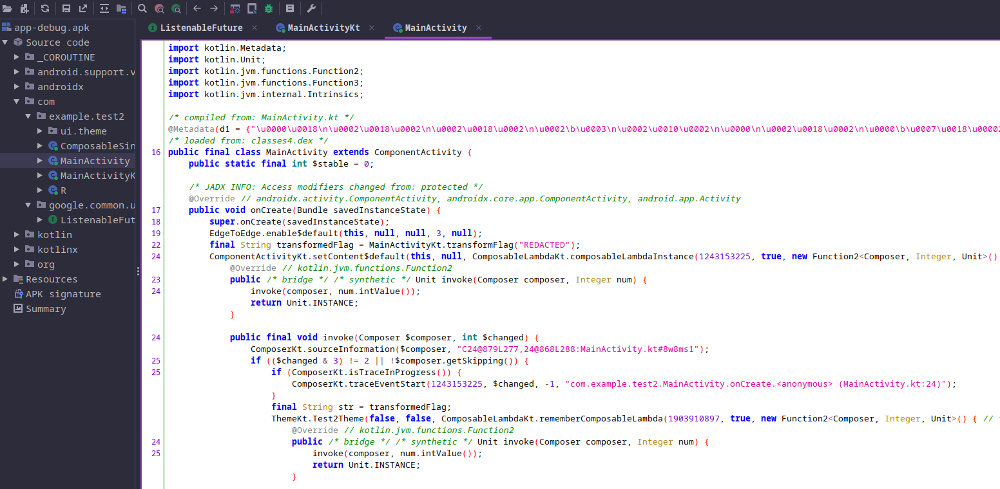

# Weird App

## Description

> I made this weird android app, but all it gave me was this .apk file. Can you get the flag from it?

## Solution

We receive an APK file, hopefully it doesn't require any dynamic analysis because I've not run Android Studio in a long time and I just know there's gonna be issues. We'll try a static approach; open the file with `jadx-gui` or `jd-gui`.

### Static Analysis



For better syntax highlighting, searching etc you might want to dump the files and open the folder in VS-Code, or just copy/paste. Starting with the `MainActivity`, we see some mentions of a `transformedFlag` which is "REDACTED".

```java
public void onCreate(Bundle savedInstanceState) {
	super.onCreate(savedInstanceState);
	EdgeToEdge.enable$default(this, null, null, 3, null);
	final String transformedFlag = MainActivityKt.transformFlag("REDACTED");
```

```java
public final void invoke(Composer $composer, int $changed) {
	ComposerKt.sourceInformation($composer, "C24@879L277,24@868L288:MainActivity.kt#8w8ms1");
	if (($changed & 3) != 2 || !$composer.getSkipping()) {
		if (ComposerKt.isTraceInProgress()) {
			ComposerKt.traceEventStart(1243153225, $changed, -1, "com.example.test2.MainActivity.onCreate.<anonymous> (MainActivity.kt:24)");
		}
		final String str = transformedFlag;
```

Sounds interesting, but those 2 lines are the only mentioned of the `transformedFlag`. Let's check the other file; `MainActivityKt`.

```java
public static final String transformFlag(String flag) {
    Intrinsics.checkNotNullParameter(flag, "flag");
    String res = "";
    int length = flag.length();
    for (int i = 0; i < length; i++) {
        int length2 = "abcdefghijklmnopqrstuvwxyz".length();
        for (int c = 0; c < length2; c++) {
            if ("abcdefghijklmnopqrstuvwxyz".charAt(c) == flag.charAt(i)) {
                int ind = c + i;
                res = res + "abcdefghijklmnopqrstuvwxyz".charAt(ind % "abcdefghijklmnopqrstuvwxyz".length());
            }
        }
        int length3 = "0123456789".length();
        for (int c2 = 0; c2 < length3; c2++) {
            if ("0123456789".charAt(c2) == flag.charAt(i)) {
                int ind2 = (i * 2) + c2;
                res = res + "0123456789".charAt(ind2 % "0123456789".length());
            }
        }
        int length4 = "!@#$%^&*()_+{}[]|".length();
        for (int c3 = 0; c3 < length4; c3++) {
            if ("!@#$%^&*()_+{}[]|".charAt(c3) == flag.charAt(i)) {
                int ind3 = (i * i) + c3;
                res = res + "!@#$%^&*()_+{}[]|".charAt(ind3 % "!@#$%^&*()_+{}[]|".length());
            }
        }
    }
    return res;
}
```

Well, there's our flag transformation function! The code is actually really simple, but might look a little confusing, mostly due to the reuse of character sets and variable naming. Let's clean it up a bit and add some comments.

```java
public static final String transformFlag(String flag) {
    String alphabet = "abcdefghijklmnopqrstuvwxyz";
    String digits = "0123456789";
    String symbols = "!@#$%^&*()_+{}[]|";
    StringBuilder res = new StringBuilder();
    for (int i = 0; i < flag.length(); i++) {
        char ch = flag.charAt(i);
        int idx;
        // shift letters by position
        if ((idx = alphabet.indexOf(ch)) != -1) {
            res.append(alphabet.charAt((idx + i) % alphabet.length()));
        // shift digits by double position
        } else if ((idx = digits.indexOf(ch)) != -1) {
            res.append(digits.charAt((idx + i * 2) % digits.length()));
        // shift symbols by square of position
        } else if ((idx = symbols.indexOf(ch)) != -1) {
            res.append(symbols.charAt((idx + i * i) % symbols.length()));
        }
    }
    return res.toString();
}
```

It essentially loops through the flag, shifting each character by a different amount, depending on which character set it comes from (letters/digits/specials).

Shortly below that, in the `Greeting` function is a string `Transformed flag: idvi+1{s6e3{)arg2zv[moqa905+`. Presumably if we run the app, this what we'll see.

Now, all we need to do is reverse the `transformFlag` function (performing each operation backwards) with `idvi+1{s6e3{)arg2zv[moqa905+` as our input.

I always default to Python, so let's \[paradoxically\] change things up a bit by sticking with the original language; Java.

### Solve Script

```java
public class Solver {
    public static final String reverseTransform(String flag) {
        String alphabet = "abcdefghijklmnopqrstuvwxyz";
        String digits = "0123456789";
        String symbols = "!@#$%^&*()_+{}[]|";
        StringBuilder res = new StringBuilder();
        for (int i = 0; i < flag.length(); i++) {
            char ch = flag.charAt(i);
            int idx;
            // reverse letters
            if ((idx = alphabet.indexOf(ch)) != -1) {
                res.append(alphabet.charAt(((idx - i) % alphabet.length() + alphabet.length()) % alphabet.length()));
            // reverse digits
            } else if ((idx = digits.indexOf(ch)) != -1) {
                res.append(digits.charAt(((idx - (i * 2)) % digits.length() + digits.length()) % digits.length()));
            // reverse symbols
            } else if ((idx = symbols.indexOf(ch)) != -1) {
                res.append(symbols.charAt(((idx - (i * i)) % symbols.length() + symbols.length()) % symbols.length()));
            }
        }
        return res.toString();
    }

    public static void main(String[] args) {
        String input = "idvi+1{s6e3{)arg2zv[moqa905+";
        String output = reverseTransform(input);
        System.out.println("Reversed flag: " + output);
    }
}
```

```bash
java Solver.java

Reversed flag: ictf{1_l0v3_@ndr0id_stud103}
```

Nice! We solved it without ever needing to run the app 😌 I opened Android Studio out of interest and as usual the SDK is missing/broken, need to reinstall and create a new device.. Some other time 🥱

Flag: `ictf{1_l0v3_@ndr0id_stud103}`
