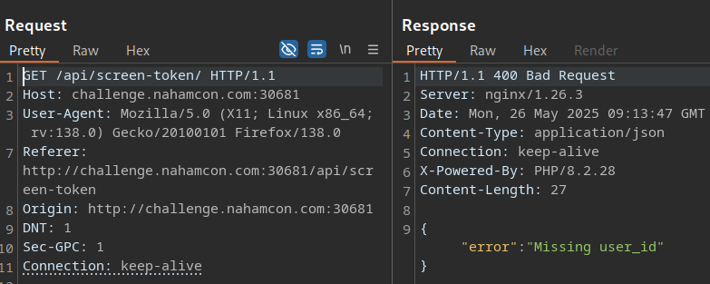

# Advanced Screening

## Description

> HackingHub has provided this CTF challenge!

## Solution

From the homepage, we can enter an email address and request an access code.


Doing so returns an error, so let's check the JS. `requestAccessCode()` sends the email address to an API endpoint.



```js
const response = await fetch('/api/email/', {
	method: 'POST',
	headers: { 'Content-Type': 'application/json' },
	body: JSON.stringify({ email })
```



`verifyCode` checks if the access code is 6 characters. If so, it sends the value to `/api/validate`. If it gets a response containing a `user_id`, it will send it to `/api/screen-token` and hopefully return a token (`tokenData.hash`) that we can use as a key to access the `/screen` endpoint.



```js
if (code.length === 6) {
	try {
		const response = await fetch('/api/validate/', {
			method: 'POST',
			headers: { 'Content-Type': 'application/json' },
			body: JSON.stringify({ code })
		});
		const data = await response.json();
		if (response.ok && data.user_id) {
			const tokenResponse = await fetch('/api/screen-token', {
				method: 'POST',
				headers: { 'Content-Type': 'application/json' },
				body: JSON.stringify({ user_id: data.user_id })
			});
			const tokenData = await tokenResponse.json();
			if (tokenResponse.ok && tokenData.hash) {
				window.location.href = `/screen/?key=${tokenData.hash}`;
			} else {
				alert("Failed to retrieve screening token.");
			}
		} else {
			alert("Invalid code. Please try again.");
		}
```



My first thought; do we need the code at all? Can't we just bypass it and go straight to `screen-token`, assuming that the `user_id` is predictable (I'll start with "1").



```js
tokenResponse = await fetch("/api/screen-token", {
    method: "POST",
    headers: { "Content-Type": "application/json" },
    body: JSON.stringify({ user_id: 1 }),
});
```



Didn't work. While reviewing burp history I noticed an error message from our earlier email attempt.



```json
{ "error": "Only email addresses from \"movieservice.ctf\" are allowed" }
```



If we send `{"email":"admin@movieservice.ctf"}`, the request is successful. It seems to work with any `movieservice.ctf` email actually.



```json
{ "message": "Verification Email Sent" }
```



Let's try sending a 6 digit code.



```js
response = await fetch("/api/validate/", {
    method: "POST",
    headers: { "Content-Type": "application/json" },
    body: JSON.stringify({ code: 123456 }),
});
```





```json
{ "error": "Invalid code" }
```



There's 1 million possibilities for the code, so brute force is obviously not the intended solution. However, I'm going to get some lunch so why not leave intruder running for 30 minutes and see the results 🤷‍♂️😂



```js
async function verifyCode() {
    try {
        const tokenResponse = await fetch("/api/screen-token", {
            method: "POST",
            headers: { "Content-Type": "application/json" },
            body: JSON.stringify({ user_id: 1 }),
        });
        const tokenData = await tokenResponse.json();
        console.log();
        if (tokenResponse.ok && tokenData.hash) {
            window.location.href = `/screen/?key=${tokenData.hash}`;
        } else {
            alert("Invalid code. Please try again.");
        }
    } catch (error) {
        console.error("Error verifying code:", error);
    }
}
```



I didn't solve this in time, so checked the writeup afterwards and kicked myself! I already brute forced the `user_id` between 1-100 for the `/api/screen-token` endpoint, but someone said the correct `user_id` was `7`. I tried it again.


Nothing. Follow the redirection just in case.



Apparently the problem was a missing `/` on the endpoint in the first request 😆


That gets us the hash, then we just need to call the `/screen` endpoint with the key!


Flag: `flag{f0b1d2a98cd92d728ddd76067f959c31}`
