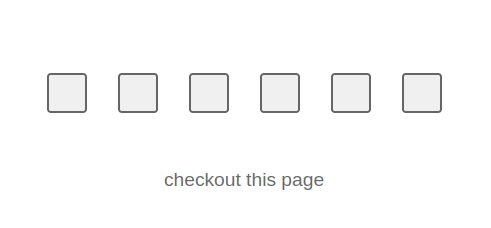

# Method in the Madness

## Description

> HackingHub has provided this CTF challenge!

## Solution

The homepage has 6 checkboxes, that we can't click. There's a hint that we should `checkout this page`.



Let's check the JS.


```js
function updateCheckboxes() {
    fetch("/poll")
        .then((response) => response.json())
        .then((data) => {
            // Check if all boxes are true and flag exists
            let allTrue = true;
            for (let i = 1; i <= 6; i++) {
                if (!data[`box_${i}`]) {
                    allTrue = false;
                    break;
                }
            }

            if (allTrue && data.flag) {
                // Hide main content and show flag
                document.querySelector(".main-content").style.display = "none";
                document.querySelector(".flag-container").style.display = "block";
                document.querySelector(".flag-container h1").textContent = data.flag;
            } else {
                // Update checkboxes (only the first 6)
                for (let i = 1; i <= 6; i++) {
                    const checkbox = document.getElementById(`box_${i}`);
                    if (checkbox) {
                        checkbox.checked = data[`box_${i}`];
                    }
                }
            }
        })
        .catch((error) => console.error("Error:", error));
}

// Initial update
updateCheckboxes();

// Poll every 3 seconds
setInterval(updateCheckboxes, 3000);
```


There's a GET request to `/poll` and sure enough, if we check the HTTP history in burp we see lots of requests, all returning false.


```json
{
    "box_1": false,
    "box_2": false,
    "box_3": false,
    "box_4": false,
    "box_5": false,
    "box_6": false
}
```


Tried changing it to a JSON POST request and updating all the values to true, but it failed to update the values. Also tried removing `disabled=""` from each of the checkbox properties and manually ticking all of them.

Realised there is another endpoint `/interesting` which just says `hello` on the page. After visiting this page, I discovered that `box_1` and `box_2` are now ticked 🤔

My instance timed out and the second time around I went straight to `/interesting` and back to the homepage. The first box is ticked, so what is the pattern? How did the second box get checked last time?

Ah OK, I change the request method to `POST` on the `/interesting` endpoint and the second box is now checked! I try the `OPTIONS` method and `box_5` is ticked. We have 3 more to go 🙏

Tried various HTTP methods, eventually ticked the remaining boxes with:

-   PATCH
-   PUT
-   DELETE

We hit the `/poll` endpoint again and get the flag!


```json
{
    "box_1": true,
    "box_2": true,
    "box_3": true,
    "box_4": true,
    "box_5": true,
    "box_6": true,
    "flag": "flag{bd399cb9c3a8b857588d8e13f490b6fd}"
}
```


Flag: `flag{bd399cb9c3a8b857588d8e13f490b6fd}`
