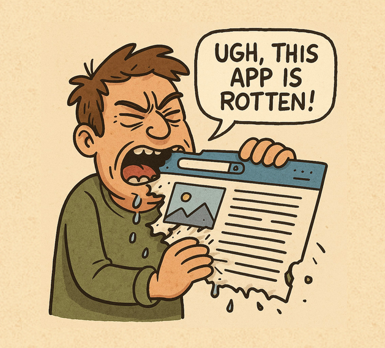

# My First CTF

## Description

> On second thoughts I should have probably called this challenge "Nz Gjstu DUG"

## Solution

We get through to a "rotten app" with no JS, links, cookies or anything for us to explore!

The challenge description provided a hint; `Nz Gjstu DUG` is `My First CTF` rotated by 1 (caeser cipher). We can try and [ROT1](<https://gchq.github.io/CyberChef/#recipe=ROT13(true,true,false,1)&input=ZmxhZy50eHQ>) some endpoints, e.g. `/admin`, `/flag` and eventually find the correct one is `/flag.txt`

We try the endpoint `/gmbh.uyu` and receive the flag.

Flag: `flag{b67779a5cfca7f1dd120a075a633afe9}`
