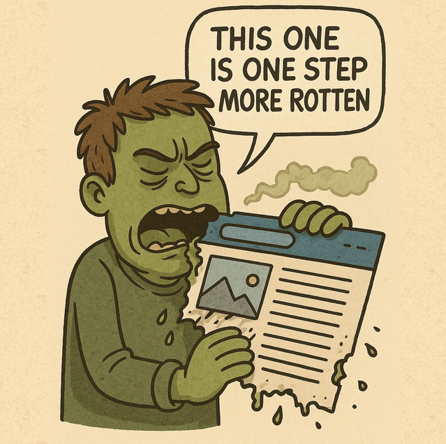
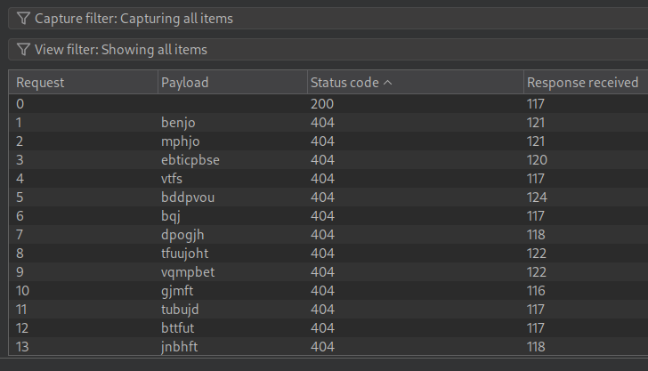
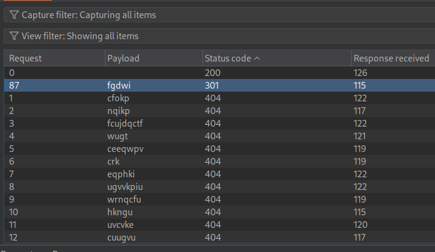
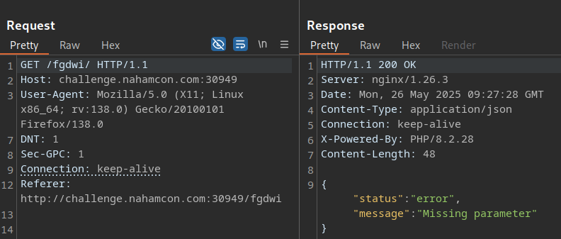
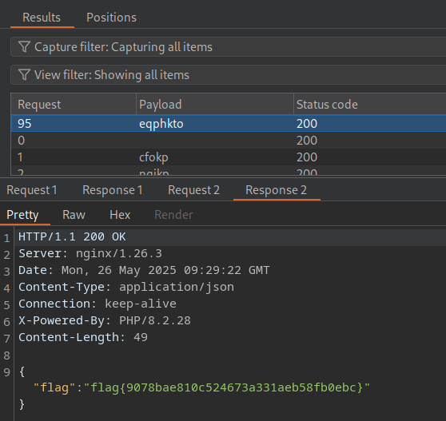

# My Second CTF

## Description

> This challenge requires some content discovery but only use the `wordlist.txt` file we've supplied to avoid wasting your time!

## Solution

I guessed this challenge is similar to part 1 (ROT1) but we have a specific wordlist to use.

It says "one more step rotten", so I think we might need to ROT2 the wordlist. First, I'll just try ROT1. I give the wordlist to ChatGPT and let it do the work for me 😌

We get nothing, so let's try ROT2.

We find the correct endpoint! However, if we follow the redirection, we are missing a parameter.

We'll repeat the process, this time fuzzing GET params with our rotated wordlist. Note, we need to set burp intruder to follow redirections, or they will all show 301.

We quickly obtain the flag!

Flag: `flag{9078bae810c524673a331aeb58fb0ebc}`
