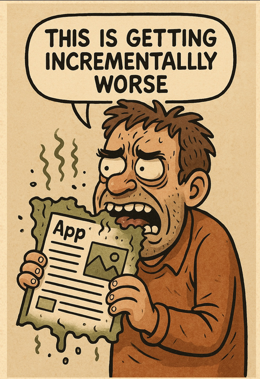

# My Third CTF

## Description

> This challenge requires some content discovery but only use the `wordlist.txt` file we've supplied to avoid wasting your time!

## Solution

Since this is part 3, we'll probably need to ROT one more time (ROT3) now.



Didn't find anything, this challenge says "incrementally worse" so maybe we need to keep rotating? I tried every ROT up to and including ROT13, no luck.

Thinking about the hint again - maybe it means each word in the wordlist is rotated by a different value?


```
word1 -> ROT1
word2 -> ROT2
word3 -> ROT3
etc..
```


Unfortunately, this didn't work either! I didn't solve this one but it turns out you needed to try all iterations of ROT with each word, for each directory, e.g.


```python
/qbhf # ROT1: page
/qbhf/oguucig # ROT2: message
/qbhf/oguucig/wrnhq # ROT3: token
/qbhf/oguucig/wrnhq/lewl # ROT4: hash
```


Visiting `/qbhf/oguucig/wrnhq/lewl` would recover the flag!

Flag: `flag{afd87cae63c08a57db7770b4e52081d3}`
