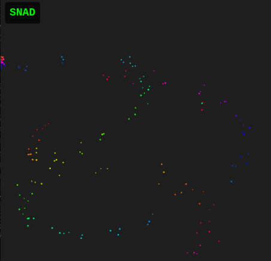

# SNAD

## Description

> No, it's not a typo. It's not sand. It's SNAD. There's a difference!

## Solution

We load the website and see a particle generator operated with the mouse.



The JS contains a POST request to `/api/verify-ctf-solution` which includes a JSON object (`{'particleData': t}`)



```js
let t = particles
        .filter((e) => e.settled)
        .map((e) => ({
            x: Math.floor(e.x),
            y: Math.floor(e.y),
            colorHue: e.colorHue,
        })),
    o = await fetch("/api/verify-ctf-solution", {
        method: "POST",
        headers: {
            "Content-Type": "application/json",
        },
        body: JSON.stringify({
            particleData: t,
        }),
    });
```



I try to send various POST requests using this information but always get `Invalid submission data`. Continuing to read the JS code, there is a `checkFlag` function which calls `retrieveFlag` at the end.



```js
function checkFlag() {
    if (flagRevealed) return;
    let e = 0,
        t = [];
    for (let o of targetPositions) {
        let i = !1;
        for (let r of particles)
            if (r.settled) {
                let l = dist(r.x, r.y, o.x, o.y),
                    s = min(abs(r.colorHue - o.colorHue), 360 - abs(r.colorHue - o.colorHue));
                if (l < 15 && s < 20) {
                    (i = !0),
                        t.push({
                            targetPos: `(${o.x}, ${o.y})`,
                            targetHue: o.colorHue,
                            particlePos: `(${Math.floor(r.x)}, ${Math.floor(r.y)})`,
                            particleHue: r.colorHue,
                            distance: Math.floor(l),
                            hueDifference: Math.floor(s),
                        });
                    break;
                }
            }
        i && e++;
    }
    e >= 7 && ((flagRevealed = !0), console.log("🎉 All positions correct! Retrieving flag..."), retrieveFlag());
}
```



I try to execute `retrieveFlag` in the console but it's not that simple! The particles need to be in the correct positions. Here's a script that will do that, we just paste it into the browser console.



```js
function placeCorrectParticles() {
    for (let i = 0; i < 7; i++) {
        let target = targetPositions[i];
        particles.push({
            x: target.x + Math.random() * 10 - 5,
            y: target.y + Math.random() * 10 - 5,
            colorHue: (target.colorHue + Math.random() * 10 - 5 + 360) % 360,
            settled: true,
        });
    }
    checkFlag();
}
```



Then call the function.



```js
placeCorrectParticles();
```



Flag: `flag{6ff0c72ad11bf174139e970559d9b5d2}`
