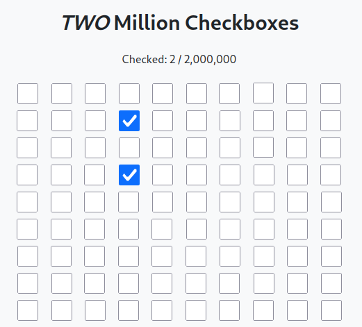
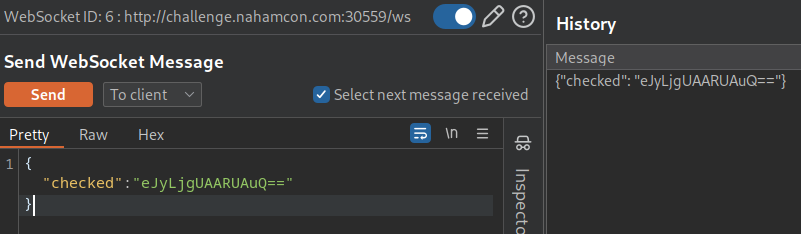
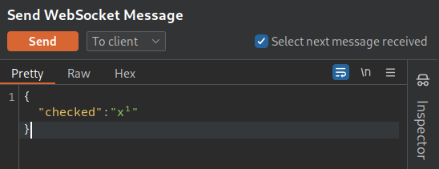
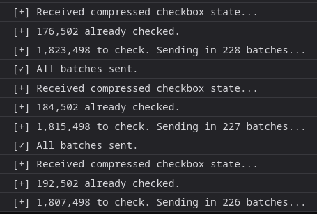
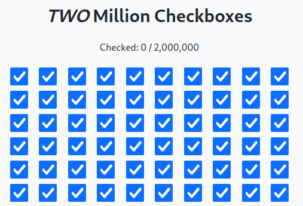
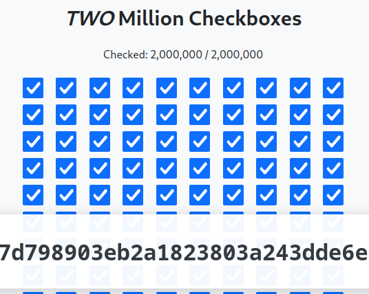

# TMCB

## Description

> They thought they could impress us with One Million Checkboxes!? _Pfft..._ how about _**TWO** Million Checkboxes?!_

> Ya gotta check'em all!!

## Solution

We have 2 million checkboxes to tick!



Checking the JS, it becomes apparent the "checks" are done with websockets.



We can base64 decode.



Presumably we can write a brute force script to solve this, but I will focus on the JS. We quickly see how the requests function.


```js
ws.onmessage = function (event) {
    const data = JSON.parse(event.data);
    if (data.checked) {
        try {
            // Decode base64
            const decoded = atob(data.checked);
            // Convert to Uint8Array for pako
            const compressed = new Uint8Array(decoded.length);
            for (let i = 0; i < decoded.length; i++) {
                compressed[i] = decoded.charCodeAt(i);
            }
            // Decompress using pako
            const decompressed = pako.inflate(compressed, { to: "string" });
            // Parse JSON
            const checkboxList = JSON.parse(decompressed);

            checkedBoxes = new Set(checkboxList);
            updateUI();

            // Hide loading overlay and show content
            if (loadingOverlay) {
                loadingOverlay.style.display = "none";
            }
            if (content) {
                content.classList.add("loaded");
            }

            // Load initial batch of checkboxes
            loadMoreCheckboxes();
        } catch (e) {
            console.error("Error processing compressed data:", e);
        }
    }
    if (data.error) {
        console.error("WebSocket error:", data.error);
    }
};
```


I was thinking of using JS to tick all the boxes though 😁 I ask ChatGPT for a quick script.


```js
(async () => {
    const TOTAL_CHECKBOXES = 2_000_000;
    const BATCH_SIZE = 500000;
    const CHECK_DELAY_MS = 5; // fast, but adjustable if needed

    const ws = new WebSocket(`ws://${location.host}/ws`);

    ws.onopen = () => {
        console.log("[+] WebSocket connected, requesting state...");
        ws.send(JSON.stringify({ action: "get_state" }));
    };

    ws.onmessage = async (event) => {
        const data = JSON.parse(event.data);
        if (data.checked) {
            console.log("[+] Received compressed checkbox state...");
            try {
                // Decode base64 and decompress
                const decoded = atob(data.checked);
                const compressed = new Uint8Array(decoded.length);
                for (let i = 0; i < decoded.length; i++) {
                    compressed[i] = decoded.charCodeAt(i);
                }
                const decompressed = pako.inflate(compressed, { to: "string" });
                const checkedList = new Set(JSON.parse(decompressed));
                console.log(`[+] ${checkedList.size.toLocaleString()} already checked.`);

                // Identify unchecked boxes
                const toCheck = [];
                for (let i = 0; i < TOTAL_CHECKBOXES; i++) {
                    if (!checkedList.has(i)) toCheck.push(i);
                }

                console.log(`[+] ${toCheck.length.toLocaleString()} to check. Sending in ${Math.ceil(toCheck.length / BATCH_SIZE)} batches...`);

                // Batch check requests
                let batchIndex = 0;
                const sendNextBatch = () => {
                    if (batchIndex * BATCH_SIZE >= toCheck.length) {
                        console.log("[✓] All batches sent.");
                        return;
                    }

                    const batch = toCheck.slice(batchIndex * BATCH_SIZE, (batchIndex + 1) * BATCH_SIZE);
                    ws.send(JSON.stringify({ action: "check", numbers: batch }));
                    batchIndex++;
                    setTimeout(sendNextBatch, CHECK_DELAY_MS);
                };

                sendNextBatch();
            } catch (e) {
                console.error("[-] Failed to process checkbox state:", e);
            }
        }
    };

    ws.onclose = () => {
        console.warn("[!] WebSocket closed. You may need to reload and resume.");
    };
})();
```


Paste this in the browser console, but it will take a few mins (250 batches)



After 1-2 minutes, we are done.



Actually, I don't know why ChatGPT set the batch size at 8000. I increased it to 500,000 and it solves in 4 batches. Maybe you can just send 2,000,000 in one go! When the page is refreshed, we have the flag.



Flag: `flag{7d798903eb2a1823803a243dde6e9d5b}`
