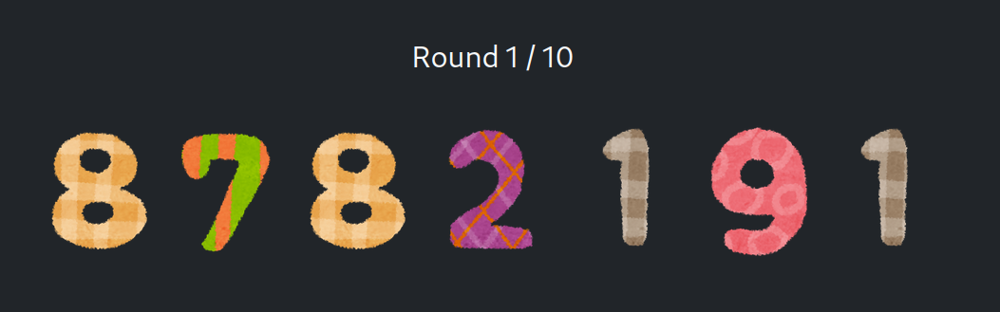
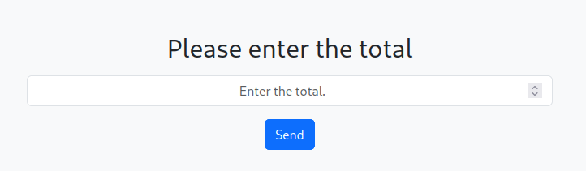
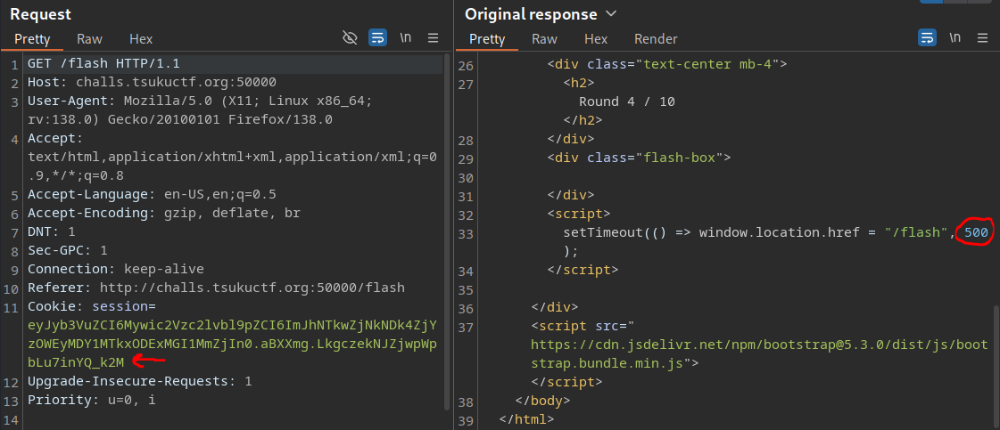

# Flash

[](https://www.youtube.com/watch?v=qGd4d0zmhy8?t=167 "flash (Tsuku CTF)")

## Description

> 3, 2, 1, pop!

## Solution

### Site functionality

When we open the website, we are welcomed to a basic page that says `Flash!` and presents a start button. Clicking start will cycle through 10 rounds, displaying a 7 digit unique number each time.



When we get to the end, we have to enter the total value.



I thought maybe I could just use a match/replace rule in burp to change the timeout of each round from 500ms to 5000ms, giving me time to write down each number. However, some of the rounds (4-7) don't show any value at all.



Note that each round provides a new session cookie, which we can decode with `flask-unsign`.

```bash
flask-unsign --decode --cookie eyJyb3VuZCI6Mywic2Vzc2lvbl9pZCI6ImJhNTkwZjNkNDk4ZjYzOWEyMDY1MTkxODExMGI1MmZjIn0.aBXXmg.LkgczekNJZjwpWpbLu7inYQ_k2M

{'round': 3, 'session_id': 'ba590f3d498f639a20651918110b52fc'}
```

### Source code

The challenge comes with source code, `app.py` is the most interesting.

```python
from flask import Flask, session, render_template, request, redirect, url_for, make_response
import hmac, hashlib, secrets

used_tokens = set()

with open('./static/seed.txt', 'r') as f:
    SEED = bytes.fromhex(f.read().strip())

def lcg_params(seed: bytes, session_id: str):
    m = 2147483693
    raw_a = hmac.new(seed, (session_id + "a").encode(), hashlib.sha256).digest()
    a = (int.from_bytes(raw_a[:8], 'big') % (m - 1)) + 1
    raw_c = hmac.new(seed, (session_id + "c").encode(), hashlib.sha256).digest()
    c = (int.from_bytes(raw_c[:8], 'big') % (m - 1)) + 1
    return m, a, c

def generate_round_digits(seed: bytes, session_id: str, round_index: int):
    LCG_M, LCG_A, LCG_C = lcg_params(seed, session_id)

    h0 = hmac.new(seed, session_id.encode(), hashlib.sha256).digest()
    state = int.from_bytes(h0, 'big') % LCG_M

    for _ in range(DIGITS_PER_ROUND * round_index):
        state = (LCG_A * state + LCG_C) % LCG_M

    digits = []
    for _ in range(DIGITS_PER_ROUND):
        state = (LCG_A * state + LCG_C) % LCG_M
        digits.append(state % 10)

    return digits

def reset_rng():
    session.clear()
    session['session_id'] = secrets.token_hex(16)
    session['round'] = 0

TOTAL_ROUNDS = 10
DIGITS_PER_ROUND = 7
FLAG = "TsukuCTF25{**REDACTED**}"

app = Flask(__name__)
app.secret_key = secrets.token_bytes(16)

@app.route('/')
def index():
    reset_rng()
    return render_template('index.html')

@app.route('/flash')
def flash():
    session_id = session.get('session_id')
    if not session_id:
        return redirect(url_for('index'))

    r = session.get('round', 0)
    if r >= TOTAL_ROUNDS:
        return redirect(url_for('result'))

    digits = generate_round_digits(SEED, session_id, r)

    session['round'] = r + 1

    visible = (session['round'] <= 3) or (session['round'] > 7)
    return render_template('flash.html', round=session['round'], total=TOTAL_ROUNDS, digits=digits, visible=visible)

@app.route('/result', methods=['GET', 'POST'])
def result():
    if request.method == 'GET':
        if not session.get('session_id') or session.get('round', 0) < TOTAL_ROUNDS:
            return redirect(url_for('flash'))
        token = secrets.token_hex(16)
        session['result_token'] = token
        used_tokens.add(token)
        return render_template('result.html', token=token)

    form_token = request.form.get('token', '')
    if ('result_token' not in session or form_token != session['result_token']
            or form_token not in used_tokens):
        return redirect(url_for('index'))
    used_tokens.remove(form_token)

    ans_str = request.form.get('answer', '').strip()
    if not ans_str.isdigit():
        return redirect(url_for('index'))
    ans = int(ans_str)

    session_id = session.get('session_id')
    correct_sum = 0
    for round_index in range(TOTAL_ROUNDS):
        digits = generate_round_digits(SEED, session_id, round_index)
        number = int(''.join(map(str, digits)))
        correct_sum += number

    session.clear()
    resp = make_response(
        render_template('result.html', submitted=ans, correct=correct_sum,
                        success=(ans == correct_sum), FLAG=FLAG if ans == correct_sum else None)
    )
    cookie_name = app.config.get('SESSION_COOKIE_NAME', 'session')
    resp.set_cookie(cookie_name, '', expires=0)
    return resp

if __name__ == '__main__':
    app.run(host='0.0.0.0', port=5000)
```

### Breaking it down

The Flask app generates a series of 10 pseudo-random 7-digit numbers using a deterministic PRNG seeded by a secret value and a session ID. The goal is to calculate the sum of all 10 numbers, but only rounds 1–3 and 8–10 are visible.

At startup, the app reads a secret `SEED` from `./static/seed.txt`. This file is served from Flask's `static/` directory, making it publicly downloadable.

```
b7c4c422a93fdc991075b22b79aa12bb19770b1c9b741dd44acbafd4bc6d1aabc1b9378f3b68ac345535673fcf07f089a8492dc1b05343a80b3d002f070771c6
```

When we visit `/`, the app generates a new session with a random `session_id` and sets the round to 0. The `session_id` is stored in the Flask session cookie, which is signed but decodable (using `flask-unsign`).

Each round's number is generated by a linear congruential generator (LCG), with parameters (`a`, `c`) and initial state derived from HMACs of the `SEED` and `session_id`. The generator advances the state based on the current round index and produces 7 digits per round.

The `/flash` endpoint shows the digits in an image if the round is in \[0, 1, 2, 7, 8, 9\]; otherwise, the digits are hidden. It progresses through the rounds automatically, and after round 10, we are redirected to `/result`.

At `/result`, we must submit the sum of all 10 numbers. The server recomputes all 10 numbers using the stored `session_id` and compares the submitted sum to the correct one. If the answer is correct, the flag is displayed.

Steps to solve:

1. Download `seed.txt` from `/static/seed.txt`.
2. Go through all 10 rounds in a single session, preserving the session cookie.
3. Decode the `session_id` from the cookie after the 10 rounds.
4. Use the known `SEED` and decoded `session_id` to regenerate all 10 numbers using the PRNG logic.
5. Compute the sum and submit it at `/result` to receive the flag.

We can use ChatGPT to make a quick solve script 🙏

### solve.py

```python
import requests
import hmac
import hashlib
import base64
import json
import time

BASE_URL = "http://challs.tsukuctf.org:50000"
SEED_HEX = "b7c4c422a93fdc991075b22b79aa12bb19770b1c9b741dd44acbafd4bc6d1aabc1b9378f3b68ac345535673fcf07f089a8492dc1b05343a80b3d002f070771c6"
SEED = bytes.fromhex(SEED_HEX)
DIGITS_PER_ROUND = 7
TOTAL_ROUNDS = 10
LCG_M = 2147483693

session = requests.Session()

def decode_flask_cookie(cookie):
    payload = cookie.split('.')[0]
    padded = payload + '=' * (-len(payload) % 4)
    decoded = base64.urlsafe_b64decode(padded)
    return json.loads(decoded)

def lcg_params(seed: bytes, session_id: str):
    raw_a = hmac.new(seed, (session_id + "a").encode(),
                     hashlib.sha256).digest()
    a = (int.from_bytes(raw_a[:8], 'big') % (LCG_M - 1)) + 1
    raw_c = hmac.new(seed, (session_id + "c").encode(),
                     hashlib.sha256).digest()
    c = (int.from_bytes(raw_c[:8], 'big') % (LCG_M - 1)) + 1
    return a, c

def generate_round_digits(seed: bytes, session_id: str, round_index: int):
    a, c = lcg_params(seed, session_id)
    h0 = hmac.new(seed, session_id.encode(), hashlib.sha256).digest()
    state = int.from_bytes(h0, 'big') % LCG_M
    for _ in range(DIGITS_PER_ROUND * round_index):
        state = (a * state + c) % LCG_M
    digits = []
    for _ in range(DIGITS_PER_ROUND):
        state = (a * state + c) % LCG_M
        digits.append(state % 10)
    return digits

# Step 1: Start a new session
print("[*] Resetting session...")
session.get(BASE_URL + "/")

# Step 2: Visit /flash 10 times, waiting for 500ms after each
print("[*] Playing through 10 rounds...")
for i in range(TOTAL_ROUNDS):
    session.get(BASE_URL + "/flash")
    print(f"Visited /flash - round {i + 1}")
    time.sleep(0.6)  # must wait >500ms to match auto-redirect timing

# Step 3: Extract session_id from cookie
cookie = session.cookies.get("session")
session_data = decode_flask_cookie(cookie)
session_id = session_data["session_id"]
print(f"[*] session_id: {session_id}")

# Step 4: Recompute numbers using SEED and session_id
print("[*] Generating numbers...")
total_sum = 0
for i in range(TOTAL_ROUNDS):
    digits = generate_round_digits(SEED, session_id, i)
    number = int("".join(map(str, digits)))
    print(f"Round {i+1:2d}: {''.join(map(str, digits))} -> {number}")
    total_sum += number

print(f"\n✅ Total sum to submit: {total_sum}")

# Step 5: GET /result to retrieve token
resp = session.get(BASE_URL + "/result")
token_line = [line for line in resp.text.splitlines()
              if 'name="token"' in line]
if not token_line:
    print("❌ Couldn't find token. Are you sure 10 rounds completed?")
    exit()

token = token_line[0].split('value="')[1].split('"')[0]
print(f"[*] token: {token}")

# Step 6: POST result with sum
resp = session.post(BASE_URL + "/result", data={
    "token": token,
    "answer": str(total_sum)
})

# Step 7: Extract flag
if "TsukuCTF25{" in resp.text:
    start = resp.text.find("TsukuCTF25{")
    end = resp.text.find("}", start) + 1
    flag = resp.text[start:end]
    print(f"\n🎉 FLAG: {flag}")
else:
    print("❌ Submission failed or incorrect. Try again.")
```

We run the script, and receive the flag 🤤

```bash
python solve.py

[*] Resetting session...
[*] Playing through 10 rounds...
Visited /flash - round 1
Visited /flash - round 2
Visited /flash - round 3
Visited /flash - round 4
Visited /flash - round 5
Visited /flash - round 6
Visited /flash - round 7
Visited /flash - round 8
Visited /flash - round 9
Visited /flash - round 10
[*] session_id: c0be089df10682d5687ac81f00520805
[*] Generating numbers...
Round  1: 3169996 -> 3169996
Round  2: 0939486 -> 939486
Round  3: 8232852 -> 8232852
Round  4: 1192245 -> 1192245
Round  5: 1860709 -> 1860709
Round  6: 3580649 -> 3580649
Round  7: 6978503 -> 6978503
Round  8: 7458677 -> 7458677
Round  9: 0971548 -> 971548
Round 10: 8093972 -> 8093972

✅ Total sum to submit: 42478637
[*] token: 9b8614ce12bd1a6445fd3c0a9e6a0eb9

🎉 FLAG: TsukuCTF25{Tr4d1on4l_P4th_Trav3rs4l}
```

Not sure if I took the intended approach here, since I didn't actually do any path traversal. I feel like I was tricked into doing a crypto challenge 😑

Flag: `TsukuCTF25{Tr4d1on4l_P4th_Trav3rs4l}`
