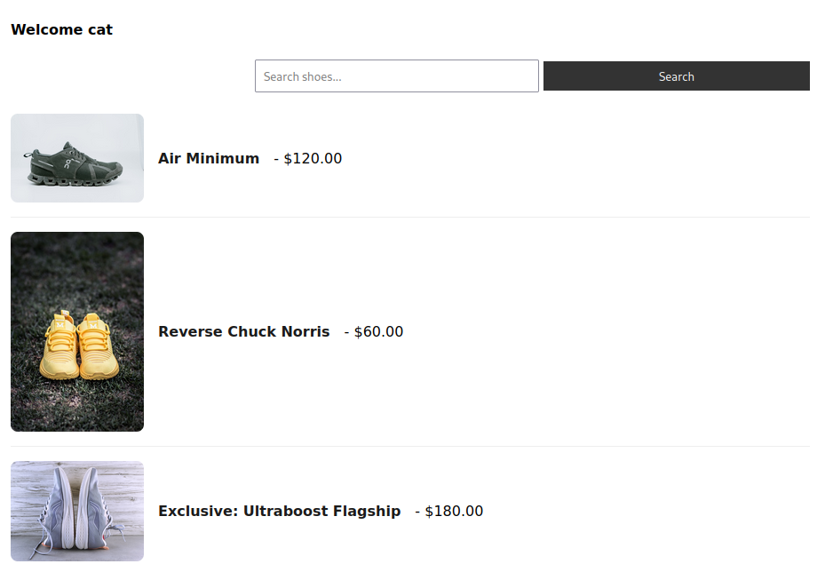
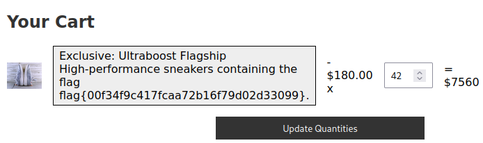

# Shoe Shop 1.0

## Description

> We created a new [shoe shop](https://shoe-shop-1.ctf.zone/), so we can sell some shoes. Too bad the admin already put the exclusive shoe in his shopping cart, but feel free to browse around and check out if there are some shoes you like

## Solution

We have an online shoe store where we can create an account, add items to the cart, view the cart etc.



### IDOR

When going to the cart, I realise the ID is unique: `page=cart&id=694`

If we change the ID, it will give access to other users carts. So, let's check the #1 user for the flag.



```
https://shoe-shop-1.ctf.zone/index.php?page=cart&id=1
```





Flag: `flag{00f34f9c417fcaa72b16f79d02d33099}`
