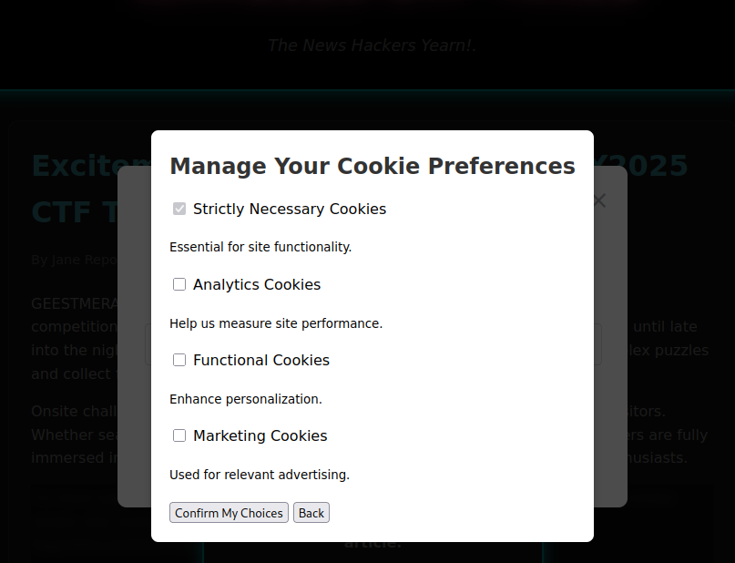
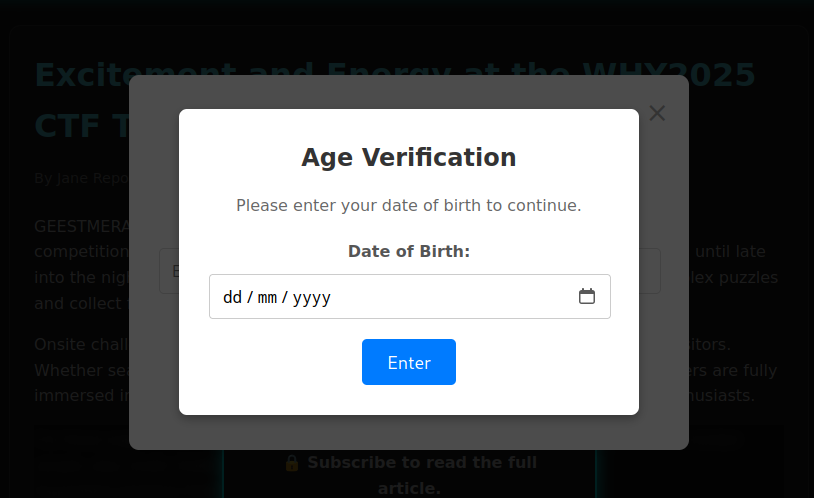
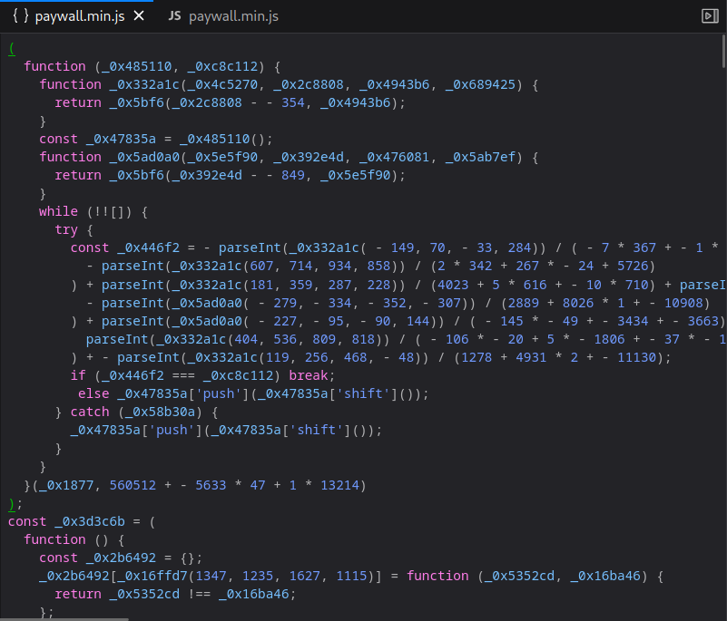
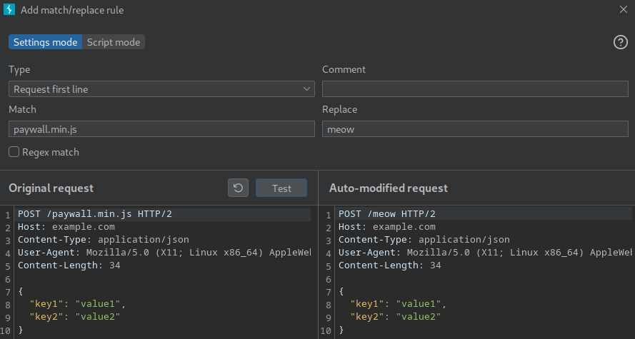
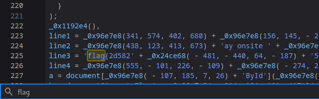
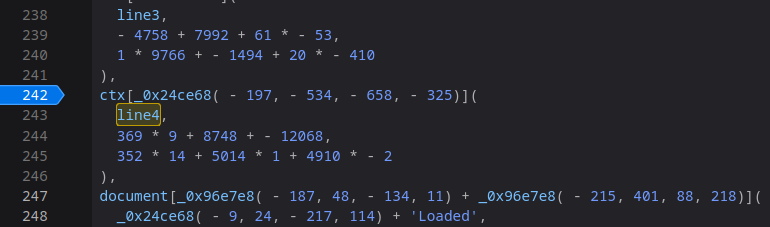
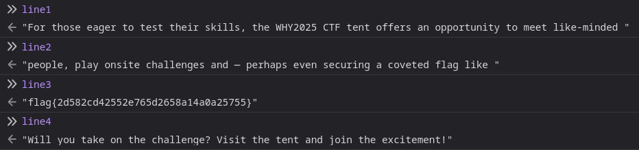

# WHY2025 CTF TIMES

## Description

> Besides creating a CTF, we also created a [newspaper website](https://why2025-ctf-times.ctf.zone). Well we have one article at least. We made sure we followed all the latest trends and laws.

## Recon

When we arrive to the site we have to agree to some cookies.

Then we need to enter our date of birth.

Then enter our email.

We'll arrive at the page, but very quickly all the annoying popups will return. It is a troll challenge!!

There's also an interesting chat button in the bottom right.

## Solution

There's probably a lot of ways to disable the popups, which seem to be coming from the `paywall.min.js` file.

It's heavily obfuscated but we could try to reverse engineer it or step through with the debugger.

I hoped to skip the trouble by simply dropping requests for the file. You can do this manually, or setup a match and replace rule in burp suite. I opted to replace all instances of `paywall.min.js` with `meow`.

Remember to reload the page while clearing the cache (`ctrl + f5`). We no longer get most of the annoying popups, but date of birth is still there and is no longer functional. Dead end, so we can remove the rule.

### Debugging

Time for a simpler approach, I use `ctrl + F` on the minified JS file.

It looks like our flag is split up across those lines with some obfuscation. We can search for `line4` and setup a breakpoint.

When the debugger pauses, we switch to the console and print out the line variables.

`line3` holds the flag!

Flag: `flag{2d582cd42552e765d2658a14a0a25755}`
