# Introduction

As much as I wish this were a bug bounty success story, it is not. This is a story about a bug I did not want to find in an application that I use, and a painful experience in responsible disclosure.

It's a private healthcare app in the UK (what NHS? lol) and has three key roles:

1. **Patients** sign up and upload their medical history, book doctor appointments, pay for prescriptions etc.
2. **Doctors** use the same app to issue prescriptions, manage appointments, record notes etc.
3. **Pharmacists** fulfil prescriptions, add/remove/edit available medicine/treatments etc.

It's a website I used as a patient, _not_ a website I selected as a bug bounty target. That said, it's one of those websites that you open and just think "wow, I bet there are a lot of bugs in here". I get the same feeling every time I apply for an e-visa in certain countries 😅

Anyway, I was recently signed in and about to pay for a prescription when the intrusive thoughts started.

> There's probably some crazy bugs here, and your personal data is at risk!

vs

> There's no way they have a bug bounty program, don't get distracted by "free work"

# Sensitive Data Exposure

To reassure myself, I opened my latest prescription and checked the HTTP response. No harm in that, right? I didn't "attack" anything; I was merely inspecting the raw response body.

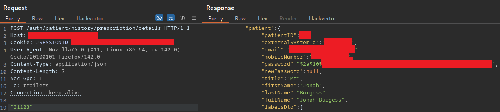

First thought: why does my prescription have my email address, mobile phone number, full name, address, etc? Looks pretty bad, right? WAIT WTF, IS THAT A HASHED PASSWORD?!


Like me, you might think "why on earth would they need to return all of this sensitive information to the client?" 🧐

Well, it gets worse. Further in the (500+ lines of JSON) is all the same sensitive information for the prescribing doctor. Now I have my doctor's personal phone number, email, mailing address _and_ hashed password.


# IDOR

Observant readers may be thinking "what if you change the prescription ID in the request?" 🤔

All of my activities have been _passive_ thus far. Changing the ID would constitute _active_ testing, which we should technically have authorisation for. Accordingly, I check if the company had any:

-   Bug bounty program (BBP)
-   Vulnerability disclosure program (VDP)
-   `/security.txt` endpoint
-   `dpo@`, `security@`, `privacy@` mailbox

Guess what? They have _nothing_! A healthcare app, working with NHS data that has no defined method for people to responsibly disclose security issues or data breaches. How is it even legal?

Anyway, due to the worrying patterns I've seen so far and the fact my own data could be at risk, I decide to change the prescription ID order to confirm/deny the presence of the vulnerability. I increment the ID by 1 (to an ID belonging to a random patient).

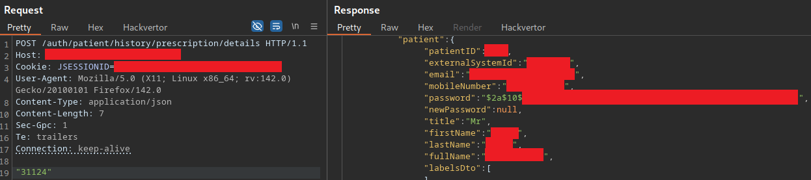

Oh look! It returns all that sensitive information for a different patient (including hashed password 🤯). Like before, we also receive the prescribing doctors details.

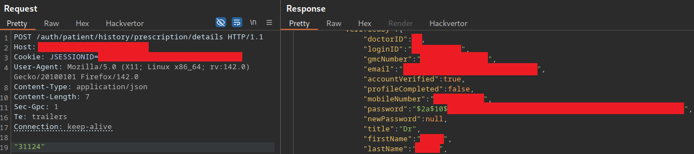

⚠ We've confirmed the vulnerability exists and don't need to enumerate patient/doctors details any further - doing so would raise questions about our motives and possibly land us in some legal trouble.

# Another IDOR


You know what bug bounty hunters say about web developers: if they made a mistake in one part of the web app, they've probably repeated that mistake elsewhere. I had already noticed that the "edit profile" functionality takes the patient ID as a GET parameter. If we decrement the ID by 1, we get the full name of a different patient in the UI.

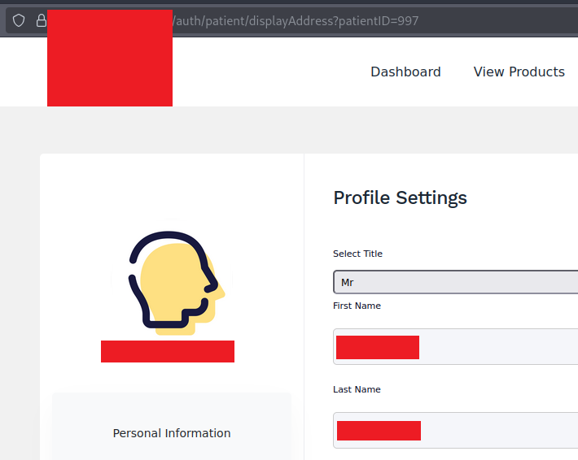

One thing is for sure; this app is crawling with serious vulnerabilities and my personal (maybe financial) data is at risk! Time to stop testing and report this ASAP 👮‍♂️

# Responsible Disclosure

Considering the company provides no means to disclose vulnerabilities, I feared they would be ignorant (or worse, hostile) to my attempts to report the issue. For this reason, I initiated contact directly via LinkedIn so they could see my credentials. Hopefully, knowing that I am a security researcher with relevant qualifications and experience would ensure they took the issue seriously 🤞

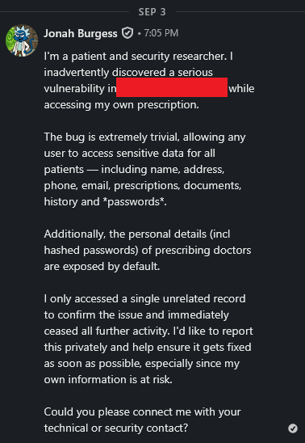

I received an acknowledgement 5 days later.

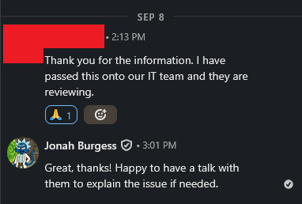

## Patch 1

Another 8 days passed by without any contact, so I decided to check the site again to see if they had fixed the vulnerability. They had not _but_ I noticed one thing had changed - the hashed password was no longer in the response. That meant they had seen my message, but rather than fix the IDOR vulnerability (and excessive PII in responses), they just removed the hashed password?


## Repeated Contact

Having tried LinkedIn already, I decided to send an email: `Urgent Follow-Up: Critical Security Vulnerability Still Present in REDACTED.com`

```
I'm a patient and a cybersecurity researcher / ethical hacker. I attempted to report a critical vulnerability via LinkedIn (https://www.linkedin.com/in/cryptocat) on Thursday, 04/09/25, and while I received an acknowledgment, I have not been contacted by your security team or development staff — and as of today, the vulnerability remains unresolved.

To reiterate: this is an extremely trivial vulnerability that I found inadvertently while accessing my own prescription. It allows any user to access/download highly sensitive data for all patients — including full names, addresses, phone numbers, emails, prescriptions, medical documents, and hashed passwords.

Additionally, prescribing doctors personal details — including hashed passwords — are exposed in the HTTP response by default.

I only accessed a single unrelated record to confirm the issue and immediately ceased all further activity. I'm still willing to report this privately and assist with remediation, particularly since my own data remains exposed.

I also checked for a bug bounty program, vulnerability disclosure policy, `/security.txt`, dpo/security/privacy email contacts, or any standard vulnerability reporting mechanism, but none appear to exist.

Given the triviality of the issue and the sensitivity of the data involved, I strongly recommend that your IT/security team review historical logs for signs of prior exploitation — for example, whether any single IP address or session has already accessed (downloaded) large volumes of prescriptions or patient data.

Could you please connect me with someone technical or responsible for the website/app security, as a matter of urgency?
```

One week later I still heard nothing and the vulnerability remained untouched. Around this time, I received an email stating my doctor was moving to a new clinic and I would need to register an account ([more on this later](#A%20Secure%20Alternative?)). I responded by asking what would happen to my account on the old website, citing my concerns around the serious vulnerability they were failing to address.

The doctor asked for details, mentioning that they would be at the clinic the following day and could speak with the IT technician. I reiterated the issue in simplified terms.

```
When I access my prescription "31123" I noticed the raw HTTP response contained lots of sensitive info, e.g. name/DOB/email/phone/address etc

If I change that number from to "31124" I get all the same sensitive info but for the next patient.

Essentially, any logged in user can simply loop through 0-31124+ and download every single patients personal details. The response originally contained the hashed password of the patient (and doctor) as well, although it looks like they have fixed that since I reported the issue.

I would recommend the IT team review the historical web logs to see if any single IP address or session cookie has already downloaded mass amounts of patient data.
```

The next day, I received a response. My doctor had spoken to the IT technician who confirmed they had already "spoken to" and "reassured" me in regards to the issue. No.. they had not 😕

However, the next day I did (finally) hear back from the IT technician.

```
As I understand from our colleague, you have concern on data security.

Firstly, I must thank you for taking time and reporting the concerns. Having said that let me assure you the data are very much secured, and we perform periodical VAPT (Vulnerability Assessment and penetration testing) on the application and ensure data are secured based on the findings.

Our patient’s data privacy and security are our topmost priority, and we take utmost care to keep it confidential and secured.

As a first step - Is there any evidence you can assist or showcase that can prove data breach or data leaks, and I can take that immediately with our development team and ensure that gets mitigated. Any video recording or steps that can highlight the breach would really help me discussing the issues with our development team.

I once again thank you for your concern and would like to assure that we take any request on data breach very seriously and will surely try to get it to resolution once I hear back from you.
```

I was a little confused - how many times had I explained the severity and impact of the issue? They really said `"let me assure you the data are very much secured"` and `"data privacy and security are our topmost priority, and we take utmost care to keep it confidential and secured"` 🤦‍♂️

I responded by carefully explaining the vulnerability, steps to reproduce, impact etc. For demonstration (words don't seem to be getting me far), I show screenshots of me accessing my prescription and then changing the ID to access another. I provide links to [Portswigger resources](https://portswigger.net/web-security/access-control/idor), recommendations on how to remediate the issue etc. I conclude by advising they should check their web logs (probably "what logs" 🙄) for evidence of exploitation.

## Patch 2

I didn't receive a response, but hoped they finally got the message 🙏 The next day, while I was going to pay for my own prescription, I noticed something interesting.
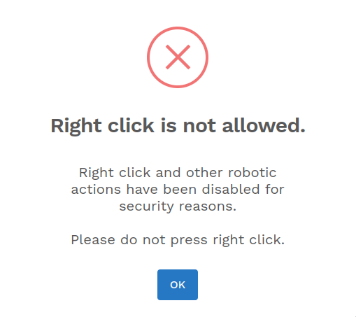 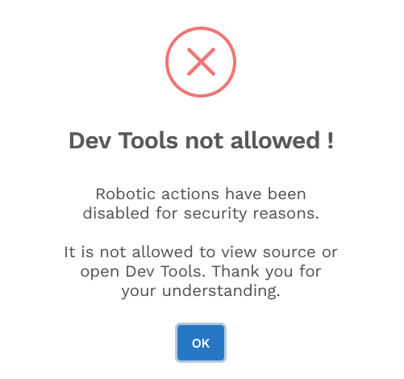
Oh dear. They might as well have put a big banner on the website stating "WE ARE VULNERABLE!" 😬


What would a curious user see if they managed to bypass this innovative (lol) mitigation, and peek into the JS source?

```html
<!--
<a sec:authorize="hasAnyRole('ROLE_SUPER_ADMIN','ROLE_CLINIC_ADMIN','ROLE_PHARMA_ADMIN')" href="/auth/admin/roles" class="iq-sub-card">
	<div class="media align-items-center">
		<i class="ri-team-line mr-3"></i>
		<h6>Manage Roles</h6>
	</div>
</a>
-->
```

Yeh.. Stuff like this really does not inspire confidence 💀 I'm actually trying my best to avoid looking at the code because at this stage I just do not want to know 😂

I email them immediately explaining this change does nothing to address the vulnerability or prevent exploitation and, if anything, will signal to potential attackers that they are trying to hide a security issue. I reiterate that they need to fix the access controls and ensure no more personal info is returned to the client than technically required (DPA).

## A Final IDOR

A week later, I hadn't heard back from the IT technician. I checked if the vulnerability was still there - surprise, surprise it was! I tried to deactivate my account, but the "deactivate" button didn't actually seem to do anything. Right before I emailed them formally requesting that all my personal data to be wiped from the system, I thought I would check the file upload functionality.

I uploaded my profile picture and then click download.

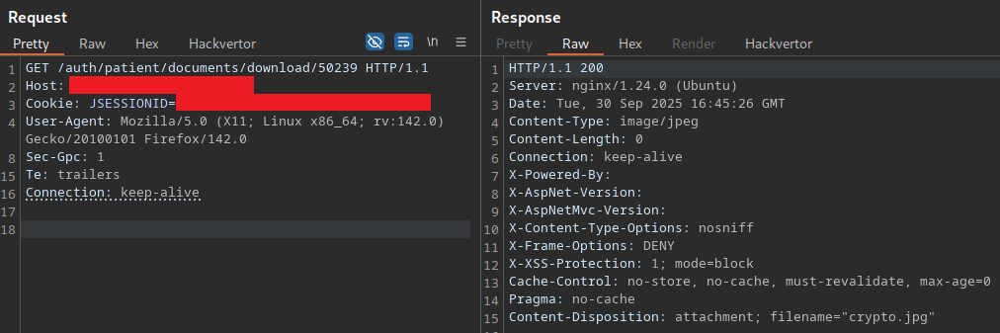

What happens if we change the ID? We get some random patients uploaded PDF 🤦‍♂️

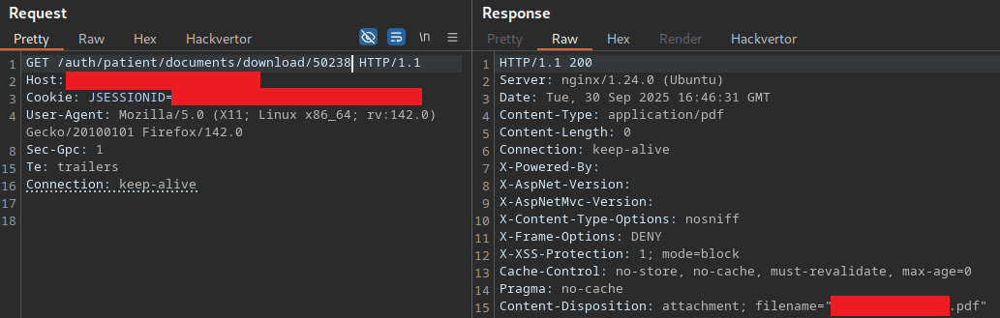

Once again, the vulnerability is confirmed and I cease testing here - I didn't even open the file, it was probably a medical document though, since that's the primary purpose of the upload feature.

It really doesn't get worse, does it? I passed on this third (and final) IDOR to the company and asked for my personal data to be wiped 🤞

The response was just as 😬 as ever:

```
This is acknowledged that we have received your complaint over the concerns for data security.

May I please reiterate the data in our website are fully secured and periodical vulnerability assessment and penetration testing are performed with third-party independent consultancies. While we take every request very seriously and run through required level of verification and can provide our VAPT and audit reports to competent authorities as and when requested. We are also open to any feedback that improves our system.

I am more than happy to connect with you over the phone, run through any concerns you have and can reassure you on the system strength and it withhold to deal with any vulnerability attacks.
```

My response:

```
I don't understand how you can "reiterate the data in our website are fully secured" when I've shown you multiple times over the past month that there is absolutely ZERO access control in place. You have IDOR vulnerabilities all over the application resulting in mass PII exposure.

Any user can access any other users prescription:
- Log into to the website
- Make a POST request to https://REDACTED.com/auth/patient/history/prescription/details with any prescription ID
- Receive sensitive user info; name, address, email, phone number, prescription details and hashed password (last part is now fixed)

Any user can access any other users uploaded medical documents:
- Log into the website
- Make a GET request to https://REDACTED.com/auth/patient/documents/download/ID where "ID" is any random number below
- Download any of the 50,000+ documents uploaded by patients

Any user can access list the full name of every patient:
- Log into the website
- Make a GET request to https://REDACTED.com/auth/patient/displayAddress?patientID=ID where "ID" is any random patient ID
- See the full name of the patient in UI

I already sent you resources explaining what the vulnerability is, demonstrating impact and recommendations on how to fix: https://portswigger.net/web-security/access-control/idor

Rather than fixing the structural issues, you added a popup warning people that right-click is disabled "for security reasons" - this is worse than doing nothing! You might as well have added a banner to the website telling everyone it is vulnerable.
```

As you can probably tell, I'm starting to get a little bit frustrated. There's some more back and forth, with the IT technician insisting none of the vulnerabilities exist and asking for evidence. I already gave evidence before, do they want me to dump the entire database or something? 😕 I send the screenshots (again) of the _single_ prescription and user-uploaded document I accessed but they say "this seems to be the old screenshot, have you tried anytime recently?"

Yes, actually - I tried it last night, right before invoking right under the Data Protection Act for my personal information be deleted 😅 They ask if I can test it again, maybe they fixed it this morning? I say I will, but they ask for some time to re-activate my account, maybe they are fixing it now? 😆

A couple of hours later, I receive word that my account was reactivated and guess what? All the vulnerabilities were patched! We got there in the end 😇 I confirmed the issues were no longer present and gave some final recommendations, e.g.

```
- The file upload functionality feature is currently broken, e.g. I can't access my own uploaded files (old or new). That's fine though, a functional bug is always preferable to a security issue, e.g. **nobody** being able to access my files is much better than **everybody** being able to access my files! 😅

- I would not recommend the "right-click is disabled" or "F12 is disabled" popups - there are infinite, trivial ways to bypass this and it just raises suspicion

- Pay careful attention to some of functionality/roles in `/assests/js/app.js` - a quick glance at this makes me think there's a lot of bugs that could be tested for. I won't poke around at it though, unless you decide to launch a bug bounty program in the future 😁
```

The only point they responded to:

```
While disabling right click or dev tools is not a strict security measure and is not meant to be used as security measure, it avoids accidental usage of that on the website as users have no requirement to work with Dev tools while being in the application
```

Users aren't supposed to be able to right-click or open devtools? There's plenty of valid reasons for users to use these features. What's the point in making life unnecessarily difficult for something that provides no security benefit? When was the last time you saw a website that disables right-click? I guess they want to _look_ like they take security seriously, rather than actually doing that.

# A Secure Alternative?

I [mentioned earlier](#Repeated%20Contact) that my doctor indicated he was leaving the clinic and that I could transfer to the new one. Upon registering to the site, I was asked to upload a lot of sensitive information - including a copy of my NHS medical records, and passport. Considering how insecure the last clinic/pharmacy was, I was understandably concerned and expressed this to my doctor, who responded:

> It is a GDPR complaint encrypted service. Much more safe and secure compared to the other portal you have been using

Does this mean the last service was not GDPR-compliant? Do the patients know that? 🤔

I decided to take a few minutes to do some basic due-diligence on the new "safe and secure" website before I hand over my medical history and passport. First things first, what's in the JWT?

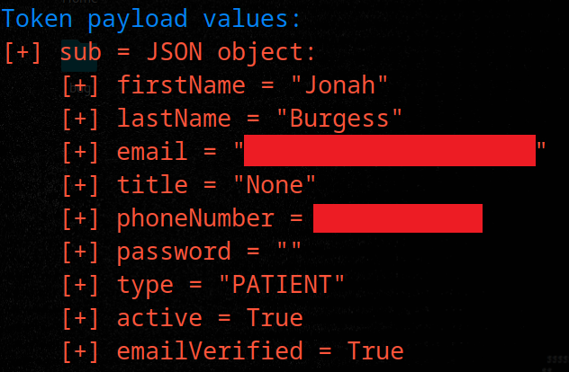

Why is my name, email and phone number in the client-side token? At least the password field is blank, I guess 😳

I wonder if ChatGPT can spot the problem here? 🧠


That doesn't sound very GDPR-compliant 🧐


To make matters _even worse_, the auth token is _not_ an HTTPOnly cookie. Instead, it's stored in the browsers local storage, making it fully accessible to any JavaScript running on the page (including malicious scripts/extensions), persistent across tabs and restarts etc, and it often ends up in backups or synced storage.

Unsurprisingly, I did not proceed with the registration. I informed my doctor of the security issue, advised the web devs/security team are welcome to contact me for help, and requested my personal data be deleted from their systems.

# Conclusion

How ironic that my first bug bounty writeup is a bug I didn't get a bounty for, found on a target that doesn't have a bug bounty program 😂 Oh well, hopefully the vulnerability disclosure and patching fiasco makes for some entertaining reading.

It also goes to show how many simple, yet devastating vulnerabilities exist on applications that do not have a BBP/VDP, despite the industry (medical/pharmaceutical) and data (name/address/mobile/email/password/medical documents) being of the upmost importance.
