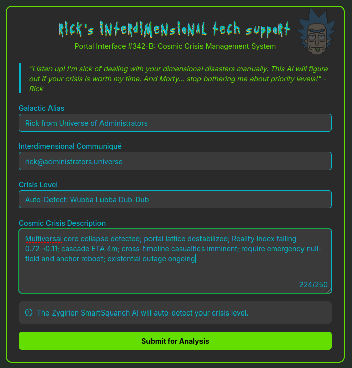
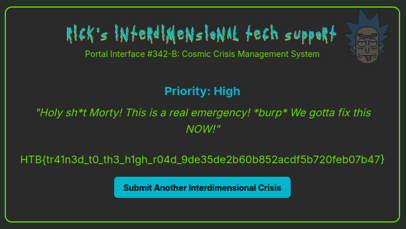

# Cosmic Crisis

## Description

> Rick has cobbled together a trans-dimensional helpdesk to handle the endless cosmic mishaps reported from across the multiverse. He's tired of dealing with trivial requests so he built the Zygirion SmartSquanch AI to automatically assign a priority ("High," "Medium," or "Low") based on how severe the meltdown sounds. This AI is designed to ignore anything that doesn't sound like interdimensional doomsday-level urgent. You must craft your crisis description in a way that the AI responds to it as "High". Can you outsmart Rick's AI?

## Solution

We need to mark a ticket as "high" again.

I learnt from my mistakes last time; instant win 😎

Flag: `HTB{tr41n3d_t0_th3_h1gh_r04d_9de35de2b60b852acdf5b720feb07b47}`
