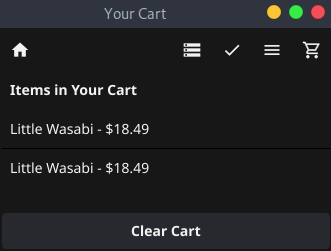
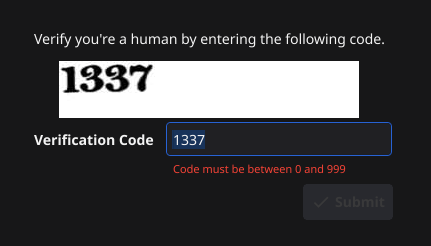
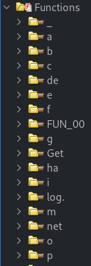
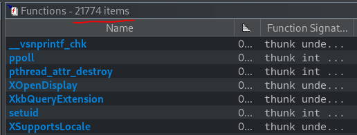
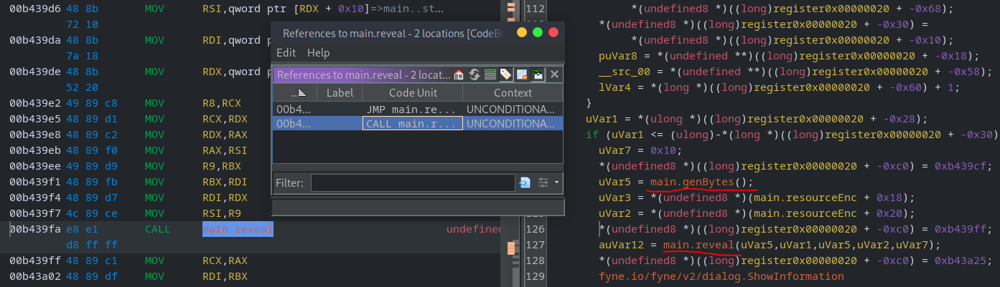
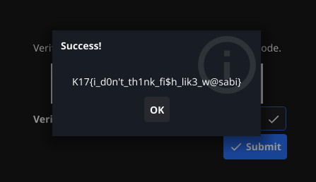

# Bait and Switch

## Description

> This store promised me a free gift if I downloaded their app, but it's not working >:(

## Solution

We'll follow the usual reversing methodology; basic file checks, static analysis, dynamic analysis.

### Basic File Checks

It's 64-bit linux binary, not stripped (easier to reverse).

```bash
file bait-and-switch

bait-and-switch: ELF 64-bit LSB executable, x86-64, version 1 (SYSV), dynamically linked, interpreter /lib64/ld-linux-x86-64.so.2, BuildID[sha1]=38f8c17f0aa216ee86c7f2d76c5f6737250e7cae, for GNU/Linux 3.2.0, with debug_info, not stripped
```

I run the program, expecting the usual terminal UI but what's this? 😲


OK, this looks like a cool reversing challenge! 🍜


Testing the basic functionality, I add an item to the cart.



Clicking the ✔ button on the navbar takes us to a "redeem a gift" screen, but since the `1337` value is outside the permitted range, we can't verify we are human 🤖



### Static Analysis

Opening the binary in ghidra reveals _a lot_ of functions, and references to golang. There's so many that it took ghidra forever to do the auto analysis.




Luckily, we did some basic file checks and we already know what functionality to investigate first. I tried searching for strings "human", "verif", "1337" etc, but no luck. I also see mentions of crypto - maybe the flag is encrypted, but there's no network element (I already ran wireshark).

We can throw the `main()` function at ChatGPT and ask if there's a better way to reverse go binaries (I suspect there is).

```bash
go tool nm ./bait-and-switch | egrep "make(HomePage|ProductsPage|GiftPage|CartPage|Toolbar)" -n

25542:  b43b00 t main.makeCartPage
25543:  b43e40 t main.makeCartPage.func1
25544:  b43f00 t main.makeCartPage.func2
25545:  b43dc0 t main.makeCartPage.func3
25546:  b43260 t main.makeGiftPage
25547:  b43a60 t main.makeGiftPage.NewAllStrings.func4
25548:  b44020 t main.makeGiftPage.func1
25549:  b440a0 t main.makeGiftPage.func2
25550:  b43740 t main.makeGiftPage.func3
25551:  b422a0 t main.makeHomePage
25552:  b42ac0 t main.makeHomePage.func1
25553:  b429e0 t main.makeHomePage.func2
25554:  b42900 t main.makeHomePage.func3
25555:  b42ba0 t main.makeProductsPage
25556:  b43120 t main.makeProductsPage.func1
25557:  b418e0 t main.makeToolbar
25558:  b421a0 t main.makeToolbar.func1
25559:  b420a0 t main.makeToolbar.func2
25560:  b41fa0 t main.makeToolbar.func3
25561:  b44120 t main.makeToolbar.func4
25562:  b41ea0 t main.makeToolbar.func5
```

OK, now we have some functions to search for (I guess we could have searched "main" 😆). I also notice that PIE is disabled, maybe we can break at these functions in GDB?

```bash
checksec --file bait-and-switch
[*] '/home/crystal/Desktop/bug/bait-and-switch'
    Arch:     amd64-64-little
    RELRO:    Partial RELRO
    Stack:    Canary found
    NX:       NX enabled
    PIE:      No PIE (0x400000)
    FORTIFY:  Enabled

```

Returning to ghidra, I notice a function that sounds interesting; `main.reveal` 👀 Checking the references to that function, it is called by `main.makeGiftPage.func3` but we probably can't jump directly to it, as there's some setup (`main.genBytes()`).



### Dynamic Analysis

Let's open `pwndbg` and set a breakpoint at `main.reveal`

```bash
break *0xb439fa
```

I thought/hoped the code might be executed during setup, but not actually revealed/presented on screen. However, setting a breakpoint at the `reveal` call did not trigger anything. Trying to work backwards, I spot an interesting snippet in `makeGiftPage.func3`

```cpp
if ((*(long *)(lVar4 + 0x78) != 4) || (**(int **)(lVar4 + 0x70) != 0x37333331)) {
	*(undefined8 *)((long)register0x00000020 + -0xc0) = 0xb4387d;
	fmt.Errorf(0,0,uVar3,0);
	*(undefined8 *)((long)register0x00000020 + -0xc0) = 0xb4388c;
	fyne.io/fyne/v2/dialog.ShowError(*(undefined8 *)((long)register0x00000020 + -0x50));
	return;
```

It checks if a value equals `4`, and another value equal `0x37333331`. What's `0x37333331` converted to ASCII? It's `7331`, aka our target verification code (endianess revered). So _this_ is the condition responsible for checking that our code is 4 digits long _and_ equals `1337`! We want to break at each of these conditions (CMP instructions):

```c
 00b4376b 48 89       MOV      qword ptr [RSP + local_50],RDX
         54 24 68
 00b43770 49 83       CMP      qword ptr [R8 + 0x78],0x4
         78 78 04
 00b43775 0f 85       JNZ      LAB_00b43865
         ea 00
         00 00
```

```c
 00b4377b 4d 8b       MOV      R10,qword ptr [R8 + 0x70]
         50 70
 00b4377f 41 81       CMP      dword ptr [R10],0x37333331
         3a 31
         33 33 37
 00b43786 0f 85       JNZ      LAB_00b43865
         d9 00
         00 00
```

Set those breakpoints in GDB and run the application.

```bash
break *0xb43770
break *0xb4377f
```

We hit the first breakpoint at `0xb43770`, let's check the condition.

```c
0x0000000000b43770 in main.makeGiftPage.func3 ()
LEGEND: STACK | HEAP | CODE | DATA | WX | RODATA
────────────────────────────────────────────────────[ REGISTERS / show-flags off / show-compact-regs off ]────────────────────────────────────────────────────
 RAX  0xb43740 (main.makeGiftPage.func3) ◂— lea r12, [rsp - 0x38]
 RBX  0
 RCX  0xc001ca6480 ◂— 0x4210000042b3c000
 RDX  0xc000402000 —▸ 0xc0019d8750 —▸ 0x1c09090 ◂— 0
 RDI  0xc002412398 —▸ 0xc00040ba40 —▸ 0xc000aa82d0 ◂— 0
 RSI  0
 R8   0xc000a7d188 ◂— 0x420c500043634400
 R9   0xe68ba0 (go:itab.*fyne.io/fyne/v2/internal/driver/glfw.window,fyne.io/fyne/v2[Window]) —▸ 0xd0d180 (type:*+1302880) ◂— 0x10
 R10  0x7fffb01e2f20 ◂— 0
 R11  8
 R12  0xc0000e38f8 —▸ 0x70efd5 (fyne.io/fyne/v2.(*Animation).Start+53) ◂— add rsp, 0x10
 R13  0xc002412398 —▸ 0xc00040ba40 —▸ 0xc000aa82d0 ◂— 0
 R14  0xc000002380 —▸ 0xc0000e0000 ◂— 0
 R15  0xffffffffffffffff
 RBP  0xc0000e3928 —▸ 0xc0000e3940 —▸ 0xc0000e3970 —▸ 0xc0000e3a20 —▸ 0xc0000e3a50 ◂— ...
 RSP  0xc0000e3878 ◂— 0
*RIP  0xb43770 (main.makeGiftPage.func3+48) ◂— cmp qword ptr [r8 + 0x78], 4
```

It's comparing `[r8 + 0x78]` to `4` - what does that address currently hold?

```r
x $r8 + 0x78

0xc000d75c80:	0x0000000000000003
```

It's `3` (the max allowed digits), let's change it to `4`

```bash
set {unsigned long}($r8 + 0x78) = 0x4
```

Verify it's looking good ✅

```r
x $r8 + 0x78

0xc000d75c80:	0x0000000000000004
```

We also need the code to _actually_ be 4 digits (`1337`) so let's continue to our next breakpoint at `0xb4377f`

```c
LEGEND: STACK | HEAP | CODE | DATA | WX | RODATA
────────────────────────────────────────────────────[ REGISTERS / show-flags off / show-compact-regs off ]────────────────────────────────────────────────────
 RAX  0xb43740 (main.makeGiftPage.func3) ◂— lea r12, [rsp - 0x38]
 RBX  0
 RCX  0xc001ca6480 ◂— 0x4210000042b3c000
 RDX  0xc000402000 —▸ 0xc0019d8750 —▸ 0x1c09090 ◂— 0
 RDI  0xc002412398 —▸ 0xc00040ba40 —▸ 0xc000aa82d0 ◂— 0
 RSI  0
 R8   0xc000a7d188 ◂— 0x420c500043634400
 R9   0xe68ba0 (go:itab.*fyne.io/fyne/v2/internal/driver/glfw.window,fyne.io/fyne/v2[Window]) —▸ 0xd0d180 (type:*+1302880) ◂— 0x10
*R10  0xc000d6b4f0 ◂— 0x333331 /* '133' */
 R11  8
 R12  0xc0000e38f8 —▸ 0x70efd5 (fyne.io/fyne/v2.(*Animation).Start+53) ◂— add rsp, 0x10
 R13  0xc002412398 —▸ 0xc00040ba40 —▸ 0xc000aa82d0 ◂— 0
 R14  0xc000002380 —▸ 0xc0000e0000 ◂— 0
 R15  0xffffffffffffffff
 RBP  0xc0000e3928 —▸ 0xc0000e3940 —▸ 0xc0000e3970 —▸ 0xc0000e3a20 —▸ 0xc0000e3a50 ◂— ...
 RSP  0xc0000e3878 ◂— 0
*RIP  0xb4377f (main.makeGiftPage.func3+63) ◂— cmp dword ptr [r10], 0x37333331
```

It's comparing `[r10]` to `0x37333331` - what does that address currently hold?

```r
x $r10

0xc0014067a0:	0x0000000000333331
```

It's `0x333331` because we are one digit short. Let's do another live modification.

```bash
set {unsigned int}($r10) = 0x37333331
```

Verify it's also looking good ✅

```r
x $r10

0xc0014067a0:	0x0000000037333331
```

Hit continue and boom - we did it! 🥳



It's not possible to copy and paste the flag, so here's a shortcut to find it in memory.

```bash
search K17

Searching for byte: b'K17'
bait-and-switch 0xea84bc 0x38314b460037314b /* 'K17' */
bait-and-switch 0x15cd409 0x130a67501537314b
[anon_c000000]  0xc0002da000 "K17{i_d0n't_th1nk_fi$h_lik3_w@sabi}"
```

TLDR; we used some static analysis and live debugging to bypass the 3 digit limit and submit the correct 4 digit code, receiving the flag. I'm not sure if this is the most efficient, or intended path to solution - let me know if you solved it differently!

Flag: `K17{i_d0n't_th1nk_fi$h_lik3_w@sabi}`
