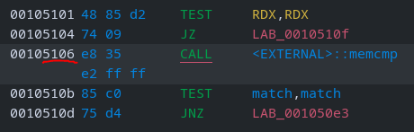
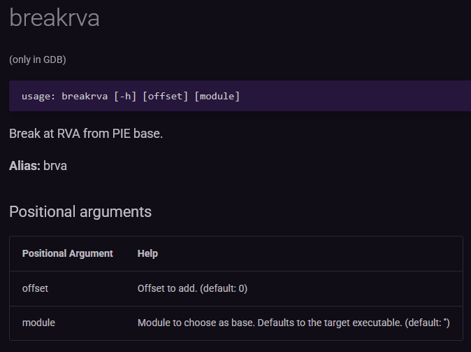
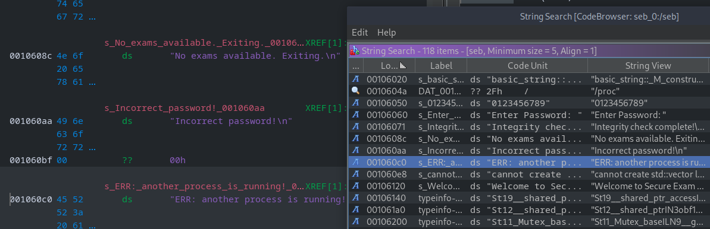
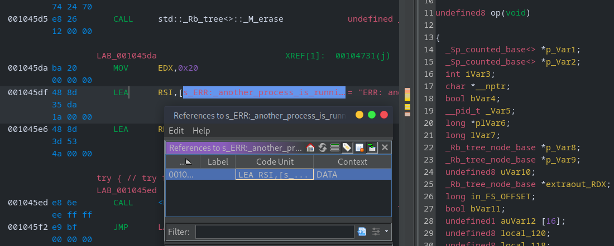
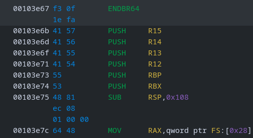
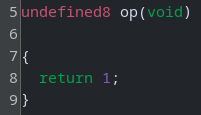
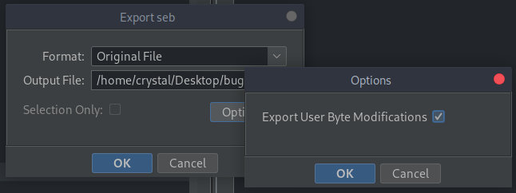
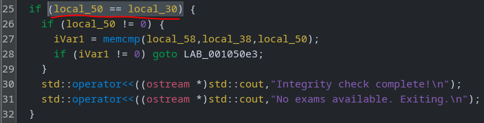
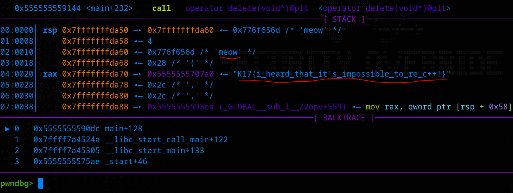

# Secure Exam Browser

## Description

> I love academic misconduct

## Solution

We'll follow the usual reversing methodology; basic file checks, static analysis, dynamic analysis.

### Basic File Checks

64-bit binary, not stripped (easier to reverse).

```bash
file seb

seb: ELF 64-bit LSB pie executable, x86-64, version 1 (SYSV), dynamically linked, interpreter /lib64/ld-linux-x86-64.so.2, BuildID[sha1]=c07f6718ca003c40c5170f23910830a91e90633e, for GNU/Linux 3.2.0, not stripped
```

Running the program, it asks us for a password. Apparently they changed it from universal default 😸

```bash
./seb

Welcome to Secure Exam Browser
Enter Password: meow
ERR: another process is running!
```

`ltrace` and `strace` don't give a quick win, over to ghidra.

### Static Analysis

I started by renaming all the variables in the main function. I still do this out of habit (methodology), but honestly it's easier and faster to use ChatGPT. From the syntax, I can see the application was C++ and while the ghidra output cannot be compiled directly, ChatGPT can re-create it nicely.

#### main.cpp

```cpp
#include <iostream>
#include <string>
#include <cstring>

extern std::string enc_p;

void decode_flag(std::string &out, const std::string &enc);

int main() {
    std::cout << "Welcome to Secure Exam Browser\n";
    std::cout << "Enter Password: ";
    std::string input;
    if (!(std::cin >> input)) return 1;
    std::string decoded;
    decode_flag(decoded, enc_p);
    if (input.size() == decoded.size()) {
        if (!input.empty()) {
            if (std::memcmp(input.data(), decoded.data(), input.size()) != 0) {
                std::cout << "Incorrect password!\n";
                return 0;
            }
        }
        std::cout << "Integrity check complete!\n";
        std::cout << "No exams available. Exiting.\n";
    } else {
        std::cout << "Incorrect password!\n";
    }
    return 0;
}
```

#### decode_flag.cpp

```cpp
#include <string>
#include <cstring>
#include <stdexcept>

static void step_bool_functor(unsigned char *out, size_t out_size, unsigned char *in, size_t in_size, int rounds, unsigned long param);
static void step_next_functor(unsigned char *out, size_t out_size, unsigned char *in, size_t in_size, int rounds, unsigned long param);
static void step_next_functor_b(unsigned char *out, size_t out_size, unsigned char *in, size_t in_size, int rounds, unsigned long *state);
static void run_pipeline(unsigned char *out, size_t out_size, unsigned char *in, size_t in_size, int rounds, unsigned long param_big, unsigned long param2);

void decode_flag(std::string &out, const std::string &enc) {
    size_t enc_len = enc.size();
    if ((long)enc_len < 0) throw std::length_error("cannot create std::vector larger than max_size()");
    unsigned char *enc_buf = nullptr;
    if (enc_len == 0) {
        enc_buf = nullptr;
    } else {
        enc_buf = (unsigned char*)operator new(enc_len);
        std::memmove(enc_buf, enc.data(), enc_len);
    }
    size_t half_len = enc_len >> 1;
    size_t out_size = half_len + 1;
    unsigned char *out_buf = nullptr;
    if (out_size == 0) {
        out_buf = nullptr;
    } else {
        out_buf = (unsigned char*)operator new(out_size);
        std::memset(out_buf, 0, out_size);
    }
    if (out_buf) out_buf[out_size - 1] = 0x2a;
    int rounds = 3;
    unsigned long param_big = 0x232f37UL;
    unsigned long param_zero = 0;
    run_pipeline(out_buf, out_size, enc_buf, enc_len, rounds, param_big, param_zero);
    if (out_buf) {
        out.assign((char*)out_buf, out_size ? out_size - 1 : 0);
    } else {
        out.clear();
    }
    if (out_buf) operator delete(out_buf);
    if (enc_buf) operator delete(enc_buf);
}

static void run_pipeline(unsigned char *out, size_t out_size, unsigned char *in, size_t in_size, int rounds, unsigned long param_big, unsigned long param2) {
    if (!out || !in) return;
    step_bool_functor(out, out_size, in, in_size, rounds, param_big);
    step_next_functor(out, out_size, in, in_size, rounds, param_big);
    step_next_functor_b(out, out_size, in, in_size, rounds, &param2);
    step_next_functor(out, out_size, in, in_size, rounds, param_big);
}

static void step_bool_functor(unsigned char *out, size_t out_size, unsigned char *in, size_t in_size, int rounds, unsigned long param) {
    for (size_t i = 0; i < out_size - 1; ++i) {
        unsigned char a = in[i % (in_size ? in_size : 1)];
        out[i] = (unsigned char)((a + (param & 0xff) + rounds) & 0xff);
    }
}

static void step_next_functor(unsigned char *out, size_t out_size, unsigned char *in, size_t in_size, int rounds, unsigned long param) {
    for (size_t i = 0; i < out_size - 1; ++i) {
        unsigned char v = out[i];
        out[i] = (unsigned char)(((v << 3) | (v >> 5)) ^ ((unsigned char)(param >> ((i & 7) * 8))));
    }
}

static void step_next_functor_b(unsigned char *out, size_t out_size, unsigned char *in, size_t in_size, int rounds, unsigned long *state) {
    for (size_t i = 0; i < out_size - 1; ++i) {
        unsigned char v = out[i];
        out[i] = (unsigned char)(v ^ (unsigned char)(*state & 0xff));
        *state = (*state >> 1) | ((*state & 1) << 31);
    }
}
```

It looks like there's a lot going on in the `decode_flag` function but hey, did you notice this line in `main`? (this is the \[manually\] refactored/commented pseudocode from ghidra)

```cpp
if (input_len == decoded_len) {
	if (input_len != 0) {
		match = memcmp(input_ptr,decoded_ptr,input_len); // compare 👀
		if (match != 0) goto LAB_001050e3; // incorrect password
	}
	std::operator<<((ostream *)std::cout,"Integrity check complete!\n");
	std::operator<<((ostream *)std::cout,"No exams available. Exiting.\n");
}
```

### Dynamic Analysis

Why bother reversing that whole function, when we can just set a breakpoint after it? However, PIE is enabled on this binary - we don't yet know the address to set the breakpoint at, only the offset (`0x5106`). We could run GDB and break on the main function (or first instruction) and _then_ check the address of the instruction we want to break at.



It's been too long since I did rev/pwn but I could have sworn there was a better way to do this in `pwndbg` (the GDB plugin). I spend a few minutes asking ChatGPT but it seems incapable of reading the [docs](https://pwndbg.re/pwndbg/latest/commands) (???), so I have to do it myself! I quickly find [what I was looking for](https://pwndbg.re/pwndbg/latest/commands/breakpoint/breakrva/) 😌



Perfect. We can use `breakrva` (or `brva`) to set a breakpoint at the desired offset. First run the program, then hit `ctrl + C` to pause execution.

```bash
breakrva 0x5106

Breakpoint 1 at 0x555555559106
```

I try to enter the password but we never reach the breakpoint.

```bash
meow

ERR: another process is running!
```

That pesky error again! I didn't see that string in the two functions, let's find it: `search -> search for strings`



Check the references to string.



We quickly find the problematic exit call.

```cpp
std::__ostream_insert<>((ostream *)std::cout,"ERR: another process is running!",0x20);
std::endl<>((ostream *)std::cout);
exit(1);
```

### Binary Patching

The function doesn't seem relevant to the challenge, but is preventing us from proceeding. What if we just patch the binary? The function starts at offset `0x3e67`, let's patch that instruction.



Just `right click -> patch instruction` and change the code to return on entry.

```c
MOV EAX, 0x1
RET
```

The pseudocode for the `op()` function now looks like this.



Save the binary and go to `file -> export program` and save as `Original File` with `Export User Byte Modifications` checked.



```bash
chmod +x patched; ./patched

Welcome to Secure Exam Browser
Enter Password: meow
Incorrect password!
```

Finally, it is checking the password! Let's open the patched binary in `pwndbg` and return to where we were earlier.

```bash
breakrva 0x5106

Breakpoint 1 at 0x555555559106
```

Hmmm, it still never triggers. Let's move the breakpoint a bit earlier (`0x50dc`)

```c
001050dc 48 3b       CMP      RDX,qword ptr [RSP + local_30]
	 54 24 28
001050e1 74 15       JZ       LAB_001050f8
```



Run the program and this time when we enter the password, GDB hits a breakpoint and we have our flag 😎



Flag: `K17{i_heard_that_it's_impossible_to_re_c++!}`
