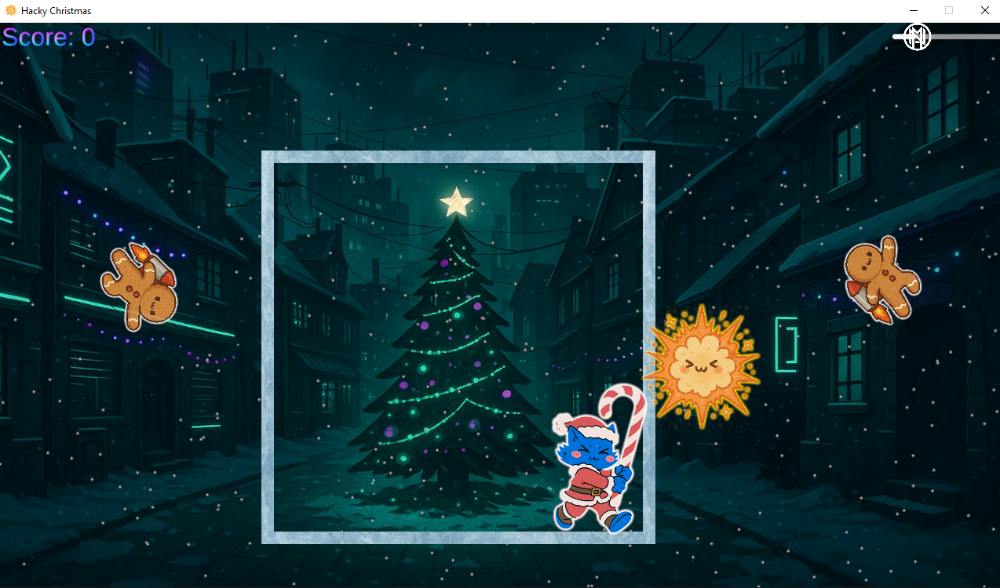
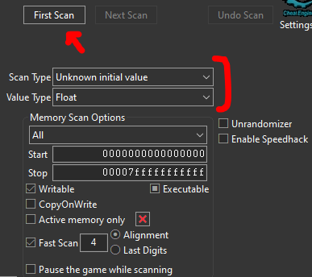
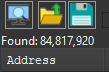
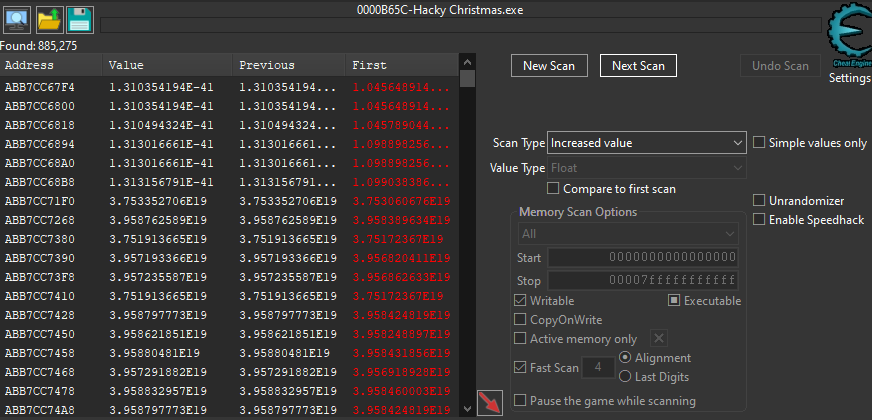
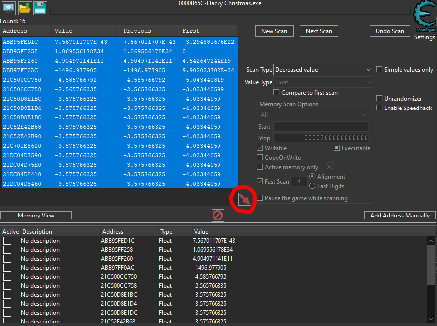
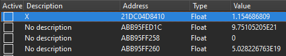
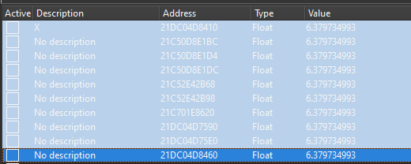
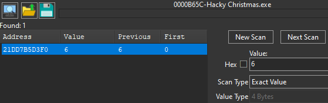
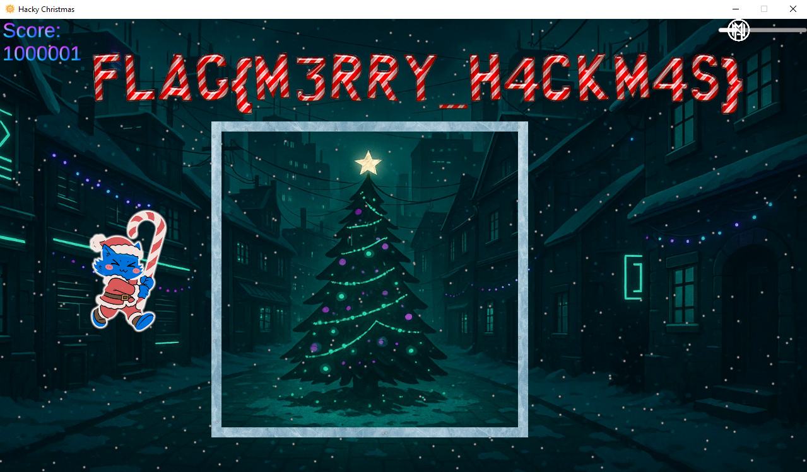

# Hacky Christmas

## Video Walkthrough

")

## Description

> Crypto Claus is trapped inside walls of ice! If you don't get him out soon, and take care of those 1 MILLION gingerbread bombers.. Christmas will be cancelled! 😿

## Solution

Downloading the ZIP (windows/linux), we'll find a Unity game. There are flying gingerbread men that explode when the hit the walls of the ice box.. which Crypto Claus is trapped inside!

That means we can't score any points, let alone 1,000,000 points 😆 Since it's a Unity game, we might try to decompile with dnSpy/ilSpy _but_ it's been compiled with IL2CPP rather than Mono, making reversing much more difficult.

Another approach is to [download cheat engine](https://www.cheatengine.org) so that we can manipulate the game memory, inject code etc. A lot people complain about adware in CE, but you just need to select the right options during installation.

### Teleportation

We need to hack our way through the wall. I vaguely remember using a tool on a [HackTheBox gamepwn](https://www.hackthebox.com/blog/intro-to-gamepwn-aka-game-hacking) challenge that allowed me to modify objects in Unity games on the fly, e.g. to remove a wall. I can't remember what it was though - if someone knows you can DM me 😄 Anyway, a way that I _do_ remember is to find the players coordinates in CE (they have to be in memory somewhere!) and then adjust them to be outside of the ice cube.

While the game is running, attach cheat engine to the process.

Since it's a 2D game, we want to find either the X (horizontal) or Y (vertical) coordinates. They are usually floats, and we don't know the initial values will be. Therefore, we scan for an "unknown initial value" of type "float".

It finds ~85 million addresses. If you like, you can sort through them manually.

However, I would rather not to that 😂 Let's filter it down. Move the character in some direction, it doesn't matter which, as long as you select the "next" value accordingly. For example, if you move to the right, you'll probably be looking for an X coordinate that has "increased", rather than "decreased".

I'll do exactly that; move to the right and then select "increased value" as the scan type and click "next scan".

That's more like it! We've reduced the possible values to ~900k. We can repeat this process, moving left/right and selecting "increased" or "decreased" for the next scan. You can also stand perfectly still and select the scan type "unchanged value", tick "repeat" and then click "next scan". Just make sure you don't move (left/right, moving up/down is actually a good idea to rule out Y coordinates) by mistake while this is on, as you'll have to start again!

Once you narrow it down enough, you can select all the possible addresses and copy them to the address list.

Now you can keep an eye on the values as you move _or_ tick the "active" checkboxes to pause those memory values. That means when you try to move, your character will be stuck. If he's not stuck, it's the wrong address and you can remove it.

Depending how many addresses you have here (don't do too many, as freezing/modifying certain addresses will crash the game), you might want to pause half at a time (split binary search).

When you think you've found it, you should move towards the wall and see if the value increases or decreases, e.g. when I move right against the rightmost wall, the X value increases to 2.33 👀

I'll modify this to 5 and see the cat is now free from his box ✅

_However_, that was not enough! There were other addresses pointing to the X coordinate and if we didn't change them, our player position will reset. By modifying all of these values, we remain out of the box and able to move around.

### Score Manipulation

When we hit the gingerbread men, our points increase. However, scoring 1 million points would take _looooooong_ time. We can follow the same process as we did for the teleport cheat, but this is even easier 🙏

Our score starts at zero, so we do a _new_ search for a 4 byte value: `0`

Now, we score one point, change the value to `1` and click "next scan". Repeat the process until we correctly identify the score in memory.

We change the value to `1000000` and then score another point in the game. The score counter will reflect the change and the flag will magically appear 🎄

Flag: `flag{m3rry_h4ckm4s}`
