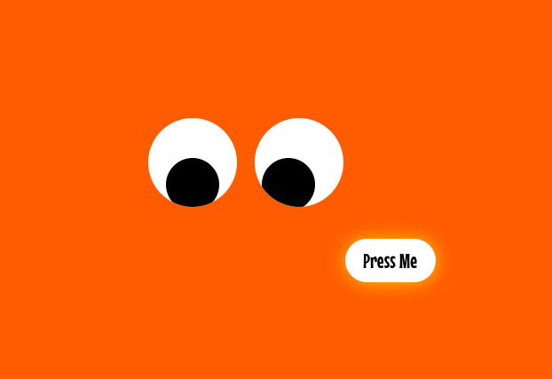

# Press Me If U Can

## Description

> "Stop chasing me!" said the button.

> "We can't. It's our job." they answered.

> Trapped in WebTopia on a page with no way out, except for the fleeing button. Can you break free?

## Solution

We start on a page with a `Press Me` button, that moves when you get too close to it with your mouse. The eyes follow too, cute!



The JS contains all the logic for the animation, movement etc. That's not too important though, we just need to click the button so should find it's declaration.


```js
const btn = document.querySelector("button");
```


Later in the script, it is disabled.


```js
btn.disabled = true;
```


We can modify these properties from the browser console, and click the button.


```js
btn.disabled = false;
btn.click();
```


A POST request is issued, and the response contains our flag (displayed in the console log).

Flag: `N0PS{W3l1_i7_w4S_Ju5T_F0r_Fun}`
