# Ultimate Calculator

## Video Walkthrough

[](https://www.youtube.com/watch?v=lRJno96za5A "Hidden Validator -> Serial Keygen - Ultimate Calculator 3000")

## Challenge Description

> New calculator dropped! The pro version is a work in progress - stay tuned 😎

It's been a while since I made a challenge and I felt like doing something a little different to the last one (pure web). I hosted some parts of it on my [domain](https://cryptocat.me/) but the downloadable file to get started was (is) available on my [discord server](https://discord.gg/qHbAN3wfRK). It's a good place to be! In future, I'll pre-release challenges/hints there and provide \[limited\] technical support 😉

## Solution

### Basic File Checks

After downloading the `ultimate_calculator` binary, we can run it and see the usage options.

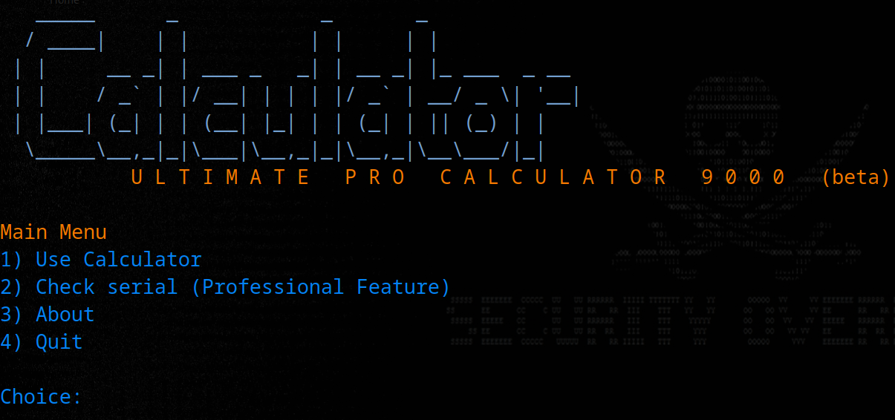

Option 3 and 4 work as advertised - no interesting functionality. Option 1 functions as a traditional calculator.

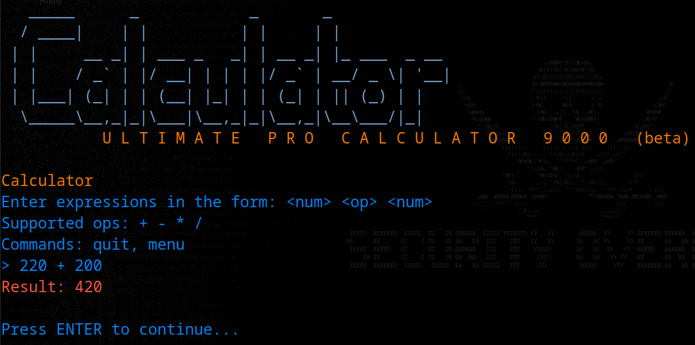

Option 2 says it's still "under construction". When it comes to CTFs, features that are under construction are typically worth investigating.

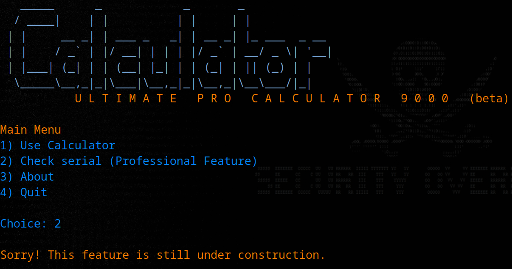

Before we start reversing the binary, let's check its properties. Firstly, we'll see it is stripped - this will make reverse engineering more challenging.

```bash
file ultimate_calc

ultimate_calc: ELF 64-bit LSB pie executable, x86-64, version 1 (SYSV), dynamically linked, interpreter /lib64/ld-linux-x86-64.so.2, BuildID[sha1]=c4429a2c919f1806adc5b6e1323920df92641689, for GNU/Linux 3.2.0, stripped
```

Most of the binary protections are enabled, reducing the likelihood that binary exploitation is the intended path.

```bash
checksec --file ultimate_calc

[*] '/home/crystal/Desktop/chall/ultimate_calc'
    Arch:     amd64-64-little
    RELRO:    Partial RELRO
    Stack:    Canary found
    NX:       NX enabled
    PIE:      PIE enabled
```

The cURL library is included so we should be on the lookout for HTTP traffic.

```bash
ldd ultimate_calc

	linux-vdso.so.1 (0x00007fd4f41af000)
	libcurl.so.4 => /lib/x86_64-linux-gnu/libcurl.so.4 (0x00007fd4f40d7000)
	libc.so.6 => /lib/x86_64-linux-gnu/libc.so.6 (0x00007fd4f3ef5000)
	libnghttp2.so.14 => /lib/x86_64-linux-gnu/libnghttp2.so.14 (0x00007fd4f3ec6000)
	<SNIP>
```

We might try to run the binary with `strace` or leave `wireshark` running in the background to analyse the network traffic. However, in this case we wouldn't see anything useful - let's take a look under the hood.

### Static Analysis

When we open the binary in `ghidra` we'll see that the serial activation function doesn't do anything - it just prints the message and loops back to the menu.

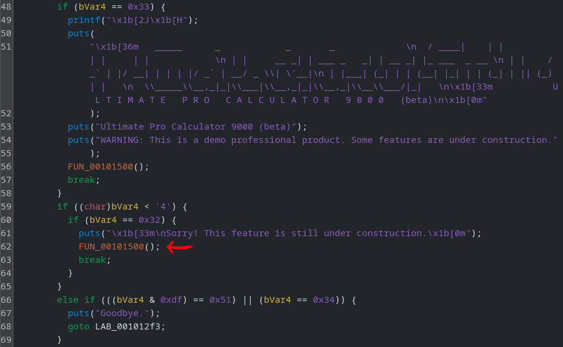

There are no `curl` commands in there either. We could browse through the other functions or look for interesting strings.

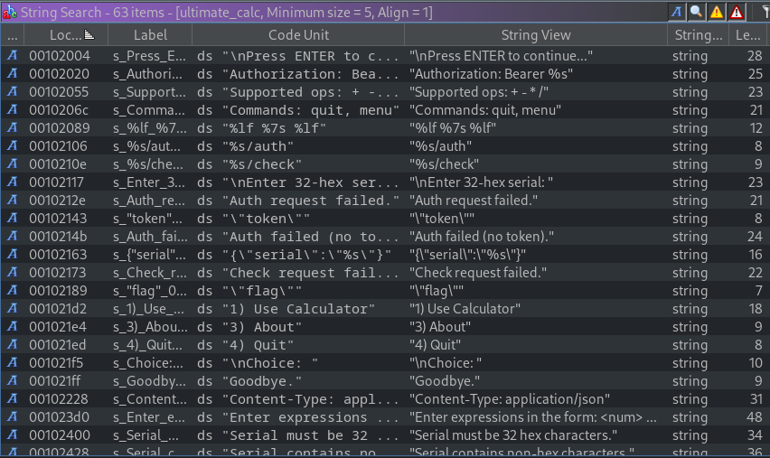

There's clearly some hidden functionality. Clicking one of those entries those will take us to the code in question. It starts with some cryptographic routines.

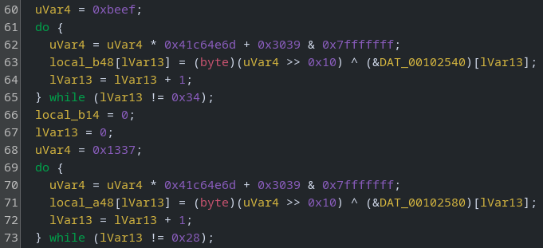

Next, it sets up what looks like some URL endpoints (`/auth` + `/check`) and takes a 32-character hex string from the user.

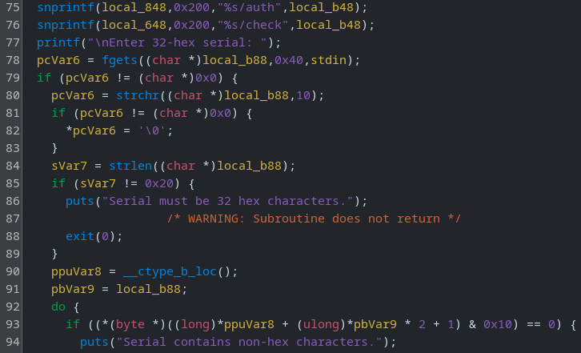

Scrolling down a little (there's ~300 LOC in this function), `curl` is called (`FUN_00101530`).

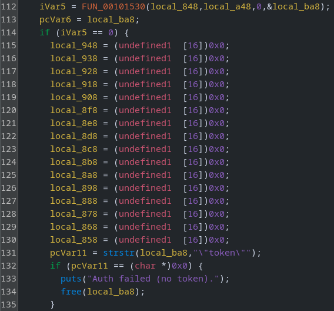

We can confirm it's `curl` by reviewing the pseudocode.

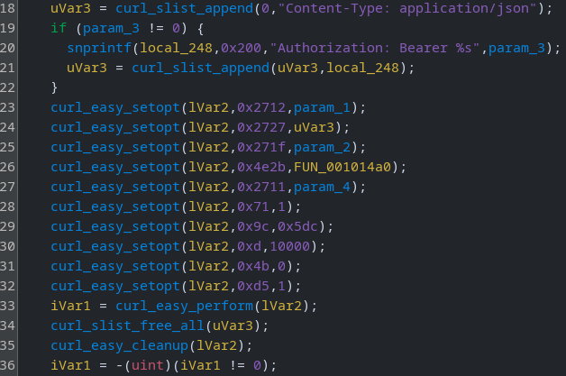

We could proceed with static analysis, reversing this function fully (trivial with LLM assistance) and recreating the crypto and HTTP interactions. However, some obfuscation has been applied in an attempt to hinder reverse engineering efforts. Another approach would be to attach a debugger and let the program do the work for us.

Note that if we check the references to this serial validation function (to find which function calls it), we'll realise that there is no execution path. Therefore, we'll want to patch the binary (swap the function call that loops the menu with the hidden one) _or_ change the flow of execution manually using a debugger.

")

### Binary Patching

The most effective technique here would be to patch the binary, it will save manually restarting the program and jumping to the breakpoint each time. Right click on the instruction, select `Patch Instruction` and insert the correct function address (0x001019a0).

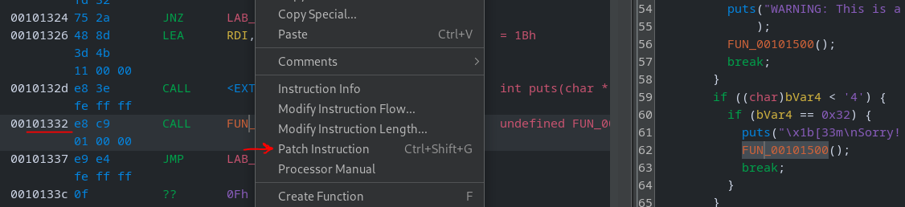

You'll see the altered instruction in the disassembler.

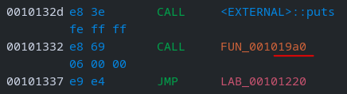

Next, go to `File > Export Program`, set the Format to `Original File` and click "OK".

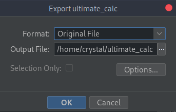

Now if we test the patched binary it will ask for serial number 👀 If we enter an invalid serial, it loops back to the main menu so we can try again indefinitely.

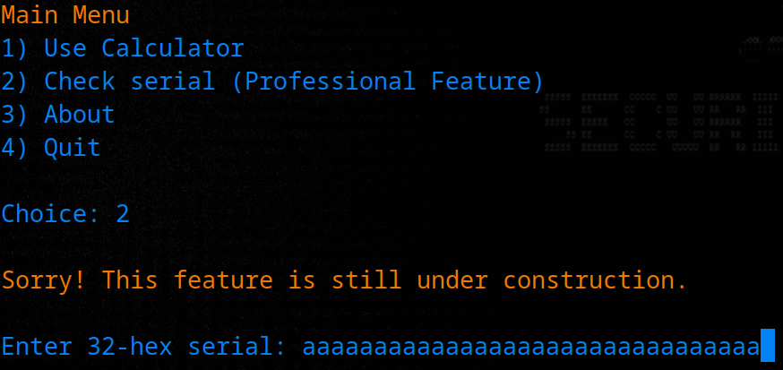

### Dynamic Analysis

If you patched the binary already, that's fine. If not (or you want to try another way), lets attach a debugger to the original (unpatched) binary. PIE is enabled and the function is at offset 0x19a0.

We can run the binary with `pwndbg` and then hit `ctrl + C` to pause execution. From here, we'll jump right to the target address.

```bash
pwndbg> piebase 0x19a0
Calculated VA from /home/crystal/Desktop/chall/ultimate_calc = 0x5555555559a0
pwndbg> jump *0x5555555559a0
Continuing at 0x5555555559a0.

Enter 32-hex serial: aaaaaaaaaaaaaaaaaaaaaaaaaaaaaaaa

Invalid serial.
```

We triggered the functionality. Let's try again with `wireshark` running in the background, then we'll use the display filter to show only HTTP traffic.

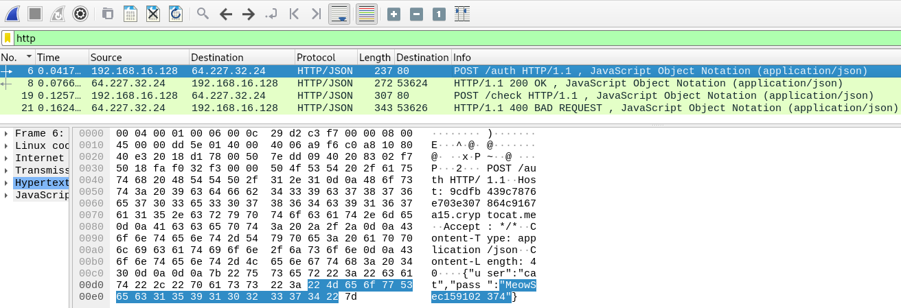

We can see two POST requests; one to `/auth` and then one to `/check`. Let's follow the HTTP stream for a better view.

")

The authentication is successful (`cat:MeowSec159102374`) and we receive a token. Next, we send the serial but get a 400 error - probably because it's invalid 🤓

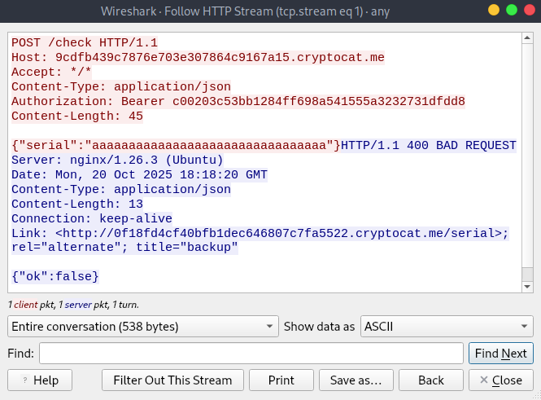

### Hidden Subdomain (Link Header)

Notice that the domain is `9cdfb439c7876e703e307864c9167a15.cryptocat.me` but then the response from `/check` includes a `Link` HTTP header with a different subdomain 🤔

```html
Link: <http://0f18fd4cf40bfb1dec646807c7fa5522.cryptocat.me/serial>; rel="alternate"; title="backup"
```

What happens when we view this address in the browser? Unfortunately, it's not what I intended 😅

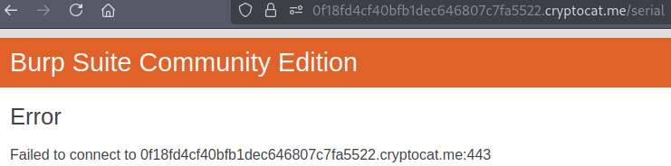

The problem is that requests are automatically upgraded to HTTPS while the server only accepts HTTP. I considered making it HTTPS but that would result in the subdomains showing on sites like [crt.sh](https://crt.sh), so players could uncover them without reversing the binary. Additionally, I wanted players to be able to easily monitor traffic without worrying about SSL.

Anyway, it's easy to get around this. If we try to curl the HTTP site, we'll see the expected response.

```bash
curl http://0f18fd4cf40bfb1dec646807c7fa5522.cryptocat.me/serial

<!doctype html>
<html lang=en>
<title>Redirecting...</title>
<h1>Redirecting...</h1>
<p>You should be redirected automatically to the target URL: <a href="/login">/login</a>. If not, click the link.
```

Therefore, we can write a script to automate the HTTP requests _or_ we can use burp and just downgrade to HTTP.

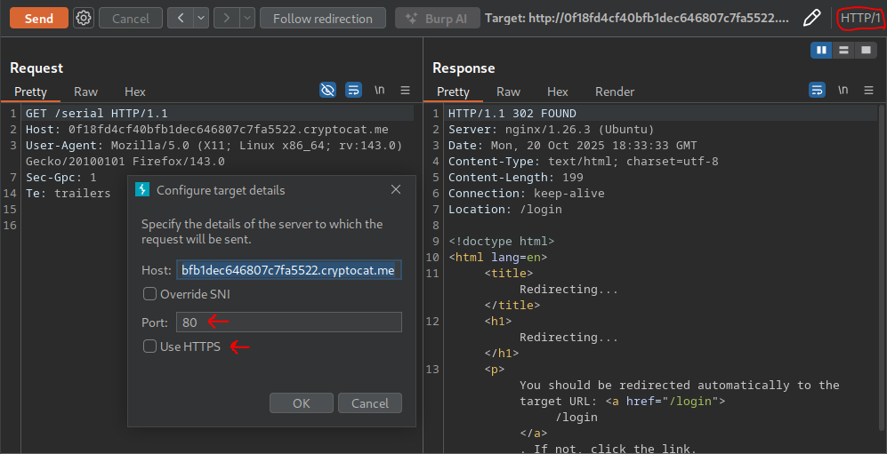

The login page contains a POST form. Let's try to reuse the creds we received earlier.

```html
<form method="post" action="/login">
    <label for="u">Username</label><input id="u" name="username" class="in" autocomplete="username" required /> <label for="p">Password</label
    ><input id="p" type="password" name="password" class="in" autocomplete="current-password" required />
    <button class="btn" type="submit">Sign in</button>
</form>
```

It works! We get a new session for the subdomain.

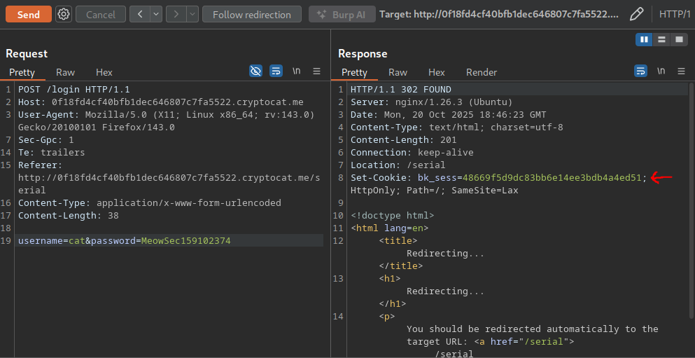

We'll need to insert the cookie before we follow the redirection. Once we do, we'll see a download link for an "offline validator" tool used by the support team.

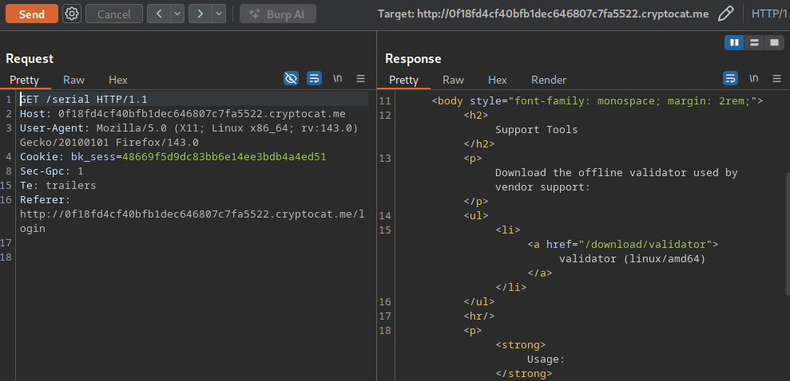

If we visit the `/download/validator` endpoint using our `bk_sess` cookie, we'll receive the file. You can either save this as a file, or right click the request in burp and `copy as cURL command` (we'll need to remove the `-i` flag to skip printing the response headers, and add `-o` to output to file).

```bash
curl --path-as-is -s -k -X $'GET' \
    -H $'Host: 0f18fd4cf40bfb1dec646807c7fa5522.cryptocat.me' -H $'User-Agent: Mozilla/5.0 (X11; Linux x86_64; rv:143.0) Gecko/20100101 Firefox/143.0' -H $'Accept: text/html,application/xhtml+xml,application/xml;q=0.9,*/*;q=0.8' -H $'Accept-Language: en-US,en;q=0.5' -H $'Accept-Encoding: gzip, deflate, br' -H $'Sec-Gpc: 1' -H $'Upgrade-Insecure-Requests: 1' -H $'Sec-Fetch-Dest: document' -H $'Sec-Fetch-Mode: navigate' -H $'Sec-Fetch-Site: none' -H $'Sec-Fetch-User: ?1' -H $'Priority: u=0, i' -H $'Te: trailers' -H $'Referer: http://0f18fd4cf40bfb1dec646807c7fa5522.cryptocat.me/login' \
    -b $'bk_sess=48669f5d9dc83bb6e14ee3bdb4a4ed51' \
    $'http://0f18fd4cf40bfb1dec646807c7fa5522.cryptocat.me/download/validator' -o validator
```

### Offline Serial Validator

Checking the file type, we'll see it's a Go binary which has not been stripped.

```bash
file validator

validator: ELF 64-bit LSB executable, x86-64, version 1 (SYSV), statically linked, Go BuildID=0sWiu8jF-ul5o-d4PWSo/fEn0iRwr3tC_Y4SMxi_M/AMDerCNYkq-14R_RD8yf/HnfIgbrFFSdpDHmS1yEW, with debug_info, not stripped
```

When the program is executed, it asks for the serial.

```bash
validator

Usage: /home/crystal/Desktop/chall/server/serial/validator <serial-hex>
Example: ./validator 4a2b... (32 hex chars)
Outputs: VALID or INVALID
```

```bash
validator aaaaaaaaaaaaaaaaaaaaaaaaaaaaaaaa

INVALID
```

Opening ghidra, we'll see the `verifySerialHex()` function.

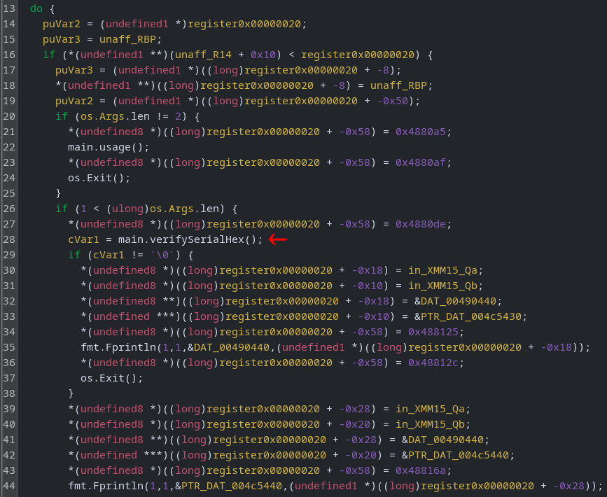

The function has a series of hex values which appear to be in the ASCII range, but the `convert` option in ghidra doesn't produce meaningful output.

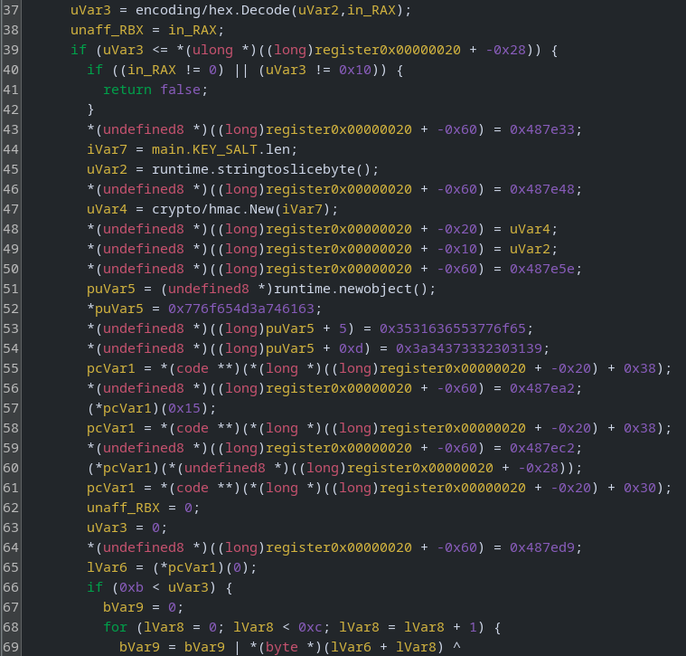

That's because of the endianess within Go binaries. Let's convert them and you'll see what I mean.

```bash
unhex 776f654d3a746163531636553776f653a34373332303139

v�TӧF51ceSwoe:4732019
```

Notice some of the password (`eowSec159102374`) in reverse (and slightly jumbled) order? You could reverse the functionality from here (ghidra has [some plugins for Go](https://youtu.be/cBdY5Y16OR4?t=363)), or do some "vibe reversing" aka paste the decompiled code into ChatGPT and ask for the original Go code.

```go
package main

import (
	"crypto/hmac"
	"crypto/sha256"
	"encoding/hex"
	"fmt"
	"os"
)

var KEY_SALT string = "<REPLACE_WITH_KEY_SALT>"
var USERPASS string = "cat:MeoweowSec159102374:"

func usage() {
	fmt.Fprintln(os.Stderr, "usage:", os.Args[0], "SERIALHEX")
	os.Exit(1)
}

func verifySerialHex(serialHex string) bool {
	decoded, err := hex.DecodeString(serialHex)
	if err != nil || len(decoded) != 16 {
		return false
	}
	mac := hmac.New(sha256.New, []byte(KEY_SALT))
	mac.Write([]byte(USERPASS))
	mac.Write(decoded[:4])
	sum := mac.Sum(nil)
	var b byte
	for i := 0; i < 12; i++ {
		b |= sum[i] ^ decoded[4+i]
	}
	return int(b-1) < 0
}

func main() {
	if len(os.Args) != 2 {
		usage()
	}
	if verifySerialHex(os.Args[1]) {
		fmt.Fprintln(os.Stdout, "serial valid")
		os.Exit(0)
	}
	fmt.Fprintln(os.Stdout, "serial invalid")
	os.Exit(1)
}
```

Looks much better, we just need to find the salt. Double click the reference in ghidra.

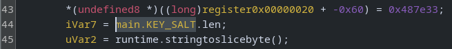

It will jump to the pointer and we can follow this again by double-clicking on `DAT_004a8111`

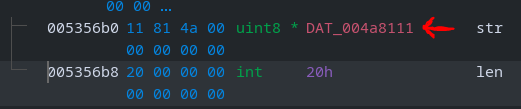

We'll find the 32 byte hex salt.

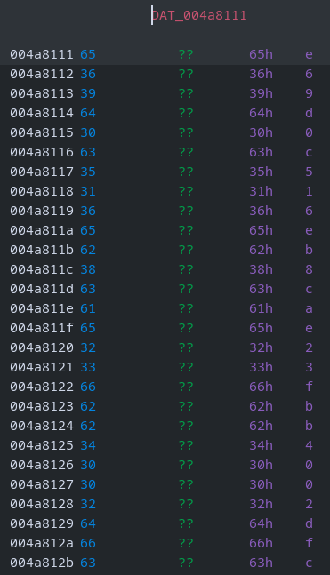

A quick way to grab this is to highlight the block in Ghidra, right-click → `Copy Special` → `Byte String (No Spaces)`

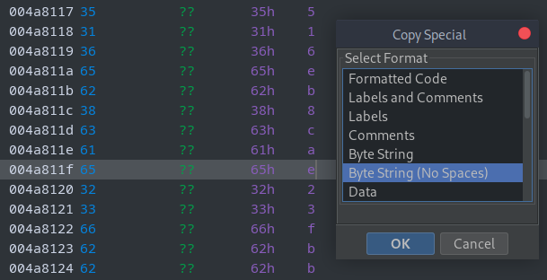

That will give us the hex string, which we can unhex for the salt.

```bash
unhex 6536396430633531366562386361653233666262343030326466633463333433

e69d0c516eb8cae23fbb4002dfc4c343
```

Now we have all the pieces we need to build a serial generator. A reminder of the verification code:

```go
func verifySerialHex(serialHex string) bool {
	decoded, err := hex.DecodeString(serialHex) // decode hex into bytes
	if err != nil || len(decoded) != 16 { // ensure valid hex and exactly 16 bytes
		return false // invalid input
	}
	mac := hmac.New(sha256.New, []byte(KEY_SALT)) // create HMAC-SHA256 with KEY_SALT as key
	mac.Write([]byte(USERPASS)) // feed the fixed USERPASS into HMAC
	mac.Write(decoded[:4]) // feed the first 4 bytes (prefix P) into HMAC
	sum := mac.Sum(nil) // finalize HMAC and get full digest
	for i := 0; i < 12; i++ { // for each of the 12 bytes expected to match
		if sum[i] != decoded[4+i] { // compare HMAC byte i to serial's corresponding byte
			return false // mismatch -> invalid serial
		}
	}
	return true // all 12 bytes matched -> valid serial
}
```

1. Creates HMAC-SHA256 using the salt as a key
2. Feeds `cat:MeowSec159102374:` into the HMAC
3. Feeds the first 4 bytes (nonce) of the decoded serial into the HMAC
4. Finalise HMAC and get the digest
5. Compare the first 12 bytes of the digest with the final 12 bytes of the decoded serial

Essentially, the serial layout is `P (4 bytes) || HMAC_SHA256(KEY_SALT, USERPASS || P)[:12]`

We have all these pieces (username, password, key) required to generate our own valid serials. The nonce (P) can be any 4 random bytes, it's included to ensure uniqueness.

### Offline Generator (keygen)

Let's put all the functionality into a new Go binary.

```go
package main

import (
	"crypto/hmac"
	"crypto/rand"
	"crypto/sha256"
	"encoding/hex"
	"fmt"
)

const KEY_SALT = "e69d0c516eb8cae23fbb4002dfc4c343"
const USERPASS = "cat:MeowSec159102374:"

func generateSerialHex() (string, error) {
	// 1) make 4-byte nonce/prefix P
	var p [4]byte
	if _, err := rand.Read(p[:]); err != nil {
		return "", fmt.Errorf("rand.Read: %w", err)
	}

	// 2) HMAC over USERPASS || P (key=salt)
	mac := hmac.New(sha256.New, []byte(KEY_SALT))
	mac.Write([]byte(USERPASS))
	mac.Write(p[:])
	sum := mac.Sum(nil)

	// 3) build 16-byte serial: P || sum[:12]
	serial := make([]byte, 16)
	copy(serial[0:4], p[:])
	copy(serial[4:16], sum[:12])

	// 4) hex-encode
	return hex.EncodeToString(serial), nil
}

func main() {
	s, err := generateSerialHex() // profit
	if err != nil {
		panic(err)
	}
	fmt.Println(s)
}
```

Compile, then run it a few times to generate some \[hopefully\] valid serial numbers.

```bash
go build -o generate generate.go
./generate

7bf8e4ba26fb2ee7d31c2d3266f6ea49
2647b83ca92edfe3371cdde25ce9c7e2
cea56629b5cdfd4feacda81d300f335a
2cb0e34c8e61507d6e5d4c51334b6315
55e4c8f6128e0c2a9e43d6ea7c5b4db3
```

We'll jump to the verification function again (you could also use burp, curl, custom script etc) and provide one of the keys.

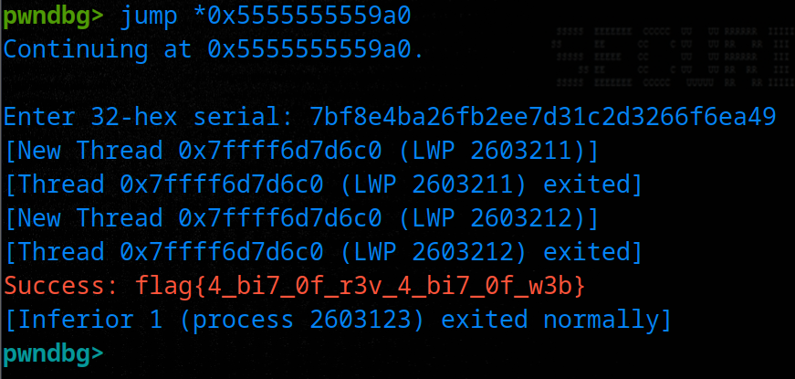

Flag: `flag{4_bi7_0f_r3v_4_bi7_0f_w3b}`

### Bonus: Solve Script

Using everything we've learnt, we can make a solve script to get the flag. This probably looks overkill, but I reused a template from OSWE prep where I would typically stick to this format. You could also integrate the keygen functionality directly to the script (homework).

```python
import requests
import argparse
import sys

BASE_URL = 'http://9cdfb439c7876e703e307864c9167a15.cryptocat.me/'
USERNAME = "cat"
PASSWORD = "MeowSec159102374"
SERIAL = "55e4c8f6128e0c2a9e43d6ea7c5b4db3"  # Generate it seperately
HEADERS = {}

def create_session(use_proxy=False):
    session = requests.Session()

    if use_proxy:  # burp if you wanna debug
        proxies = {
            'http': 'http://127.0.0.1:8080',
            'https': 'http://127.0.0.1:8080',
        }
        session.proxies.update(proxies)
        session.verify = False
    return session

def login_user(session, url):
    try:
        res = session.post(
            url, json={'user': USERNAME, 'pass': PASSWORD})
        if res.status_code < 400:
            token = res.json().get("token")
            print(f"[+] Logged in: {USERNAME} ({PASSWORD})")
            return session, token
        else:
            print(res.status_code)
            print("[!] Login failed!")
            exit()
        return session
    except requests.RequestException as e:
        print(f"[-] POST request failed: {e}")
        sys.exit(1)

def send_serial(session, url):
    try:
        res = session.post(url, json={'serial': SERIAL}, headers=HEADERS)
        if res.status_code < 400:
            flag = res.json().get("flag")
            print(f"[+] Correct serial no: {SERIAL}")
            return flag
        else:
            print(res.status_code)
            print(f"[!] Incorrect serial no: {SERIAL}")
            return "Not Found!"
    except requests.RequestException as e:
        print(f"[-] POST request failed: {e}")
        sys.exit(1)

def main():
    parser = argparse.ArgumentParser(
        description="Ultimate Calculator Serial Check")
    parser.add_argument("--proxy", action="store_true",
                        help="Route traffic through Burp (127.0.0.1:8080)")
    args = parser.parse_args()

    session = create_session(use_proxy=args.proxy)

    # Log in
    session, token = login_user(session, BASE_URL + 'auth')
    HEADERS['Authorization'] = 'Bearer ' + token

    # Submit the serial number
    flag = send_serial(session, BASE_URL + 'check')
    print(f"[*] Flag: {flag}")

if __name__ == "__main__":
    main()
```

```bash
python solve.py

[+] Logged in: cat (MeowSec159102374)
[+] Correct serial no: 55e4c8f6128e0c2a9e43d6ea7c5b4db3
[*] Flag: flag{4_bi7_0f_r3v_4_bi7_0f_w3b}
```

Hope you enjoyed this one, see you for "monthly" challenge #3 next year! 😂🥰

## Community Writeups

-   [Paweł Łukasik](https://allthingsreversed.io/20251023-ultimate-calculator-3000.html)
