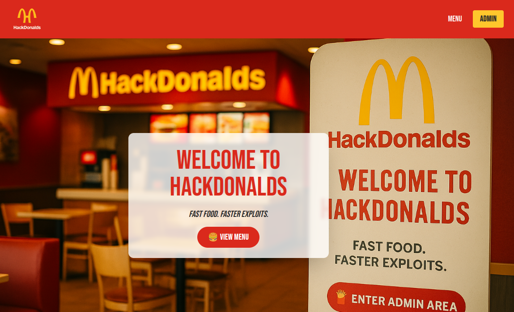
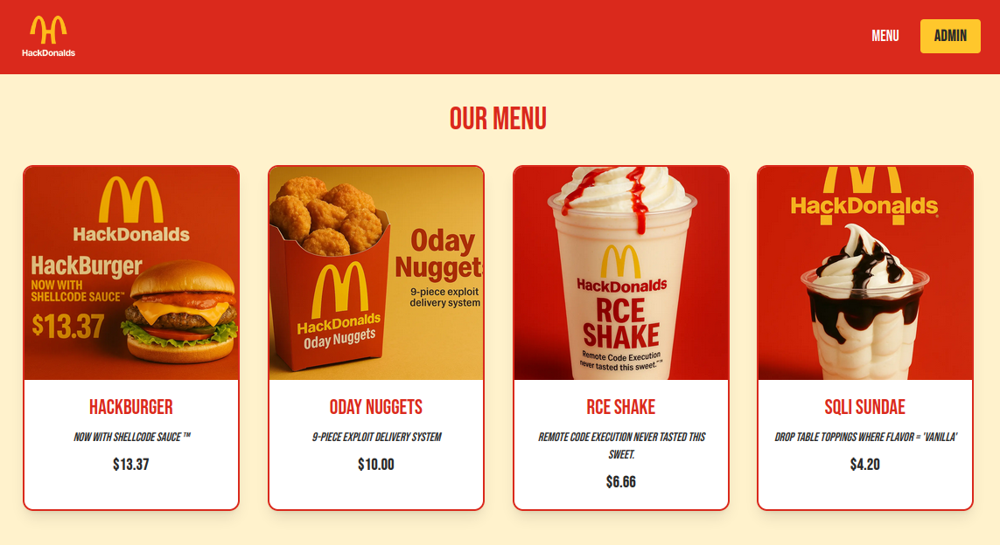
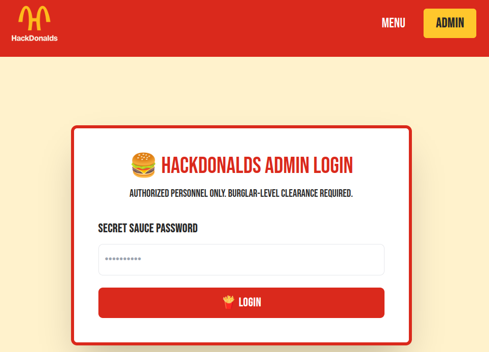
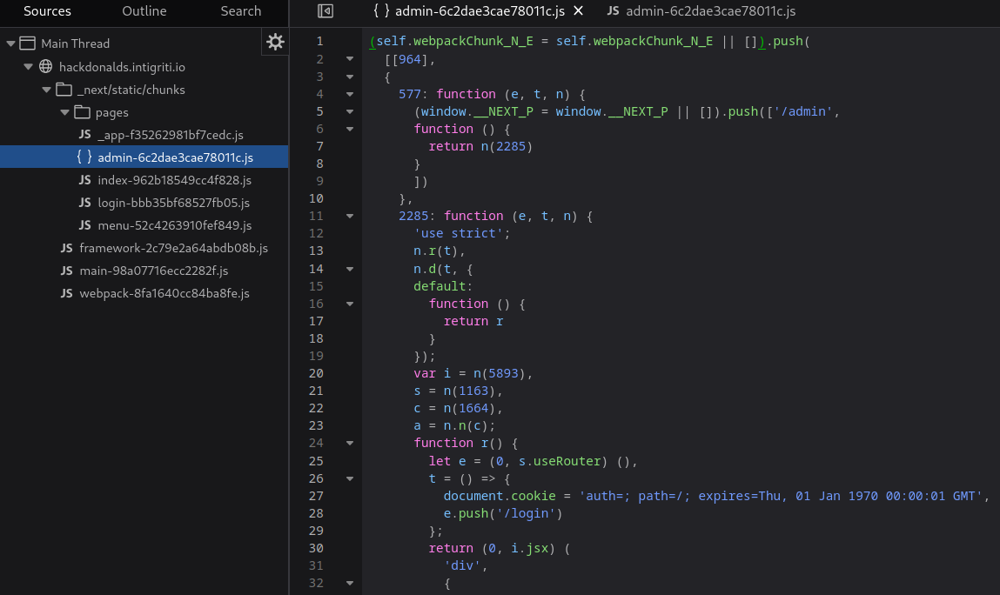
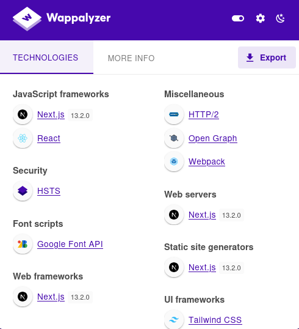
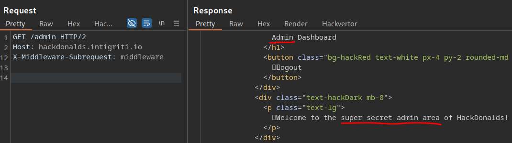
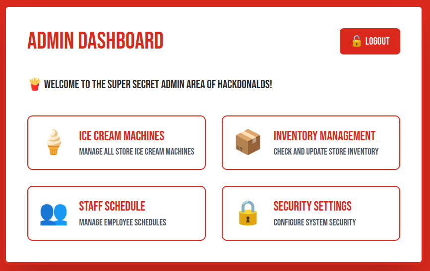
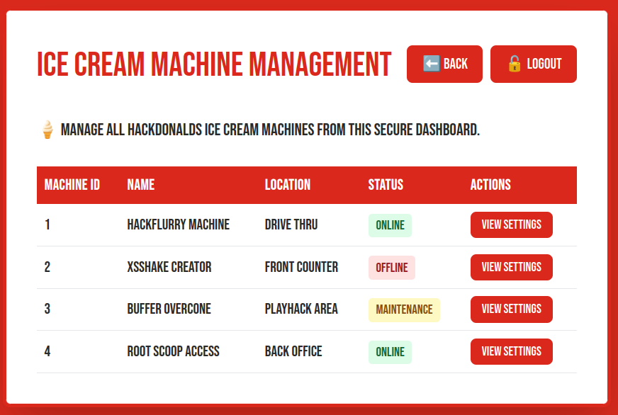
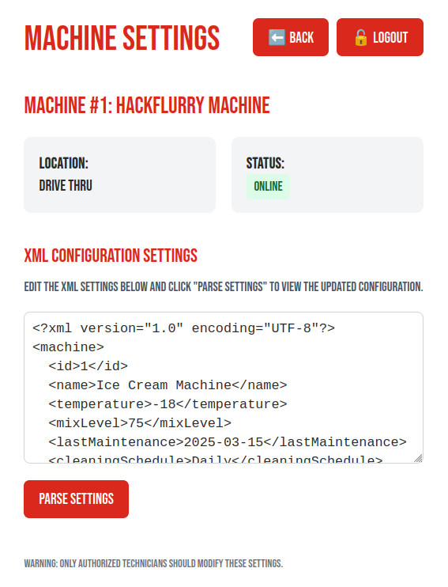
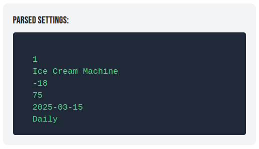

# 04-25: HackDonalds

| Name                                                                 | Authors                                               | Category                                           |
| -------------------------------------------------------------------- | ----------------------------------------------------- | -------------------------------------------------- |
| [Intigriti April Challenge (2024)](https://hackdonalds.intigriti.io) | Bastien + [CryptoCat](https://twitter.com/_CryptoCat) | NextJS Middleware Auth Bypass, CVE-2025-29927, XXE |

[](https://www.youtube.com/watch?v=KwD_TKZr0YY "Next.js Middleware Auth Bypass (CVE-2025-29927) and XXE Local File Read")

## Challenge Description

> Find the FLAG and win Intigriti swag! 🏆

## Useful Resources

-   [Next.js Middleware Auth Bypass (CVE-2025-29927)](https://zhero-web-sec.github.io/research-and-things/nextjs-and-the-corrupt-middleware)
-   [XML External Entity Injection (XXE)](https://portswigger.net/web-security/xxe)

## Solution

Bastien (BAS10) made most of this challenge. I (CryptoCat) just made the UI _cough_ ChatGPT _cough_ and fixed a few bugs/unintended solutions. It's a lot easier than the typical Intigriti monthly challenge - thankfully, as it came only a week after the crazy chain by 0x999 in the [March '25 challenge](https://bugology.intigriti.io/intigriti-monthly-challenges/0325). Therefore, this one was run more informally, without all the usual prizes, promo, domain name etc.

### Recon

The challenge did not come with source code, so we must follow a black box approach.

#### Site Functionality

The website doesn't appear to have a lot of functionality; there's a homepage and a food menu.





There's also an admin section which, as hackers, should be interesting to us.



We might try some basic SQLi, default/common password etc. However, it will get us nowhere. Digging into the client-side code is also fairly unproductive - since it's a NextJS application, the code is hard to read and most of the important stuff is on the server-side.



Wait, NextJS? Wasn't there some [crazy vulns](https://zhero-web-sec.github.io/research-and-things/nextjs-and-the-corrupt-middleware) discovered for it recently 🤔 Let's check the version with Wappalyzer 👀



Back to the advisory:

**CVE-2025-29927** affects **all Next.js versions from 11.1.4 up to 15.1.7** and allows **middleware bypass** via a specially crafted `x-middleware-subrequest` header.

Vulnerability confirmed ✅

### Next.js Middleware Auth Bypass (CVE-2025-29927)

Middleware in Next.js is commonly used for:

-   Authentication / Authorization
-   Rewrites / Redirects
-   Adding security headers (CSP, etc.)

This vulnerability allows attackers to **bypass middleware protections entirely**, leading to:

-   **Authorization bypass**
-   **Content Security Policy (CSP) bypass**
-   **DoS via Cache Poisoning (CPDoS)**

An auth bypass would be perfect for us! Maybe it can get us into the admin panel without knowing the password?

Let's request the `/admin` page while including the following HTTP header.

```json
x-middleware-subrequest: middleware
```



Easy! Now we just need to include this header on each request to maintain our access 😎



We can only click on the `Ice Cream Machines` option, which allows us to view the settings of various machines (notoriously buggy/broken at HackDonalds 👀)



### XML External Entity Injection (XXE)

So, what do we have here? An XML config input that can be parsed.





Any CTF player or bug bounty hunter should know what to check for here; XXE 👇

**XXE (XML External Entity)** is a vulnerability that occurs when an XML parser **processes external entities** defined in XML documents. If not properly configured, it can be exploited to:

-   **Read local files** (`file:///etc/passwd`)
-   **Perform SSRF** (e.g., hitting internal services)
-   **DoS** via "billion laughs" attack
-   **Exfiltrate data** via out-of-band channels (OAST, DNS, etc.)

If we replace the parsed input with a payload to read `/etc/passwd`

```xml
<?xml version="1.0" encoding="UTF-8"?>
<!DOCTYPE machine [
  <!ENTITY xxe SYSTEM "file:///etc/passwd">
]>
<machine>
  <id>1</id>
  <name>&xxe;</name>
  <temperature>-18</temperature>
  <mixLevel>75</mixLevel>
  <lastMaintenance>2025-03-15</lastMaintenance>
  <cleaningSchedule>Daily</cleaningSchedule>
</machine>
```

We successfully retrieve the file contents!


#### Local File Read (Source Code Disclosure)

Where is the flag though? In a real world scenario, we might look for common files of interest (plenty of wordlists online). Since we know this is a NextJS app, why don't we ask ChatGPT what the common location is and what interesting files it might have?


Nice, so we can try enumerating all of these files starting with the `/app/` directory 😼

```xml
<?xml version="1.0" encoding="UTF-8"?>
<!DOCTYPE machine [
  <!ENTITY xxe SYSTEM "file:///app/package.json">
]>
<machine>
  <id>1</id>
  <name>&xxe;</name>
  <temperature>-18</temperature>
  <mixLevel>75</mixLevel>
  <lastMaintenance>2025-03-15</lastMaintenance>
  <cleaningSchedule>Daily</cleaningSchedule>
</machine>
```


There we have our flag: `INTIGRITI{XXE_1n_Ic3Cr34m_M4ch1n3s}` 🚩

Some players retrieved the same file from `/proc/self/cwd/package.json` or simply `package.json`
